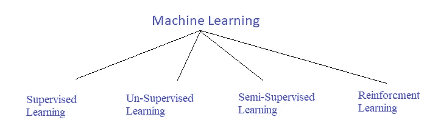
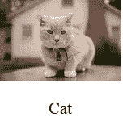
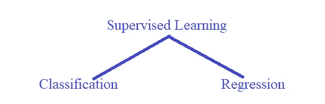
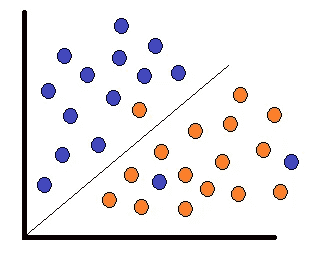
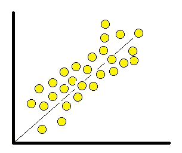

# 机器学习的类型

> 原文：<https://medium.datadriveninvestor.com/types-of-machine-learning-aff911441315?source=collection_archive---------6----------------------->

你好，朋友们，我又带着嗡嗡叫的蜜蜂和机器学习来到这里。！我希望你们已经喜欢并清楚了人工智能、机器学习和深度学习的概念，以及我在过去的故事中所写的它们之间的区别。

嗯，既然你现在已经熟悉了机器学习的基础知识，那么让我们来探索更多关于机器学习的**类型。**这就是你在几分钟的阅读和理解中将要学到的东西。那么，我们开始吧。通常有四种类型的机器学习，即**监督、无监督、半监督和强化学习。让我们**在系列故事中一一了解。

Types of **Machine Learning**

1.  ***监督学习:***

因此，正如我在上一篇关于人工智能的文章中所讨论的那样，**输入数据**是机器学习模型或深度神经网络中的主要内容。在监督学习中，输入数据包含数据的**标签和**数据。****

嘿，等等，这有意义吗？

这里，数据被称为**标签数据**，因为数据包含标签和数据/值，让我们举个例子:

如下面的猫的图片所示，它有作为数据的视觉图像和作为动物的文本标签，即猫。

在这里，在监督学习中，数据充当老师，就像我们如何通过看到相应的图片及其名称来学习 A、B、C、D，如 **A 代表苹果，B 代表球，C 代表猫，D 代表狗**，同样，我们需要教机器数据是关于什么的。我们需要给出大量的输入数据，其中数据包含标签和值，这是通过给出大量训练数据，机器将识别模式来识别数据的方法。学习过程被称为**监督学习。**

还有两种类型的**监督学习**，如下所示。

Types of **Supervised Learning**

***a .分类:***

这是一种监督问题，我们将数据分为两个或更多类别，模型将根据训练数据识别测试数据应属于哪一类别，因此看起来很简单，对吗？分类将数据分为**类别**或**类**。像下面这样的问题需要分类…

1.  这封邮件是不是垃圾邮件？
2.  是对还是错？
3.  这是猫、狗、狮子还是大象？等等..

**Classification** of Animal — dog/cat

这种类型的问题需要两种或更多种可能的答案。所以这类问题被称为**分类。**如果答案只有 **2 种可能性**如真/假或是/否，这称为**二元分类**，如果有 2 种以上的可能性，则称为**多类分类。**通过训练模型，在测试的时候，模型只会预测可能的结果，所以根据我们预测动物**狗/猫**的例子，它只会预测它们，所以这类问题属于这一类别，分类。

**b. *回归:***

在这种监督学习中，we/模型需要根据**连续值预测预期结果。嗯，**听起来很困惑对吧？因此，让我们简单地看看日常生活中的一些回归问题，如下所示:

1.  这个地区这个规格的房子价格是多少？
2.  股票市场目前的价格是多少？诸如此类，

Regression of Price based on the number of rooms

说得有道理。！！所以，这种类型的问题通常是预测未来的结果，基于之前关于相同类型问题的连续值。所以这种类型的模型会根据一组参数来预测一些东西。我们可以说回归是模型将寻找不同参数之间的**关系的类型，基于它，输出将被预测。让我们把这幅图和这个问题联系起来，一般来说，一所房子的房间数越多，价格就会比房间数少的房子高，对吧。这被称为**回归。**可以用一个因变量和一个自变量进行回归，称为**简单线性回归。**如果因变量超过一个，称为**多元线性回归。****

这就是关于**监督学习**的全部内容。我们将在接下来的故事中深入探讨这一点。我希望这对每个人都有意义。

感谢大家。快乐学习，敬请关注。分享它，拥抱它，放下疑惑，分享你的观点，放下建议，不要忘记下一个故事。！
敬请期待。！快乐学习。！