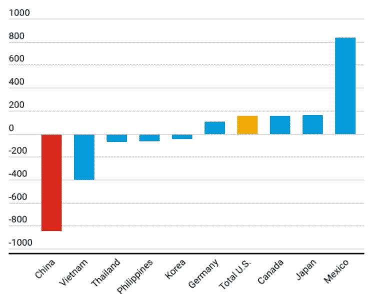
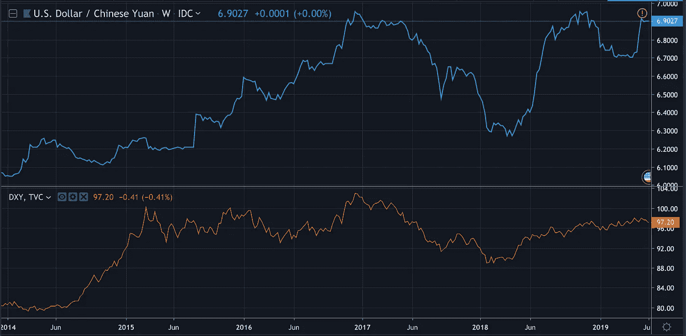
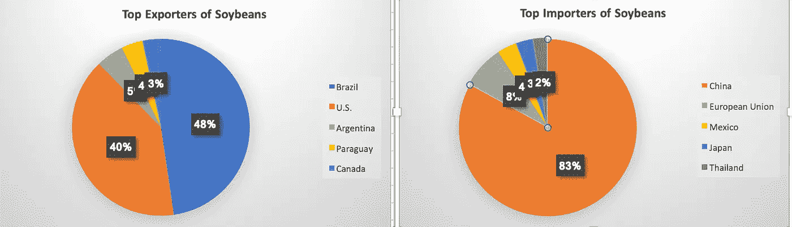

# 美中贸易:关键货币观点

> 原文：<https://medium.datadriveninvestor.com/u-s-china-trade-a-key-currency-view-b56bb76f9169?source=collection_archive---------1----------------------->

**摘要:** *美中贸易战导致美元反弹-受美元避险和贸易特征的推动-人民币从 2018 年第四季度开始贬值。然而，美元很可能已经见顶！随着中国的结构调整和贸易替代变得更加明显，人民币不太可能朝着关键的 7.00 水平贬值。这是合理的，过分强调短期经济中断和以美元为中心的叙事与中国供应链调整和全球价值链(gvc)灵活性的经济影响。*

美国将对价值 5390 亿美元的中国商品征收 25%的关税，中国将有选择地对价值 1200 亿美元的美国进口商品征收关税。美国瞄准了铁路设备的耐用和非耐用商品，从衣服和化学品到婴儿奶嘴，而中国瞄准了设备和大豆。未来几天，美国原油和其他中间产品可能会被加征关税。与此同时，全球经济可能会受到关税的影响，世界银行预测 2019 年和 2020 年的增长率分别为 2.6%和 2.7%。

***出口首当其冲的贸易战***

由于贸易战，尽管美国在关税生效前进行了前期采购，但美中贸易额和两国出口增长都有所下降( [IMF，2019](https://blogs.imf.org/2019/05/23/the-impact-of-us-china-trade-tensions/) )。贸易战的影响遍及美国和中国，但短期反应和全球影响已不成比例地偏向美元。以美元为中心的叙事和随之而来的升值，无论多么错位，都是由几个因素推动的。

Source: IMF

***消费者暂时安全，但企业和行业面临风险！***

到目前为止，美国成本的很大一部分被生产商吸收了，全部额外关税只在洗衣机上转嫁给了消费者。虽然对消费者的净影响是中性的，但生产商不太可能保护他们免受成本影响，因为关税会进一步消耗他们的利润率。与此同时，如图所示，中国生产商将在短期内遭遇更大冲击，但全球价值链的灵活性表明，未来几个月美元升值趋势将逆转。如下图所示，在最近一轮关税升级中，在中国和国际市场销量都很高的美国公司股价下跌。这种风险目前没有完全反映在美元汇率中。

 [## 为什么包容性财富指数比 GDP 更能衡量社会进步？-数据驱动…

### 你不需要成为一个经济奇才或金融大师就能知道 GDP 的定义。即使你从未拿过 ECON 奖…

www.datadriveninvestor.com](https://www.datadriveninvestor.com/2019/03/08/why-inclusive-wealth-index-is-a-better-measure-of-societal-progress-than-gdp/) 

与此同时，中国可能会减少美国原油的进口，通过创造一个供过于求的市场，给原油价格带来下行压力，从而降低过度负债的美国页岩勘探商和生产商的竞争力。

***美元得益于其全球霸主地位，而非基本面***

在整个贸易战期间，美元汇率(USD)的升值幅度超过了人民币(Yuan)。诚然，这种升值在一定程度上是合理的，因为美元汇率在数量上主导着全球贸易体系(Gopinath 和 Plagborg-Moller，2017)。毕竟，人民币是主要的融资货币，大量的双边贸易都是以美元计价的。此外，由于大多数全球经济体的“美元化”，美元构成了央行储备的很大一部分。与此同时，各种类型的大宗商品和远期合约也以美元结算，这使得美元受益于避险资产，不管这种避险资产的位置有多错。

Source: [Trading view](https://uk.tradingview.com/chart/ZHDNU3Ny/)

***美元-人民币结果取决于供应链敏捷性***

自 2018 年 6 月以来，美元指数和汇率(分别为蓝色和红色)一直在升值，但下行趋势可能正在出现。美元受到贸易和避风港属性的保护，并受到深度和流动性强的美国金融系统的支持，随着制裁和美国政策的不确定性迫使中国、俄罗斯、委内瑞拉等国家与电子货币、加密货币等替代支付来源进行竞争，全球银行业的基础开始发生变化。与此同时，两种货币的差异取决于供应链的中断和敏捷性与市场参与者和商业实体的中短期经济中断之间的平衡。

**贸易战的短期经济成本在**中被错误定价

因此，很难证明美元的持续升值是合理的，因为中国的结构调整可能会超过美国。因此，尽管短期内对中国的干扰和经济影响是显而易见的，但其过分强调是错误的，错误地基于美中贸易的总价值，而不是全球价值链的灵活性和调整的影响。不要介意当前和未来的股价取决于盈利增长和企业利润率的前景。

**GDP 损失是由短期经济成本造成的，而非供应链中断**

虽然[国际货币基金组织计算](https://blogs.imf.org/2019/05/23/the-impact-of-us-china-trade-tensions/)美国的近经济损失为 0.6%-1.0%，在 0.4%-0.6%之间，但中国的短期经济成本并没有完全反映全球价值链的灵活性。因此，虽然国际货币基金组织预测全球经济将损失 0.3%的 GDP 鉴于中国从稀土金属和美国原油进口到全球价值链调整的升级，0.2%的损失并非不可能。对全球价值链的进一步观察表明，作为中间人，中国对全球网络的不可或缺性至少是不容忽视的。这一点在图表二中变得越来越明显，在中国和其他地方的美国公司都经历了价格下跌。随着这一趋势在未来几个月变得更加明显，美元不太可能保持升势。

***第二轮贸易战影响可能更小***

Source: [The Conversation](https://theconversation.com/how-soybeans-became-chinas-most-powerful-weapon-in-trumps-trade-war-118088)

全球经济将经历更少的混乱，因为中国将把美国的进口转向拉丁美洲和非洲的新兴市场，这取决于美国不妥协后他们进口替代的方式和程度。美元走强非但不会抑制贸易，反而会促进新兴市场货币之间的贸易，加速全球贸易与美元汇率的脱钩。例如，中国从美国进口的大豆将转向巴西、加拿大、巴拉圭和阿根廷，原油进口将受到限制，因为中国利用了与沙特阿拉伯的 5 年供应协议。

诚然，贸易战压倒性地聚焦于美国经济和美元走强，过分强调了对新兴市场的影响。尽管贸易量可能会下降，但中国的财政刺激和对贸易战的结构调整将抵消需求冲击；人民币和新兴市场货币走软将刺激贸易，并在一定程度上减轻贸易战的影响。与此同时，由于大豆占美国食品出口的很大一部分，对 GDP 贡献的损失应该引起对美元持续走强预期的反思。

***经济含义:***

未来几个月，美元可能会调整，通胀超调仍取决于生产商将成本转移给消费者。然而，农民的资产负债率可能会上升，因为他们的大豆基本上没有新的市场。在中国经济结构调整和与世界其他地区贸易增长的支持下，人民币将在短期内升值。

***更长远的影响。***

虽然贸易战不太可能导致美元贬值，但替代支付系统肯定会出现。此外，进一步脱钩几乎是肯定的，因为越来越多的非美贸易将以其他货币结算，如欧元(41%)和人民币。与此同时，美元目前在欧元区的比重为 45%，仅高出 0.4%。

**参考列表。**

1)美中贸易紧张局势的影响， [Eugenio Cerutti](https://blogs.imf.org/bloggers/eugenio-cerutti/) ， [Gita Gopinath](https://blogs.imf.org/bloggers/gita-gopinath/) ， [Adil Mohommad](https://blogs.imf.org/bloggers/adil-mohommad/) ，2019 年 3 月可用[此处](https://blogs.imf.org/2019/05/23/the-impact-of-us-china-trade-tensions/)

2)边境和商店的关税传递:来自美国贸易政策的证据，2019 年 5 月。吉娜·戈皮纳斯、阿尔贝托·卡瓦洛、布伦特·内曼和珍妮·唐。可用[此处](https://scholar.harvard.edu/files/CGNT_0.pdf)

3)欧盟统计局(Eurostat)2019 年 5 月公布，2018 年，欧元是欧盟出口最常用的货币，美元是欧盟进口最常用的货币。此处[可用](/Eurostat, May 2019.)

4)大豆如何成为中国在特朗普贸易战中最有力的武器，2019 年 5 月，伊恩·谢尔登。此处可用[。](https://theconversation.com/how-soybeans-became-chinas-most-powerful-weapon-in-trumps-trade-war-118088)