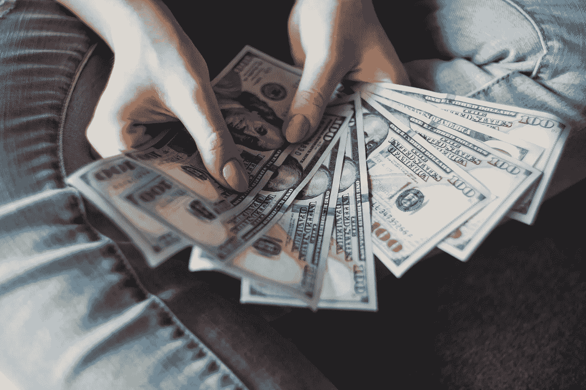

# 优步解释道

> 原文：<https://medium.datadriveninvestor.com/uber-explained-5c3734682e4b?source=collection_archive---------5----------------------->

Photo by [Alexander Mils](https://unsplash.com/@alexandermils?utm_source=unsplash&utm_medium=referral&utm_content=creditCopyText) on [Unsplash](https://unsplash.com/search/photos/profit?utm_source=unsplash&utm_medium=referral&utm_content=creditCopyText)

2011 年，在与一位早期投资者的一次随意交谈中，我被介绍到了优步，就在优步一举成名之前。那个人很兴奋，因为几天前从机场订购一辆豪华轿车是多么容易。然后我被告知，对于那些可能拥有一辆高档汽车、还款仍在到期、但由于经济衰退失去了一份高薪工作的人来说，优步是一个完美的选择。大多数时候，那个人可能在寻找一份新工作，但每天有几个小时可以抽出时间给优步当司机。通过这种方式赚到的几百美元可以在金融危机期间有所帮助，比如支付汽车贷款。

这不是我们现在所知道的优步的概念。但我在优步的联合创始人[加勒特·坎普](https://medium.com/@gc)披露的[原始推介平台](https://medium.com/@gc/the-beginning-of-uber-7fb17e544851)中看到了类似的方法。2008 年末，优步的创始人注意到，新的移动电话技术允许创建一个简单的拼车应用程序，比过时的出租车调度系统更容易、更高效。时机再好不过了。

 [## 在自动驾驶汽车发生事故的情况下，谁应该承担法律责任？数据驱动的投资者

### 我仍然认为自动驾驶汽车是一种奢侈品，而不是必需品…

www.datadriveninvestor.com](https://www.datadriveninvestor.com/2018/11/02/who-is-legally-accountable-in-the-case-of-an-autonomous-vehicle-accident/) 

从 2008 年初到 2009 年底，[750 万美国人失去了工作。他们中的许多人仍未付清购车款，急切地抓住了优步的机会。在他们的经济计算中，开车去优步的唯一成本就是汽油费。他们没有计算他们每小时挣多少钱；他们重视在需要时做这件事的便利性，也重视愿意做多久就做多久。他们的收入目标是他们迫切需要的每周几百美元的额外收入。](https://www.bls.gov/opub/ted/2009/ted_20091006.htm)

当经济反弹时，情况发生了变化。很少有人有好车和充裕的时间。大多数能买得起好车的人通常都有一份职业，收入足以支撑他们的购买。如果他们需要额外收入，通常他们可以通过探索自己的专业领域比降级到相对低技能的私人司机工作赚得更多。

我记得与一位兼职为优步开车的朋友的对话。他的主要工作收入不多，在寻找额外收入来源方面很有进取心。他似乎对自己为优步开车的收入很满意。我问他是否考虑了他所有的成本:汽车的磨损、保险、更高的事故风险和他空闲驾驶的时间。在考虑了所有这些因素之后，以一种类似于人们在互联网上可以找到的方式，我们得出结论，他的收入大约是每小时 10 美元，如果不是更少的话。他没有意识到这一点。他有技能和机会通过做其他事情赚更多的钱。如果许多人仍然开车去优步，只是因为像我朋友一样，他们不知道商业会计的基本知识，我不会感到惊讶。

对于那些试图以开车去优步为主要收入来源的人来说，这个计算更糟糕。在所有的账单都付清后，他们清楚地看到没有足够的钱了。优步的司机没有去其他地方工作，而是向政府寻求帮助，以确保最低工资。纽约州最近将其设定在[每小时 17.22 美元](https://www.washingtonpost.com/technology/2018/12/04/new-rules-guarantee-minimum-wage-nyc-uber-lyft-drivers/)；加州[正在修补](https://www.businessinsider.com/uber-minimum-wage-proposal-for-drivers-california-ab5-2019-8)将其设定为每小时 21 美元。

讽刺的是，历史做了一个完整的循环。由于出租车行业监管过度，拼车越来越受欢迎。在美国的主要城市，大部分的出租车都是在这里开的，为了开出租车，人们需要购买一个牌照。那个徽章是经营出租车服务的城市许可证。通过限制这些许可证的发放，城市限制了出租车流量，并通过抑制竞争，帮助出租车司机保持较高的收入。由于供应量有限，这些奖章的价格达到了天文数字，高达几十万美元，在纽约甚至达到了 100 万美元。随着优步和 Lyft 造成的破坏，所有这些官僚现实都土崩瓦解了。现在，出租车牌照的价格只有几年前的十分之一。此外，在零工经济的光辉褪去之后，一个赤裸裸的事实浮出水面:乘客乘车，无论是乘坐老式出租车还是新型拼车，只能提供最低工资收入。原本从不受监管的领域中获益的优步司机向政府要求监管。

优步一夜成名是因为在经济衰退期间，司机供过于求，急需现金的司机愿意以低于成本的价格提供拼车服务。公众喜欢便利和较低的价格。早期投资者被浮华的开端弄得眼花缭乱，没有意识到这种只在衰退期间有效的模式是不可持续的。他们向这些公司投入了数十亿美元，现在优步是一家现金充裕的公司，拼命寻找运输相关业务的下一个大项目。毫无疑问，他们对新技术和新概念的投资最终会使一些人受益，而不一定是优步本身。

被视为零工经济最大成功的优步，最终将耗尽尝试新事物所需的资金。就像新的想法一样，只有很少一部分是可行的，而且通常要花费比预期更多的时间和金钱。通过至少在一些业务领域实现稳定盈利，优步有机会达到财务稳定的稳定水平。到目前为止，它还没有盈利，而且盈利也不在短期内。因此，我们不能排除这样一种可能性，即一旦取得惊人的胜利，优步最终将成为一个惊人的错误。