# 如何将谷歌路线服务的成本降低 10 倍

> 原文：<https://medium.datadriveninvestor.com/uber-like-service-route-travel-time-calculation-2a1fb8c5ca52?source=collection_archive---------2----------------------->

在这个快速发展的世界里，越来越多的服务需要计算旅行时间。我们经常在家里订购一些东西，无论是按摩、私人教练的锻炼、理发师或化妆师，甚至是一顿饭，我们都希望在约定的时间完成。但是，为我们提供这些服务的公司也必须考虑到他们的员工将花费在交通上的时间，以便尽可能高效地工作。在我们的一个项目的开发过程中，我们面临着客户要求有这样一个机会，但没有使用第三方服务的日常成本，所以我们来了这个解决方案。

# 商业案例描述

在现有的提供“从专家到客户门口的服务”的系统中，有必要增加对专家从一个客户到另一个客户所需时间的近似计算。该系统有一个日历，其中每个小时被分成 15 分钟的片段，这允许您在特定时间订购服务。当选择特定服务时，系统应该计算专家到客户端的旅程时间，并向客户端显示专家的可用性信息。还必须考虑到系统中可能有专家的预约。

 [## 2019 年最值得学习的编码语言|数据驱动的投资者

### 在我读大学的那几年，我跳过了很多次夜游去学习 Java，希望有一天它能帮助我在…

www.datadriveninvestor.com](https://www.datadriveninvestor.com/2019/02/21/best-coding-languages-to-learn-in-2019/) 

# 赞成和 CONS 的意见

解决这个问题有两种主要方法:

*   使用离线地图。
*   使用各种第三方服务的 API。

第一种方法涉及连接离线城市地图，该地图应该包括关于街道上交通的方向、关于街道上交通的行驶速度趋势以及关于每条街道的长度的数据。然后，在这篇 [**惊人文章**](https://blog.daftcode.pl/find-your-way-with-the-power-of-postgis-pgrouting-66d620ef201b) 的帮助下，我们必须为许多专家计算 A 点和 B 点之间的每条路线的即时路径，并且还要考虑现有的预订单。所以我们排除了这个选项，原因有几个:

*   具有所需信息的离线地图的可用性；
*   新城市的简单服务激活；
*   请求的时间成本；
*   在系统中实施该解决方案的持续时间。

第二个选项是创建一个对现有服务之一的请求来计算时间，以接收响应。我们审查了几个选项，其中包括:

*   谷歌距离矩阵，
*   Mapquest 路线矩阵，
*   微软必应路由 API，

并决定选择谷歌的服务，因为我们的系统已经使用了谷歌云平台的其他服务。最好在一个地方控制一切，对吗？同时，必须考虑到，每次客户请求服务时，系统每次都会为整个城市的所有专家生成一个请求，即使该服务最终没有被订购，而是“只是为了查看”。我们使用谷歌距离矩阵，它可以计算 25 个元素之间的旅行时间，即一个地址或一个坐标在一个单一的请求。

但是这种服务的使用成本随着客户数量的增加而呈指数级增长，成本变得过高。那么我们想出了什么解决方案呢？

# 我们的选择

受距离矩阵的启发，我们决定创建一个所谓的具有类似功能的交通网格。在我们的工作中，我们使用了 PostgreSQL + PostGIS + PG 路由。我们以苏黎世为例展示了其中的逻辑:

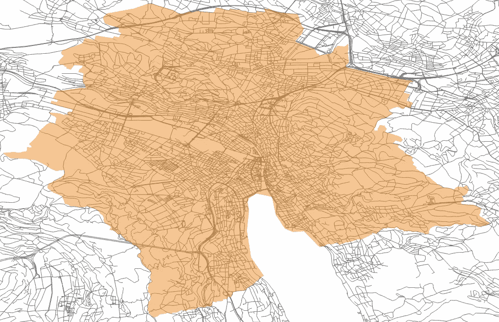

(The roads in the picture are included for better perception, they do not participate in the system operation)

首先，我们需要确定将进行计算的城市的边界，以及我们的交通网格的“密度”。密度越高，精确度越高，因此，考虑到业务需求，每个人都有一个选择。例如，我们决定以 1 千米为增量创建一个网格(在生产版本中我们使用了 500 米)。

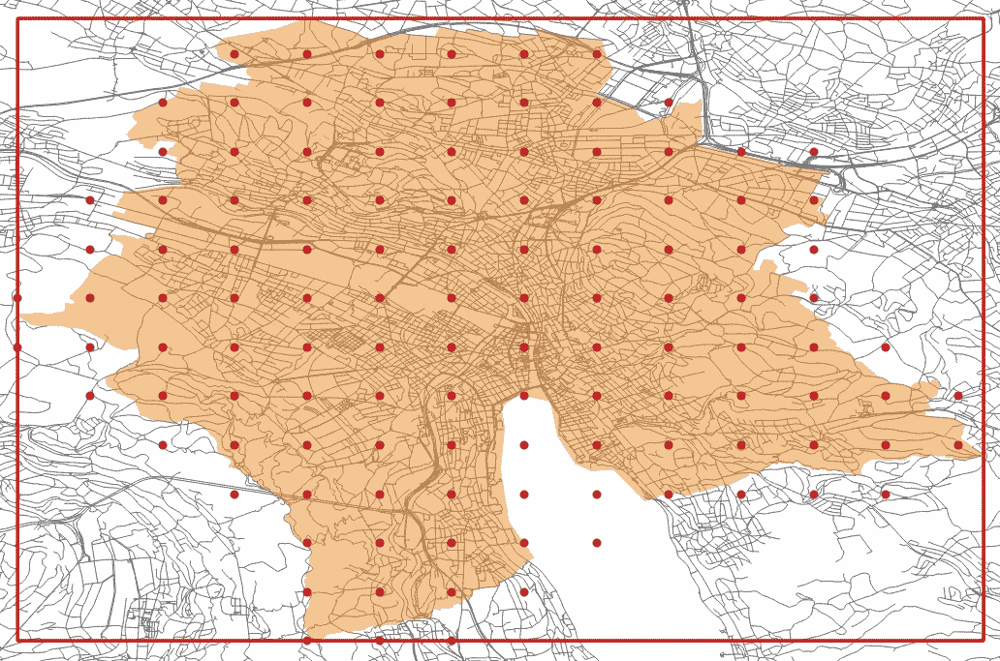

图中的红点是‘交通节点’，彼此等距的地理坐标，用城市边界区域的真实地址表示。同样在每个传输节点周围，我们构建了一个边长为 1 公里 x 1 公里的多边形，用于进一步计算。在图中，这些多边形看起来是矩形的，因为它们显示在 WGS 84 坐标系中。

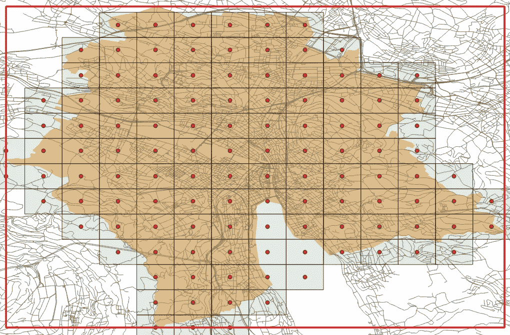

使用谷歌距离矩阵的功能，我们可以计算相邻交通节点之间的距离和旅行时间。让我们在存储接收数据的节点之间创建连接器。我们收到了这样的结果:

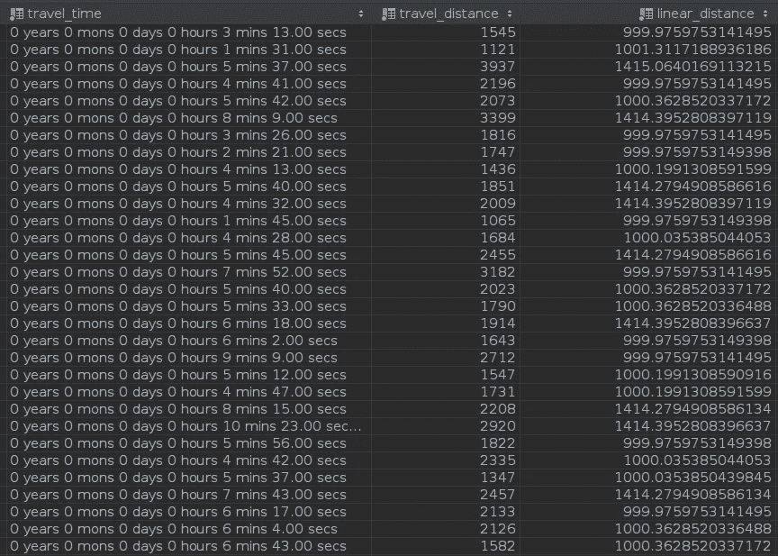

(each red line corresponds to the value from the table on the right)

*   Travel _ time 从第三方服务返回的路径时间值
*   Travel _ distance 从第三方服务返回的实际路径长度值
*   Linear _ distance 路径“直接”的长度值

如您所见，对于某些 Linear_distance 值，Travel_distance 值从 1300 到 3200 不等，这是一个显著的差异，不是吗？让我们试着做点什么。

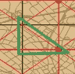

从图中可以看出，红线将传输节点的多边形划分为边长为 500 * 500 * 707 的小三角形(对于生产版本已经是 250 * 250 * 353)。让我们创建顶点在交叉点的多边形。

假设道路的走向没有显著变化，这意味着您可以通过将相应的值除以二来获得 Travel_time 和 Travel_distance 的值(两者都是新创建的三角形的值)(请注意，我们对水平和垂直连接符进行了双向计算)。通过计算速度，以及直线距离和与现实世界的距离之间的比率，我们获得“道路密度比率”，这将是我们的交通网络和现实世界之间的联系。

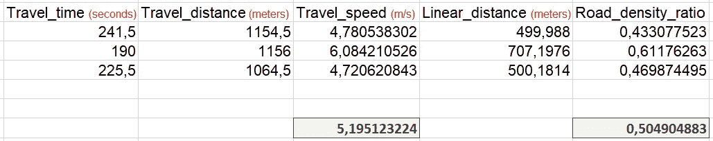

(gray values are the arithmetic average that will be written into the fields of our triangular polygons)

是时候做一些计算了。他们到底是怎么表演的？

我们的客户向他的房子下了一个服务订单，系统找到所有的专家，并试图计算从客户到每个专家的旅程时间。因此，基本上，我们知道每个三角形的交叉点所产生的线段的长度(线性距离)，我们知道这个三角形的平均“道路密度比率”和平均“行驶速度”，简单的数学和*瞧*！

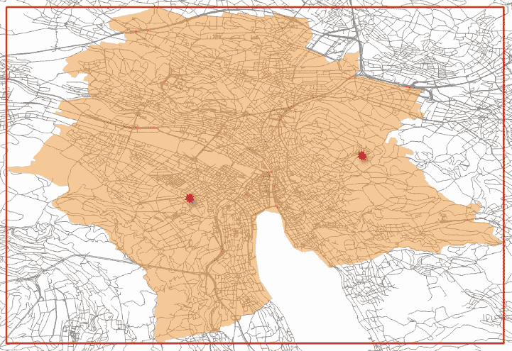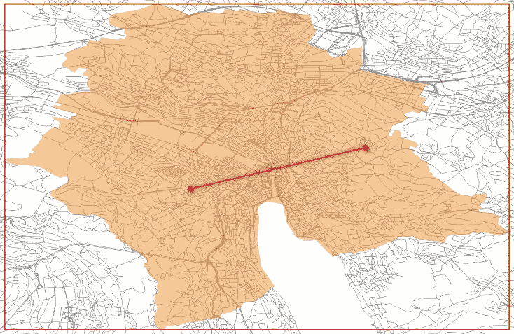

所有进一步的操作都由 PostGIS 执行。为了更清晰，有一个动画:

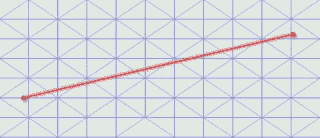

(blue lines are the borders of our triangular polygons)

如果连接器越过没有三角形的区域，我们该怎么办？对于这种情况，仍然有同样的宏伟教程对 PGR 的能力。在我们的例子中，我们没有指定一个包含道路的表，而是简单地指定一个包含传输节点之间的连接器的表。

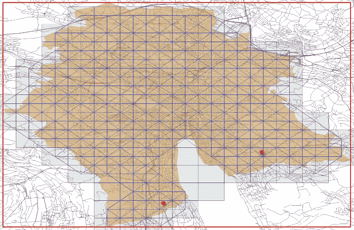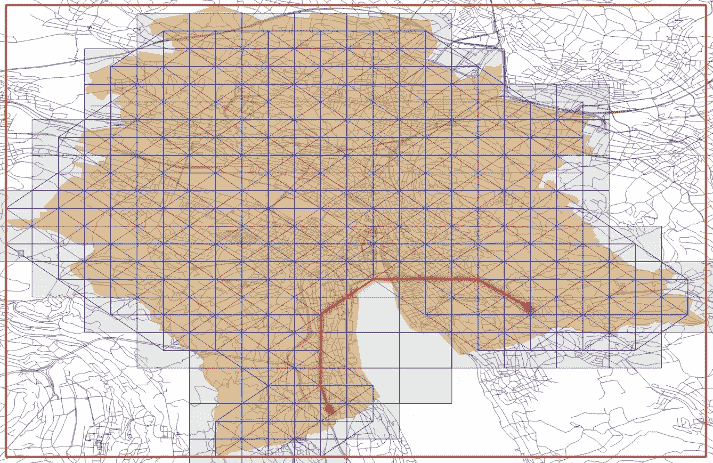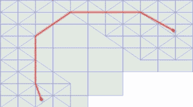

# 我们的解决方案与谷歌地图输出

结果 1:

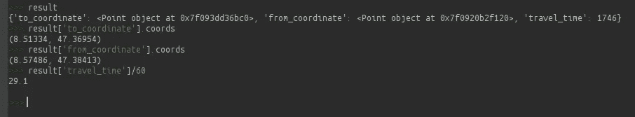

结果 2:

结果 3:

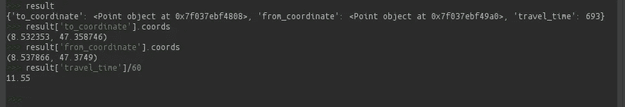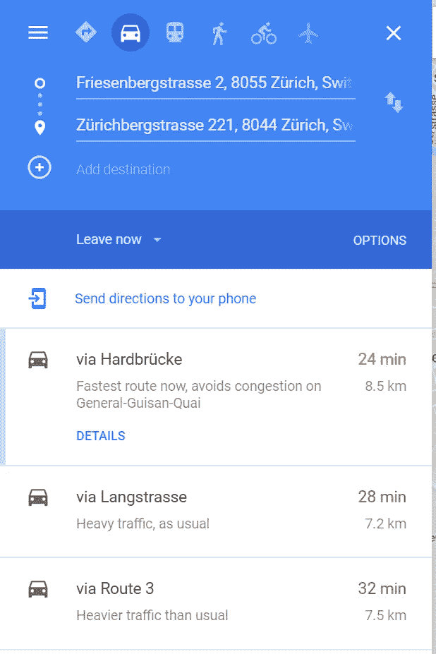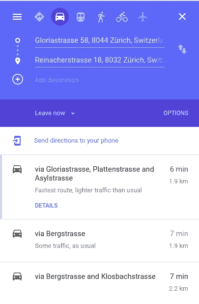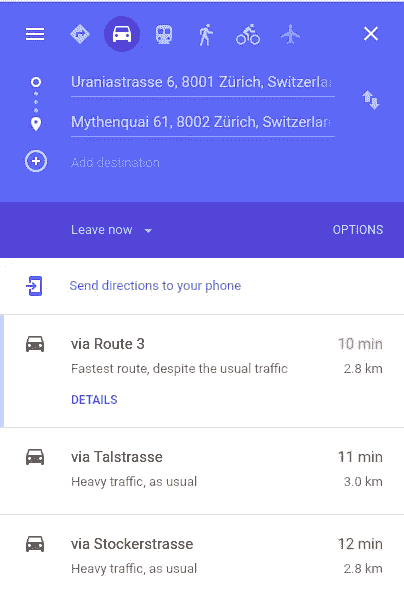

# 结论

为了启动苏黎世的系统，我们使用 724 个元素创建了请求，成本不到 4 美元。举个例子，在生产版本中，每天大约有 60 个客户在我们的系统中向 10-20 名专家提出请求。通过这种方式，直接的 API 请求每天生成大约 900 个元素请求，这比在城市中设置的系统所需要的还要多。因此，我们的解决方案比创建对现有 API 的请求更具成本效益。

*作者* [作者*康斯坦丁*作者](https://www.linkedin.com/in/konstantin-bondarenko-1a7a42144)

*由* [*校对*](https://www.linkedin.com/in/nadiia-pyvovar/)

*原载于 2019 年 7 月 4 日*[https://www . quantumobile . com/company/rd-blog/Uber-like-service/](https://www.quantumobile.com/company/rd-blog/uber-like-service/)*。*