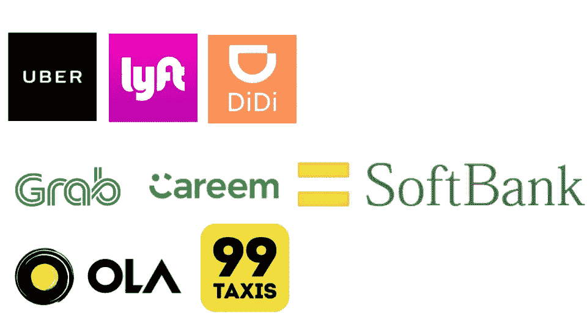

# 优步&打车市场的软银效应

> 原文：<https://medium.datadriveninvestor.com/uber-the-softbank-effect-on-the-ride-hailing-market-78eefc95a1b7?source=collection_archive---------0----------------------->

> 这是一次长途旅行。会有好的时候，也会有不好的时候，但是软银一直在。
> 
> *—软银创始人孙正义& CEO*

ide-hailing 始于 2009 年的 UberCab 是的，他们的名字中有“Cab ”!你可以在这里查看他们的第一个摊位。在巴黎这样的大城市是不可能叫到出租车的，总的来说这是一次可怕的经历；作为一名骑手，你受出租车司机和他们糟糕的监管者的摆布。

2010 年 Ola Cabs 在印度推出后不久。然而，我们今天熟悉的大多数主要参与者都是在 2012 年推出的——美国的 Lyft、中国的滴滴、新加坡和东南亚其他国家的 Grab、巴西的 99 和中东及北非的 Careem。

过去一年半以来，全球打车市场出现了一个非常有趣的现象。我们已经看到了该领域的整合，这一切都是在一个实体——软银——的授意下完成的。他们能够影响这一点，因为他们是所有主要打车公司的主要投资者，并且正在推动全球整合。

2016 年，优步退出中国市场，转而入股滴滴出行。这是全球整合的开始，上周我们看到优步退出了他们的东南亚业务，以换取他们的主要竞争对手 Grab 的股份——其最大股东是……你猜对了是软银！

> *看看优步在其他大市场的竞争，我们看到一个类似的故事:*

*   印度的 Ola Cabs，其最大投资者是软银。
*   中东和北非的 Careem，滴滴是那里的大投资者
*   2018 年 1 月被滴滴收购
*   连美国的 Lyft 都把滴滴算投资人了！

> 当然，软银是滴滴的大投资者之一，也是优步今年早些时候的大交易的最大股东，持有 20%的股份。

这种整合不应令人感到意外，因为打车领域的竞争一直很残酷，而且得到了全球“巨额风险投资”的资助。在过去的几年里，我们已经目睹了一场大规模的“土地掠夺”战略在该领域的上演，随着当前软银效应的出现，这一战略可能最终会显示出减弱的迹象。

他们似乎试图通过“投资”相互竞争的公司来减缓司机和乘客之间的残酷竞争，并以此作为一种强制整合的方式。我怀疑他们的策略是让每个大的世界市场都有一个主要的主导者，他可以支配司机和乘客的条款，并使这些业务盈利。

打车服务的未来似乎是优步和滴滴出行成为代理公司，软银通过它们巩固自己的市场地位，抑制竞争，提高乘客的价格，降低司机的费用。

该领域未来 12-18 个月将会非常有趣，我相信我们会看到当地监管机构介入市场，以确保叫车服务转向更具公用事业风格的业务，效率收益将传递给乘客和司机。蛮荒西部的日子即将结束。

*延伸阅读&听力*

*   [高盛播客——“现收现付”汽车和移动的未来](http://www.goldmansachs.com/our-thinking/podcasts/episodes/12-06-2017-stefan-burgstaller.html)
*   [https://www . wired . com/story/ride-hailing-business-Uber-lyft-索尼-博世/](https://www.wired.com/story/ride-hailing-business-uber-lyft-sony-bosch/)
*   [https://venturebeat . com/2018/03/30/ubers-next-battle ground-Latin-America/](https://venturebeat.com/2018/03/30/ubers-next-battleground-latin-america/)

*原载于 2018 年 3 月 30 日*[*www . Shiva la . in*](http://www.shivala.in/2018/03/30/uber-the-softbank-effect-on-the-ride-hailing-market/)*。*

