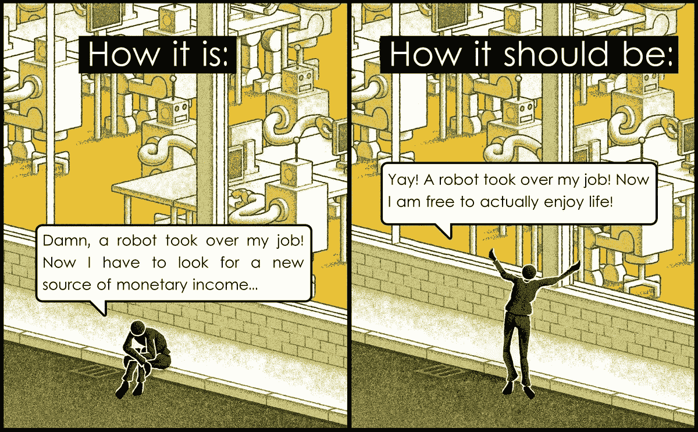
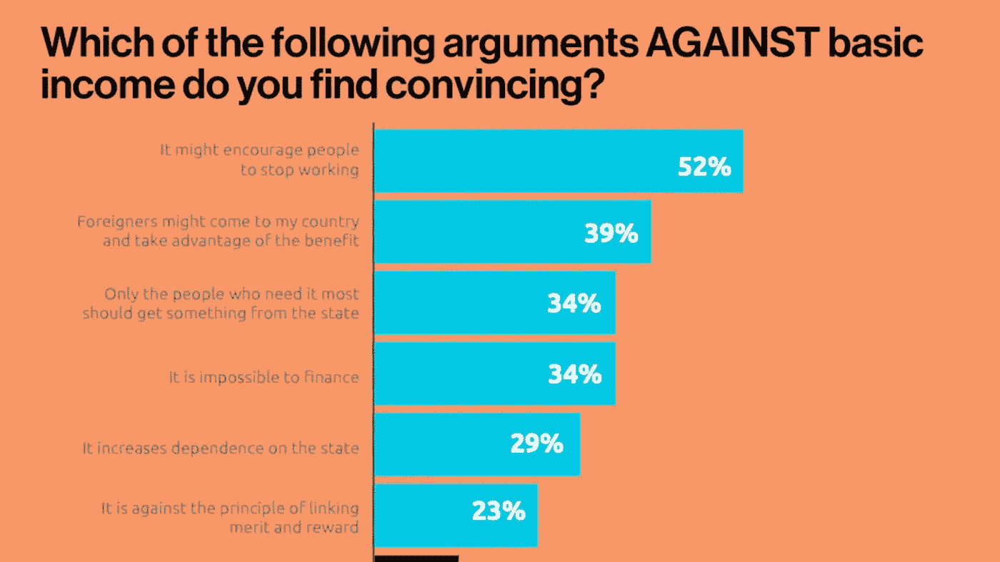
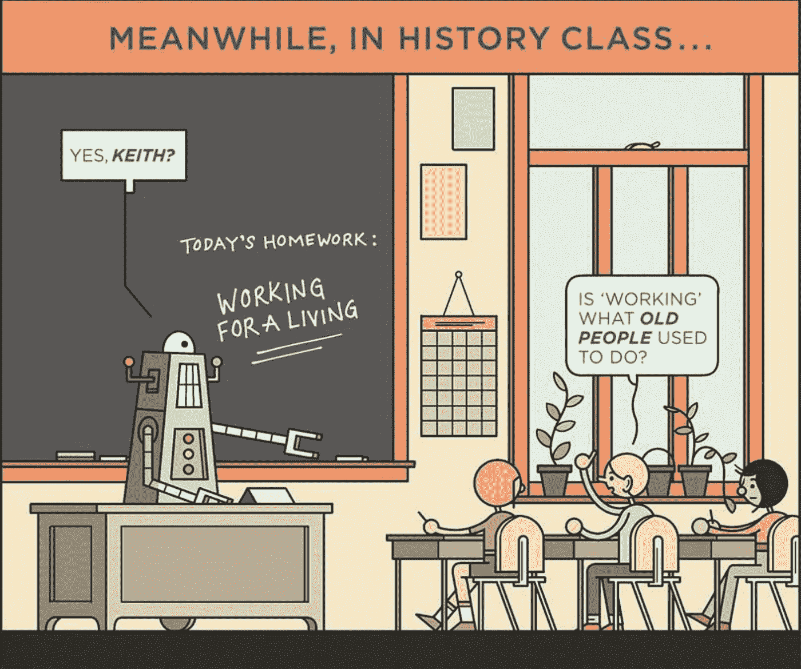

# 我们准备好接受全民基本收入了吗？

> 原文：<https://medium.datadriveninvestor.com/ubi-7d08766eec6?source=collection_archive---------2----------------------->

## 普遍基本收入的想法正在全世界加快步伐，但我们准备好了吗？

Photo by [Christine Roy](https://unsplash.com/@agent_illustrateur?utm_source=medium&utm_medium=referral) on [Unsplash](https://unsplash.com?utm_source=medium&utm_medium=referral)

你想不想每个月都把一笔预先分配好的钱直接打入你的银行账户，不问任何问题？这是普遍基本收入(UBI)的要点，它让整个世界在福利和风险上两极分化。UBI 正在全球范围内获得动力，并在经济学家和政治家之间引发了无休止的辩论。虽然 UBI 有一些强有力的支持，如埃隆·马斯克、比尔·盖茨、理查德·布兰森和马克·扎克伯格等支持这一概念，但许多经济学家仍然需要说服。虽然 UBI 的想法并不特别新颖，但它正越来越多地被世界各国政府视为应对失业率不断上升的一项措施。因此，民主党总统候选人杨安泽将他的整个竞选活动建立在实施全民医保的基础上。但是 UBI 能解决我们的失业问题吗？即使是这样，它在经济上合理吗？

## 的理由

> 机器人不能做得更好的工作会越来越少；我们正面临大规模失业。这将是一个巨大的社会挑战，最终我们将不得不拥有某种普遍的基本收入来维持生计。我觉得我们别无选择。
> 
> 埃隆·马斯克

世界上最大的科技公司的负责人认为，人工智能的突破将是如此势不可挡，以至于大约三分之一的可就业人口会发现自己没有工作。我们有充分的理由相信他们的话。杨安泽提议给所有美国成年公民每月 1000 美元的收入。现在，钱从哪里来？而且不会让人更自满，更不愿意工作吗？

 [## 另一场精心策划的全球经济危机正在逼近？如果我们的数据经济可以帮助它|数据…

### 我们的 DApp 的开发，称为 DECENTR，目前正与我们的 R&D 同步进行，作为我们即将到来的…

www.datadriveninvestor.com](https://www.datadriveninvestor.com/2019/03/06/another-engineered-global-economic-crisis-looming-not-if-our-data-economy-can-help-it/) 

好吧，让我们来看看数字，在美国实施的 UBI 的总数大约是 3 万亿美元。虽然这是一大笔钱，但当你看到许多正在进行的福利和安全项目时，它会大幅缩水，这意味着大约一半的美国人已经在获得收入支持。这个数字下降到大约 1.8 万亿美元。杨提议对奢侈品征收增值税，对从技术进步带来的产量增加中受益的公司征收“机器人税”。

现在，大多数人不明白的是，这 1000 美元的月收入将增加他们的购买力，实际上这笔钱将渗透到经济本身。因此，从理论上讲，它看起来并没有一些经济学家声称的那么大。还有一个学派认为犯罪率会大幅下降，因为这将激励罪犯不进监狱，以便他们继续获得 UBI。

至于人们变得消极和无精打采的想法，统计数据证明并非如此。在普遍存在 UBI 的阿拉斯加州，研究发现，自从 UBI 开始以来，市民们更受鼓励沉溺于工作之外的激情。

## 反对的理由

反对 UBI 的主要论点是融资。对于印度这样大的国家来说，在财政上很难接受基本收入的概念。对商品和服务需求的增加可能会引发通货膨胀。由于物价上涨，生活水平不会有很大提高。

此外，自由收入可能会抑制人们找工作的积极性，使工作看起来是可有可无的。尽管如前所述，研究表明个人的生产力提高了，但研究的规模还不足以令人信服地证明这一点。

另一个论点是，这将增加对政府的依赖，使经济更容易崩溃和放缓。

虽然普遍基本收入确实有其利弊，但在彻底研究这个话题数周后，我个人认为没有办法摆脱它。人工智能的进步正在以惊人的速度增长，大多数技能正在变得多余。我认为像美国这样的发达经济体实施这一政策只是时间问题。

