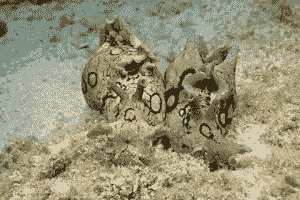

# 加州大学洛杉矶分校的生物学家报告说，他们已经将一只海螺的记忆转移到另一只海螺身上。但是我有一个挥之不去的疑问。

> 原文：<https://medium.datadriveninvestor.com/ucla-biologists-report-they-have-transferred-a-memory-from-one-marine-snail-to-another-8ea423c3b02?source=collection_archive---------13----------------------->

一开始，这个实验让我想起了一个 40 岁的学生关于伪科学方法论的笑话，其中提到了蟑螂。事情是这样的:

"一名研究人员提出了一个假设:蟑螂的听觉器官位于它们的跗骨上."为了验证这个假设，我们敲敲这只不幸的昆虫坐的桌子，看到蟑螂正在逃跑。”然后，博物学家撕下蟑螂的跗骨，敲敲桌子，注意到这只昆虫一动不动。因此，假设被证明，并成为一个工作理论。”

但是考虑到目前的技术趋势，如果我们离开对蟑螂的研究，这个实验看起来和我的观点有点不同:

一个房间里有两台一模一样的电视机，放在两张不同的桌子上。两台电视都连接到 220 伏电网。但是只有一台电视连接到电视天线，即第一台电视显示电视节目，而第二台没有，只有白噪声。让我们进行一个简单的实验—让我们关闭第一台电视的天线系统，并将其连接到第二台电视。确保第一台电视停止播放电视节目，第二台电视开始播放电视节目。我们做出一个非常简单的结论——实验者不仅成功地将电视节目从一台电视机“移植”到另一台电视机上，而且证明了所有的电视节目都位于天线系统中！多么简单易懂的实验，但是离现实有多远…

加州大学洛杉矶分校的生物学家报告说，他们通过给一只海螺注射 RNA，将一只海螺的记忆转移到另一只海螺身上，创造了一种人工记忆。这项研究可能会带来新的方法来减轻 RNA 带来的痛苦记忆的创伤，并恢复失去的记忆……”

来源: [**加州大学洛杉矶分校生物学家‘转移’了一段记忆**](https://www.eurekalert.org/pub_releases/2018-05/uoc--ub051118.php)

*原载于 2018 年 5 月 30 日*[*www.krasnostup.com*](http://www.krasnostup.com/en/2018/05/30/blog-en/ucla-biologists-report-they-have-transferred-a-memory-from-one-marine-snail-to-another-but-doubts-torment-me/)*。*