# Udacity 数据科学家顶点项目

> 原文：<https://medium.datadriveninvestor.com/udacity-data-scientist-capstone-project-306c1ab10ca5?source=collection_archive---------4----------------------->

这个帖子是为了支持 Udacity 数据科学家 Capstone 项目，并展示我对数据科学的理解。我将从项目的简要概述开始。

该数据集是模拟星巴克移动应用程序上的客户行为的模拟数据。

分析数据以确定以下信息:

a.什么因素促成了有效的报价？

b.我们能否利用所提供的数据预测一个报价是否有效。

提供以下数据用于分析

1.  优惠组合:这包括每个客户的属性
2.  人口统计:每个客户的人口统计数据
3.  交易数据:该应用上发生的事件的记录。

为了回答问题，我使用三种分类监督机器学习模型，从三种不同的报价类型中输入数据。

记录接受或不接受该提议的用户的特征重要性和特征。

# **数据的初步检查:**

我对下面列出的数据有一些疑问

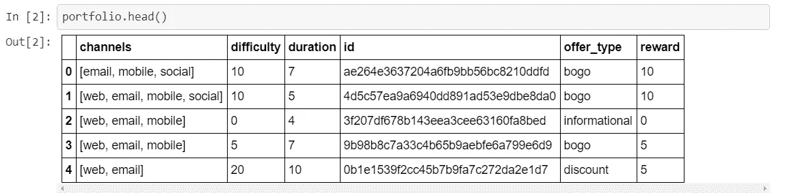

投资组合数据集中的渠道列由嵌套列表组成。我们需要扩大这个栏目。持续时间以天为单位，难度以美元为单位，所以我们需要做一些功能缩放。

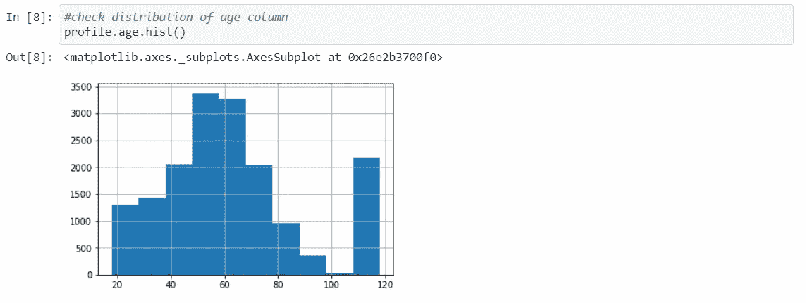

我们有一个年龄变量的异常值。年龄值 118 没有意义，脱离了正态分布。

我们还发现有 4 种类型的事件要约完成，要约收到和交易。我们需要为交易事件分配优惠 id，因为它尚未提供。

# **有效要约的定义:**

对于 BOGO 和折扣优惠，如果按正确的时间顺序记录了以下事件，则定义为有效优惠:

`offer received`->-`offer viewed`->-`transaction`->-`offer completed`

同时，对于一个信息性报价，由于有`offer completed`事件与之相关联，我必须将交易定义为有效报价的转换:

`offer received`->-`offer viewed`->-`transaction`

# 数据预处理

# a.为交易分配优惠 id

在定义了上面的方法之后，我们现在必须探索将 offer _ ids 分配给特定事务的方法。考虑因素之一是定义以下主要客户群:

**1。受影响并成功转化的人群—有效优惠:**

```
- `offer received` -> `offer viewed` -> `transaction` -> `offer completed` (BOGO/discount offers)
- `offer received` -> `offer viewed` -> `transaction` (informational offers - must be within validity period of offer)
```

**2。收到并查看了优惠但未成功转换的人员—无效优惠:**

```
- `offer received` -> `offer viewed`
```

**3。购买/完成优惠而不考虑任何优惠的人:**

```
- `transaction`
- `offer received` -> `transaction` -> `offer completed` -> `offer viewed`
- `transaction` -> `offer received` -> `offer completed` -> `offer viewed`
- `offer received` -> `transaction` -> `offer viewed` -> `offer completed`
- `offer received` -> `transaction` (informational offers)
- `offer received` -> `transaction` -> `offer viewed` (informational offers)
```

**4。收到聘用但未采取行动的人员:**

```
- `offer received` 
```

**目标变量:**

定义这些条件后，我们必须决定目标变量是什么。

我们知道第 1 组客户将是我们的目标变量`effective_offer=1`，但是对于第 2-4 组客户，有许多无效的报价定义。

那么，我们如何定义无效要约呢？如上所述，第二组属于无效要约的定义范围；用户知道一个提议，但是该提议是无效的，因为它没有将用户转化为顾客。所以组 2 可以定义为我们的目标变量`effective_offer=0`。

第三组和第四组呢？组 3 由可能已经收到报价但无论如何都要购买的用户组成。从商业的角度来看，我们不想给他们任何报价。

同时，组 4 用户将被认为是低优先级客户，因为他们不做任何动作，不管他们是否收到报价。

因此，我们可以从模型中取消组 3 和组 4 用户的优先级。仍然值得对第 3 组和第 4 组做一些探索性分析，只是为了探索他们的人口统计数据。

上述条件是我分配“影响”交易的报价 id 的基础，确保交易发生在`offer viewed`事件之后。

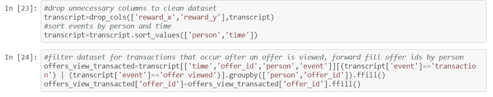

我们使用向前填充方法来填充要约 id 数据。

# 查看报价后标记已完成的交易和报价

为建模和分析准备数据的下一个重要步骤是识别完整的报价和查看报价后发生的交易。

一旦我们分配了在查看报价后发生的交易，我就可以使用该信息根据上面定义的组对我的数据进行分组，并在每个组内进行分析。

使用为`transaction`事件填充了 offer _ ids 的数据集，我们可以标记已转换的交易和已完成的报价。我们必须首先确保前一个事件的要约 id 是同一个。由于我们已经为所有已查看、交易和已完成的报价标记了报价 id，我们可以使用`offer_id`字段来确保之前的报价包含这些事件。

这意味着，只要事件`offer viewed`、`transaction`和`offer completed`发生在相同的事件空间中，并且处于正确的时间序列中，我们就可以确信它是仅在报价被查看之后才发生的交易和/或完成的报价。

为此，我使用 pandas 的`shift`函数创建了一个新列来标记以前的报价 id

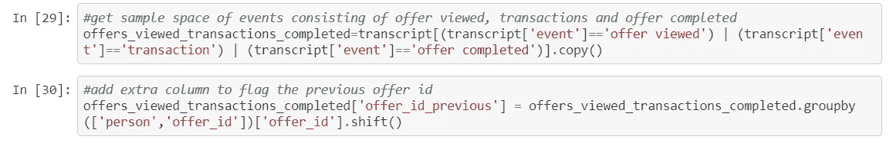

为之前发生了`offer viewed`事件的交易分配了 offer_id 后，我们现在可以重新访问我们正在尝试分析的四个独特的 person-offer_id 对的客户群。

由于我们对依赖于优惠类型的转换事件的考虑不同，我们必须首先将抄本分成 3 种不同的优惠类型，以适应在分配目标变量时的不同处理。

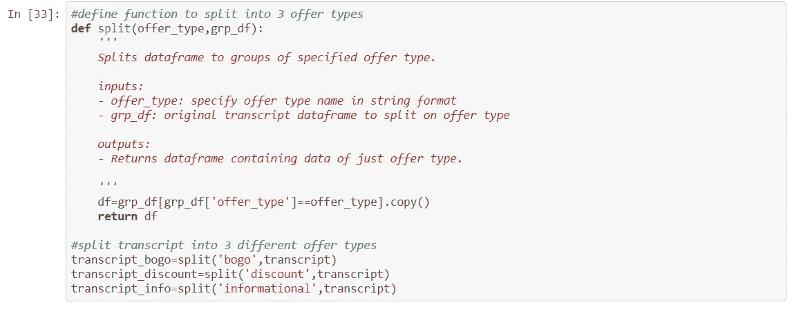

对于 BOGO 和折扣优惠，我们将只考虑`offer completed`事件作为转换事件，而我们可以考虑`transaction`事件作为信息性优惠的转换事件。

对于 BOGO 和折扣优惠，我们将数据分为 4 个不同的客户群。接下来，我们必须根据组类型来考虑有效和无效的报价。

**信息优惠的持续时间/有效期:**

对于信息性报价，报价的`duration`可以认为是影响的持续时间。因此，我们可以假设，只有在要约的`duration`范围内，要约才应被视为有效。

同时，对于 BOGO 和折扣优惠，我们可以假设如果有转换/ `offer completed`事件，它应该在持续时间内，因为如果优惠超过其有效期，则完成优惠没有意义。

我们可以将时间转换为天数，并获取信息提供的时差，以标记有效的事件。

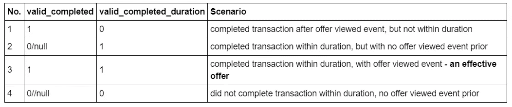

根据上述情景，只有情景 3 会被视为我们的信息性报价标签`effective_offers = 1`(第 1 组客户)。

# **特征工程**

1.  我们可以从 became _ member _ on 列中提取见解，并将其转换为一个特征。
2.  由于一个人可能会收到多个报价，因此可以设计报价计数列。这在下面的直方图中有所体现。

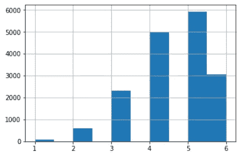

3.通过事务分离用户行为

检查对于受某些优惠(在第 1 组)和第 2 组中)高度影响的用户，是否存在某种消费基线水平，以及在“无效交易”的这种基线水平中是否存在某种预测能力，可以预测用户接受优惠的倾向。

4.收到报价的间隔时间。

我有一个假设，如果一个人在某段时间内收到了多个报价，那么在收到报价之间的时间间隔可能会有一些预测能力。

# **实施前的数据清理**

a.添加所有工程特性

b.删除人口统计数据的性别列中的缺失值，将性别转换为虚拟变量

c.将通道列分成分类变量

d.重复记录的处理

**实施**

我们将使用二元分类监督学习模型。我决定将简单决策树分类器模型作为基线模型，与集成随机森林分类器模型进行性能比较。我选择决策树作为基线模型的原因是，我想优先考虑模型的可解释性。回到目标，因为我们打算分析特性的重要性来确定有效报价的驱动因素，所以决策树将为我们的分析提供良好的可解释性。

同时，我还选择了随机森林作为替代模型来比较基线模型，作为对决策树简单集成打包的改进，以提高模型训练的准确性。

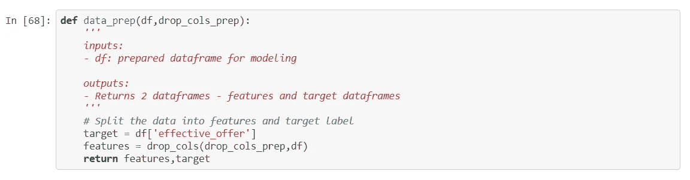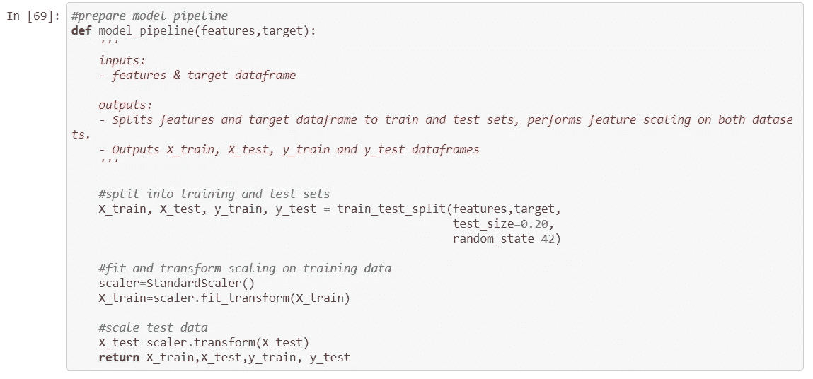

我在这里定义函数来运行我的模型，因为我计划实现 3 个不同的模型；因此，重复实现会更容易。在这个函数中，我定义了模型分数——F1 分数和准确度，以及误差(均方误差)。如上所述，我计划将 F1 分数与准确性分数进行比较，作为模型性能的更好指标，特别是因为 BOGO 和折扣优惠的等级不一致。

我们建立了 BOGO 优惠模型、折扣优惠模型和信息优惠模型。然后，我们使用指标评估模型性能。

**细化**

在优化模型时，我将首先尝试对 3 个 RF 模型进行参数调整，然后尝试删除或添加特性来提高模型性能。然后我决定做 GridSearch 来确定模型的最佳参数。

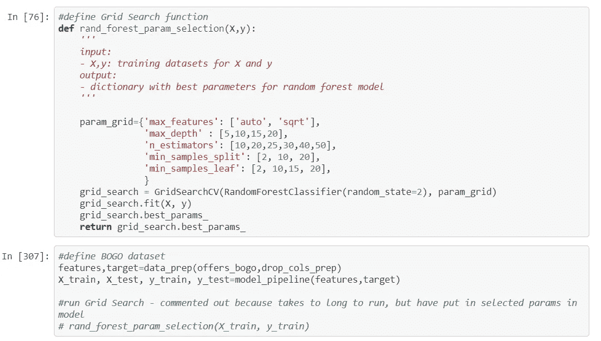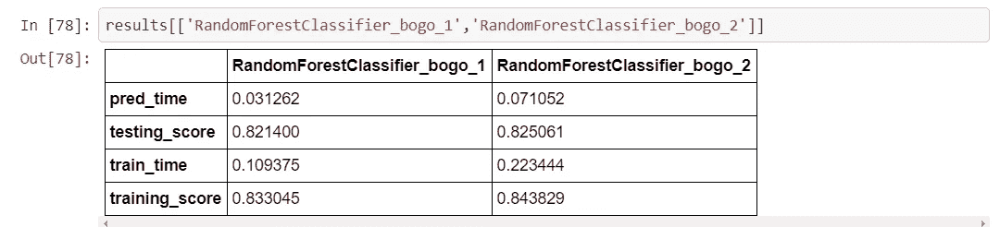

我还从我的数据准备中删除了数量无效变量特性，并使用通过 GridSearch 找到的相同优化参数重新训练了模型，将 DT 模型作为基线。信息模型不适合数据，所以我们需要添加更多的功能。

**最佳模式讨论**

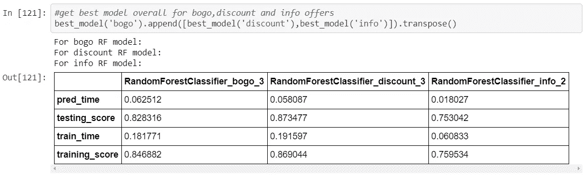

总的来说，我们可以看到，表现最好的模型是第三个模型(使用 GridSearch 查找最佳模型参数并删除 amount_invalid 列),用于预测 BOGO 和折扣优惠的有效性，而表现最好的信息优惠模型是在执行 GridSearch 查找最佳参数之后。

**特征重要性**

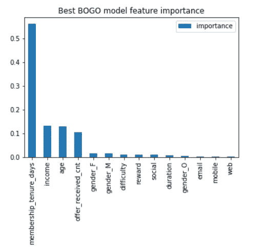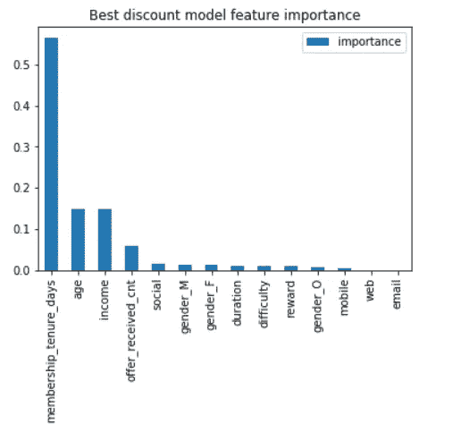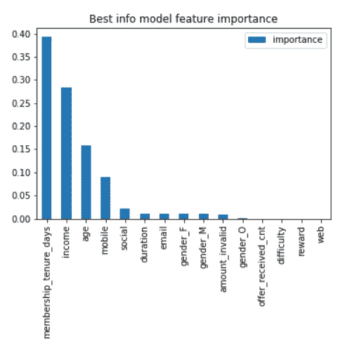

检查功能重要性以分析有效优惠的主要驱动因素，我们可以看到，在所有三个方面，有效优惠的最重要驱动因素是会员资格。然而，第二个最重要的特点是三种型号各不相同。

**结论:**

## 人工智能问题 1 调查结果:

对于问题 1，所有 3 个模型给出的特征重要性是，成员的任期是要约有效性的最大预测因素。进一步的研究将能够表明什么样的平均任期天数将导致有效的 BOGO 要约。

对于所有三个模型，前三个变量是相同的——成员任期、收入和年龄。但是，收入和年龄会根据优惠类型改变订单。

对于 BOGO 和折扣优惠，特征重要性的分布相对相等。然而，对于信息提供，分布稍微平衡一些，收入是第二重要的变量。

## a .二.问题 2 调查结果:

我决定使用 3 个独立的模型来预测每种优惠类型的有效性，最终 BOGO 和折扣模型的准确性较好(BOGO 为 82.83%，折扣为 87.35%)，而信息性优惠的准确性稍差(75.3%)。然而，在商业环境中，我认为 75%是可以接受的，至于信息性报价，通知用户产品是没有成本的。

与此同时，对于 BOGO 和折扣模型，我对 80%及以上的准确性非常满意，因为在向人们显示报价的商业环境中，即使模型错误分类了一些，整体收入的增加也可能证明这几个错误是正确的。