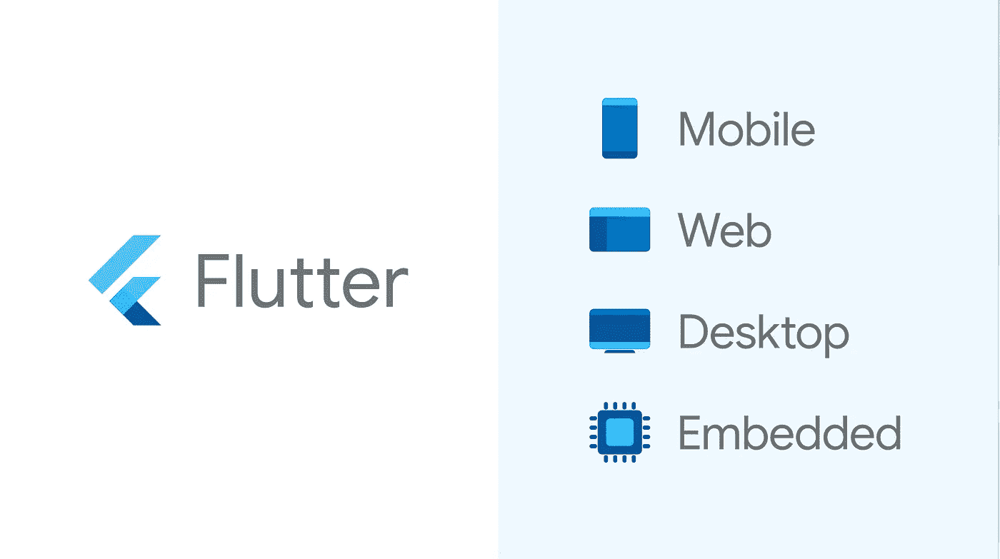
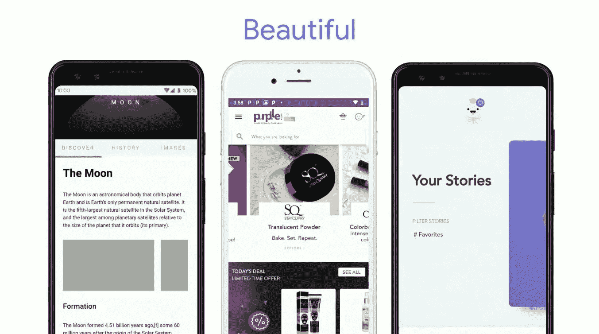
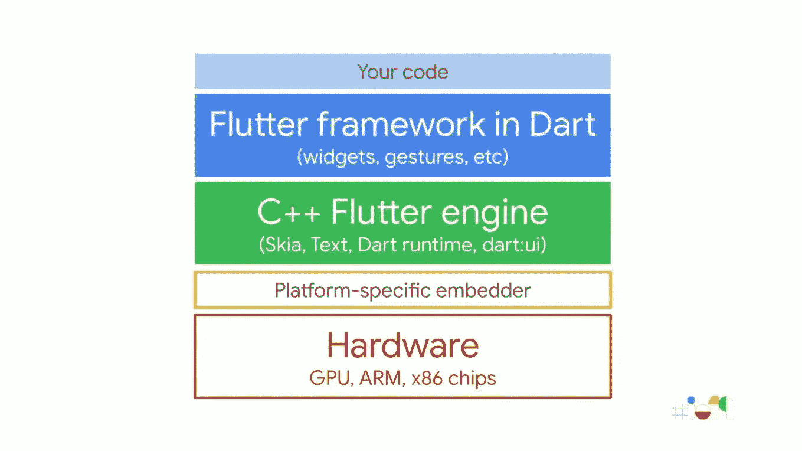
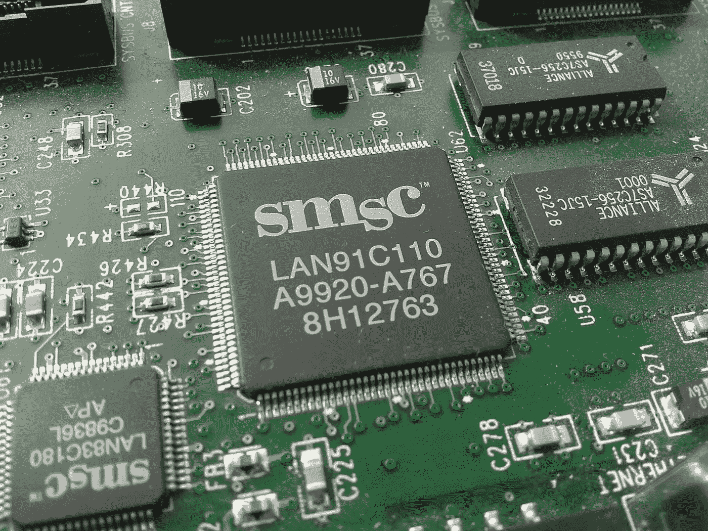
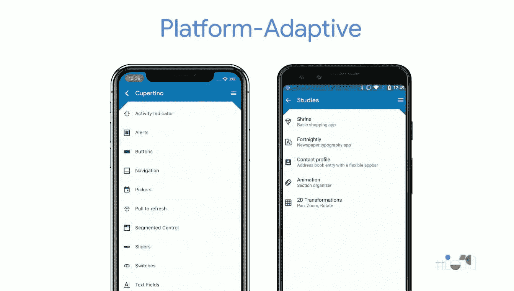

# UI/UX 革命与颤动|从移动到大屏幕。

> 原文：<https://medium.datadriveninvestor.com/ui-ux-revolution-with-flutter-from-mobile-to-big-screens-e2276b4fb3b3?source=collection_archive---------2----------------------->

Photo from Google I/O 2019

2018 年谷歌正式推出 flutter 1.0 后，移动应用开发者中有一个热门话题——flutter。移动开发者提出了许多问题，*没有 javascript，跨平台如何可能？* *比其他 javascript 框架快吗？* *我为什么要选择旋舞？但是他们中的大多数被它的用户界面/UX 元素所迷惑。受此影响，2019 年[谷歌 I/O](https://events.google.com/io/recap/) 发布了一项公告，*

> 本周的大新闻是，我们终于开放了 Flutter，不仅仅是移动设备，而是真正融入了我们对 Flutter 的更广泛的愿景，作为我们面向移动设备、嵌入式设备和桌面设备的通用便携式 UI 工具包。

 [## 2019 年移动应用开发之路|数据驱动的投资者

### 任何在移动应用程序开发行业工作的人，无论他们是专注于在伦敦开发 iOS 应用程序还是…

www.datadriveninvestor.com](https://www.datadriveninvestor.com/2019/01/15/the-path-of-mobile-app-development-in-2019/) 

本文涵盖了 flutter 的 UI 特性以及受特定 flutter 会议 Google I/O 2019 开发者峰会启发的主题。

# Flutter UI 套件具有令人敬畏的功能

Photo by [Tranmautritam](https://www.pexels.com/@tranmautritam?utm_content=attributionCopyText&utm_medium=referral&utm_source=pexels) from [Pexels](https://www.pexels.com/photo/apple-computer-decor-design-326502/?utm_content=attributionCopyText&utm_medium=referral&utm_source=pexels)

**像素完美与尺寸无关。**

Flutter 控制显示器中的每个像素。因此，无论你的设备显示器的尺寸是多少，flutter 都可以与之兼容。这也让设计师可以毫无保留地发表自己的观点。

**无故障的漂亮 UX**

颤振是建立在 Skia 之上，2D 图形引擎与硬件加速。这样，flutter 代码被直接编译成本机代码，而不是像 javascript UI 框架那样在虚拟机上解释或运行。因此，用 flutter 开发的应用程序没有故障，用户体验也很好(UX)。

**外观和感觉与材料设计相同**

Flutter 采用自己的材质设计，优雅美观。除此之外，你会在 android 和 ios 设备上看到相同的按钮、小部件和框架。原生的 ios 和 android 在其 UI 元素中有不同的风格，但 flutter 将为这两款设备带来相同的设计。因此，当你使用用 flutter 构建的应用程序时，你会在不同的设备上获得相同的感觉。

由于 flutter UI kit 具有上述特性，开发人员开始广泛使用它。Flutter 的开发者注意到了他们，并决定将 flutter 的功能扩展到大屏幕上。

Slides from Google I/O 2019

# flutter 在大屏幕上是如何工作的？

Flutter 实际上是 dart 语言之上的一个 UI 框架。在幕后，所有的编程工作都是用 dart 代码完成的。所以 dart 代码的使用方式决定了 flutter 的通用性。

**在网页上**

Web 开发人员知道，javascript 是 web 的脚本语言。所有的客户端环境都由 javascript 控制。因此，dart 代码被编译为 javascript 代码，并且可以使用 HTML 元素在 web 上轻松运行。

 [## 网的颤动

### 宣布为网络预演释放扑。

投资机会:vulture . dev](https://flutter.dev/web) 

**台式机上**

旋舞进入桌面环境的方式与进入移动环境的方式相同。Dart 代码运行在 c++ window 引擎上，该引擎将在专门为 Windows、Mac 和 Linux 构建的特定于平台的嵌入程序上运行。这比你想象的容易。*这是一个实验项目，但在桌面上使用旋舞的说明在下面给出的链接中。*

 [## 颤动/颤动

### 正在进行的工作是扩展 window 以支持桌面作为目标环境，允许开发人员创建 macOS…

github.com](https://github.com/flutter/flutter/wiki/Desktop-shells) 

**关于嵌入式系统**

[https://commons.wikimedia.org/wiki/File:SMSC_LAN91C110_ethernet_chip.jpg](https://commons.wikimedia.org/wiki/File:SMSC_LAN91C110_ethernet_chip.jpg)

旋舞有一个叫旋舞嵌入器的低层 API。该 API 用于将扑动的功能带到嵌入式系统中。开发人员必须通过使用你喜欢的平台上的 API 来创建你的定制的扑动引擎。但这仍处于开发阶段，开发人员正在努力让它在未来变得更好。

 [## 颤动/颤动

### 旋舞使它很容易和快速地建立漂亮的移动应用程序。—颤动/颤动

github.com](https://github.com/flutter/flutter/wiki/Custom-Flutter-Engine-Embedders) 

# 这怎么可能是革命性的呢？

前面的主题是为了达到这一点而解释的。

Photo by [Guille Álvarez](https://unsplash.com/@guillealvarez?utm_source=medium&utm_medium=referral) on [Unsplash](https://unsplash.com?utm_source=medium&utm_medium=referral)

编写代码总是充满挑战。有了这一点，使得跨平台应用程序需要花费大量的时间和精力。扑上去更容易。

*比如:-如果一家公司开发了一款手机应用，而且进展神速。在推出移动应用后，该公司发现该产品需要网络应用。然后雇佣一个网络开发者并创建网络应用。此后，对桌面应用的需求也出现了。在这种情况下，对于一家将应用程序扩展到跨平台的公司来说，扑动可能会更有帮助。无需额外的成本，从零开始设计 UI/UX，但改变现有的设计将是唯一要做的工作。*

Slides from Google I/O 2019

对用户来说，如果跨平台应用程序感觉相似，他们使用该应用程序会更容易。因为他们不会担心按钮和框架的放置。也就是说，这个应用的用户数量在增加。对公司来说，这是一个有利可图的举动。

*比如:-写一篇中型文章，在 PC 上比在移动应用中更容易上手。但这款手机应用程序阅读相关文章非常方便。如果这个 web 应用程序是用 with 构建的，那么把相同的 UI 带到这个移动应用程序上就更容易了。所以用户可以在网络和移动上感受到同样的体验。*

Photo by [Austin Distel](https://unsplash.com/@austindistel?utm_source=medium&utm_medium=referral) on [Unsplash](https://unsplash.com?utm_source=medium&utm_medium=referral)

# 结论

旋舞在移动开发者中已经很流行了。它的 UI/UX 功能非常吸引人。因此，flight 的开发者正试图将这种体验从移动屏幕扩展到更大的领域，比如网络、桌面和嵌入式系统。这种旋舞的演变成为 UI/UX 行业的一场革命，有一天所有的屏幕都会被旋舞点亮。

你想成为一名 flutter 开发者吗？在评论区告诉我。