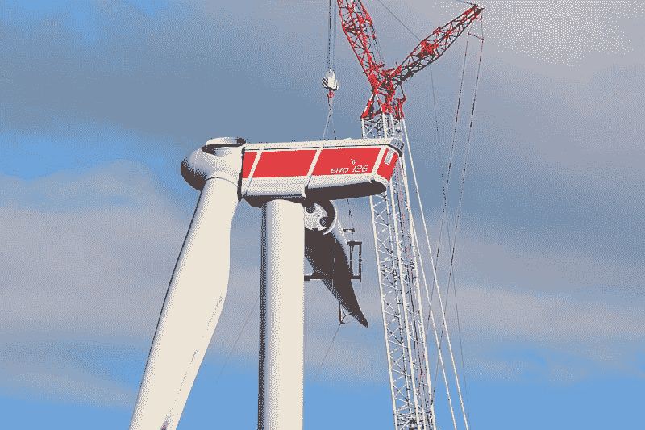
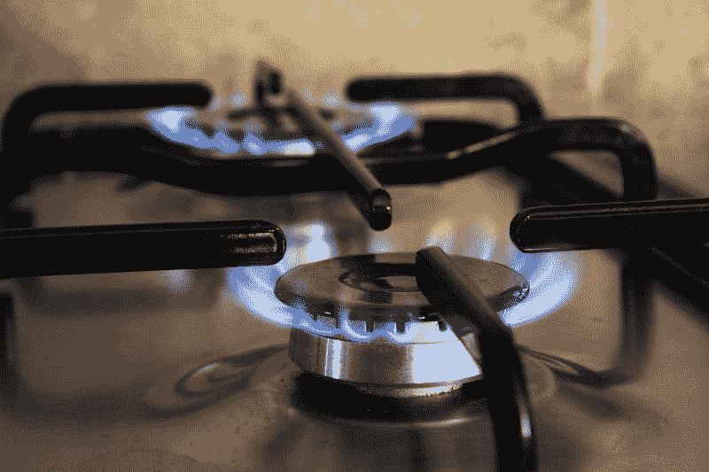
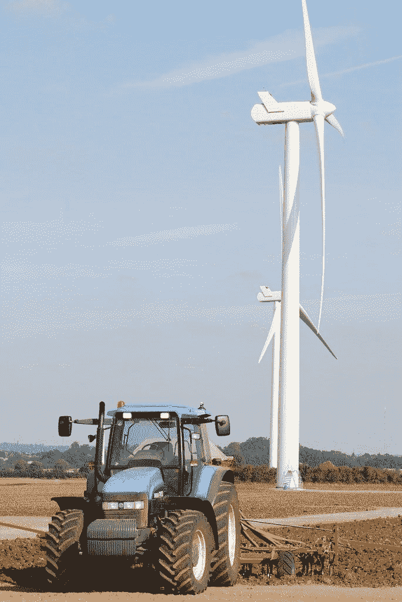

# 由于低需求和强劲的风力发电输出，英国天然气价格暴跌——市场疯人院

> 原文：<https://medium.datadriveninvestor.com/uk-gas-prices-slump-due-to-low-demand-and-strong-wind-power-output-market-mad-house-cb240728347?source=collection_archive---------8----------------------->

可再生能源现在满足了英国三分之一的电力需求，政府临时数据显示，去年风力发电占英国电力供应的 17.1%。这是历史新高，而 2017 年仅为 14.8%。

虽然朝着可再生能源驱动的经济方向迈出了正确的一步，但天然气价格正在付出代价。路透社最近的一份报告将混合天然气价格归因于较弱的风力输出预测和供应过剩的系统。国家电网数据显示，与 1.325 亿立方米的需求预测相比，每日天然气供应量为 1.586 亿立方米(百万立方米)。

这导致英国天然气系统供应过剩 2610 万立方米的天然气。

 [## 气候变化、ESG 和对更好数据的追求|数据驱动的投资者

### 在地球上许多地方经历了另一个令人难以置信的炎热夏季后，来自 S&P 的最新发现…

www.datadriveninvestor.com](https://www.datadriveninvestor.com/2018/08/24/climate-change-esg-and-the-quest-for-better-data/) 

# 风力发电创纪录的一年

*风能月刊*报道称，2018 年，该电网增加了 700 兆瓦的陆上风电装机容量，使陆上总装机容量达到 13.5 千兆瓦，海上总装机容量达到 8.2 千兆瓦，这要归功于 1.2 千兆瓦的新增装机容量。

核能、煤炭和天然气发电量的下降被可再生能源产量的增加所抵消，2018 年的总发电量下降了 1.4%，达到 334 兆瓦时。风能、太阳能和生物能是这一转变的主要可再生能源。

商业、能源和工业战略部表示，2018 年，可再生能源总计占能源产量的 111.1 万亿瓦时(33.3%)，高于 2017 年的 29.7%。这部分是由于几个海上扩张和新的风力发电站上线。

例如，世界上最大的海上运营项目 Walney Extension 的发电量为 6.59 亿瓦。

# 随后天然气价格暴跌

在天然气行业，9 月份的合同下降到每立方米 29.9 便士，下降了 0.59 便士。交易员称，前一天上涨 0.45 便士是因为前一周的低价格水平出现了回调。此外，周二风力发电输出的预期下降据称会增加对天然气发电的需求。

虽然这对交易者来说可能是喜忧参半的消息，但企业现在可以从油价下跌中受益。大约 80%的英国企业支付过高的天然气价格，现在是一个比较价格和寻找更实惠的供应商的好时机。[公用事业投标人](https://www.utilitybidder.co.uk/business-gas/)为企业提供商业天然气交易和最可靠公司的供应商比较。

# 英国可再生能源的未来

可再生能源生产的破纪录数字随处可见，显示了其不可阻挡的势头。虽然太阳能光伏负载系数在 2018 年第四季度下降，但水电、生物能源、陆上和海上风力发电[飙升](https://www.windpowermonthly.com/article/1580446/record-year-uk-wind)。

英国可再生能源公司副首席执行官；艾玛·平克告诉*风能月刊*，灵活的电力、公平的市场、廉价的发电和创新资金是推动政府认识到可再生能源在英国未来电力生产中的地位的足够令人信服的理由。

随着可再生能源日益成为英国发电的重要组成部分，传统能源生产商受到冲击也就不足为奇了。只有时间能告诉我们这将如何影响整个经济。目前，企业可以从廉价天然气中获益。

*发布于 2019 年 9 月 6 日*[*https://marketmadhouse.com*](https://marketmadhouse.com/uk-gas-prices-slump-due-to-low-demand-and-strong-wind-power-output/)*。*