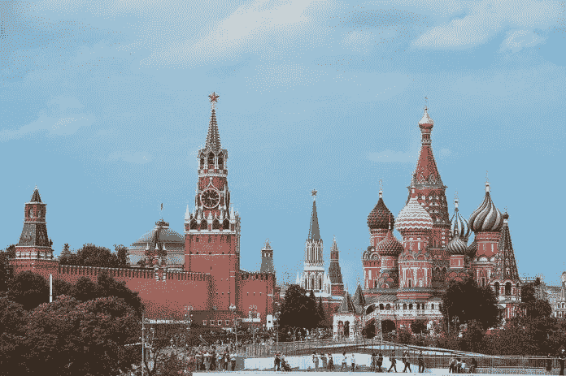
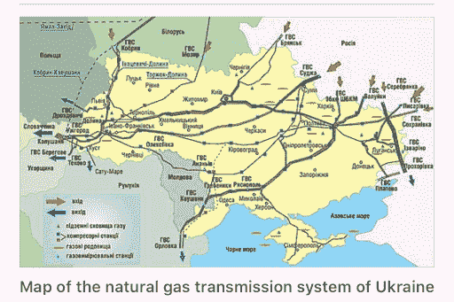
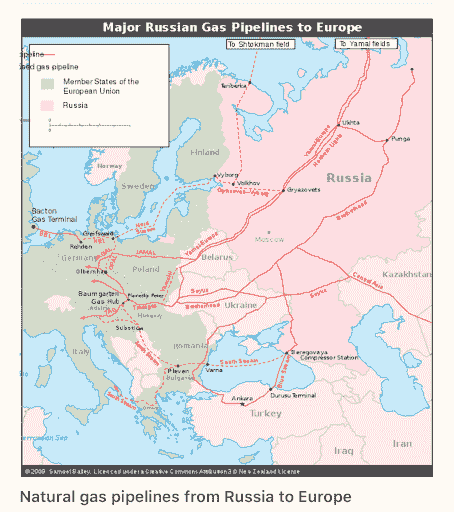
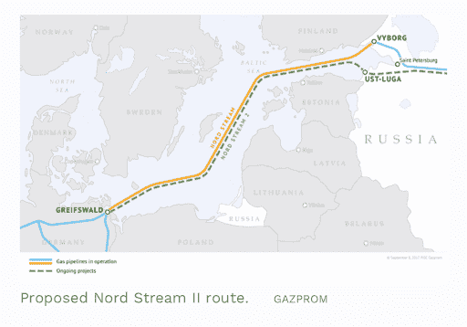
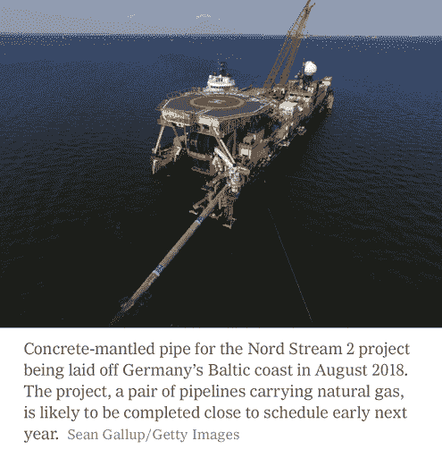

# 乌克兰:政治、商业和企业封建主义

> 原文：<https://medium.datadriveninvestor.com/ukraine-politics-business-and-corporate-feudalism-5cdb351a0c87?source=collection_archive---------6----------------------->

世界政治格局在不断变化。几个世纪以来，参与的规则已经从君主制转变为社会极权主义，从而进一步转变为我们现在所目睹的，即企业封建主义。最脆弱的具有经济潜力的新兴国家正在成为一个目标，以换取援助或商业。后苏联时代的乌克兰和其他国家都是这一图景的例证。

“féodal”一词源自 17 世纪法国法律契约中使用的术语。它被翻译成英语法律论文作为一个形容词，如“联邦政府”，仅仅类似于一个联邦国家，具有财政，政治和军事权力，以保护缺乏一个或多个宣布的工具的社会的利益。封建国家的政府将面临冲突，这些冲突必须在战场上或谈判桌上解决。重要的 21 世纪公司是他们那个时代的封建主义者或另一个词联邦主义者，因为他们有无限的货币资源，投资于最富裕的游说者，他们在工业部门有财务利益，最重要的是，他们与拥有世界上最强大军队之一的政府保持伙伴关系特权。

在当前以乌克兰、俄罗斯、美国和唐纳德·特朗普总统为中心的动荡中，弹劾调查象征着现代意义上的封建观念。如果我们走出媒体森林，窥视政治丛林的巨大混乱景象，这一点就很明显了。

 [## 保护主义、政治和经济动荡|数据驱动的投资者

### 美国股市昨日出现 400 多点的大幅反转，为未来的事情发出了警告信号。市场…

www.datadriveninvestor.com](https://www.datadriveninvestor.com/2018/06/28/protectionism-politics-economic-turmoil/) 

[乌克兰](https://www.theguardian.com/environment/earth-insight/2014/mar/06/ukraine-crisis-great-power-oil-gas-rivals-pipelines)是前苏联国家，也是今天东欧国家的一部分。它与东北的俄罗斯接壤；北方的白俄罗斯；西部的波兰、斯洛伐克和匈牙利；以及罗马尼亚、摩尔多瓦和南部的黑海。

Ukraine

在 2014 年被俄罗斯重新吞并后，乌克兰目前与邻国俄罗斯在克里米亚半岛问题上存在领土争端。包括克里米亚在内，乌克兰的面积为 233，062 平方公里。英里，使其成为欧洲最大的国家和世界第 46 大国家。但是，不包括克里米亚，乌克兰有 4200 万人口，是世界第 32 大人口大国。其首都和最大城市是基辅，乌克兰语是官方语言。这个国家的主要信仰是东正教。根据 2019 年的数据，乌克兰的国内生产总值估计为 4080.40 亿美元，人均 9743 美元。

# 乌克兰的经济和战略意义

乌克兰在欧洲大陆拥有独特的战略视角，这使得该国对世界其他地区具有重要价值，对西欧领土更是如此。此外，它还监管着从俄罗斯延伸到包括德国在内的西部地区的天然气管道的主要通道。

乌克兰国有[天然气石油公司](https://en.wikipedia.org/wiki/Naftogaz)；Naftogaz 从事天然气和原油的开采、运输和提炼。年营收€81.63 亿；€净收入 36841 万。Naftogaz 总资产估计约为€192.28 亿，总股本为€131.81 亿。乌克兰天然气管道是一个复杂的天然气输送管道网络，用于从俄罗斯向西方国家的天然气进出口以及在乌克兰的过境运输。它是世界上最大的输气系统之一。

2009 年[，乌克兰、欧盟委员会](https://europa.eu/rapid/press-release_BEI-11-71_en.pdf)、欧洲复兴开发银行、欧洲投资银行和世界银行签署了一项协议，旨在复兴乌克兰天然气输送系统。该协议旨在实现整个欧洲大陆天然气供应系统的现代化。

# 俄罗斯-乌克兰冲突

苏联解体后，乌克兰与俄罗斯的关系并非没有冲突，2005 年 3 月，俄罗斯政府指控乌克兰在没有支付主要用于西欧国家的天然气费用的情况下，从管道中转移天然气，引发了严重的对抗。虽然乌克兰官员最初否认了这一指控，但后来 Naftogaz(国家国有能源公司)承认，打算供应给其他欧洲国家的天然气被隐藏起来，用于国内目的。

2006 年 1 月 1 日，当俄罗斯停止通过乌克兰管道输送天然气时，争议达到了新的高度。根据这一经验以及路透社的报道，乌克兰天然气运输公司 Ukrtransgaz 已经开始在一些地方增加天然气泵站，以帮助在俄罗斯再次中断天然气供应的情况下，向该国东部和南部地区输送天然气。俄罗斯-乌克兰天然气运输协议将于 2020 年 1 月到期。

后者是乌克兰能源领导层非常关注的问题，因为俄罗斯可能会在此后的任何时候停止通过乌克兰管道的天然气供应，导致乌克兰某些地区没有足够的天然气，尤其是在冬季。俄罗斯人和乌克兰人之间不断升级的对抗已经导致俄罗斯占领了乌克兰自治区克里米亚，导致 2014 年 3 月 18 日[吞并克里米亚](https://en.wikipedia.org/wiki/Annexation_of_Crimea_by_the_Russian_Federation)。

革命后的乌克兰政权与亲俄叛乱分子[之间展开的战争，伴随着两国紧张局势的升级](https://www.bloomberg.com/news/articles/2018-03-21/russia-seen-needing-ukraine-s-gas-pipelines-to-europe-after-2019)，以及他们之间天然气条约的探索，都指向这样一种假设，即俄罗斯将在 2020 年需要[乌克兰](https://en.wikipedia.org/wiki/Natural_gas_transmission_system_of_Ukraine)到[欧盟](https://www.forbes.com/sites/arielcohen/2018/06/18/russias-nord-stream-ii-pipeline-is-ukraines-worst-nightmare/)的天然气管道。出于这个原因，乌克兰 Naftogaz 公司在其长长的议程清单中积累了 2020 年 3 月与俄罗斯同行 Gazprom 举行会议的内容。

俄罗斯绕过乌克兰过境走廊的替代战略是北溪二期工程，它只是现有水下管道的扩建。更新的系统扩展了波罗的海最长的延伸长度，允许 Gazprom 增加对匈牙利和德国的直接天然气供应。

pipeline

俄罗斯[北溪二期管道](https://www.nytimes.com/2019/10/07/business/energy-environment/gas-nord-stream-pipeline.html)将[跨越政治界限](https://www.nytimes.com/2019/10/07/business/energy-environment/gas-nord-stream-pipeline.html)，可能使德国依赖俄罗斯天然气，同时在经济上危及乌克兰的收入流。天然气将从俄罗斯直接流向德国，绕过波兰和乌克兰，并扣留这两个国家的大部分过境费。

其结果是，德国将开始依赖俄罗斯的天然气，同时计划摆脱对核能和煤炭能源的依赖。与此同时，制造不确定性是俄罗斯的目标，目的是让乌克兰获得大量关键红利。

[川普政府](https://www.rferl.org/a/us-efforts-stop-russia-pipelines-will-nord-stream-2-be-different/30107938.html)，在[美国国会的支持下，正在继续努力](https://www.rferl.org/a/us-efforts-stop-russia-pipelines-will-nord-stream-2-be-different/30107938.html) g 停止 95 亿欧元(106 亿美元)的北溪 2 项目，以防止北约盟国成为俄罗斯化石燃料能源的附属品。基于这一理由，自那以来，[德国一直努力主动主持与乌克兰和俄罗斯的三方会谈](https://qz.com/1329732/what-is-the-eu-ukraine-russia-gas-pipeline-germany-hosts-meeting/)，特朗普总统在北约峰会期间抨击[德国，批评](https://qz.com/1329732/what-is-the-eu-ukraine-russia-gas-pipeline-germany-hosts-meeting/)他们在地区动荡问题上的立场。

丹麦是首批批准北溪二期管道项目的波罗的海国家之一。美国国会一直在考虑对俄罗斯采取进一步的制裁措施，以此来阻止波罗的海海底的北溪二期天然气管道。但是，这个想法已经付诸行动，因为已经有 85%的管道已经插入。看似足够的是，针对参与管道建设的公司的国会禁令既不会停止该项目。相反，它们将成为美国和欧盟关系紧张的另一个借口。

[**相关文章:什么是生物科技，如何投资？**](https://www.datadriveninvestor.com/2018/08/03/what-is-biotech-and-how-can-you-invest-in-it/)

# 但是，美国化石燃料与乌克兰和特朗普弹劾听证会有关系吗？

乌克兰目前正处于对总统[川普弹劾](https://www.eenews.net/stories/1061182247)的加速审查中，而这对总统促进美国化石燃料出口的努力[至关重要。尽管如此，弹劾调查程序伤害了美国和乌克兰的关系。这一切都始于众议院民主党人开始收集数据，了解总统及其政府可能如何参与向乌克兰施压，要求乌克兰调查前副总统乔·拜登(Joe Biden)及其儿子亨特·拜登的腐败指控。](https://www.eenews.net/stories/1061182247)

乌克兰领导人邀请美国支持和投资其能源部门，愿意购买美国的液化天然气，而不是购买俄罗斯的燃料。主要信息是:面对俄罗斯的军事干预，乌克兰依赖任何倾向于向其提供军事支持的政府。然而，美国并不是扩大液化天然气出口能力的少数国家之一。根据该报告，俄罗斯还计划在欧洲建设液化天然气终端，使该国能够以比美国供应商更低的价格向欧洲国家出口液化天然气。

# 与卡内基国际和平基金会一起改革乌克兰的能源部门

改善乌克兰能源部门顾问[卡内基](https://carnegieeurope.eu/2018/02/06/reforming-ukraine-s-energy-sector-critical-unfinished-business-pub-75449)是一个国际政策分析组织，成立于 2007 年，十多年来一直致力于乌克兰的能源部门改革。根据该机构的说法，如果目的是支持经济和国家安全，那么转变国家的能源领域就显得格外重要。即便如此，尽管最近在建设性的道路上迈出了热情的步伐，但可能性看起来很麻烦。

Naftogaz 公司的代表在 2015 年第一次与他们的美国支持者和商业专家会面，考察乌克兰的天然气市场和对未来投资的预期。大约在同一时间，位于得克萨斯州[奥斯丁的 TrailStone](https://www.forbes.com/sites/kenrapoza/2015/07/15/ukraine-opening-its-energy-market-to-the-u-s/) 宣布了进入乌克兰市场的计划。受到 Naftogaz 的欢迎，Kyiev 通过私有化政策吸引西方投资的敏锐诡计一直是其领导人将俄罗斯的影响从势力范围中分离出来的关键手段。Naftogaz 长期以来一直是俄罗斯政府监管的巨头俄罗斯天然气工业股份公司的合作伙伴。然而，Naftogaz 有时一直在排练解放，在这一过程动摇地区稳定的同时，在中间胁迫美国和欧盟。

该部门为 Trailstone 等美国能源公司提供了进入利润丰厚的欧洲市场的机会。但是，根据 2019 年的丑闻，美国能源部长里克·佩里(Rick Perry)任命政治支持者迈克尔·布莱泽(Michael Bleyzer)为乌克兰总统的顾问，之前的[德克萨斯大学系统董事](https://www.texastribune.org/2019/11/11/rick-perry-supporters-won-potentially-lucrative-ukraine-oil-and-gas-de/)从乌克兰政府获得了利润丰厚的能源合同。据了解，前得克萨斯州州长佩里参加了乌克兰总统沃洛季米尔·泽伦斯基的就职典礼。

据路透社报道，在访问期间，里克亲自交给即将上任的总统一份名单，其中也包括布莱泽，他认为布莱泽是担任 Naftogaz 公司能源顾问的有利人选。Blayzer 的名字在其余的名字中是不足为奇的。

不出所料，在接下来的一个月内，乌克兰将油气勘探合同授予了 Bleyzer 和他的合作伙伴 Alex Cranberg。佩里在德克萨斯州登记投票后，选举克兰伯格进入犹他州董事会，寻求从科罗拉多州过渡。克兰伯格在 2011 年至 2017 年担任一个系统的管理委员会，并被视为一个有争议的人物。

后者的举动震惊了美国众议院三个委员会的民主党人，促使他们传唤佩里的手稿，作为对唐纳德·特朗普总统恳求泽伦斯基调查美国民主党总统候选人乔·拜登之子的账户进行弹劾调查的一部分。当时，亨特在 2014 年至 2019 年期间担任乌克兰主要天然气生产商 Burisma Holdings 的董事会成员，这与 Trailstone 谈判的时间相吻合。

# 石油和天然气的公开秘密

[据美联社](https://apnews.com/d7440cffba4940f5b85cd3dfa3500fb2)报道，在特朗普总统的帮助下，鲁迪·朱利安尼(前纽约市长，特朗普的律师)试图改变纳夫托加斯的高级管理层，这一举动已经被能源部长里克·佩里想到了。随着鲁迪·朱利安尼在 2018 年推动乌克兰官员调查唐纳德·特朗普的主要政治对手之一(拜登)，一群与总统及其律师有联系的人在乌克兰进一步活跃。民主党人认为利润高于政治，这是怀疑前苏联共和国政府中有人可能从美国获得内幕信息的最终结果。后者点燃了新的火焰，点燃了反对在任美国总统滥用权力的火炬。

毫无疑问，[石油和天然气能源行业](https://www.theguardian.com/us-news/2016/mar/03/oil-and-gas-industry-has-pumped-millions-into-republican-campaigns)在共和党的成功中得到了一心一意的关注，因为根据一份报告，仅在 2015 年，化石燃料股东就总共向共和党总统竞选活动注入了超过 1 亿美元的捐款——这为石油和天然气行业在该党的财富中提供了一笔出色的交易。

在桌子的另一端，清洁能源的言论经常是民主党谈话的主题，因为他们意识到，如果他们必须应对气候危机，与化石燃料行业的战争是绝对的解决方案。因此，一条公开的信息表明[乔·拜登参加了一个每人 2800 美元的筹款会](https://www.theguardian.com/commentisfree/2019/sep/06/democrats-climate-plans-fossil-fuel-industry)，由安德鲁·戈德曼主持，他是一家专门为“清洁天然气”开拓新市场的公司的联合创始人

与此同时，发起对亨特腐败指控调查的前乌克兰检察官维克托·肖金(Viktor Shokin)在美国副总统乔·拜登(Joe Biden)向乌克兰政府施压后被清除，作为报复，他扣留了承诺的财政支持。检察官被解雇是因为他认为任命亨特·拜登为 Burisma 董事会成员是错误的，因为他缺乏相关经验。

在一次新闻采访中，参议员兰德·保罗(R-KY) 声称，一个由民主党参议员组成的代表团预计也将因他们在 2018 年向乌克兰政府传递的一条信息而受到调查，提出了一个关于穆勒相关调查的问题。在采访中，他指出，在滥用权力方面，两个政党似乎都在犯[同样的趋势。](https://www.thedailybeast.com/rand-paul-democrats-actually-need-to-be-investigated-over-ukraine)

在【2019 年 11 月，Washington examiner 发表了一篇文章，指出民主党人不想让公众知道乌克兰调查的起源，因为他们不想让国家发现俄罗斯调查的来源。众议院民主党人似乎不愿透露特朗普-乌克兰告密者的身份，他透露了总统与乌克兰领导人关于最近佩里努力的谈话性质。也许他们对举报人的安全感到不安，或者可以想象不是！

但是，民主党人似乎明白，除了情报部门总检察长的有限拒绝，没有任何法律阻止政治、媒体或其他任何地方的任何人公开举报人的倾向。民主党人决定切断对特朗普-乌克兰调查根源的质疑，这似乎与他们拒绝就特朗普-俄罗斯调查的开始提出问题的判断相同。在这两种情况下，他们都以压倒性的优势捍卫了审查的秘密来源，这些审查震动了整个国家，深刻地分化了选民，并影响了总统的命运。

在民主党竞选承诺消除美国能源部门的同时，当前的共和党政府正在快速推进原油和天然气生产。民主党总统候选人抵制一种被称为水力压裂的生产技术，这种技术得到了他们的对手共和党人的大力支持。他们认为这不是基于环境危害，因为他们知道这是一种清洁技术，或者是一种生态和金融财富，然而这是由于天然气产量的增加，尽管这是一种比煤更体面的发电方式。共和党竞争者声称水力压裂法是提取化石燃料的有效方法。

[**相关文章:日益扩大的经济鸿沟**](https://www.datadriveninvestor.com/2018/09/01/the-growing-economic-divide/)

如前所述，[里克·佩里，根据与乌克兰人关于现代化提取的商业交易](https://www.nytimes.com/2019/10/07/us/politics/rick-perry-ukraine.html)，液化气已经让他卷入了一场更大的国会动议丑闻。在此基础上，佩里支持者的宣传，在乌克兰购买了大量的天然气，而佩里在乌克兰有着巨大的影响力。针对特朗普的弹劾调查中的声明表明，能源部长是安排特朗普与乌克兰同行对话的关键美国官方三人组之一。[据 CNN 报道，在唐纳德·特朗普总统 7 月 25 日与泽伦斯基总统的电话交谈中，他的许多同事都在努力改变纳夫托加斯的领导层。巧合的是，两名朱利安尼的同事在试图离开美国时意外被捕。](https://www.cnn.com/2019/10/17/politics/parnas-fruman-perry-naftogaz/index.html)

当我们接近特朗普-乌克兰丑闻如何发展的时候，我们必须记住，对美国人民来说，这是美国历史上的一次巨大失败。因为它只是围绕着美国总统及其政府胁迫乌克兰和其他外国提供关于 2020 年民主党总统初选候选人乔·拜登的负面描述，以及俄罗斯干预 2016 年美国大选的迹象。检察官；美国联邦调查局(F.B.I .)也在调查朱利安尼先生参与竞购乌克兰官员一事，这些官员希望前美国大使玛丽·约瓦诺维奇(Marie Yovanovitch)在担任总统律师期间被解职。

乔·拜登对乌克兰的兴趣可以追溯到 20 世纪 70 年代他在参议院的第一个任期，当时他热切关注欧洲事务。但在 1991 年苏联解体后，他将注意力转向前苏联国家乌克兰，主张允许他们加入北约。2014 年俄罗斯重新占领克里米亚后，乌克兰成为奥巴马政府的首要议题。因此，亨特·拜登(乔·拜登之子)在天然气公司 Burisma Holdings 的董事会中获得了一个有利可图的职位，这得益于他父亲在该系统中的地位。

[罗伯特·亨特·拜登是一名律师、说客](https://en.wikipedia.org/wiki/Hunter_Biden)，美国前副总统乔·拜登的次子，是国际咨询公司 Rosemont Seneca Partners 的联合创始人。在纽约州北部共和党[众议员 Elise Stefanik、国家安全委员会官员 Alexander Vidman](https://nypost.com/2019/11/19/impeachment-witnesses-suggest-hunter-bidens-ukraine-ties-could-be-conflict-of-interest/) 中校和副总统迈克·彭斯的外交政策助理 Theresa Williams 在众议院弹劾调查期间接受质询时，承认亨特·拜登对 Burisma Holdings 的任命似乎有些冲突。

亨特·拜登在布里斯马的角色一直备受争议，美国总统唐纳德·特朗普(Donald Trump)指责乔·拜登(Joe Biden)在担任副总统期间不道德地帮助他儿子在乌克兰的商业投资。对包括乌克兰高管和前检察官在内的数十人的采访，描绘了一位董事在五年董事会任期内就法律问题、公司财务和战略提供建议的快照，而现实生活中的亨特在此期间从未因公司事务前往乌克兰。他们还说:[亨特·拜登在董事会的存在并没有保护该公司免受最紧迫的挑战，即乌克兰当局对 Burisma、前生态和自然保护部部长 Mykola Zlochevsky 进行了一系列刑事调查，指控其在 Zlochevsky 担任部长期间违反税收、洗钱和向 Burisma 发放许可证。](https://www.reuters.com/article/us-hunter-biden-ukraine-idUSKBN1WX1P7)

作为报复措施，[克里姆林宫享受着美国从叙利亚撤军](https://apnews.com/e2aa46d615c94fb381db854e018b23fa)，乌克兰动荡以及在土耳其和委内瑞拉日益增长的影响力。一方面是欧盟，另一方面是美俄和世界其他国家之间的权力斗争，这使得乌克兰的政治格局超越了欧洲边界。这仅仅是美国和普京扩张议程之间的针锋相对。如果俄罗斯需要失去对乌克兰的兴趣，那么美国必须告别土耳其、叙利亚、委内瑞拉以及与伊朗谈判的筹码。

# 整体情况

尽管乌克兰历史悠久，但其最近的年表相对较新，主要是因为它在第二次世界大战后被共产主义俄罗斯吞并，这使新乌克兰受到审视，是否需要向其他国家寻求帮助，以摆脱对俄罗斯新政府的纠缠不清的依赖。为了生存，它必须做出关键的选择，因为它需要封建主义所设想的军事保护和财政支持。乌克兰容易受到新兴企业封建主义的影响。它渴望融入西方市场，但它与东方的长期联系让这一使命变得更加艰难。乌克兰的经济主权对欧盟至关重要。

同时，这对企业来说是数十亿美元的机会，对世界强国来说是巨大的战略空间。后苏联时代的俄罗斯渴望重返游戏。该公司还预计将向欧洲其他地区输送更多的天然气。在向清洁能源转型的过程中，欧洲国家需要源源不断的俄罗斯天然气，因此它们必须保持乌克兰和俄罗斯之间的平衡关系。

到目前为止，该计划为美国公司创造了一个完美的环境，包括但不限于能源行业，以争夺一块蛋糕。对美国来说，乌克兰协议是一个多方面的挑战。经济、社会、国内以及国外的政治因素都在影响着国家处理这一问题的行动方针。民主党决心取代共和党总统，无论是通过弹劾还是 2020 年的选举。能源行业历来都是支持共和党的。但是清洁能源部门已经成为民主党倡议的焦点。在乌克兰-俄罗斯 Naftogaz 条约结束之际，德克萨斯州的化石燃料行业提出了液化气体技术，试图绕过民主党人的环保言论。

游说公司和竞选支持者期望从他们各自的政党那里得到一些回报。俄罗斯在谈判中挟持欧盟，同时折叠波罗的海海底管道。作为对美国介入乌克兰的报复，俄罗斯扩大了在中东和委内瑞拉的参与。更具体地说，如今在也门、叙利亚、伊朗和黎巴嫩同时发生的剧变为全球实力和影响力抵消创造了完美的环境。

# 字里行间

乌克兰的地盘太大了，无法通过企业封建主义，掌握财富、美国政府资源和军事工业综合体来维持霸权。他们有必要确保乌克兰的公民主权和土地所有权，以换取服务或劳动力，也就是现代意义上的企业财务利益。乌克兰对经济独立于俄罗斯的兴趣是以亲社团主义和屈服于封建主义为代价的。我们在媒体头条上读到的只是正在发生的事情的冰山一角。它仅仅体现了游说者驱动的政治下公司之间的地盘之争。在奥巴马政府(民主党)期间获得绿灯的公司在特朗普总统任期(共和党)期间被推到一边，玷污了通过亨特·拜登和他的公司获得的所有商业交易。今天，民主党人监督国会，弹劾调查和特朗普选举-俄罗斯丑闻说明了现代封建主义的军事力量。

# 带回家的信息

企业封建主义是中世纪欧洲盛行的著名社会制度的当代版本。皇室从美国手中攫取国家，以换取军事服务和弹药。为了让乌克兰按照自己的方式生活，它必须保持忠诚、劳动力和生产份额，以换取军事保护和工业综合体的最终利润。弹劾是企业争夺地盘的结果，这些企业的使命是通过太阳能、清洁能源或液化天然气生产能源。

*原载于 2019 年 12 月 16 日*[*【https://www.datadriveninvestor.com】*](https://www.datadriveninvestor.com/2019/12/16/ukraine-the-emerging-state-at-the-crossroads-of-politics-business-and-corporate-feudalism/)*。*

 [## 从北欧社会计划到福利国家资本主义:远离自由市场资本主义的两个选择

### 社会或整个世界是每个人的精髓。作为一种活跃的社会存在，人类拥有…

medium.com](https://medium.com/datadriveninvestor/nordic-social-program-to-welfare-state-capitalism-two-resorts-distant-from-free-market-capitalism-41858a54dc65)