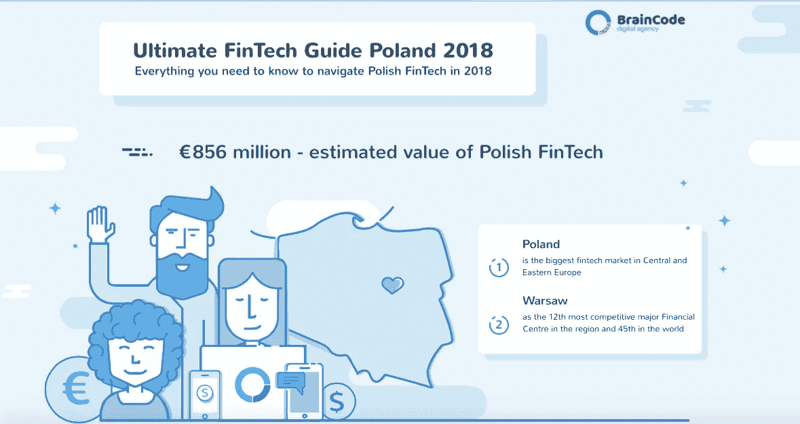

# 2018 年波兰金融科技终极指南。在当地生态系统中导航所需的一切

> 原文：<https://medium.datadriveninvestor.com/ultimate-guide-to-fintech-in-poland-2018-all-you-need-to-know-to-navigate-local-ecosystem-f3eff3682f0d?source=collection_archive---------1----------------------->

[**波兰是中东欧最大的 FinTech 市场**](https://www2.deloitte.com/content/dam/Deloitte/global/Documents/About-Deloitte/central-europe/ce-fintech-in-cee-region-2016.pdf) ，估值 8.56 亿€。 [**华沙，这个国家近 45%的创业公司所在地**](https://www.linkedin.com/pulse/whats-hot-poland/) 也是该地区的金融科技中心。全球金融中心指数(GFCI)将波兰首都列为中东欧第 12 大最具竞争力的金融中心，全球第 45 大最具竞争力的金融中心。

就在 5 年前，“金融科技”一词在波兰还不广为人知。尽管如此，当地金融机构是欧洲最具创新性的机构之一。从那以后就没变过。由 [**GE 全球创新晴雨表 2016**](https://www.ge.com/reports/innovation-barometer-2016/) 发布的“迎接创新革命”报告明确显示，83%的波兰公司对新技术高度感兴趣。2018 年的 [**版报告**](https://s3.amazonaws.com/dsg.files.app.content.prod/gereports/wp-content/uploads/2018/02/12141110/GE_Global_Innovation_Barometer_2018-Full_Report.pdf) 证明波兰的创新主要是由中小企业推动的。

银行是推动创新的企业的典范。他们不断投资于各个领域的改进和创新，如现代销售渠道(包括在线渠道)、远程客户服务技术、传统分支机构的数字化或新的支付方式。

因此，根据波兰银行协会的数据，大约有 1550 万波兰人每月至少使用一次网上银行服务。移动银行技术的使用也非常广泛。

就外包而言，波兰也是最具吸引力的市场之一。目前，有 **524 家外国公司拥有业务流程外包(BPO)** 、共享服务中心(SSC)和研发中心(R & D)，雇员超过 244，000 人(根据 [ABSL](http://absl.pl/publications/) 的数据)。波兰 BPO 行业的一个关键因素是全球金融机构的外包。

这就是为什么像瑞士瑞信银行、花旗和瑞士联合银行这样的公司把波兰作为他们所有外包和客户支持的家。据推测，英国退出欧盟不仅会增加波兰和中东欧地区这些“后台”的工作量，还会加快中台服务的搬迁。例如，全球主要银行之一 JP 摩根大通(JP Morgan Chase)计划在一个新扩建的中心运行其运营和风险管理流程，该中心将容纳 5000 名专业人员。

随着在英国经营任何规模企业的成本越来越高，越来越多的金融科技企业家将寻求在其他地方扩大业务规模。波兰正准备成为欧洲主要的金融科技中心，吸引外国企业家来这里经营业务。其中一位就是[**Rene Skaflestad**](https://www.linkedin.com/in/reneskaflestad/)[**挪威金融科技初创公司 Liber Finance Group 的 CEO，他选择华沙作为总部**](http://www.cushmanwakefield.pl/en-gb/news/2016/08/norwegian-company-libertech-opens-its-office-in-poland) 。

**身处波兰金融科技行业，这是一个激动人心的时刻。**

考虑到这一点，我们制作了《2018 波兰金融科技指南》,涵盖了波兰和中东欧地区的顶级企业、最具创新性的银行和扰乱金融科技生态系统的倡议。

*   完整指南[点击此处](https://braincode.xyz/blog/fintech-guide-poland/)
*   [下载信息图](http://www.paywithapost.de/pay?id=49cf3a58-8f1b-43d5-9e3c-1ff6611ccfc3)

[**BrainCode 是一家提供全栈 web 和移动服务+增长型营销的数字机构**](https://braincode.xyz/) **。**

