# UML 图:你需要知道什么？

> 原文：<https://medium.datadriveninvestor.com/uml-diagrams-what-you-need-to-know-d07d4101e7c4?source=collection_archive---------1----------------------->

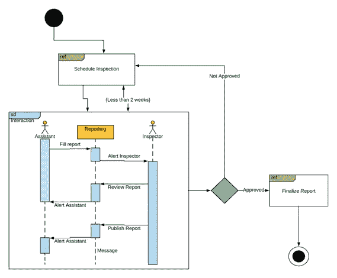

商业用户和那些想要识别系统的人现在可以理解软件开发的复杂世界。多亏了标准的可视化语言“UML”

图表总是吸引人，它是集思广益、制定计划和交流的有效方式。今天，来自几乎所有领域的大量研究人员聚集在一个统一的论坛上，这个论坛被称为“软件或商业模型的可视化插图”

 [## 创建折衷书架的程序员指南|数据驱动的投资者

### 每个开发者都应该有一个书架。他的内阁中可能的文本集合是无数的，但不是每一个集合…

www.datadriveninvestor.com](https://www.datadriveninvestor.com/2019/03/25/a-programmers-guide-to-creating-an-eclectic-bookshelf/) 

[统一建模语言](https://www.visual-paradigm.com/guide/uml-unified-modeling-language/what-is-uml/) (UML)图是这个统一论坛的一部分，用于指定错误和缺陷，可视化，构建和记录业务模型或软件系统的对象。

关于它有太多需要了解的；让我们更深入地探究 UML 图令人兴奋的领域。

# 什么是 UML？

> **UML 是一种通过图形符号来描绘软件程序或进行面向对象分析的方法。发明它是为了打造一种标准的、语义丰富的图形建模语言，用于复杂软件系统的设计、架构和执行。**

统一建模语言不是一种编程语言，但是有一些工具使用 UML 图来生成不同语言的代码。

今天，UML 被对象管理组织(OMG)接受为软件系统建模的标准语言。

它很像不同领域中使用的蓝图，代表了大型复杂系统建模中的最佳工程实践的集合。

# 什么是 UML 图？

> UML 图是用于交流、分析、检测和测试系统的复杂性、特征和其他方面的图形符号。

开发人员在编写应用程序之前或之后绘制 UML 图，以便更好地了解系统，并作为各种角色、活动和工作流的文档形式。

通过图表，可以揭示许多设计问题或缺陷，这有助于提高项目的整体质量。

# UML 图有哪些类型？

UML 图帮助开发人员和客户从不同的角度和不同的结构层次来看软件系统。UML 图有 14 种类型，分为两大类，每一类都有不同的用途。

行为 UML 图和结构 UML 图是包含所有其他类型的两个类别。

# 行为 UML 图

七种类型属于这一类别，描述如下:

**活动图**

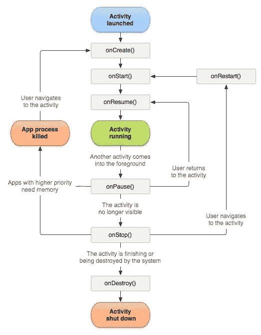

活动图通过形成从一个活动到另一个活动的控制流来显示系统的动态特性。这些图通常用于对业务流程、工作流和内部操作进行建模。此图集中于由内部处理驱动的流程。

**用例图**

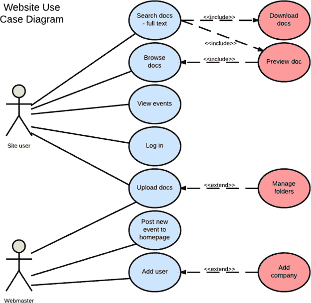

用例图是一组显示用户和系统之间交互的状态。它显示了用例与参与者之间的关系。

**序列图**

序列图用于说明参与交互的对象的时间顺序。该图由代表时间的垂直维度和代表不同对象的水平维度组成。

**状态图**

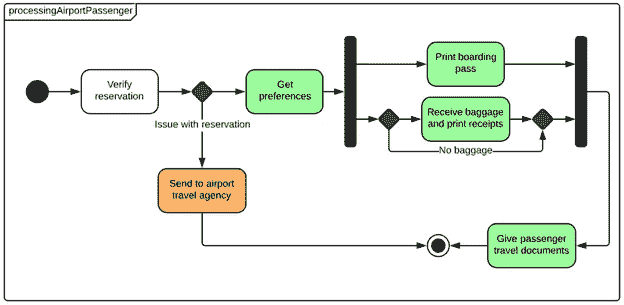

状态图显示了事件发生时交互对象可能经历的状态。每个布局都用于了解对象在整个系统中的行为。

**通信图**

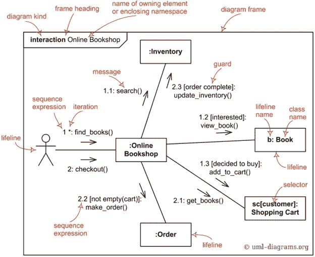

通信 UML 图也称为协作图，因为它们关注对象之间交换的消息。这些图可以用与序列图相同的方式来绘制，但是唯一的区别是通信图中的对象用关联连接来显示。

**交互概述图**

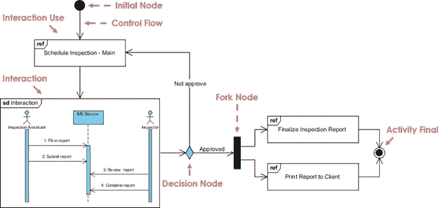

交互概览图用于表示系统的动态行为。它很像由不同的交互图组成的活动图，也被称为专门化的活动图。您可以在活动图中使用大多数注释，并添加交互、时间约束、持续时间等元素。

**时序图**

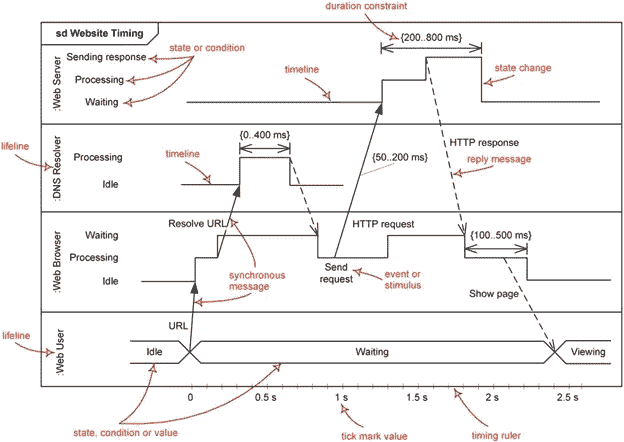

时序图 UML 用来概括以时间为中心的对象之间的联系。这些图表代表了角色和对象如何沿着线性时间轴进行操作。生命线、状态时间线、持续时间约束、时间约束和破坏事件是时序 UML 图的主要组成部分。

# **结构化 UML 图**

**类图**

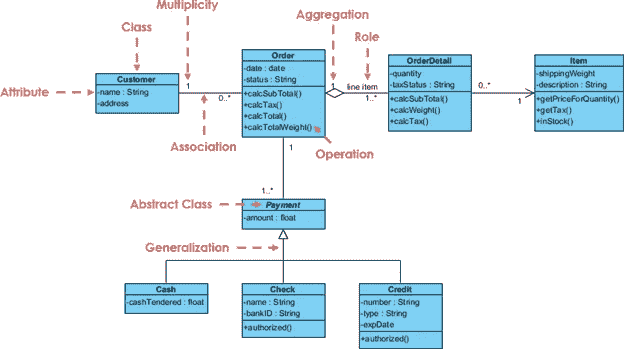

类图模型用于说明不同类型的对象及其关系，如使用设计元素(如包、类和目标)的继承、关联和包容。

**对象图**

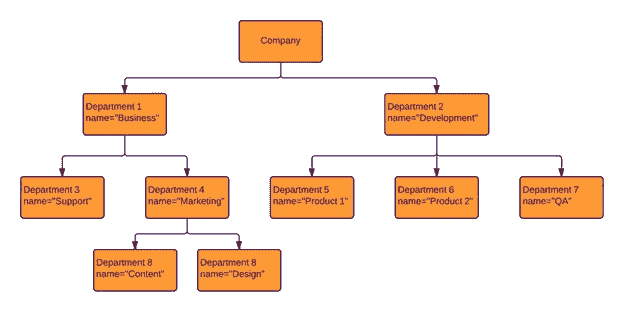

对象 UML 图更多地关注与计算机科学相关的概念。在软件开发中，对象被认为是抽象类的实例，而类是抽象数据类型。这些图帮助软件开发人员检查他们创建的基本几何结构(类图)是否在实现上显示了可行的结构。一些开发人员将 UML 对象图作为准确性检查的第二阶段。

**部件图**

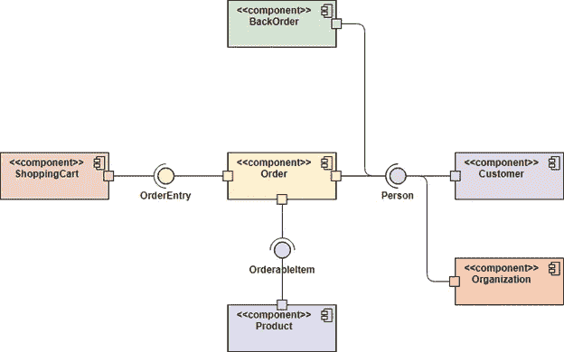

组件图显示了代码本身的高级打包结构。这些图用于说明组件之间的依赖关系，包括二进制代码组件、源代码组件和可执行组件。

**复合结构图**

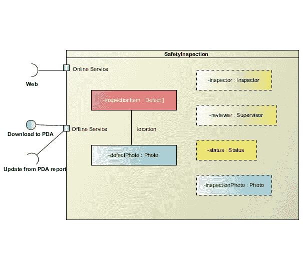

这些图仅仅代表了几个类组件和类的内部结构之间的关系。由于功能有限，复合结构 UML 图并不常用。

**部署图**

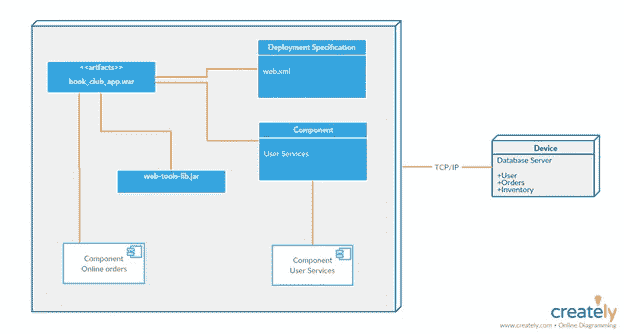

部署 UML 图对运行时处理元素的配置、软件组件、流程和基于它们的对象进行建模。这些图表显示了系统中软件和硬件之间的物理关系。

**包装图**

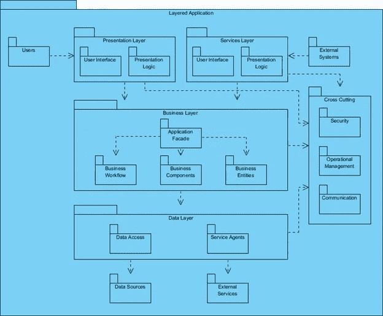

这些图通常是类图的子集，但是有时开发人员将它们作为一种独立的技术来使用。包 UML 图将系统的元素集合到相关的组中，以减少集合之间的依赖性。

**剖面图**

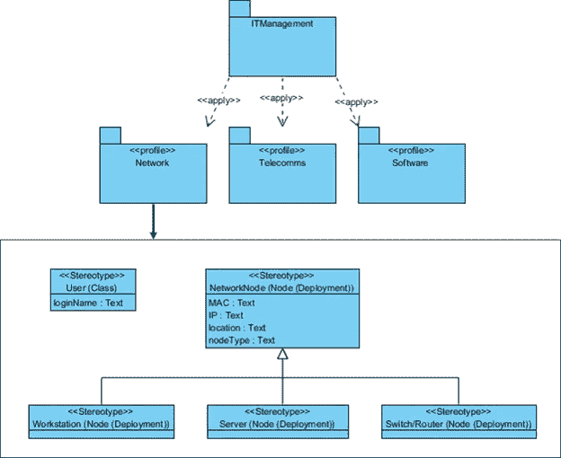

轮廓图通常不被认为是 UML 图，因为它不是一个典型的图。它更像是一种可扩展性机制，而不是一个图表。这就像一门语言，如果你说英语，你可以创建新的句子，同样，如果你谈论概要图，你可以为 UML 图创建新的语义和属性。

# **现实世界中的 UML 图表制作**

每个人都在问 UML 图的实际应用，这些图在专业环境中何时何地使用。如果你也是和我有同样想法的人之一，那么这里是你问题的答案。这些是 UML 图的[现实应用](https://www.uml-diagrams.org/index-examples.html)。

网络购物

自动售票机

银行自动取款机

医院管理

医学中的数字成像和通信

Java 技术

Andriod 的应用程序开发

使用 SafeNet Sentinal HASP 安全解决方案的软件许可和保护

# **最后一句话**

UML 图本身是一个广泛的主题；关于他们有很多东西要学。我刚刚分享了一个简短的概要，给你关于 UML 图的主要想法。这些图现在正在商业世界中创建一个基准，在未来的几年中，我们将很快看到 UML 图更有前途的应用。