# 机器学习预测中的不确定性

> 原文：<https://medium.datadriveninvestor.com/uncertainty-in-machine-learning-predictions-fead32abf717?source=collection_archive---------0----------------------->

[](http://www.track.datadriveninvestor.com/1B9E)

## 如何使用我们不完全信任的数据


[https://www.pexels.com](https://www.pexels.com)

由于大多数算法的统计性质，机器学习存在固有的不确定性。这种不确定性的来源之一是不正确的标签，要么是由于数据错误，要么是甚至对人来说也难以确定正确标签的情况。例如，在回归类型的问题中，我们可以将预测建模为:

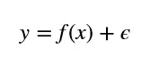

在这里 *ϵ* ϵ是目标中固有的不确定性。假设它遵循正态分布，我们可以将一种情况对似然函数的贡献写为:

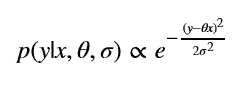

这里，为了简单起见，我们假设线性回归

似然函数是这些值的乘积，似然函数的负对数给出了成本函数:

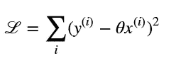

奇怪的是，不确定性信息已经从成本函数中消失了。这对于最大后验方法来说是很常见的。为了使用数据估计不确定性的程度，我们必须使用更强大的方法，如[贝叶斯线性回归](https://en.wikipedia.org/wiki/Bayesian_linear_regression)。

假设不确定性 *σ* σ对于所有情况都是相同的。如果不是呢？标记数据集的人可以表明他对给定的例子不确定。例如，在给定的评级下，给定债券的收益率异常低，交易量异常高，或者其他一些让贴标签者怀疑有错误的情况。对于计算机视觉问题，在一个给定的 mnist 例子中，可能有人很难区分 1 和 7。

一种非常常见的方法是删除这些记录。但是如果我们想使用这些信息，只是不要太相信它。

在线性回归模型的情况下，我们可以通过增加 *σ* 来表示增加的不确定性。为了方便起见，我们将指数乘以精度 *τ* :

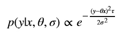

τ为 1 表示信任的正常水平，而τ的较低值将表示不确定性增加。为了证明这一点，让我们绘制两条曲线。

```
%matplotlib inline
import numpy as np
import matplotlib.pyplot as pltdef linreg_likelihood(x, y, theta, sigma, tau):
    return np.exp(-(y-theta*x)**2 * tau/2/sigma**2)/np.sqrt(2*np.pi*sigma**2/tau)fig, ax = plt.subplots(1, 1)
y = np.linspace(1, 10, 100)
ax.plot(y, linreg_likelihood(5,y,1,0.5,1), 'r-', lw=1, alpha=1, label='Reg. Uncertainty')
ax.plot(y, linreg_likelihood(5,y,1,0.5,0.3), 'b-', lw=1, alpha=1, label='High Uncertainty')
plt.legend();
```


我们看到，不确定性较高的示例导致了更广泛的分布，因为我们不确定目标值。如果我们将其反馈给成本函数，我们将得到一个修正的成本函数:

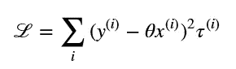

这里τ(i)是第 I 个例子的相对精度。现实中，大部分会是 1，但是对于数据集中的一些可疑的例子，标注器可以降低τ(i)。

拥有不寻常的损失函数应该不成问题，因为像 TensorFlow 这样的框架提供了梯度的自动计算。

# 二元分类的不确定性

对于二进制分类问题，我们必须使用伯努利分布而不是正态分布。

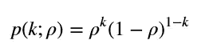

其中ρ是分布的参数，k∈0，1

因为分布只有一个参数，所以没有办法在不改变均值的情况下改变方差。也没有明显的方法通过增加方差来表示不确定性。

相反，我们将推导出基于贝叶斯概率概念的方程。在我们的例子中，k 是观察到的结果，而真正的目标值 t 可能不同于 k。我们可以用另一个伯努利分布来形式化它:

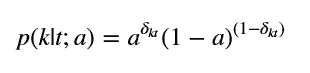

这里δ是克罗内克符号，a∈[0.5，1]是不确定度。如果 a=1，我们绝对肯定这个标号。a=0.5 的情况也是一个极端的情况，当我们说我们根本不信任这个标签。

给定ρ和 a，观察值的概率为:

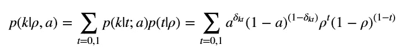

这里我们使用贝叶斯规则，并通过未知的真实标签值进行边缘化。

经过相对简单的计算，我们推导出修正的伯努利分布公式:

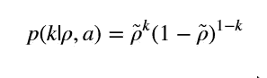

在哪里

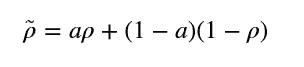

例如，在二元逻辑回归问题中，您可以用 sigmoid 函数代替ρ:

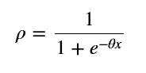

并遵循梯度下降法的常规程序。成本函数如下:

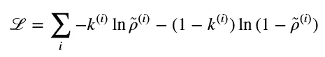

这就是通常的交叉熵，除了ρ~是基于不确定性修正的

# 多类分类中的不确定性

将二元分类推广到多类分类情况真的很容易。我们必须使用[分类分布](https://en.wikipedia.org/wiki/Categorical_distribution)来代替伯努利分布

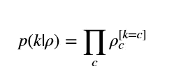

在这种情况下，对于不确定类别的每个观察值，我们可以定义值 ac，它是该示例属于类别 c 的概率。然后，如果 k = t，则条件概率 p(k|t)为 at，否则为(1*at*)(1at)。通过 t 边缘化，我们得到更新的值ρ~:

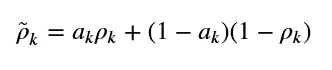

这种情况下，ρ应使用 softmax 函数而非逻辑函数建模。

这方面的一个例子可以是 mnist 数据集，在给定的情况下，数字看起来像 1 或 7。在这种情况下，将 a1 和 a7 设置为 1/2，将 a 的其余部分设置为零。在这种情况下，当预测到 1 或 7 时，您的成本函数不会扣分，但当其他数字预测错误时，您的成本函数会扣分。

# 结论

这一切意味着，如果你怀疑一些数据，你不必放弃它们，而是估计不确定性的程度，并将其包括在你的算法中。的确，您最终会有一个自定义的成本函数，但这可以通过使用 TensorFlow 这样的自动计算梯度的框架来轻松解决。

您也可以使用这种方法来处理异常值。我们都知道它们会对回归和分类结果产生相当大的影响。相反，如果您认为可能存在数据错误，可以给它们分配较低的权重。

所有代码都在[我的 github 库](https://github.com/mlarionov/machine_learning_POC/blob/master/uncertainty/Target_Uncertainty.ipynb)中。