# 预测变量的不确定性

> 原文：<https://medium.datadriveninvestor.com/uncertainty-in-the-predictor-variables-7ecb779f854c?source=collection_archive---------11----------------------->

[](http://www.track.datadriveninvestor.com/1B9E)

## 使用我们不完全信任的预测变量


[https://www.pexels.com](https://www.pexels.com)

在[上一篇文章](https://medium.com/datadriveninvestor/uncertainty-in-machine-learning-predictions-fead32abf717)中，我们讨论了如何根据标记数据的人来处理目标值不准确的情况。通常不考虑它，但在许多情况下，我们可以将案例保留在数据集中，但调整成本函数，使该案例对结果的影响程度低于可信案例。

在本文中，我们考虑预测变量的值不可信的情况，与上一篇文章中的目标变量的值相反。

为简单起见，我们考虑一个简单的线性回归问题与一个数字预测。我们将使用正态分布对预测值的不确定性进行建模。这种依赖关系的信念网络如下所示:

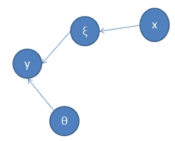

这里 y 是观测目标，x 是观测值(但不可信的预测值)， *ξ* 是真值，但预测变量的一个未观测值， *θ* 是线性回归模型的参数。既然 *ξ* 未被观测到，我们应该将其边缘化。

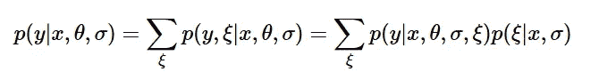

这里我们使用了关于联合概率的贝叶斯规则。概率值如下:

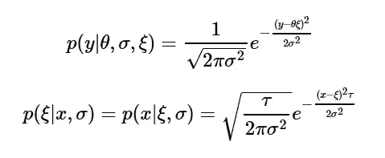

这里，我们再次使用贝叶斯规则，并假设ξ上的平坦先验。我们引入了确定性τ的度量。当它是无穷大时，我们确定预测值，当它很小时，不确定性很大，变量不可信。该值可在数据标注期间设置。

当我们通过在 *ξ* 的整个范围内对联合概率进行积分来忽略未观察到的变量ξ时，我们将得到以下概率分布(我将省略积分的细节):

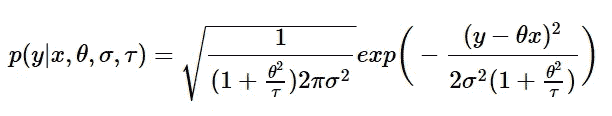

损失函数(针对单一情况)是该概率的负对数，为简单起见，乘以σ2:

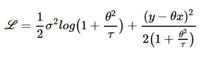

第一项作为正则项。事实上，对于非常高的τ，它可以近似为:

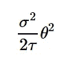

这是 L2 正则项。有趣的是，我们如何基于预测器的不确定性导出 L2 正则化。我们看到，不确定性越高，我们需要应用于模型的正则化程度就越高。

第二项是线性回归的修正损失函数。分母中的附加因子使其成为θ的非二次函数。我们将绘制不同σ和τ值的损失函数

```
import numpy as np
import matplotlib.pyplot as plt
%matplotlib inlinex = 1
y = 5def loss_function(theta, sigma, tau):
    reg_dem = 1 + theta**2/tau
    return 1/2*sigma**2 * np.log(reg_dem) + (y-theta*x)**2/2/reg_demplt.rcParams["figure.figsize"] = (15,10)
fig, ax = plt.subplots(1, 1)
theta = np.linspace(-5, 10, 200)
ax.plot(theta, loss_function(theta, 1,1000), 'r-', lw=1, alpha=1, label='s=1,t=1000')
ax.plot(theta, loss_function(theta, 1,100), 'y-', lw=1, alpha=1, label='s=1,t=100')
ax.plot(theta, loss_function(theta, 1,10), 'g-', lw=1, alpha=1, label='s=1,t=10')
ax.plot(theta, loss_function(theta, 1,5), 'c-', lw=1, alpha=1, label='s=1,t=10')
ax.plot(theta, loss_function(theta, 1,1), 'b-', lw=1, alpha=1, label='s=1,t=1')
ax.plot(theta, loss_function(theta, 1,0.1), 'm-', lw=1, alpha=1, label='s=1,t=0.1')
plt.legend();
```

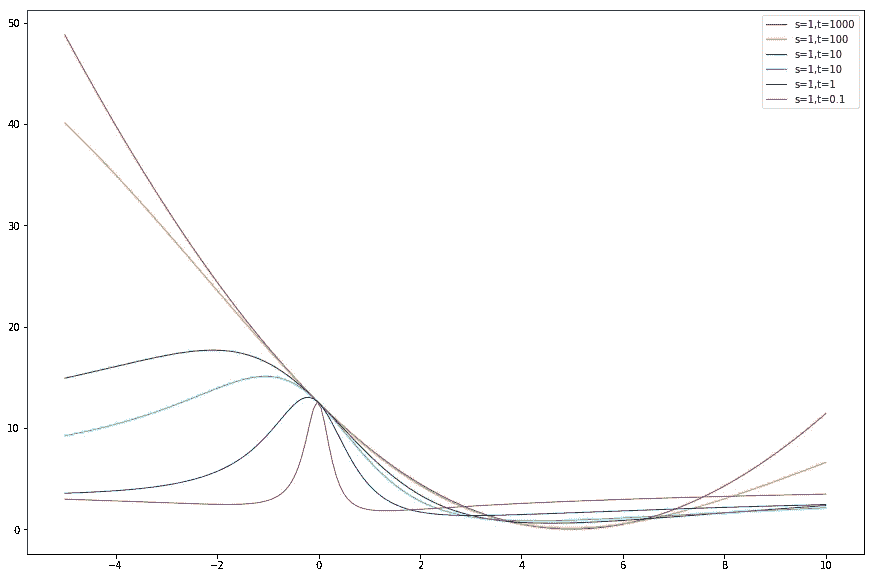

我们首先看到的是损失函数是非凸的，可能有两个局部极小值。如果我们使用梯度下降来学习最可能的参数，这可能是一个问题。

我们还看到，对于高信任因子τ，损失函数几乎是二次的，最小值在期望值 5 处。但是随着不确定性的增加，最小值向θ的较低值移动，并且曲线不再类似抛物线。

# 处理分类特征

如果您有带有不确定值的分类特征，这些特征也可以用于模型中，必须对模型进行调整以处理不确定性。如果我们使用分类特征的一键编码，则似然函数(1)必须重写为:

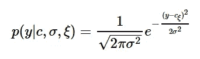

这里我们引入了参数 c，而不是θ，一个参数代表一个类别的值。那么 cξ是类别值ξ的分类参数的值

为了模拟预测值中的不确定性，我们必须引入不确定性矩阵 U，其元素是条件概率:

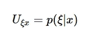

然后，排除ξ，我们可以得到后验概率:

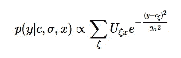

矩阵 U 的值在标记期间设置。然而，对于具有太多值的类别，很难正确估计 U 的所有值，因为它们实在太多了！通常有必要使用近似值。这种近似的一个例子可以是对称近似:

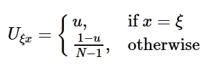

这里 N 是类别的数量。那么概率分布可以简化为:

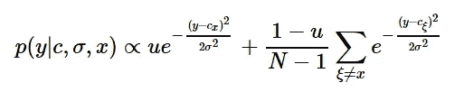

# 结论

存在目标值可信，但一个或多个预测值不确定的情况。这些情况可以在数据标注期间被识别，并且不确定性的程度应该被用在模型中以校正预测。为此，我们使用了一种简单的贝叶斯技术。我们证明，小程度的不确定性导致 L2 正则项。对于分类特征，使用了类似的技术。我们只考虑了回归问题。对于分类问题，我们也可以使用类似的技术，但是数学结果可能会不同。