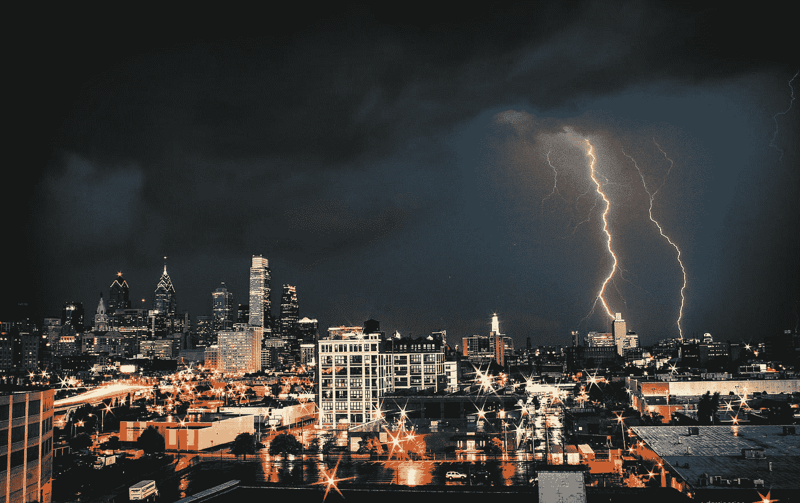

# 你需要明白一件事

> 原文：<https://medium.datadriveninvestor.com/uncertainty-now-you-can-handle-it-2e80cefe7e18?source=collection_archive---------11----------------------->

# 让我解释一下…

> “世界上没有什么比不确定性带来的痛苦更大”——马丁·路德

似乎这个世界从未像今天这样不确定。

生活的每个领域都受到影响。

> 从不知道自己的股票明天是否会暴跌的投资者，不确定是应该买更多还是继续持有的加密迷，到遇到正在快速取代他的人工智能卡车的卡车司机。

所有这些领域都是紧密相连的——理应如此。

被困住的感觉可能是压倒性的。如果你投资了 S&P，买入了以太坊，或者刚刚在运输公司签了一份短期合同，你会怎么做？

问题是，我们大多数人都陷入了犹豫不决之中——而这种不确定性和犹豫不决会影响到其他情况。

它会深深地影响我们的家庭和我们与他们的关系。

愤怒和沮丧会爆发，如果不知道为什么愤怒会变得势不可挡。

“person holding white printer paper” by [Sydney Sims](https://unsplash.com/@fairytailphotography?utm_source=medium&utm_medium=referral) on [Unsplash](https://unsplash.com?utm_source=medium&utm_medium=referral)

# 拖着脚走

我们都在一定程度上认识到不确定性的外在迹象。

> 被咬过的指甲，皱眉，不断重复地问问题以寻求安慰，用笔敲桌子，把头从一边倾斜到另一边——权衡选择——然后是长长的叹息，不耐烦的愤怒，或者吞咽。

有了不确定性，大脑就会在无尽的可能性中奔跑——一个场景接一个场景地“翻转”——让你感到慌张，并对自己的决定产生怀疑。

世界上所有的心理学和鼓舞士气的话都不能带走…

…那种挥之不去的怀疑感。

如果是你一个人做决定，尤其如此。不知何故，如果结果是共享的，压力就解除了。

> 那么，你如何解决这个问题并回到正轨呢？

“person holding bulb” by [Raul Varzar](https://unsplash.com/@calypso999?utm_source=medium&utm_medium=referral) on [Unsplash](https://unsplash.com?utm_source=medium&utm_medium=referral)

# 信息是关键…

任何不确定情况下的主要因素之一是不了解事实。

意识不到你正在大脑中构建的拼图的某个关键部分，可能意味着听天由命的绝望感和坚定地改变方向之间的区别。

不管怎样，知识是这里的关键。

历史上充满了知识直接导致成功的例子。

> 从[、孙子](https://www.goodreads.com/book/show/10534.The_Art_of_War)的《孙子兵法》——到[、蔡斯·休斯](https://www.goodreads.com/book/show/34323601-the-ellipsis-manual?ac=1&from_search=true)的《省略号手册》——先进的知识、策略和前瞻性规划总是会带来积极的结果。

有趣的是，在《孙子兵法》的第一章中，孙子描述了欺骗的影响。他说它是不可见的——这种不可见性使它既强大又危险。

将托词和诡计带入现代也恰好是“假新闻”的现代现象。

近年来，随着外国政府利用社交媒体和互联网传播宣传和谎言，在各种各样的问题上影响选举结果和公众舆论的丑闻曝光，这种做法受到了关注。

如今假新闻无处不在，根据定义，它是基于欺骗。

它对近期一些最具灾难性的决定负有责任——它是一个被世界各地的政治家扔来扔去的政治足球——并被用作好的和坏的决定的借口。

“aerial view photography of helicopter cockpit and cityscape by water” by [Austin Neill](https://unsplash.com/@arstyy?utm_source=medium&utm_medium=referral) on [Unsplash](https://unsplash.com?utm_source=medium&utm_medium=referral)

# 及时，消息灵通，准确。

> 知道你的信息来源是真实可靠的，对于克服不确定性是至关重要的。

朱利叶斯·张敬利、拿破仑·波拿巴和艾森豪威尔将军都知道上述的重要性。

他们到处都有间谍，向他们的指挥所传递敌军位置、人数和其他背景信息。这样，他们知道他们采取的任何行动在任何给定的情况或环境下都最有可能获得有利的结果。

换句话说，他们消除了不确定性…

他们不去猜测或收集二手情报，而是确切地知道当地正在发生什么。

他们的现代对等物使用无人机监视系统和卫星图像——但目的仍然是一样的——消除疑虑。

那么你如何控制呢？

# 成为数据驱动的投资者

**如果你想在一个不确定的世界中有效地导航，数据、情报、知识、事实、观点——随你怎么称呼——都是至关重要的。**

投资者——无论你是把钱投入市场，还是把时间和生命投入学习和思考，你都是在把有限的资源转化为对未来的潜在投资。

这也是为什么 DDI 比我们想象的要多得多。

如果您参与了:

*   **人工智能和机器学习**
*   **编码和软件开发**
*   **区块链、加密货币和智能合约**
*   **经济、金融和市场**
*   **企业家精神和个人成长**

你需要了解你所在行业的最新发展新闻、行业趋势、棘手问题、顶级培训和事件。

你需要和合适的人在一起——专家、志趣相投的人、好奇的人和勇敢的人。

DDI 已经在[我们独特的行动计划](http://www.datadriveninvestor.com/ddi-intelligence/)中为您规划好了一切——这是一个全球技术社区，致力于缩短发现洞察力的路径，从它发生的地方(即隐藏的价值)到最终的价格。这个世界，有着一层又一层不需要的实体、人和代理问题，

*   使得普通人很难知道什么是重要的；
*   使得聪明和好奇的头脑在本质上的合作变得不公平；
*   制造了阻碍文明真正进步的问题。

我们将为投资者(即金融投资者、学习者和实干家)消除所有障碍。

DDI——一个可靠、值得信赖和诚实的来源，你需要它来确保你对 WTF 有一个客观和准确的评估。

数据驱动投资者——或**DDI**——正是这种来源。

你还记得你的第一部智能手机吗？你还记得发现它有手电筒吗——还想知道为什么手机需要手电筒吗？

无数的创新也是如此，你甚至希望提前几个月就知道它们的社会和行为含义。

# 拒绝迷茫？

有了**数据驱动的投资者**，你会发现技术是怎样的，为什么会发生。我们将它与常识性的经济学和市场知识相结合，帮助您做出最清醒和最好的行动。

不仅如此。**成为第一个**了解并参与我们即将在全球主要城市开展的社区项目和活动的人。拥有 2000 多名专业撰稿人和全球编辑团队，您将把自己放在最先发生变化的正确位置，与正确的人在一起。