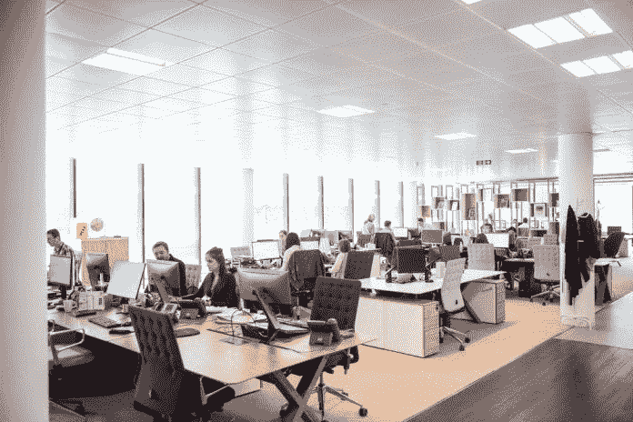
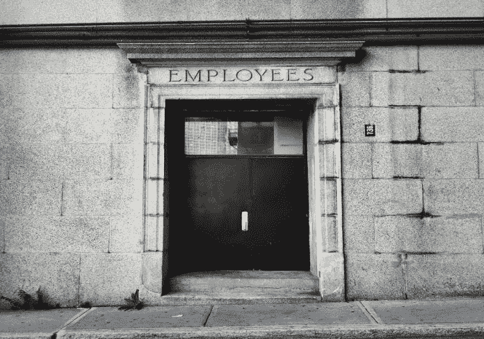

# 不管反对者告诉你什么，无条件的基本收入都是好的

> 原文：<https://medium.datadriveninvestor.com/unconditional-basic-income-is-all-good-despite-what-the-nay-sayers-tell-you-data-driven-investor-6653babcdc81?source=collection_archive---------6----------------------->

我有点恼火。我在社交媒体上看了很多评论，发表了很多关于普遍基本收入的文章。它有很多让人喜欢的地方。我关注这些信息是因为，作为一名未来学家和工程师，我试图找到解决方案，帮助我们度过第四次印度革命的混乱，并成为赢家。像任何其他过去的革命一样，我们需要重新设计许多核心遗产，并使它们适应新的技术和思维方式。随着工业革命，最需要改变的是经济。

我[最近写了一篇文章](https://www.datadriveninvestor.com/2019/05/20/the-employment-based-economy-will-soon-fail-what-can-we-do-to-avoid-disaster/)，描述了我们以员工为基础的企业将如何在未来 10-20 年内失败和崩溃。为了生存，我们需要钱来买东西。尽管我们所有的技术进步，[超过 12%的美国人仍然生活在贫困线以下。他们中的大多数需要某种形式的社会服务来获得食物和住所。被誉为世界上最大的经济体却找不到一种方法让他们自己的公民摆脱贫困！这是一个糟糕的笑话，尽管我们拥有所有的知识、基础设施和资源，但我们无法就如何照顾需要帮助的兄弟姐妹达成一致。今天，我们有办法和技术让每个人都有饭吃，有房住。资源是存在的，但我们通过参与商品的生产或管理，在稀缺和价值原则的基础上建立了我们的经济。不适用于 21 世纪现实的 20 世纪概念。](https://www.statista.com/statistics/200463/us-poverty-rate-since-1990/)

如果我告诉你人类的工作将很快成为生产力的阻碍，你不会感到震惊。我们可以严格地作为消费者参与经济活动。我们工作的原因是为了生产我们想要消费的商品。就是这样。因此，我们去工作和贸易，这样每个人都可以消费我们需要的东西。把工作作为生活的理由是一种幻觉，一种谬论，我们告诉自己去证明一周又一周地从事一份超过 70%的我们不喜欢的工作是合理的。我们创造了货币来公平分配生产出来的商品。如果我们对经济贡献越多，我们得到的钱就越多，这就允许你消费更多的集体生产的商品。

既然我们在商品生产过剩方面没有问题，而且我们已经很好地管理了自动化供应链，为什么我们仍然抱着稀缺的心态？习惯和恐惧。

让我们想象 20 年后。所有付费任务的 90%，因此，所有感知价值的任务、自动化系统和人工智能将为我们完成所有工作。根据麦肯锡研究所(McKinsey Institute)的数据，2017 年这个数字[是 50%，并且每年增加几个百分点。当务之急是要明白，人工智能可以越来越经常地完成技术创造的新任务。当 2040 年到来时，人类水平的机器智能将在没有人类指导的情况下处理几乎任何由技术颠覆创造的新工作。智能系统的本质就是建立在彼此之上。](https://www.mckinsey.com/featured-insights/future-of-work/jobs-lost-jobs-gained-what-the-future-of-work-will-mean-for-jobs-skills-and-wages)

我们正逐渐让人类失业。就像水中的青蛙慢慢变热直到沸腾一样，变化是如此的缓慢，以至于我们注意不到。不幸的是，如果我们不在沸腾之前为自己建立一个社会降落伞，我们将遭受许多痛苦和灾难，我们的社会将不得不在失败的边缘经历一次创伤性的彻底的制度变革。这对我们的社会和家庭也是有害的。

我们现在可以做一些事情来弥合我们目前对技术转移的担忧和人类黄金时代之间的差距。一个容易实现的目标是普遍基本收入(或无条件基本收入，我喜欢这个术语，但我在这里将使用更常见的术语)。

不幸的是，互联网上有许多团体在反对一件伟大的事情，因此，我写信来驳斥我读到的反对的主要论点。

**全民基本收入(UBI)是一个社会主义项目**

第一，UBI 是社会项目，不是社会主义项目。反对者使用社会主义者这个词，因为它会引起人们的恐惧情绪，尤其是美国资本家。不要困在词汇里。社会主义者这个词描述了

UBI 是一个社会项目，就像今天大多数美国人崇拜和使用的许多项目一样。这里有一份美国所有社会项目的清单供参考。我估计大约 98%的美国人至少使用这些程序中的一个，并且他们喜欢它。[当政府控制经济时，那就是社会主义。当私人实体控制经济时，这就是资本主义。我们认为俄罗斯是一个社会主义国家。见鬼，这是在它的名字苏联(苏维埃社会主义共和国联盟)。但是今天的俄罗斯并不是 100%的社会主义。中国也不是。尽管这两个国家的政府控制着人们生活的许多方面，但私营企业蓬勃发展，并在国际上与企业竞争。他们也在光谱上。美国基本上仍然是资本主义，但多年来，已经采取了社会计划，以帮助他们的公民谁最需要它，并给予福利或救济一般人口，平衡不平等等。这个国家的社会项目让美国的私营经济从更健康、更幸福的人口中受益匪浅，这些人比以往任何时候都更长寿、更积极地参与经济。美国是一个资本主义国家，其经济中嵌入了一些社会主义项目，为其人民带来了巨大的利益。大多数经合组织国家介于 100%社会主义和 100%资本主义之间。既非善也非恶。](https://medium.com/datadriveninvestor/the-united-states-the-socialist-boogeyman-and-a-solution-walk-into-a-bar-ca0f1a5c9a8a)

增加另一个伟大的项目，确保收入水平最低的人有吃有住是不好的，因为这是一个社会项目？饶了我吧！UBI 至多是每个人都喜爱和使用的现有社交项目的升级和扩展。

**太贵了**

成本至少是一个明智的考虑。在美国，一个公平的全民基本收入每年可能要花费 3 万亿美元以上。那太多了。美国国内生产总值(GDP)超过 19 万亿美元，所以至少美国生产的足够支付它。就在吧台下面，所以价格实惠。美国人是否想把 3 万亿美元花在 UBI 上，而不是其他地方，这才是真正的问题。都是预算的问题。把它想象成从一个我们可能不再需要的桶里取东西，比如有条件的社会项目(SSI，福利等等。)来支付一个无条件的程序。我们通过从那些有大量闲钱的实体和个人那里转移资金来支付所需的余额。像富人和大公司一样。税法的改变有助于平衡收入平等，并为覆盖每个人基本需求的无条件收入一揽子计划买单。

然而，我们必须思考我们如何组织所有收入水平的 UBI，以便为了共同利益公平分配财富。我们这些有适当收入水平的人不需要额外的月收入，因为我们有保险。然而，如果我们在全民基本收入计划下每月多挣 1000 美元，那么政府可以在所得税中收回这笔钱。即使我收到了基本收入，我也不会因此在年底变得更富或更穷。然而，对于穷人来说，这 1000 美元意义重大。因为他们的收入太低，这 1000 美元是额外的开支，当税务人员要求在年底到期时，他们不必归还任何款项。对于那些手头有多余美元、有大量机会进行再投资并让钱为自己服务的富人来说，他们可以支付比额外的 1000 美元多得多的钱，这些钱也是他们为几个比他们更需要 UBI 的穷人支付的。

因此，我们需要额外支出的不是 3 万亿美元。我们可以组织起来，将财富从富人手中重新分配给穷人，确保每个人都有足够的食物和住所。

使它成为无条件的降低了管理这样一个项目的成本，并且它通过税收代码的数量来平衡他们自己。如果有一年，我在财务上做得很好，我就有保障了。如果下一年，我的日子不好过；我有基本医疗保险来满足我的基本需求。无需申请，无条件，无到期。它总是在我需要的时候抓住我。

底线，它可以从计划和适当的预算中制定出来。斯科特·桑坦斯(Scott Santens)无疑是美国最著名的全民基本收入专家，他在本文和其他文章中写了如何支付自己的费用[。](https://medium.com/economicsecproj/how-to-reform-welfare-and-taxes-to-provide-every-american-citizen-with-a-basic-income-bc67d3f4c2b8)

**免费的钱让工作失去动力**

甚至认为接受免费资金会导致大量工人短缺都是愚蠢的。这是一个基于对一些有条件的社会项目如福利或就业保险的普遍观察的论点。我们都知道有些人靠这些项目生存，却根本不想工作。他们很乐意靠这些项目勉强维持生计，尽管许多人如果想的话也能找到工作。参加这些项目的大多数人是因为生病、残疾或真正的原因而无法工作。但是总有滥用者认为:“如果我根本不工作就能得到钱，而当我工作的时候，这些免费的钱就没了，我宁愿呆在家里，拿着这些免费的钱不工作。”。是的，我们在生活中都会遇到这样的人。这些人说的话是有道理的。想想吧。如果你得到了免费的钱，而工作会把它从你身上拿走，那就是对工作的抑制。问题是应用于这些程序的条件。它们是重返工作岗位计划，而不是社会支持计划。

如果当一个人对经济做出贡献时，我们不取消福利支票，那么许多人会工作，因为**工作会给他们额外的钱花。在那种条件下工作有明显的优势。至少自 20 世纪 70 年代以来，工作激励的概念已经在世界各地的基本收入试点中反复得到检验。最新数据是在去年芬兰基本收入试点项目接近尾声时公布的。试点的结果很明显:无条件地接受金钱并没有减少接受者的工作量。从好的方面来看，[研究](https://www.newscientist.com/article/2193136-universal-income-study-finds-money-for-nothing-wont-make-us-work-less/)发现它也增加了接受者的幸福感。这并不奇怪，因为世界上实施的所有稳定基本收入试点都是这么说的，尽管大多数试点都有条件因素。好的全民基本收入试点给出扎实的数据一定不能有钱可以拿走的成分，否则就是福利支票而已。我们知道这是怎么回事。**

自 20 世纪 70 年代以来，基本收入试点对接受它的社区产生了惊人的影响。这里有一个简短的清单，摘自[明科姆实验](https://mdl.library.utoronto.ca/collections/numeric-data/microdata/manitoba-basic-annual-income-experiment-mincome-1974-1979)、[美国 GAI 实验](https://www.utpjournals.press/doi/full/10.3138/cpp.37.3.283)、[芬兰基本收入试点](https://www.weforum.org/agenda/2019/02/the-results-finlands-universal-basic-income-experiment-are-in-is-it-working/)和[纳米比亚基本收入实验](https://www.centreforpublicimpact.org/case-study/basic-income-grant-big-namibia/):

*   犯罪率下降了 40%
*   住院率降低了 10%
*   学校毕业率/入学率增加
*   创新和创业增长高达 300%
*   家庭工作努力减少了 13%(主要、次要和主要收入者的总和)
*   总体福利增加，压力水平下降
*   家庭重组率激增(结婚、离婚、家庭变动等)。)

这些数据在所有尝试某种形式的基本收入的国家重复出现。这一论点中突出的显著结果是工作努力的明确减少(对家庭来说高达 13%)。这个数据来自美国 70 年代的 GAI(保证年收入)实验。这听起来像是对工作的抑制，但多伦多大学的研究人员研究了数据，通过主要家庭收入者工作稍少(1%-3%)，收入减少来自次要收入者(妻子兼职工作……这是 70 年代)和第三收入者(大学年龄的年轻男女)。中等收入者花更多的时间照顾孩子和家务，而高等收入者花更多的时间在学校。我们认为这些活动有助于建设经济能力和一个更好、更健康的社区。

如果我们看看最近的、持续时间更短的芬兰实验的结果，项目组和普通人群的就业率或工作时间没有区别。并非所有的实验都是一样的，自 20 世纪 70 年代以来，时代已经发生了变化…

因为，我们将在 2019 年实现普遍基本收入的原因是因为自动化系统可以比我们更好地完成人类任务，也许更少的工作并不是一件坏事。父母用额外的钱下班来照顾他们的孩子或大学生，花额外的自由在学校花更多的时间，对我们的社会和经济来说也是一个很好的权衡。

所以，结果是肯定的。

我们为什么不现在就做呢？

我们可以对它进行预算，它所带来的一切都有积极的影响，这只是另一个社会项目，它不会降低工作的积极性。我们知道，为了保持生产率的增长，大多数工作将会自动化，如果工人得不到工资和纳税，我们的经济将会崩溃。是什么阻止了我们实现稳固的全民基本收入？

恐惧。

公众害怕未知。我们以前从来没有一个全民福利计划给有能力的成年人免费的钱。我们一直认为每个人都需要工作才能生存。我们甚至会问对方“你是做什么工作的？”并称之为正常。这篇文章有望减轻一些恐惧。

另一个更难克服的障碍是，许多有权势的人不希望基本收入发挥作用。这样做会给经济注入更多资金，这对富人来说是好事，但公民会有更多的选择自由。选择的自由剥夺了那些控制我们日常生活系统的人的权力。

对于普通人来说，没有基本收入补充的自动化将使许多人很难购买商品，这就是这些富人变得富有的原因。一个没有购买力的人口的经济体对任何人都没有好处，尤其是对富人和权贵。对他们来说，这是一个难题。更广泛的消费者分布将购买更多的基本商品。另一方面，他们失去了对穷人的权力。因此，他们的抵制和一些来自某些新闻来源和富裕的反对者的虚假信息。

在 20 年内，我们绝对必须改变我们在经济中的地位，从生产者、管理者和消费者转变为纯粹的消费者。人类级别的机器智能会自己解决这个问题。无论发生什么，我们都有望实现目标。然后，我们将需要消费我们最需要的东西的能力，以便在没有钱的情况下生存。我们应该设计出一条摆脱“工作-生活”概念的道路。

但是在向这个未来过渡的过程中，我们需要保持经济运行，我们需要购买我们需要的东西。普遍基本收入是一种很好的方式，可以增强全体人民的权能，同时减少犯罪、医疗成本、压力，提高教育水平、健康、创新和幸福。

从现在起 20 年后,[就业市场仍将存在，但它看起来会像科幻小说中的东西。如果我们计划得当，并尽快实施 UBI，我们可以使其发挥作用并避免不必要的痛苦。](https://medium.com/datadriveninvestor/the-job-market-in-year-2040-d17f7743c0fd)

我敦促你自己去探索这些研究。不要相信我的话。消除你对这种免费的奇怪想法的恐惧。结合古老人类的聪明才智，我们可以为自己和后代设计一个伟大的世界。

Sylvain 是一位国际主题演讲人、未来学家、企业家，也是非虚构书籍《工程天堂:你准备好了吗？。作为一名企业家，他与来自世界各地的多个合作伙伴一起支持和经营娱乐技术、数字媒体和国际基础设施融资业务。他拥有加拿大渥太华大学的生物化学、化学工程和教育学士学位，从高中到大学教了 20 多年书，公开演讲超过 12 年。此外，他目前是世界未来协会的代表，加拿大大众传播研究所的负责人，也是蔻驰认证的企业家培训师。他现在热衷于通过文章、其他出版物和其他媒体格式(如视频和播客)撰写和讲述人工智能将如何彻底改变我们的社会和经济。

*原载于 2019 年 6 月 26 日*[*【https://www.datadriveninvestor.com】*](https://www.datadriveninvestor.com/2019/06/26/unconditional-basic-income-is-all-good-despite-what-the-nay-sayers-tell-you/)*。*