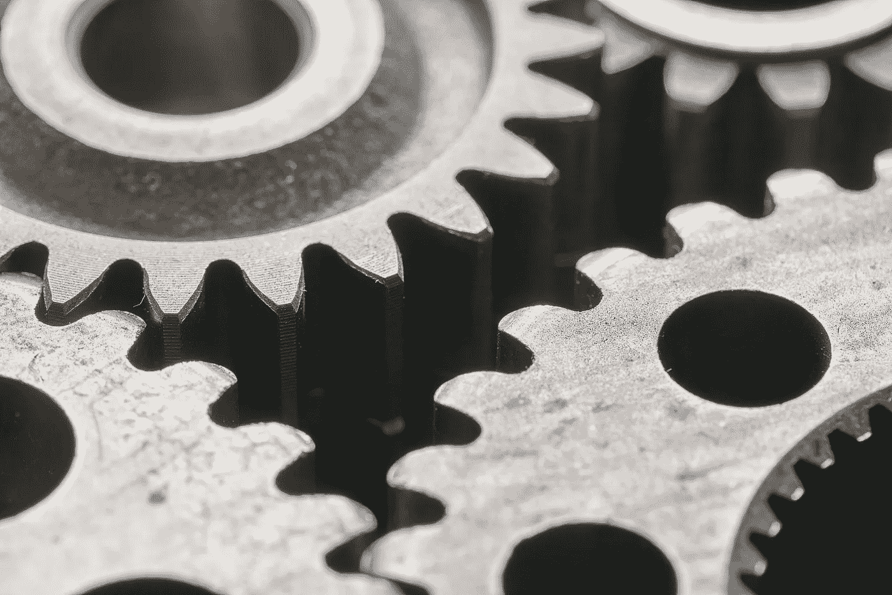

# 未被击败的

> 原文：<https://medium.datadriveninvestor.com/undefeated-6e08612de940?source=collection_archive---------15----------------------->

What keeps us moving forward?

我的一个朋友昨天在 Instagram 上分享了一段话。Ig: Pierrevision 分享到:

> “为什么陌生人比你的朋友更支持你的成功？
> 
> 因为你的朋友是从你开始的地方开始的……”

哇哦。那不是真的吗？

人有时候不喜欢承担责任，承担什么责任？任何事。

最终，我们有自由意志，我们有控制权，[我们做决定](https://medium.com/@harrisonwendland/changestartswithyou-625a85dae3b3?source=friends_link&sk=a29d09030a6935e727063ba707630142)(正如我在三月份反思的那样)。

你今天什么时候醒来的？你当时不是决定醒了吗？

有什么事情不是我们自己决定的？

We were born victorious.

**我们内心的东西。那些让我们…不败的东西。**

对你来说胜利是什么样子的？

你不知道耶稣已经征服了世界吗？上帝得胜了。

> “所以上帝按照自己的形象创造了人类，他按照上帝的形象创造了他们；他创造了男性和女性。”——创世纪 1:27

这意味着我们…天生胜利，不是吗？

> 耶和华对约书亚说:“不要害怕。要有勇气。”

不管你相信什么，我知道我们应该能够认同我们都是独一无二的。我们都擅长不同的事情。结果，我们和身边的人有着不同的使命、人生目标、命运，不管你怎么称呼它，不是吗？

> “我放下我的骄傲，拿起那本圣经”——艾斯·胡德

但是，如果你不知道你是谁呢？

很难实现你的目标，不是吗？

昨天我在 Instagram 上与某人交谈，他们谈论我们应该如何只做让我们开心的事。

尽管我很想支持那件事，但我不能。

我不相信。

我们不能总是做让我们快乐的事情，同时实现我们的人生目标。

想想一些伟人:

> 迈克尔·乔丹，他在每一场篮球比赛中都感到快乐吗？
> 
> 科比·布莱恩特，他在每天早上 5 点的训练中感到快乐吗？
> 
> 奥普拉·温弗瑞，她在每一次采访中都感到快乐吗？
> 
> 特蕾莎修女，她在每一个与他人交谈的机会中都感到快乐吗？

我不这么认为。

> “为我们不关心的事情努力工作叫做压力，为我们热爱的事情努力工作叫做激情”——西蒙·西内克
> 
> “成功的最重要的关键之一是有纪律去做你知道你应该做的事情，即使你不想做”

What are you investing in?

我不想写这个。我觉得写这个并不开心。我甚至不喜欢这篇文章…

但是，我投资了我自己。我花了时间和精力写它，学习和反思。我知道我在朝着什么方向努力。

> 迈克尔·乔丹？他知道要赢得冠军，他需要在每场比赛中都全力以赴。
> 
> 科比布莱恩特？他知道要成为最伟大的人之一，他需要永远投入鲜血、汗水和泪水。
> 
> 奥普拉·温弗瑞？她知道她需要带着完整的自己去参加每一次面试、演出或谈话。
> 
> 特里萨修女。她知道她需要真实，向每一个和她交往的人展示她的真实。

此刻你想做什么或想做什么并不重要。重要的是你长期想做什么。如果你知道为了上帝为你的生活设定的目标，有些事情需要去做，你需要去做。句号。

> “你已经赢了。你生来就是赢家。始终如一地全力以赴将确保成功。”—哈里森·文德兰德

那么，你的成功是什么？

> “如果你知道胜利是唯一的选择，你今天会做什么来体验成功？”
> 
> “你是个人，你要对自己负责。你决定你是谁，是什么定义了你”——布拉德·李

什么定义了你？对你来说什么是有益的？

Does this look like success to you?

你现在为什么会在这个地球上？你为什么不早 200 年被创造出来？

现在…我完成了这篇文章。我喜欢它。这是真的。你是真实的。坚持不懈地去追逐你的成功吧。你知道你的目标是什么，它就在你心里。如果你不知道你为什么在这里，问你的创造者，他会告诉你。