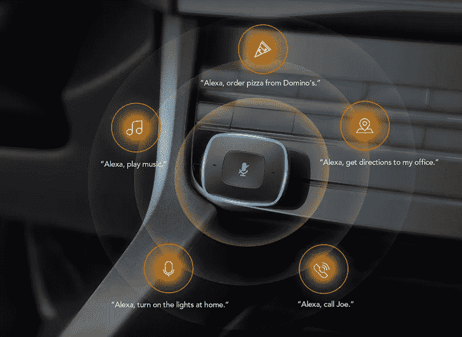
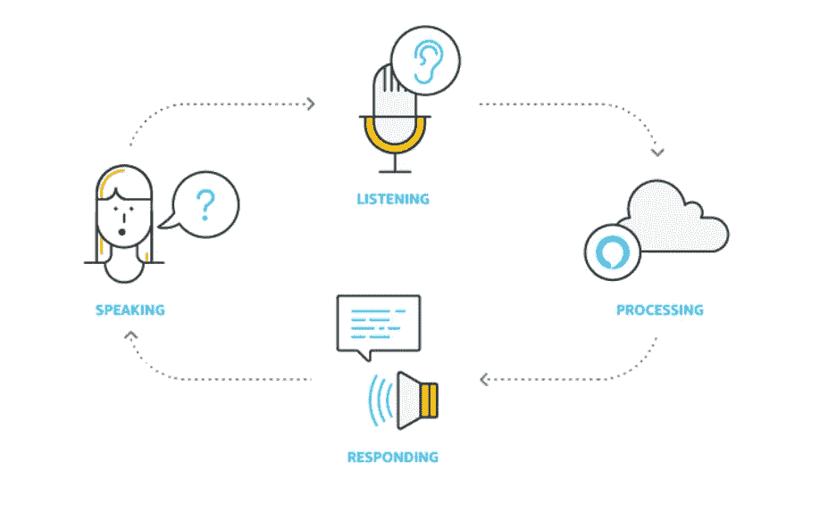
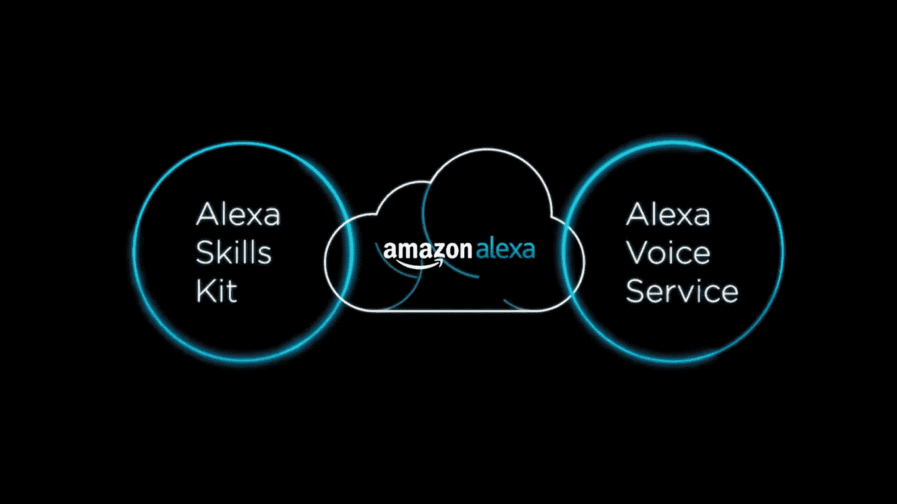

# 在后台

> 原文：<https://medium.datadriveninvestor.com/under-the-hood-ffeb4e8eab8a?source=collection_archive---------2----------------------->

【Alexa 如何工作

Alexa 是一种全新的做事方式，不仅能完成，而且能更快、更完美地完成。语音是与技术互动的最自然的方式，有了 Alexa，亚马逊让事情变得更加简单和有趣。从第一次对话开始，它就受到了人们的喜爱，但是，这一切是如何运作的呢？几秒钟内理解并回复您的问题。说“Alexa 开灯”灯就亮了。

在这个博客中，我们将讨论 Alexa 的工作。当你向 Alexa 发出命令，而 Alexa 给出所需的深度输出时，中间发生的整个过程。

# **当你让 Alexa 做事时会发生什么**

当你说 Alexa，打开灯或 Alexa，播放最新的宝莱坞热门歌曲或你要求 Alexa 预订一个旅程或订购一个披萨时，会发生什么？

Alexa 总是开启的，每当你说，Alexa，它就会被激活，当用户对着他们的 echo 说话时，Alexa 使用 echo 中的麦克风听用户说什么并开始记录，然后在用户说完之后，它将数据发送到 Alexa 服务(Alexa 语音服务)，在那里自动语音识别(ASR)，自然语言理解(NLU)，文本到语音， 机器学习全部一起工作，它们解释和处理数据，并向用户提供所需的输出，这就是我们如何简单地通过发出语音命令来完成我们的工作。

# **等等，没那么简单**

Alexa 由两个强大的框架支持，即 Alexa 技能工具包和 Alexa 语音服务，这两个框架支持用户向 Alexa 发出的数百万条命令。

开发人员可以使用 Alexa Skills Kit 创建不同的服务或技能来增加 Alexa 的功能，他们使用 Alexa 语音服务将语音带到自己的设备上。

# Alexa 语音服务

Alexa 语音服务(AVS)帮助开发人员将 Alexa 添加到新设备中。从智能音箱到手机再到汽车和过于智能的家电。

生活在云中的 Alexa 语音服务帮助客户获得令人惊叹的免提语音体验。这是一个完全可编程的服务，可以与其他在线服务一起工作，做一系列令人惊讶的事情，并帮助开发人员建立 Alexa 支持的产品。随着 Alexa 技能和 API 更新，它总是变得越来越聪明。它提供了所有基本到复杂的开发工具，如

1.  技术文档。

2.开发套件。

3.项目原型。

4.构建 API 原型。

AVS 使得构建和发布支持 Alexa 的产品变得更加容易。使用 Alexa 语音服务的一些关键功能是

1.  它有天生的语音控制能力。

2.它总是变得越来越聪明。

3.易于集成。

4.免费使用。

# Alexa 技能工具包(询问)

Alexa Skills Kit 是一个软件开发工具包(SDK ),使开发者能够为 Alexa 设计他们的技能或对话应用程序的前端部分。

Alexa 技能工具包包括 API 工具代码样本文档和所有必要的东西，使开发人员能够将技能添加到 Alexa 上可用的 10，000+语音识别功能。

使用 ASK，您可以轻松扩展现有服务或创造全新的服务，而无需客户用手或眼睛。

**接下来:——ALEXA 技能**