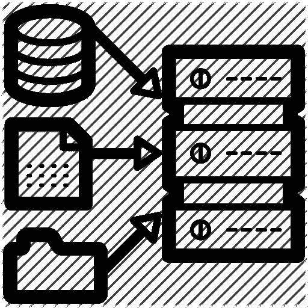
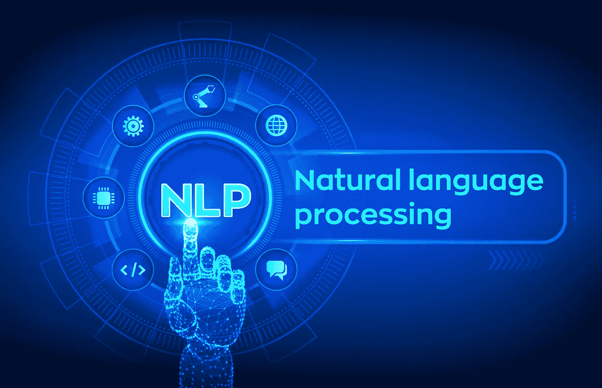
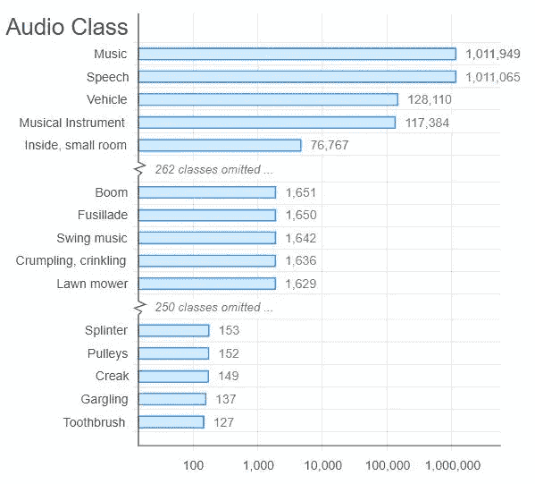

# 理解数据集

> 原文：<https://medium.datadriveninvestor.com/understand-data-sets-1b9f6c9e2cda?source=collection_archive---------5----------------------->

## 数据集及其属性

## 介绍

一个成功企业的秘密是对本质部分有更深的理解。你需要有深度的学习，只有通过实践才能达到。你需要练习从语音识别到图像处理的各种问题。每个问题都需要不同的方法来提供持久的解决方案。

人们从哪里获得这些数据？这是一个相当棘手的问题。尤其是如果一个人既想学习又想应用他们新获得的技能。下面是有用的数据集以及它们的属性，你需要看一看

*   图像处理
*   自然语言处理
*   音频/语音处理

## 你如何使用这些数据集？

它们相当大。你必须有最快的互联网连接速度。它还应该对个人可以下载的数据量有一个很高的限制。

你可以使用这些数据集来应用于各种深度学习技术。他们会帮助你磨练你的技能。这还不是全部。它们有助于帮助你理解识别和构建问题的方法。你会想到一个独特的用例。之后，你可以发表你的发现给其他人看。

 [## 为什么数据将改变投资管理|数据驱动的投资者

### 有人称之为“新石油”虽然它与黑金没有什么相似之处，但它的不断商品化…

www.datadriveninvestor.com](https://www.datadriveninvestor.com/2019/01/25/why-data-will-transform-investment-management/) 

# 图像数据集

有各种图像数据集，如下所示:

## MNIST

这是你会遇到的最受欢迎的深度学习数据集之一。这是在真实世界数据中尝试和学习技术以及深度识别模式的最佳数据库之一。您可以在数据预处理上花费最少的时间和精力。您可以在胶囊纸之间进行动态路由，这是一种最先进的结果，可以帮助您改进您的模型

**属性**

*   这是一个由手写数字组成的数据集。
*   它包含 60000 个样本的训练集和 10000 个案例的测试集

## b)可可女士

这是一个大规模的，也是一个珍贵的对象检测数据库。它还涉及到分段和字幕

它有几个属性。它们包括:

*   上下文中的识别
*   有对象分割
*   每张图片最多可以有 5 个标题
*   有 150 万个对象实例。
*   享受每张图像的超像素分割。
*   有 91 个物品类别。
*   有 25 万人有关键点

使用 mask R-CNN 这种最先进的纸张，它可以帮助您进一步增强您的模型

## c) ImageNet

这是一个数据集，它由按照 WordNet 层次结构组织起来的图像组成。

**属性**

*   WordNet 由大约 10000 个短语组成
*   ImageNet 平均利用 1000 张图片来说明每个特定的短语
*   大小是 150GB
*   图像总数包括 1500000
*   每个模型都有多个边界框以及各自的类别标签

## d)打开图像数据集

*   它有将近 900 万个图片网址。
*   每个图像都使用图像级标签边界框进行了注释，该边界框跨越了数千个类。
*   该数据集具有 9011219 幅图像的训练集。
*   验证集包括 41260 幅图像，而测试集有 125436 幅图像。

# 自然语言处理

以下是这一类别中的一些数据集及其属性:

## a) IMDB 审查

这是所有电影爱好者的梦想数据集。它是为二元情感分类而设计的。它有 25000 条高度极性的电影评论用于训练，还有 25000 条用于测试。还有一些未标记的数据也可以使用。原始文本以及预处理的单词包格式都包含在内。

## b)感觉 140

作为一名商业分析师，你需要用情感分析的知识来武装自己。你可以通过参加[商业分析师/情报课程](https://www.greatlearning.in/pg-program-business-analytics-course)来了解这一点。数据集是开始 NLP 之旅的理想选择。数据中没有附加任何情绪。以下是最终数据集的属性:

*   推特的受欢迎程度
*   推特的 ID
*   推文的日期
*   询问
*   推特用户的用户名
*   推特的文字
*   它的压缩大小为 80 兆字节
*   160000 条推文是记录的数量。

## c)不同语言的机器翻译

这是一个包含四种欧洲语言的训练数据的数据集。这是为了改进现有的翻译方法。您有独特的机会参加以下任何语言配对

*   英汉的
*   英语-捷克语
*   英语-爱沙尼亚
*   英语-芬兰语
*   英语-德语
*   英语-哈萨克语
*   英语-俄语
*   英语-土耳其语

你也可以得到每个翻译的反过来

已经有超过 3000 万个句子及其翻译的记录

大小是 15GB

## d)博客作者语料库

这里有一个数据集，由从不同博客作者那里收集的博客帖子组成。它是从 blogger.com 收集来的。每个博客都有一个独特和独立的文件。

每个博客都有至少 200 个英语单词

大小是 300 兆字节。已经有 681288 个帖子，超过 1.4 亿字。

## e)维基百科语料库

这是一个数据集，是维基百科全文的集合。超过 400 万篇文章中有超过 19 亿个单词。

这是一个强大的 NLP 数据集。这是因为你可以搜索一个单词、短语或段落并得到结果

## Yelp 评论

它是一个开放的数据库，由 yelp 发布，作为学习的基础。该数据集拥有数百万条用户评论、企业属性以及来自不同大都市地区的 20 多万张图片。

这是一个共享数据集，在全球范围内用于 NLP 挑战

它们有各种压缩大小，包括 2.66 GB 的 JSON、7.5 GB 的 photos 和 2.9 GB 的 SQL。

已经有超过 5200000 条评论、174000 个商业企业属性和 11 个大都市地区的记录。

# 音频/语音数据集

Image by AudioSet

这一类别中有各种数据集。它们如下

## a)自由口语数字数据集

它是为识别音频样本中的语音数字而创建的。这是一个开放的数据集；因此，有希望让不同的个人继续为其他样本做出贡献。目前，它具有以下属性

*   1500 录音。作为说话者，每一位数为 50
*   它由英语发音组成。
*   它由 3 个扬声器组成。
*   它的大小是 10MBs。

## b)免费音乐档案

这是一个用于音乐分析的数据集。它包含一个完整的长度以及总部音频。有一些预先计算的特征以及轨迹和用户级元数据。

这是一个开放的数据集，是为了评估和平号上的不同任务而创建的。它的大小是 1000 GB。

## c)舞厅

这是一个由音频文件中的交际舞组成的数据集。它有几个特点，如

*   持续时间 30 秒
*   总长度为 20940
*   698 是实例总数
*   它有一个 14 GB 的压缩大小
*   已经有 700 个音频样本的记录

## d)图书馆

它是超过 1000 个英语演讲小时的大规模语料库中的数据集。数据来源于 LibriVox 项目的有声读物。

它变得既分段又对齐。你可以在线查看在这个数据集上训练的各种声学模型以及语言模型。

## e)推特情感分析

隔离仇恨言论至关重要，因为它在 twitter 上令人讨厌。种族主义和性别歧视是一场激烈的辩论，扰乱了常规的推文，因此需要分开。作为一名数据科学家，你的任务是从其余的推文中过滤出仇恨推文。曾经有过 31962 条大小为 3 MBs 的推文的记录。

## f) VoxCeleb

这是一个大规模的说话人识别数据集。该数据集拥有 1251 位名人的超过 10 万条话语。这些都是从 YouTube 视频中提取的。这基本上是一个性别平衡的数据集，男性占 55%。

参与的名人来自不同的口音、年龄和职业。测试集和开发之间没有任何重叠。你会对用一个案例来分离和识别某个超级巨星的声音感兴趣。

## g)百万首歌曲数据集

这是一个由音频特征组成的免费数据集。它包含了一百万首当代音乐曲目的所有元数据。这个数据集的目的是鼓励对商业规模算法的研究。它还为评估研究提供了一个参考数据点。

它帮助新的研究人员开始研究和平号领域。它还使用 API 创建了一个大型数据集。

该数据集有一个核心特征，即专注于一百万首歌曲。然而，数据集不包括任何音频。它只包含派生函数。你可以从哥伦比亚大学提供的 7digital 等服务中获取特定的样本。

## h)城市声音分类

这是一个包含 8000 多名城市声音专家的数据集。它的意思是介绍通常分类场景中的音频处理。训练集包括 3GB，而测试集有 2 GB，这是经过压缩的。创纪录的 8732 名城市声音专家来自 10 个班级。

## 结论

当你选择研究这些数据集时，你就有机会成为一名更好的数据科学家。通过提供大多数人往往忽略的技能，成为你职业道路上的佼佼者。