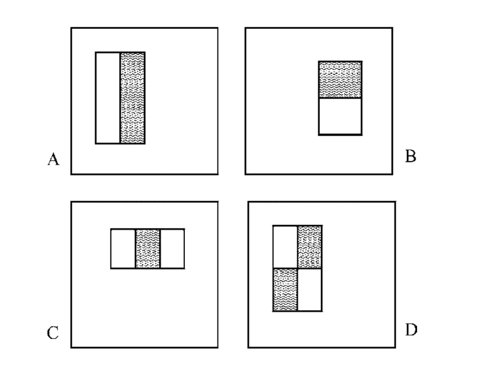
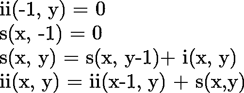
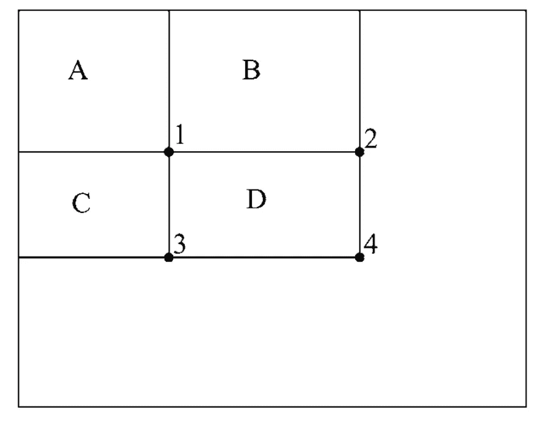
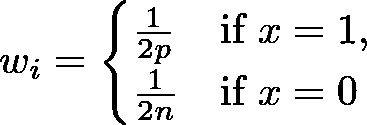
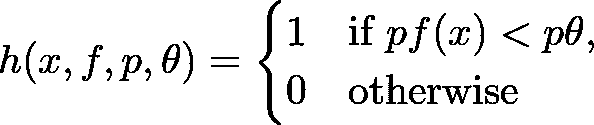
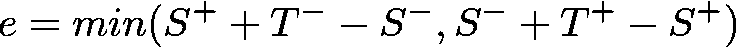
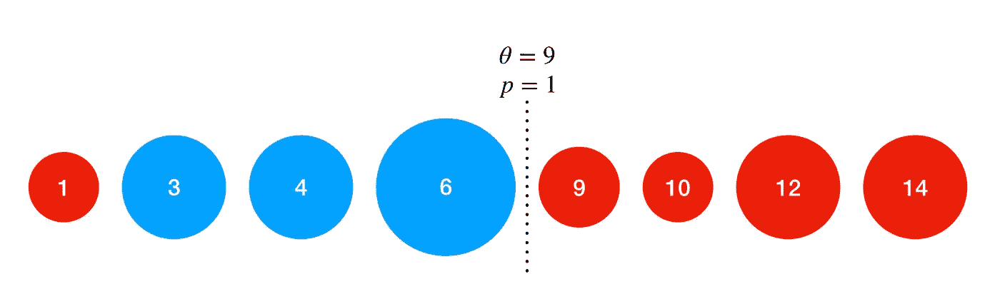
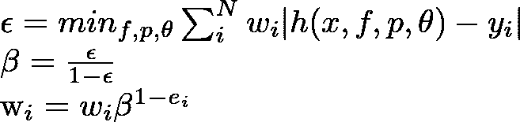
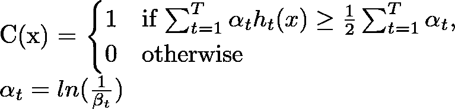

# 理解和实现 Viola-Jones 图像分类算法

> 原文：<https://medium.datadriveninvestor.com/understanding-and-implementing-the-viola-jones-image-classification-algorithm-85621f7fe20b?source=collection_archive---------0----------------------->

[](http://www.track.datadriveninvestor.com/1B9E)

图像分类在过去十年中一直是一个快速发展的领域，卷积神经网络(CNN)和其他深度学习技术的使用正在快速增长。然而，在 CNN 成为主流之前，另一种技术被广泛使用并继续使用:Viola-Jones。

CNN 是一个单一的分类器，它查看完整的图像并应用矩阵运算来实现分类，而 Viola-Jones 采用了一种集成方法。这意味着 Viola-Jones 使用许多不同的分类器，每个分类器都在查看图像的不同部分。每个单独的分类器都比最终的分类器弱(不太准确，产生更多的假阳性等)，因为它接受的信息更少。然而，当来自每个分类器的结果被组合时，它们产生一个强分类器。


由于算法的性质，Viola-Jones 方法限于二进制分类任务(例如对象检测),并且具有非常长的训练周期。然而，它对图像的分类很快，因为每个弱分类器只需要少量的参数，并且在有足够数量的弱分类器的情况下，它的假阳性率很低。

# 特征和整体形象

在介绍 Viola-Jones 的[论文中做出的第一个重要贡献是一组用于图像识别的简单功能。在大多数任务中，像素值是输入到算法中的特征。然而，Viola 和 Jones 引入了以下新功能。](http://www.vision.caltech.edu/html-files/EE148-2005-Spring/pprs/viola04ijcv.pdf)



A and B are two-rectangle features, C is a three-rectangle feature, and D is a 4-rectangle feature. Image taken from Original Paper.

从阴影矩形中的像素总和中减去无阴影矩形中的像素总和。很容易看出，即使对于小图像，也有很多特征(对于 24 x 24 的图像，超过 160，000 个)。由于该算法需要迭代所有特征，因此必须非常高效地计算它们。为了做到这一点，维奥拉和琼斯引入了积分图像。积分图像由以下递归关系定义。



s(x，y)是点(x，y)的累积行和，ii(x，y)是同一点的积分图像值，i(x，y)是该点的像素值。这个关系说的是，一个点(x，y)的积分图像是当前像素上方和左侧所有像素的总和。这使得计算矩形区域中像素的总和变得容易，如下所示。



D 区像素之和为 ii(4) + ii(1) — ii(2) — ii(3)，正好是四个数组引用。让我们通过创建一个辅助函数来开始实现该算法，该函数计算给定图像(表示为 2D numpy 数组)的积分图像。

```
import numpy as np #Don't forget to import numpydef integral_image(image):
    ii = np.zeros(image.shape)
    s = np.zeros(image.shape)
    for y in range(len(image)):
        for x in range(len(image[y])):
            s[y][x] = s[y-1][x] + image[y][x] if y-1 >= 0 else image[y][x]
            ii[y][x] = ii[y][x-1]+s[y][x] if x-1 >= 0 else s[y][x]
    return ii
```

这个函数只是实现了上面定义的递归关系。由于 s(x，-1) = 0，当 y-1 < 0, s(x, y) is just i(x, y) and likewise for ii(-1, y). Next, let's define a helper class to store rectangle regions to make it easy to compute the value of features later.

```
class RectangleRegion:
    def __init__(self, x, y, width, height):
        self.x = x
        self.y = y
        self.width = width
        self.height = heightdef compute_feature(self, ii):
    return ii[self.y+self.height][self.x+self.width] + ii[self.y][self.x] - (ii[self.y+self.height][self.x]+ii[self.y][self.x+self.width])
```

# Viola-Jones

Now that we have set up our helper classes and functions, we can start creating the Viola-Jones algorithm. Let's start by defining a ViolaJones class. The only hyper-parameter which our algorithm will use is the number of features (a.k.a the number of weak classifiers)

```
class ViolaJones:
    def __init__(self, T = 10):
        self.T = T
```

For training, Viola-Jones uses a variant of Adaboost. The general idea of boosting is for each subsequent weak classifier to correct the mistakes of the previous classifier. To do this, it assigns a weight to each training example, trains the classifiers, chooses the best classifier, and updates the weights according to the error of the classifier. Incorrectly labeled examples will get larger weights so they are correctly classified by the next classifier chosen.


Visual representation of boosting. ([See source article](https://medium.com/greyatom/a-quick-guide-to-boosting-in-ml-acf7c1585cb5))

This gives the following outline of the algorithm:

1.  Initialize the weights
2.  Normalize the weights
3.  Select the best weak classifier (based on the weighted error)
4.  Update the weights based on the chosen classifiers error
5.  Repeat steps 2–4 T times where T is the desired number of weak classifiers

Add a method 【 to the ViolaJones class where we can implement the training.

```
def train(self, training):
    training_data = []
    for x in range(len(training)):
        training_data.append((integral_image(training[x][0]), training[x][1]))
```

For now, 【 will take in a single parameter, 【 , which is an array of tuples. The first element in the tuple will be a 2D numpy array representing the image, and the second element will be its classification (1 for positive, 0 for negative). The loop will convert all of the images into their integral image format. We add the integral images to a new array to preserve the original dataset.

## Initializing the weights

At the start of the algorithm, we have no error off of which to base the weights, so each training example of the same class is weighted the same (i.e all positive examples are equally weighted as are all negative examples). This means for the ith image



Where *p* 为正例数 *n* 为负例数。假设我们事先知道正例和反例的数量，那么`train`将把它们作为一个参数

```
def train(self, training, pos_num, neg_num):
    weights = np.zeros(len(training))
    training_data = []
    for x in range(len(training)):
        training_data.append((integral_image(training[x][0]), training[x][1]))
        if training[x][1] == 1:
            weights[x] = 1.0 / (2 * pos_num)
        else:
            weights[x] = 1.0 / (2 * neg_num)
```

## 构建功能

训练的主循环需要选择最佳弱分类器，但是对于每个可能的特征都有一个弱分类器。因此，我们必须在开始实施培训的主循环之前构建所有的功能。回想一下，功能如下所示。


让我们将`build_features`作为 ViolaJones 类的一部分来实现，以返回所有特性的数组。

```
def build_features(self, image_shape):
    height, width = image_shape
    features = []
    for w in range(1, width+1):
        for h in range(1, height+1):
            i = 0
            while i + w < width:
                j = 0
                while j + h < height:
                    #2 rectangle features
                    immediate = RectangleRegion(i, j, w, h)
                    right = RectangleRegion(i+w, j, w, h)
                    if i + 2 * w < width: #Horizontally Adjacent
                        features.append(([right], [immediate]))
                    bottom = RectangleRegion(i, j+h, w, h)
                    if j + 2 * h < height: #Vertically Adjacent
                        features.append(([immediate], [bottom]))
                    right_2 = RectangleRegion(i+2*w, j, w, h)
                    #3 rectangle features
                    if i + 3 * w < width: #Horizontally Adjacent
                        features.append(([right], [right_2, immediate]))
                    bottom_2 = RectangleRegion(i, j+2*h, w, h)
                    if j + 3 * h < height: #Vertically Adjacent
                        features.append(([bottom], [bottom_2, immediate]))
                    #4 rectangle features
                    bottom_right = RectangleRegion(i+w, j+h, w, h)
                    if i + 2 * w < width and j + 2 * h < height:
                        features.append(([right, bottom], [immediate, bottom_right]))
                j += 1
            i += 1
    return features
```

`image_shape`参数是一个形式为`(height, width)`的元组。该算法的其余部分在图像中的所有矩形上循环，并检查是否有可能用它来制作一个特征。我们的特征表示是一个包含两个数组的元组。第一个数组是对该特征有积极贡献的 RectangleRegions，第二个数组是对该特征有消极贡献的 RectangleRegions。这种表示将允许我们稍后轻松地保存我们的分类器。

## 应用功能

当我们在算法中寻找稍后使用的最佳弱分类器时，将需要评估每个训练示例的每个特征。为了节省计算，我们将在开始训练分类器之前这样做。这是更有效的，因为每次我们选择一个新的分类器时，每个分类器都需要重新训练。如果我们将这些特征应用于训练循环中的训练示例，我们将重复工作，因为图像的每个特征的值从不改变。在训练前应用这些功能还可以让我们在以后预先选择功能，以加快训练速度。保留一个单独的数组来保存每个训练示例的标签将会简化我们的代码，因此我们也将在这一步中创建该数组。将`apply_features`方法添加到 ViolaJones 类。

```
def apply_features(self, features, training_data):
    X = np.zeros((len(features), len(training_data)))
    y = np.array(map(lambda data: data[1], training_data))
    i = 0
    for positive_regions, negative_regions in features:
        feature = lambda ii: sum([pos.compute_feature(ii) for pos in positive_regions]) - sum([neg.compute_feature(ii) for neg in negative_regions])
        X[i] = list(map(lambda data: feature(data[0]), training_data))
        i += 1
    return X, y
```

`train`方法现在应该是这样的

```
def train(self, training, pos_num, neg_num):
    weights = np.zeros(len(training))
    training_data = []
    for x in range(len(training)):
        training_data.append((integral_image(training[x][0]), training[x][1]))
        if training[x][1] == 1:
            weights[x] = 1.0 / (2 * pos_num)
        else:
            weights[x] = 1.0 / (2 * neg_num) features = self.build_features(training_data[0][0].shape)
    X, y = self.apply_features(features, training_data)
```

## 弱分类器

我们终于拥有了开始构建和训练弱分类器的所有要素。回想一下，Viola-Jones 使用一系列弱分类器，并将它们的结果加权在一起以产生最终的分类。每个弱分类器是“弱的”,因为它本身不能准确地完成分类任务。每个弱分类器关注单个特征( *f* )。它既有阈值( *θ* )又有极性( *p* )来确定一个训练样本的分类。



极性可以是-1 或 1。当 *p = 1* 时，当 *f(x) < θ* 或者特征值小于阈值时，弱分类器输出肯定结果。当 *p = -1* 时，弱分类器在 *f(x) > θ* 时输出肯定结果。现在，让我们定义一个类来封装弱分类器功能。

```
class WeakClassifier:
    def __init__(self, positive_regions, negative_regions, threshold, polarity):
        self.positive_regions = positive_regions
        self.negative_regions = negative_regions
        self.threshold = threshold
        self.polarity = polaritydef classify(self, x):
        feature = lambda ii: sum([pos.compute_feature(ii) for pos in self.positive_regions]) - sum([neg.compute_feature(ii) for neg in self.negative_regions])
        return 1 if self.polarity * feature(x) < self.polarity * self.threshold else 0
```

请注意，每个特征都是正矩形区域之和减去负矩形区域之和。回想一下，算法的下一步是选择最佳弱分类器。要做到这一点，我们需要找到每一个的最佳阈值和极性。

## 训练弱分类器

训练弱分类器是该算法中计算量最大的部分，因为每次选择新的弱分类器作为最佳分类器时，由于训练样本的权重不同，所有弱分类器都必须重新训练。然而，有一种有效的方法来使用权重找到单个弱分类器的最佳阈值和极性。首先，根据权重对应的特征值对权重进行排序。现在遍历权重数组，如果阈值被选为该特征，则计算误差。找出误差最小的阈值和极性。阈值的可能值是每个训练示例的特征值。误差可以通过以下方式测量



t 代表权重的总和，S 代表迄今为止看到的所有例子的权重的总和。上标“+”和“-”表示该和属于哪一类。从概念上讲，此错误比较了如果当前位置下方的所有示例都被标记为负，将有多少示例被错误分类，以及如果当前位置下方的所有示例都被标记为正，将有多少示例被错误分类(考虑每个示例是如何加权的)。



In this example, the numbers indicate the feature values and the size of the bubbles indicates their relative weights. Clearly, the error will be minimized when any feature with a value less than 9 is classified as blue. That corresponds to a threshold of 9 with a polarity of 1.

这样，我们可以在常数时间(O(1))内评估每个可能阈值的误差，在线性时间(O(n))内评估所有阈值的误差。阈值被设置为误差最小的特征的值。极性由位于阈值左侧(小于)和右侧(大于)的正样本和负样本的数量来确定。如果还有更多阈值的正例， *p=1* 。否则， *p = -1* 。下面是我刚才在代码中描述的内容(ViolaJones 类的一部分)。此方法将训练所有弱分类器，并以数组形式返回它们。

```
def train_weak(self, X, y, features, weights):
    total_pos, total_neg = 0, 0
    for w, label in zip(weights, y):
    if label == 1:
        total_pos += w
    else:
        total_neg += w classifiers = []
    total_features = X.shape[0]
    for index, feature in enumerate(X):
        if len(classifiers) % 1000 == 0 and len(classifiers) != 0:
            print("Trained %d classifiers out of %d" % (len(classifiers), total_features))
        applied_feature = sorted(zip(weights, feature, y), key=lambda x: x[1])
        pos_seen, neg_seen = 0, 0
        pos_weights, neg_weights = 0, 0
        min_error, best_feature, best_threshold, best_polarity = float('inf'), None, None, None
        for w, f, label in applied_feature:
            error = min(neg_weights + total_pos - pos_weights, pos_weights + total_neg - neg_weights)
            if error < min_error:
                min_error = error
                best_feature = features[index]
                best_threshold = f
                best_polarity = 1 if pos_seen > neg_seen else -1
            if label == 1:
                pos_seen += 1
                pos_weights += w
            else:
                neg_seen += 1
                neg_weights += w
         clf = WeakClassifier(best_feature[0], best_feature[1], best_threshold, best_polarity)
         classifiers.append(clf)
    return classifiers
```

## 选择最佳弱分类器

一旦我们训练了所有的弱分类器，我们现在可以找到最好的一个。这就像遍历所有分类器并计算每个分类器的平均加权误差一样简单。将`select_best`方法添加到 ViolaJones 类

```
def select_best(self, classifiers, weights, training_data):
    best_clf, best_error, best_accuracy = None, float('inf'), None
    for clf in classifiers:
        error, accuracy = 0, []
        for data, w in zip(training_data, weights):
            correctness = abs(clf.classify(data[0]) - data[1])
            accuracy.append(correctness)
            error += w * correctness
        error = error / len(training_data)
        if error < best_error:
            best_clf, best_error, best_accuracy = clf, error, accuracy
    return best_clf, best_error, best_accuracy
```

请注意，我们返回到了训练数据的原始表示形式(元组数组)。这是因为我们需要将积分图像传递给弱分类器，而不是特征值。另外，请注意，我们会跟踪精确度。这将在算法的下一步中更新权重时发挥作用。`train_weak`和`select_best`一起构成了我之前概述的高级算法的第三步。更新`train`利用这两种方法。

```
def train(self, training, pos_num, neg_num):
    ...
    for t in range(self.T):
        weak_classifiers = self.train_weak(X, y, features, weights)
        clf, error, accuracy = self.select_best(weak_classifiers, weights, training_data)
```

这些函数属于循环，因为最佳弱分类器依赖于每个训练示例的权重，并且回想一下，在选择每个新的弱分类器之后，每个训练示例的权重会改变。

## 更新权重

Viola-Jones 的大部分工作是构建特征、训练分类器以及在每次迭代中选择最佳弱分类器。其余的训练方法相对简单。在选择最佳分类器之前，我们应该归一化权重。在选择了最佳弱分类器之后，我们必须用所选弱分类器的误差来更新权重。被正确分类的训练样本将获得较小的权重，被错误分类的样本将保持其权重不变。



ε表示最佳分类器的误差，w 是第 I 个例子的权重，β是改变权重的因子。β的指数是 1-e，其中如果训练示例被正确分类，则 e 是 0，如果分类不正确，则 e 是 1(这就是为什么我们在选择最佳弱分类器时返回准确度数组)。

```
def train(self, training, pos_num, neg_num):
    ...
    for t in range(self.T):
        weights = weights / np.linalg.norm(weights)
        weak_classifiers = self.train_weak(X, y, features, weights)
        clf, error, accuracy = self.select_best(weak_classifiers, weights, training_data)
        beta = error / (1.0 - error)
        for i in range(len(accuracy)):
            weights[i] = weights[i] * (beta ** (1 - accuracy[i]))
```

## 强分类器

最后，我们必须从弱分类器中编译出强分类器。强分类器被定义为



系数α是每个弱分类器在最终决策中的权重，它取决于误差，因为它是β的倒数的自然对数。将弱分类器决策的加权总和与阿尔法决策总和的一半进行比较，因为这类似于说“至少一半的弱分类器同意正面分类”

我们需要存储所有的分类器和它们对应的 alphas，所以向 init 方法添加两个新的实例变量。

```
def __init__(self, T = 10):
    self.T = T
    self.alphas = []
    self.clfs = []
```

接下来，更新 train 方法的循环，以计算 alphas 并存储它们和分类器

```
def train(self, training, pos_num, neg_num):
    ...
    for t in range(self.T):
        weights = weights / np.linalg.norm(weights)
        weak_classifiers = self.train_weak(X, y, features, weights)
        clf, error, accuracy = self.select_best(weak_classifiers, weights, training_data)
        beta = error / (1.0 - error)
        for i in range(len(accuracy)):
            weights[i] = weights[i] * (beta ** (1 - accuracy[i]))
        alpha = math.log(1.0/beta)
        self.alphas.append(alpha)
        self.clfs.append(clf)
```

最终训练方法应该如下所示

```
def train(self, training, pos_num, neg_num):
    weights = np.zeros(len(training))
    training_data = []
    for x in range(len(training)):
        training_data.append((integral_image(training[x][0]), training[x][1]))
        if training[x][1] == 1:
            weights[x] = 1.0 / (2 * pos_num)
        else:
            weights[x] = 1.0 / (2 * neg_num) features = self.build_features(training_data[0][0].shape)
    X, y = self.apply_features(features, training_data)
    for t in range(self.T):
        weights = weights / np.linalg.norm(weights)
        weak_classifiers = self.train_weak(X, y, features, weights)
        clf, error, accuracy = self.select_best(weak_classifiers, weights, training_data)
        beta = error / (1.0 - error)
        for i in range(len(accuracy)):
            weights[i] = weights[i] * (beta ** (1 - accuracy[i]))
        alpha = math.log(1.0/beta)
        self.alphas.append(alpha)
        self.clfs.append(clf)
```

确保将`import math`添加到文件的顶部。最后，实现强分类器的分类方法。

```
def classify(self, image):
    total = 0
    ii = integral_image(image)
    for alpha, clf in zip(self.alphas, self.clfs):
        total += alpha * clf.classify(ii)
    return 1 if total >= 0.5 * sum(self.alphas) else 0
```

## 改进

功能的数量增长非常快。对于 24x24 的图像，有超过 160，000 个特征，而对于 28x28 的图像，有超过 250，000 个特征。此外，这些特性中的许多不会提供很大的分类能力，而且大部分是无用的。移除尽可能多的特征是有用的，这样我们可以训练更少的弱分类器。幸运的是， [SciKit-Learn 包](https://scikit-learn.org/stable/)可以通过它的 [SelectPercentile](https://scikit-learn.org/stable/modules/generated/sklearn.feature_selection.SelectPercentile.html#sklearn.feature_selection.SelectPercentile) 类帮助我们缩小特征空间。为了利用这一点，将下面的代码添加到`train`方法中，并导入所需的类。

```
from sklearn.feature_selection import SelectPercentile, f_classif
def train(self, training_data, pos_num, neg_num):
    ...
    X, y = self.apply_features(features, training_data)
    indices = SelectPercentile(f_classif, percentile=10).fit(X.T, y).get_support(indices=True)
    X = X[indices]
    features = features[indices]
    ...
```

拟合 SelectPercentile 类将找到最好的 k%的特征(我在这里选择了 10%)。然后，`get_support`方法返回这些特征的索引。在拟合 SelectPercentile 时，请注意传入的是 X.T，而不仅仅是 X，这是因为 SelectPercentile 希望每一行都是单个定型示例，每一列都是特征值，但 X 数组对此进行了切换。

## 保存和加载

由于 ViolaJones 需要很长时间来训练，因此能够从文件中保存和加载模型将非常有用。使用 Pickle 模块很容易做到这一点。将以下内容添加到 ViolaJones 类中

```
def save(self, filename):
    with open(filename+".pkl", 'wb') as f:
        pickle.dump(self, f)@staticmethod
def load(filename):
    with open(filename+".pkl", 'rb') as f:
        return pickle.load(f)
```

# 测试

ViolaJones 是为面部检测任务而创建的，那么在相同的任务上测试我们的代码还有什么更好的方法呢？测试这一点的一个很好的数据集是由麻省理工学院生物和计算学习中心创建的 [CBCL 人脸数据库](http://www.ai.mit.edu/courses/6.899/lectures/faces.tar.gz)。该数据集包含超过 2000 幅人脸图像和超过 4500 幅非人脸图像的训练集。每个图像是 19x19 和灰度。原始数据集的每个图像都是. pgm 格式的，所以我创建了两个 Pickle 文件，一个用于训练，一个用于测试，这样我们就可以直接将它们加载到 ViolaJones 类中。你可以在 GitHub 上的这里下载它们[。](https://github.com/parandea17/FaceDetection)

```
def train(t):
    with open("training.pkl", 'rb') as f:
        training = pickle.load(f)
    clf = ViolaJones(T=t)
    clf.train(training, 2429, 4548)
    evaluate(clf, training)
    clf.save(str(t))def test(filename):
    with open("test.pkl", 'rb') as f:
        test = pickle.load(f)
    clf = ViolaJones.load(filename)
    evaluate(clf, test)def evaluate(clf, data):
    correct = 0
    for x, y in data:
        correct += 1 if clf.classify(x) == y else 0
    print("Classified %d out of %d test examples" % (correct, len(data)))train(10)
test("10")
```

在 T = 10 的情况下，该算法花费一个小时来训练，并且在训练集上获得 85.5%的准确度，在测试集上获得 78%的准确度。在 T=50 的情况下，该算法花了 5 个小时来训练，并且在训练集和测试集上都获得了 93%的准确率。

# 结束语

Viola-Jones 实现了对机器学习和人工智能很重要的几个概念。首先，它是一种系综方法。第二，它利用 Adaboost 算法的变体进行特征选择。这些特征使得它成为过去使用并继续使用的用于图像分类的强有力的方法。最初的论文还引入了“注意力级联”的概念，以大大减少负面例子的分类时间。在本教程的第二部分中了解更多信息。

我希望这篇教程能让你很好地理解 Viola-Jones 算法。你可以在这里查看所有的代码。感谢阅读！