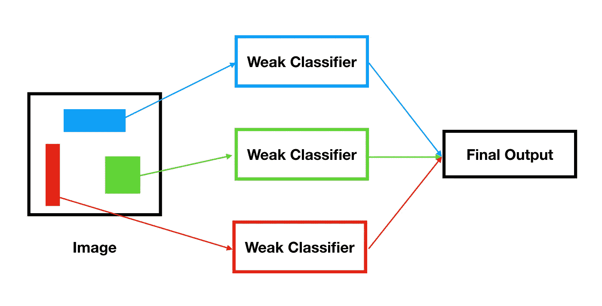
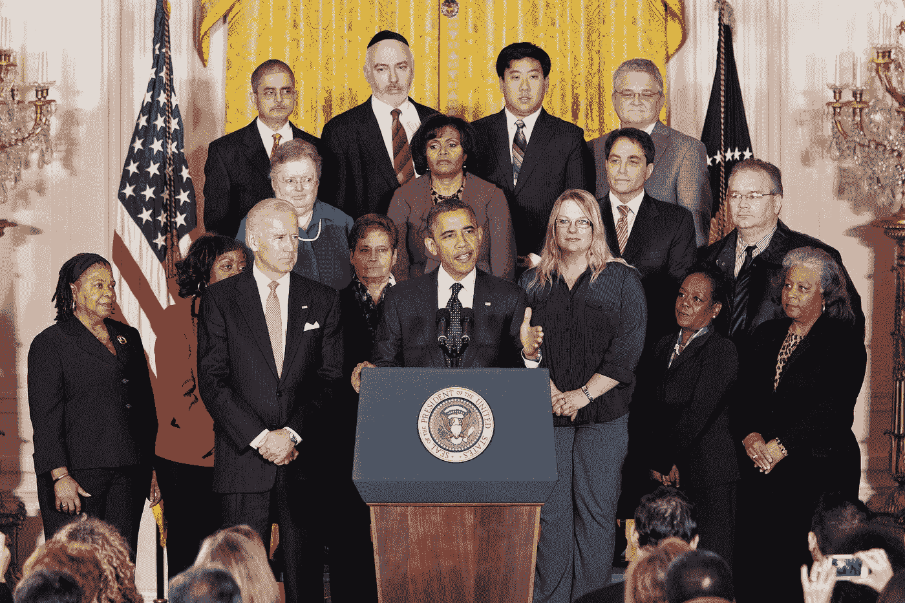
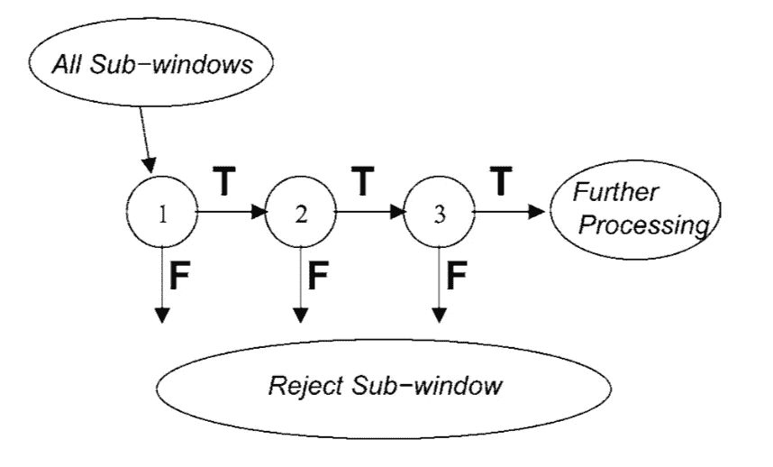
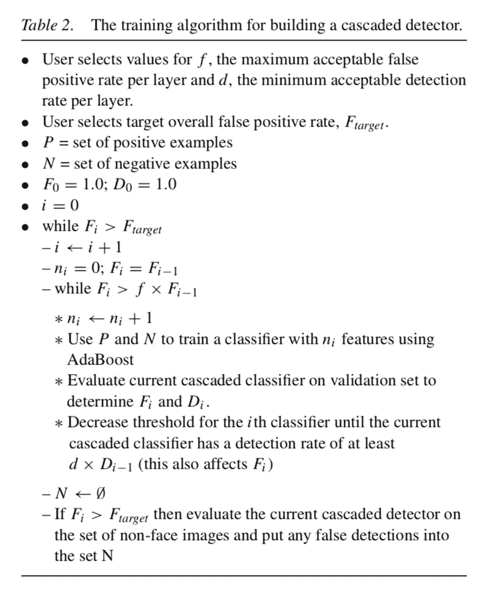

# 理解和实现 Viola-Jones(下)

> 原文：<https://medium.datadriveninvestor.com/understanding-and-implementing-viola-jones-part-two-97ae164ee60f?source=collection_archive---------4----------------------->

[](http://www.track.datadriveninvestor.com/1B9E)

在本系列教程的第一部分中，我介绍了如何实现由 Paul Viola 和 Michael Jones 在 2001 年提出的 Viola-Jones 图像分类方法。简而言之，Viola-Jones 是一种集成方法，它使用一系列弱分类器来创建强分类器。该算法的输出是由每个弱分类器做出的预测的加权组合。



当我们在教程的第一部分中训练 Viola-Jones 分类器时，我们使用了 19 x 19 的图像。然而，在现实世界中，我们不会得到一张 19 x 19 的图像，也不会被问及图像中是否有人脸。取而代之的是，我们经常会看到大幅图片和许多面孔，就像这张前总统奥巴马就经济问题发表演讲的照片。



Source: [White House Archives](https://obamawhitehouse.archives.gov/blog/2012/11/13/so-who-were-those-14-people-standing-behind-president)

为了检测图像中的所有面部，面部检测系统可以在图像中的每个位置滑动 19×19 像素的窗口，并通过 Viola-Jones 运行该图像中的像素。对于大的图像，考虑到图像必须被缩放和重新缩放以适应不同大小的脸，这相当于使用 Viola-Jones 很多次。如果系统需要实时检测人脸，计算速度必须很快。正是为了这个目的，维奥拉和琼斯引入了“注意力级联”

# “注意力级联”

注意力级联使用一系列 Viola-Jones 分类器对图像进行分类，每个分类器都越来越复杂。如果第 n-1 个分类器将图像分类为正例，则该图像仅通过第 n 个分类器。如果在任何一点上，一个分类器不认为图像是一个正面的例子，级联停止。



A diagram of the attentional cascade found in the original paper

例如，级联可能包含按 1 个特征、5 个特征、10 个特征、50 个特征和 100 个特征的顺序考虑的分类器。引入这种结构的好处是尽早剔除负面例子。这显著减少了在大图像中寻找负样本的计算时间，因为对于负样本实际上只计算了一小部分特征。

级联中每个分类器的训练与常规 Viola-Jones 算法的训练基本相同。唯一的区别是，在对所有训练样本进行训练的第一个分类器之后，每个后续分类器对所有正样本进行训练，并且只对先前分类器误分类的负样本(假阳性)进行训练。因此，级联中的每个分类器关注“更难”的特征。引入级联的最终结果是假阳性率(有多少非人脸被分类为人脸)显著降低。

# 构建算法

在他们的论文中，Viola 和 Jones 介绍了一种算法，该算法可以精确控制由此产生的级联的假阳性率。



然而，为了简单起见，我们将修改算法，以允许用户单独设计级联的每一层(即选择每一层有多少功能)

让我们从设计类开始。

```
class CascadeClassifier():
    def __init__(self, layers):
        self.layers = layers
        self.clfs = []
```

`self.layers`将是一个整数数组，如[1，5，10，50],它定义了级联中每一层有多少个特征。`self.clfs`将存储每个强分类器。

我们的训练方法将与您预期的完全一样，确保跟踪假阳性。

```
def train(self, training):
    pos, neg = [], []
    for ex in training: 
        if ex[1] == 1:
            pos.append(ex)
        else:
            neg.append(ex) for feature_num in self.layers:
        if len(neg) == 0:
            print("Stopping early. FPR = 0")
            break clf = ViolaJones(T=feature_num)
        clf.train(pos+neg, len(pos), len(neg))
        self.clfs.append(clf)
        false_positives = []
        for ex in neg:
        if self.classify(ex[0]) == 1:
            false_positives.append(ex)
        neg = false_positives
```

分类方法也相对简单。

```
def classify(self, image):
    for clf in self.clfs:
        if clf.classify(image) == 0:
            return 0
    return 1
```

最后，添加我们用于 Viola-Jones 的保存和加载方法

```
import pickle
def save(self, filename):
    with open(filename+".pkl", 'wb') as f:
        pickle.dump(self, f)@staticmethod
with open(filename+".pkl", 'rb') as f:
    return pickle.load(f)
```

注意力级联可以用测试 Viola-Jones 的同样方法来测试。

# 结论

注意力级联是一个简单的想法，重点是减少假阳性率。它加快了分类时间，但可能会增加训练时间，这取决于每个强分类器考虑多少特征。不管怎样，这是一个有用的结构，并不是 Viola-Jones 所特有的。

这就结束了我的关于 Viola-Jones 算法的两部分教程。你可以在我的 [GitHub](https://github.com/parandea17/FaceDetection) 上找到完整的代码。感谢阅读！