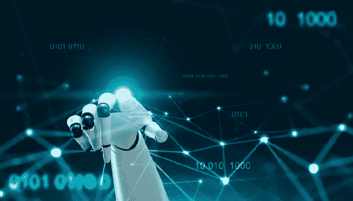

# 理解人工智能、机器学习和深度学习

> 原文：<https://medium.datadriveninvestor.com/understanding-artificial-intelligence-machine-learning-and-deep-learning-58f546ba7111?source=collection_archive---------6----------------------->

技术变革是当今商业世界唯一不变的因素，它颠覆了从大型组织到小型初创企业的一切。颠覆会影响每个人，但是你会成为颠覆者还是被颠覆者？你必须密切关注[塑造你的行业、你的企业和外部世界的未来](https://www.burrus.com/2018/04/hard-trends-are-easy-to-find-if-you-know-where-to-look/)的硬趋势，以识别用于创新和快速增长的机会，此外利用这些硬趋势在发生之前解决你的组织和客户可能有的任何问题*。*

# **共享理解和定义的力量**

对我们使用的词语的共同定义和理解是商业中的一个问题。虽然一些公司正在使用人工智能(AI)、机器学习(ML)和深度学习(DL)，但其他公司几乎不理解这些强大技术之间的根本差异。当一个人自己不区分人工智能、人工智能和数字图书馆时，他怎么可能成功，更不可能有破坏性？

 [## 挑战你对人工智能和社会看法的 4 本书|数据驱动的投资者

### 深度学习、像人类一样思考的机器人、人工智能、神经网络——这些技术引发了…

www.datadriveninvestor.com](https://www.datadriveninvestor.com/2019/02/28/4-books-on-ai/) 

最近，科技公司 Sage 进行了一项关于人工智能和个人对它的理解的调查。不幸的是，43%的美国受访者和 47%的英国受访者表示，他们不知道人工智能在商业中的能力。

除了教育不足之外，许多供应商在最终决策者和购买者了解他们需要什么或者该技术实际上可以为他们的公司做什么之前，就将不同的人工智能解决方案推向市场，导致内部和外部的混乱。再加上其他人工智能子范畴，ML 和 DL，卷积就更进一步了。

在为世界各地不同背景的领导人提供建议时，我发现我们对人工智能及其对手都有不同的定义和理解。例如，我被邀请参加在 DC 华盛顿州举行的关于人工智能的高级别战略会议，与会的有来自国防部、DARPA 和几个主要国防承包商的专家。

在会议开始之前，我听到了关于一些人正在用深度学习做什么的讨论，其他人正在谈论他们从机器学习中获得的结果。我想知道我们是否都理解了眼前的讨论，于是我请其中一位专家给出了他们对机器学习的定义，之后又问了另一位专家。第三个人说，很明显我们对同一件事都有不同的定义。

当我询问深度学习的定义时，出现了类似的结果，令我惊讶的是，甚至人工智能的定义也因参与者而异。

如果我们分享我们如何应用一项技术，但对它实际上是什么有不同的定义和理解，我们就没有有效地沟通或合作。事实上，我们会制造更多的问题。因此，在我的例子中，我们花了会议的下一部分来起草每个人都同意的定义。

# **到底什么是 AI ∙机器学习∙深度学习**

**人工智能**适用于计算系统，这些系统被设计成使用逻辑、if-then 规则和决策树来执行通常保留给人类智能的任务。人工智能从大量高质量数据中识别模式，提供见解、预测结果和做出复杂决策。

**机器学习**是人工智能的一个子集，它利用先进的统计技术使计算系统能够*随着时间的推移随着经验的积累而改进任务*。亚马逊的 Alexa 和苹果的 Siri 等聊天机器人每年都在改进，这要归功于消费者的不断使用以及在后台进行的机器学习。

**深度学习**是机器学习的一个子集，它使用高级算法使人工智能系统能够*通过将多层神经网络暴露于大量数据来训练自己执行任务*。然后，它利用所学到的知识来识别数据中包含的新模式。学习可以是*人类监督学习*、*非监督学习、*和/或*强化学习、*像谷歌用 DeepMind 学习如何在围棋比赛中打败人类。

**自主计算**使用深度学习等先进的人工智能工具，使系统*能够自主管理，并能够在没有人类命令的情况下根据情况数据采取行动*。AI 自主包括感知、高速分析、机器对机器通信和运动。自动驾驶汽车使用这些功能在没有人类驾驶员的情况下驾驶车辆。

**增强思维**:随着人工智能越来越多地融入物体、过程、产品和服务，人类将利用人工智能提供的洞察力增强个人解决问题和决策的能力。

对于领导者和员工来说，对人工智能、人工智能和数字逻辑之间的根本区别有一个明确的理解是至关重要的。当准确理解*如何*这些不断发展的颠覆性技术可以被您的组织所利用时，从对人工智能的共同理解中获得的不断增长的商业洞察力是显而易见的。

组织和领导者必须超越快速反应。通过关注将要发生的艰难趋势并在问题发生前解决它们，变得有预见性是必要的。理解人工智能技术以及它们如何相互构建是一个很好的开始，有助于你的组织快速走向未来。

Go to www.TheAOBook.com

www.TheAOBook.com