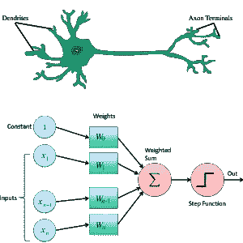

# 理解人类术语中的反向传播

> 原文：<https://medium.datadriveninvestor.com/understanding-back-propagation-in-human-terms-6a5a7ffb0d15?source=collection_archive---------26----------------------->

Photo by [Joel Filipe](https://unsplash.com/@joelfilip?utm_source=medium&utm_medium=referral) on [Unsplash](https://unsplash.com?utm_source=medium&utm_medium=referral)

神经网络和底层感知机的概念是我们称之为神经元的生物形式及其形成的错综复杂的网络的数学表示。本文旨在从更高的层面上得出实际学习过程(反向传播)和人类大脑行为之间的相似性，从而提供另一种视角。

像神经元这样的感知器基于输入信号的值做出反应。感知器计算输入值的加权和，并根据需要额外应用激活函数来标准化输出。多层感知器的每一层都使用前一层的输出。随着神经网络经历训练过程，随着与输入值相关联的权重被调整，学习过程发生。当希望减少预测值和作为训练数据的一部分提供的真实目标值之间的损失时，进行这种调整。

这就是反向传播概念的由来。反向传播是神经网络学习的关键，虽然数学涉及微分计算梯度；这种学习过程类似于人的大脑在一夜之间找到许多问题的正确答案的能力。有多少次，你在上床睡觉的时候，沮丧地试图解决某件目前看来很复杂的事情，而当你早上醒来的时候，你已经找到了解决方案。在睡眠的 REM 阶段，一旦神经网络有机会基于正向传递期间的损失计算来调整/反向传播信息，我们的大脑就会将可用的信息拼凑在一起并清理掉，从而产生更好的答案/想法，类似于改进的预测。

诚然，反向传播可以发生在每个输入周期，但这可能不是有效的。想象一下，每当我们遇到障碍时，我们都会进入深度快速眼动期。小批量或一般批处理过程是我们如何在调整权重方面获得效率的，类似于大脑处理过多的信息并调整其对所述信息的评估。

最终，只要额外关注我们的大脑如何在一天中感知、分类和处理信息，就可以实现神经网络的大量效率。

最初发布于 2019 年 1 月 27 日@ [aiapplied.ca](https://www.aiapplied.ca/2019/01/27/human-perspective-back-propagation-in-neural-networks/)