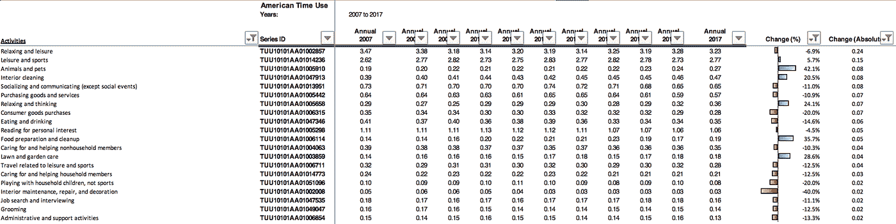

# 理解消费者行为:美国人如何利用他们的时间

> 原文：<https://medium.datadriveninvestor.com/understanding-consumer-behavior-how-americans-use-their-time-5a95b150d4da?source=collection_archive---------4----------------------->

你知道从 2007 年到 2017 年，美国人花在宠物身上的时间增加了 42%吗？

**时间就是金钱。**

理解消费者行为需要理解消费者在哪里、如何以及(最终)为什么在什么活动中投入时间。

了解日常生活中人们的日常时间花费，可以让我们对囚禁时间的位置做出明智的预测。当然，花在宠物身上的时间增加 42%可能不值得[在宠物公司](https://news.crunchbase.com/news/wag-need-300m-softbank-walk-dogs/)上亿美元的投资，但这表明了一种值得投资的上升趋势。

 [## 金融科技初创公司正在颠覆全球银行业|数据驱动的投资者

### 传统的实体银行从未真正从金融危机后遭受的重大挫折中恢复过来…

www.datadriveninvestor.com](https://www.datadriveninvestor.com/2018/10/20/fintech-startups-are-disrupting-the-banking-industry-around-the-world/) 

我从最有趣的公共数据集中提取了数据，即由美国劳工统计局编制的美国时间使用调查(T7)，以了解是否还有其他有趣的趋势。

我每天花在特定活动上的时间，并根据百分比和绝对时间筛选出 2007 年至 2017 年间变化最大的活动。结果如下:

一些有趣的事情显而易见，甚至令人惊讶:

人们在以下方面花费了更多时间:

*   工作
*   在家度过时光
*   思考
*   准备食物
*   运动/休闲
*   照料他们的草坪(是的，这也难倒我了)

另一方面，人们花在以下方面的时间越来越少:

*   买东西
*   放松的
*   交际
*   吃喝

这种行为很大一部分可以归因于 2008 年的经济衰退和电子商务和送货服务的普及。然而，有趣的是，这些数据似乎强烈支持一个不断上升的假设，即家庭是消费者注意力的下一个战场。随着亚马逊、谷歌和富士康等公司在家庭自动化/物联网行业取得更大进展，我希望看到更多关于消费者对其家庭的心理的复杂论文。

转贴自 2018 年 11 月

[*Chia*](http://chiajy.com/?source=post_page---------------------------) *深入美国和亚洲的消费者投资趋势，建立有趣的项目，并与早期(Pre-A)创始人密切合作。以前在这里工作:*[*http://chiajy.com*](http://chiajy.com/?source=post_page---------------------------)