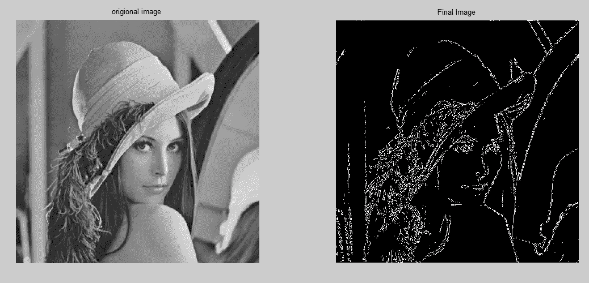
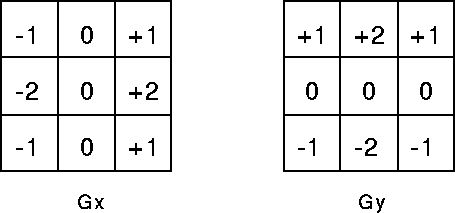
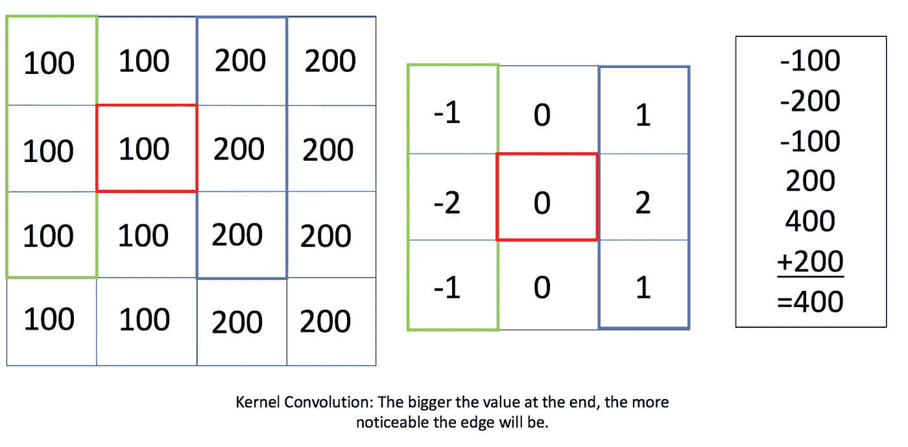
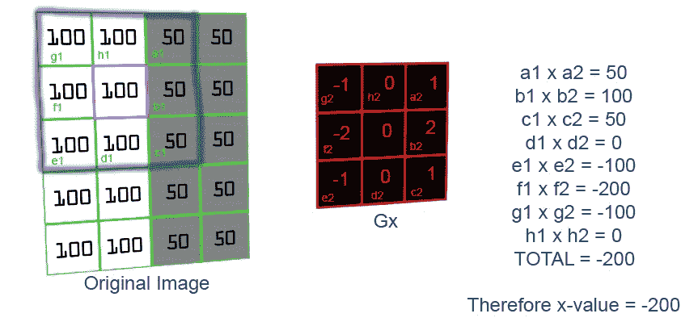
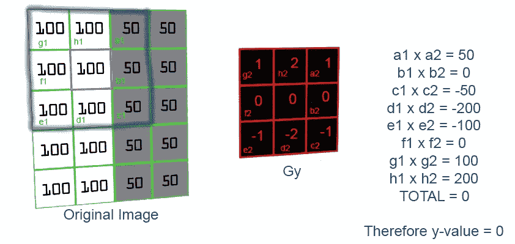

# 了解边缘检测(Sobel 算子)

> 原文：<https://medium.datadriveninvestor.com/understanding-edge-detection-sobel-operator-2aada303b900?source=collection_archive---------1----------------------->

# **边缘检测:**

边缘检测就是试图找到图像中强度或颜色发生急剧变化的区域，高值表示急剧变化，低值表示轻微变化。

# 索贝尔算子:

一个非常常见的操作符是 Sobel 操作符，它是一个图像导数的近似值。它在 y 和 x 方向是分开的。如果我们看 x 方向，一个图像在 x 方向的梯度等于这里的这个算子。我们使用一个核 3 乘 3 矩阵，每个 x 和 y 方向一个。x 方向的梯度在左手边有负数，在右手边有正数，我们保留了一点中心像素。类似地，y 方向的渐变在底部是负数，在顶部是正数，这里我们保留了一点中间行的像素。

Image Source: [http://homepages.inf.ed.ac.uk/rbf/HIPR2/sobel.htm](http://homepages.inf.ed.ac.uk/rbf/HIPR2/sobel.htm)

本质上，我们在这里尝试用 Sobel 算子做的是通过在图像的每个像素上放置梯度矩阵来找出差异的数量。我们得到两幅图像作为输出，一幅是 X 方向的，另一幅是 Y 方向的。通过使用核卷积，我们可以在下面的示例图像中看到，在 100 和 200 个值的列之间有一条边。

Image Source: [https://www.projectrhea.org/rhea/index.php/An_Implementation_of_Sobel_Edge_Detection](https://www.projectrhea.org/rhea/index.php/An_Implementation_of_Sobel_Edge_Detection)

上面的例子显示了通过将梯度矩阵 X 放置在图像的红色标记 100 上进行卷积的结果。计算结果显示在右边，总计为 400，非零，因此有一个优势。如果图像的所有像素都具有相同的值，那么卷积将导致总和为零。因此，当一侧较亮时，梯度矩阵将提供较大的响应。这里需要注意的另一点是，输出结果的符号无关紧要。

**让我们看另一个例子:**

Illustrating how the calculation is done for a pixel in the x-direction using Gx. Image source: [http://www.doc.ic.ac.uk/~ts2615/contribution.html](http://www.doc.ic.ac.uk/~ts2615/contribution.html)

Illustrating how the calculation is done for a pixel in the y-direction using Gy. Image source: [http://www.doc.ic.ac.uk/~ts2615/contribution.html](http://www.doc.ic.ac.uk/~ts2615/contribution.html)

在使用 Gx 和 Gy 计算边缘之后，可以导出许多其他有用的推论。

# 总结:

Sobel 算子方法可以成功地用于分割图像，而无需任何人工干预。Sobel 操作符执行起来也非常快。由于每次对图像执行 Sobel 算子都会产生相同的输出，因此 Sobel 算子是一种稳定的图像分割边缘检测技术。

我叫 Ashish [@ashish_fagna](http://twitter.com/ashish_fagna) 。我是顾问。查看我的 [LinkedIn 简介](https://www.linkedin.com/in/ashkmr1/)。你也可以通过我的电子邮件联系我，ashish[dot]fagna[at]gmail.com

如果你喜欢这篇文章，请推荐并分享它！谢谢你的时间。