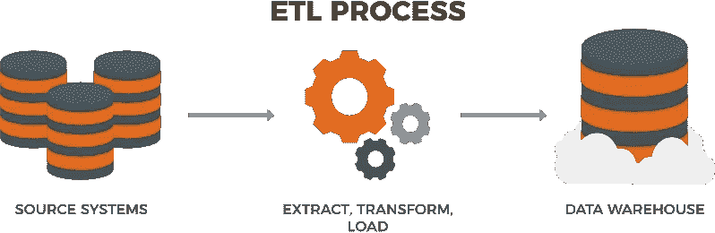
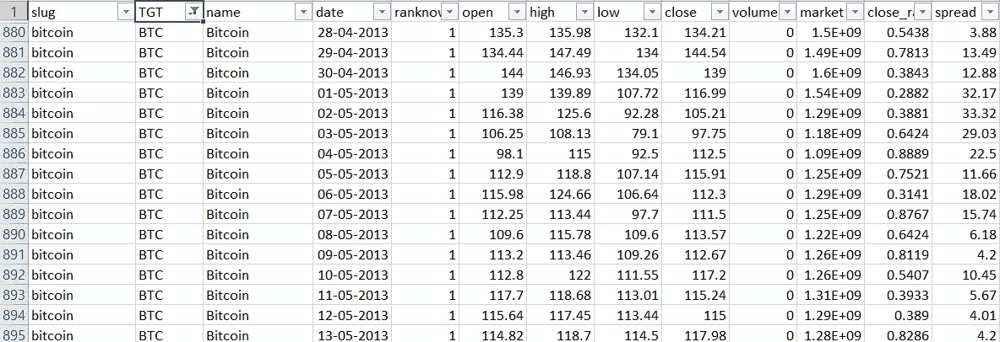
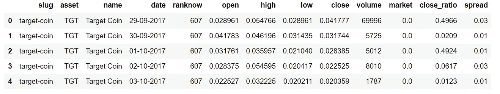
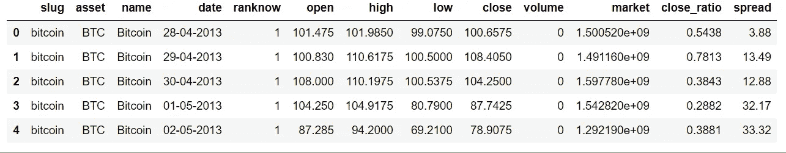
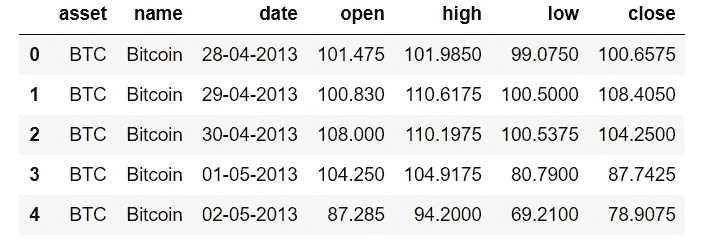

# 通过 Python 代码中的示例了解数据分析领域中的提取、转换和加载(ETL)

> 原文：<https://medium.datadriveninvestor.com/understanding-extract-transform-and-load-etl-and-its-necessity-in-data-analytics-world-with-an-64346016153d?source=collection_archive---------1----------------------->

任何从事数据分析的人，无论是程序员、业务分析师还是数据库开发人员，都直接或间接地开发过 ETL 管道。对于数据驱动的业务，ETL 是必须的。

> **什么是 ETL？？？**

ETL Process

ETL 代表提取、转换和加载。这是一个通用的过程，其中数据首先被获取，然后被更改或处理，最后被加载到数据仓库或数据库或其他文件，如 PDF、Excel。

您可以从任何数据源(如文件、任何 RDBMS/NoSql 数据库、网站或实时用户活动)中提取数据，转换获取的数据，然后将转换后的数据加载到数据仓库中以供业务使用，如报告或分析。

 [## 数据科学和软件工程哪个更有前途？数据驱动的投资者

### 大约一个月前，当我坐在咖啡馆里为一个客户开发网站时，我发现了这个女人…

www.datadriveninvestor.com](https://www.datadriveninvestor.com/2019/01/23/which-is-more-promising-data-science-or-software-engineering/) 

不要把 ETL 和工具混为一谈，它是一个数据移动的概念，可以借助各种工具如 Informatica、Tableau、编程语言等来建立。

ETL 是一个 3 步流程:

*   从单个或多个数据源提取数据
*   根据业务逻辑转换数据。转换本身是一个两步过程——数据清理和数据操作。
*   将转换后的数据加载到目标数据源或数据仓库中。

> **你可能会问，为什么是 ETL？？？**

数据分析主要围绕 ETL 展开。你们中的许多人可能已经以这样或那样的方式通过编写不同的函数/脚本来执行数据任务并从数据中获取一些有用的信息。

使用 ETL 的主要原因是:

*   可视化您的整个数据流管道，帮助企业做出关键的业务决策。
*   事务数据库不能回答复杂的业务问题，而 ETL 可以回答这些问题。
*   ETL 提供了一种将数据从各种来源转移到数据仓库的方法。
*   随着数据源的变化，数据仓库将自动更新。
*   ETL 过程可以执行复杂的转换，并且需要额外的区域来存储数据。
*   ETL 有助于将数据迁移到数据仓库。转换成各种格式和类型，以符合一个一致的系统。
*   ETL 是一个预定义的过程，用于将源数据访问和操作到目标数据库中。
*   ETL 为业务提供了深刻的历史背景。

在这篇博客中，我们将通过使用 Python 编程语言来建立我们的 ETL 管道，因为幸运的是 Python 附带了许多不同的库，有助于建立大量的数据分析、数据可视化或数据科学解决方案。

让我们从用 python 构建自己的 ETL 管道开始。

为了简单起见，我们的 3 个步骤如下:

*从 CSV 文件中提取数据
*转换/操作数据
*将数据加载到 SQL 数据库中(Python 内置了 SQL 模块—‘sqlite3’)

CSV 数据源链接:[https://raw . githubusercontent . com/dil Jeet 1994/Python _ Tutorials/master/Projects/Advanced % 20 ETL/crypto-markets . CSV](https://raw.githubusercontent.com/diljeet1994/Python_Tutorials/master/Projects/Advanced%20ETL/crypto-markets.csv)

Sample Data

让我们从 python 代码开始。我在这里用熊猫来读取 CSV 文件。Pandas 是一个很棒的 python 库，被大量用于数据分析。在熊猫身上读取 CSV 的数据真的很容易。你可以关注这个 [Github repo](https://github.com/diljeet1994/Python_Tutorials/blob/master/Pandas.ipynb) 来了解更多关于熊猫的信息。

读取 CSV 文件的代码片段:

运行代码后，您可以看到以下数据帧作为输出:

因此，我们有加密货币数据，其中包含加密令牌名称，其开盘价、收盘价、特定日期的最高价和最低价以及其他一些列。这些价格以美元为单位，我们希望将此价格转换成英镑。另外，我们假设有些列与我们无关，所以我们最终会删除这些列。因为我们的数据不包含任何空值或空白值及其结构，所以我们可以跳过数据清理部分。

让我们从转换数据开始。转换逻辑是将 BTC、ETH、XRP 和 LTC 加密货币的价格仅从美元转换为英镑。假设我们不关心其他货币。

所以在 Python 中，我们必须构建逻辑来遍历 excel 文件的所有行，并检查当前行是否包含所需的加密货币(BTC、瑞士联邦理工学院、XRP 和 LTC)。如果是这样，那么我们将通过简单地将价格列乘以 0.80 来将其价格转换为英镑，这是在写这篇博客时美元对英镑的兑换率((1 美元= 0.80 英镑))。

转换部分的代码片段:

在代码中，您可以看到以下数据帧作为输出:

列有很多，假设对我们来说，相关列只有资产、名称、日期、开盘价、最高价、最低价和收盘价。因此，让我们放弃其他不相关的专栏。

最终数据集如下:

最后一步是将转换后的数据加载到 SQL 数据库中。

需要记住的一点是，加载部分也可以是数据可视化(图形)、PDF 或 Excel 报告或数据库的形式，就像我们的例子一样。这只是为进一步的业务案例研究检索最终数据集。

Python3 附带了一个内置的 SQL 模块‘sqlite3 ’,所以我们不需要下载任何外部库。

将数据加载到 SQL 的代码片段:

首先，我创建了一个 sql 连接，然后检查是否存在任何名为“Crypto”的数据库。如果它存在，那么我就放弃它(只是为了好玩:P)。然后在 conn.execute()方法内用 sql 查询创建了表 Crypto。

对于数据插入，我们再次需要将数据从 Pandas Dataframe 更改为 Python 列表或元组列表，因为这是 sqlite 模块理解的数据插入格式。下面是相同的代码片段。

这是 Python 代码中的一个基本 ETL 管道。要获得上述代码的完整 jupyter 笔记本，请使用这个 github repo:[https://github . com/dil Jeet 1994/Python _ Tutorials/tree/master/Blog % 20 work/ETL/ETL % 20 basic](https://github.com/diljeet1994/Python_Tutorials/tree/master/Blog%20Work/ETL/ETL%20Basic)

为了更好地理解在 python 中使用 ETL 构建复杂的数据分析解决方案，请阅读下面提到的博客:

 [## 使用 Python 中的 ETL 管道的完整数据分析解决方案

### 这篇博客解释了使用 Python 进行 ETL(提取、转换和加载)的概念。它将说明关于…

medium.com](https://medium.com/p/edd6580de24b) 

玩得开心，不断学习，一直坚持编码。

谢了。