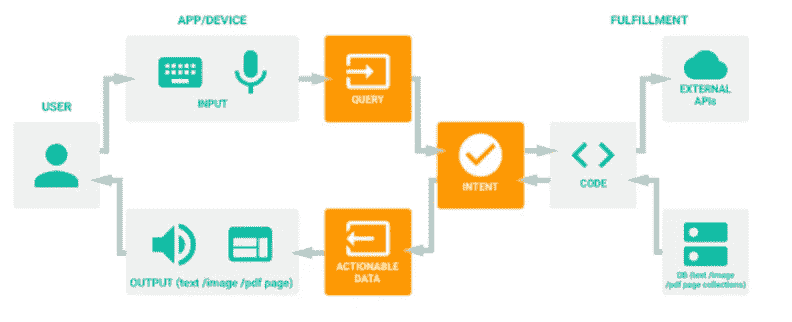

# 了解聊天机器人的基础知识

> 原文：<https://medium.datadriveninvestor.com/understanding-fundamentals-of-chatbots-c71d4dea136b?source=collection_archive---------13----------------------->

“聊天机器人”在过去几年里已经成为一个时髦的词，并被用于不同的行业领域，以实现不同的目的。简单地说，聊天机器人只不过是以文本或音频格式对您的查询做出的响应。响应是在一些规则和分析的基础上生成的，例如自然语言处理(NLP)或其他文本分析技术。每当用户向 bot 询问任何事情时，都会对其查询进行分析，并将他的查询映射到存储在后台的短语(称为意图),并根据该意图向用户发送响应。响应可以是硬编码，也可以通过 web hooks(web hooks 只不过是一种与其他应用程序交互的机制)附加到 chatbot 的 API。它可以是服务或 API 或与其他应用程序通信的类似技术)。

开发聊天机器人时，我们应该记住几件事:

> 聊天机器人的目标应该是非常明确的，它应该为完成一个定义的业务问题，如保险索赔处理机器人，订票机器人，银行机器人等开发。我们不能开发通用聊天机器人，因为为此做准备可能需要几年时间，而且还不是很优化。
> 
> 它应该处理相关的场景并对其做出适当的响应。例如:如果我们试图通过开发来处理帐户细节的银行 bot 申请贷款，它不应该后退并给出错误消息。相反，它应该说“访问我们的网站 www.xxxxxxx.com”或类似的话。同样，它应该处理信用卡查询和其他类似的查询，即使没有给用户确切的信息。
> 
> 为了更好的客户体验，应该有适当的后备。它不应该突然结束对话，而是应该问用户它是否意味着其他东西，或者应该给用户几个选项来继续沟通。
> 
> 从用户的角度来看，记住上下文并处理上下文对任何机器人来说都是非常重要的。例如，您正在与一个银行机器人交谈，并提供了您的帐号以获取帐户详细信息。聊天机器人应该记住你的账号，如果你在同一个对话中要求“添加收款人”或“更新手机号码”等其他内容，聊天机器人不应该再要求你这样做。
> 
> 聊天机器人应该处理闲聊(例如，嗨，很高兴与你交谈，再见等)，并以适当的方式回应。
> 
> 聊天机器人的成熟需要时间，所以要跟踪用户的活动和机器人的反应，并不断更新它的意图。这就像一个孩子学习如何交谈和回应他人。

有许多预先构建的平台来开发聊天机器人，如 Google 的 Dialogflow、Amazon Lex、IBM Watson、Microsoft LUIS，您可以使用这些平台以最少的时间和精力快速开发您的聊天机器人，或者您可以从头开始开发自己的聊天机器人。以下是聊天机器人的高级架构示例:

Chatbot Architecture