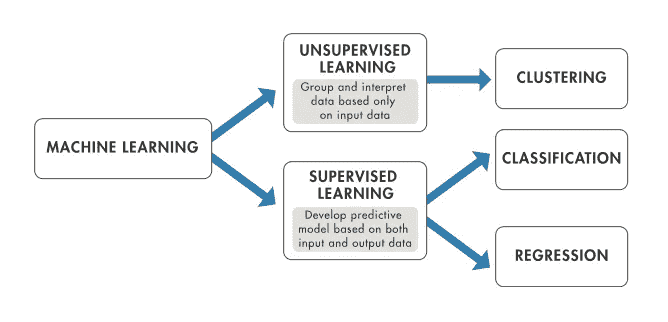
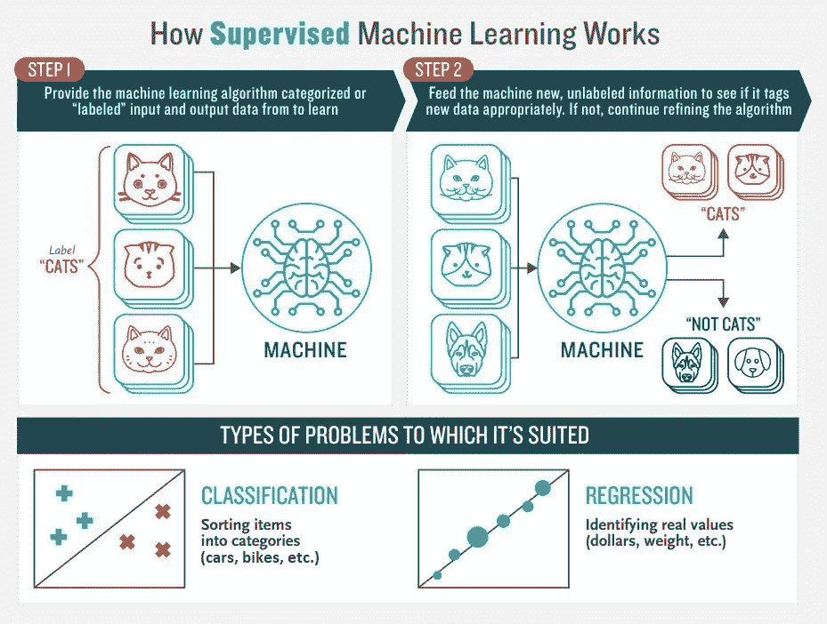

# 理解人工智能中的关键术语

> 原文：<https://medium.datadriveninvestor.com/understanding-key-terms-in-ai-415baa8b37a1?source=collection_archive---------1----------------------->

在阅读本文之前，请查看上一篇文章[人工智能简介](https://link.medium.com/7fW4NgGVZU)。

**人工智能 ABC**

**算法**是使用代码处理数据并给出输出的一系列步骤。

**偏向**是人类更倾向于某些事物的倾向。

**认知**是获取知识和理解以给出人类感知的过程。

看看这个来自谷歌的有趣视频:

机器学习和人类偏见

算法的效率、偏倚的考虑和认知的实现决定了输出的准确性。

**机器学习**

简单来说，机器学习就是使用数据来模仿我们所做的和理解的。

这里有各种类型的机器学习。

Image from mathworks.com

看看 ML 模型是怎么训练的。

**监督学习**

这是一种基于输入和输出数据开发预测模型的学习过程。它要求人们检查输出数据的准确性。

Image from boozallen.com

**无监督学习**

这是一种学习过程，包括自动分组、寻找模式和仅基于输入而非输出来解释数据。

Image from boozallen.com

**半监督学习**

处理大量的未标记数据依赖于一些标记数据。它节省了标记的时间，也提高了学习的准确性。

**强化学习**

软件代理采取行动寻找解决问题的最佳方案。这就像玩电子游戏一样，你要么掉进陷阱，要么被杀死。后来你学会了避免这种情况，并进入下一个阶段。

**机器学习是如何工作的？**

让我们考虑一个新生儿。整个世界对他来说都是陌生的。当他开始观察周围的事物时，他开始学习。眼睛和耳朵接收输入。大脑处理它。嘴以声音的形式输出，眼睛、手和腿以动作的形式输出。他需要大约 1 年的时间来获得完整的视力。慢慢地，他开始对我们的行为做出反应，比如叫他的名字、说话，他还会做自己的动作，比如玩耍、爬行和给我们指示东西。他周围发生的事情是发展和成长的数据。随着婴儿的成长，他学会说话，识别像苹果这样的东西和像猫、狗这样的生物。这就是**无监督学习**，因为在这里我们不会明确地告诉婴儿所有的事情，他更愿意通过观察来理解事情。

考虑一台计算机。它就像一个新生的婴儿。因此，数据被提供给它。当它遇到大量数据时，它会基于机器学习算法分析模式，并创建一个模型。通过将该模型与预期的应用程序联系起来，可以使用该模型来实现这一目的。它可以很容易地识别一个苹果，一只猫或一只狗，但不像一个正在成长的孩子，它不需要 2 或 3 年就能做到。它不需要太多的时间，只需要相关的数据和适当的算法。这是一个**监督学习的例子。**

这是一个由 T2 标记的数据的例子，用于一个由 T4 监控的大规模生产过程。这里我们已经知道了模式，即汽车。这些都是在不同环境下，不同角度，不同背景，不同光照条件下拍摄的照片。如果你提供足够的汽车图像数据，模型将能够根据一些共同特征识别出一个物体是一辆汽车，就像我们是如何做的一样。

Sample data of Different cars

**深度学习**

它是分析没有任何标签的非结构化数据(图像、文本、音频或视频)的过程，以找到匹配并提供必要的信息来识别模式。这是机器学习的一个组成部分。虽然通过提供数据来训练模型可以是**监督的**或**非监督的**学习，但是深度学习算法主要用于 U **非监督的学习**任务。

**人工神经网络**

人工神经网络由被称为**人工神经元**的连接单元或节点组成，它们是模仿生物大脑中的神经元。每个连接都可以用来在人造神经元之间传递信号。

神经网络根据输入和输出不断学习和改进自己。

**数据科学**

数据科学是使用各种工具、算法和学习目标来利用原始数据解决某个目的的过程。在数据科学方面有很好经验的人被称为数据科学家。

**数据分析**

数据分析是分析数据、获得可操作的见解并对其进行处理以获得必要结果的过程。数据可以用算法来处理。它属于数据科学。

公司有大量未被使用的客户或顾客数据。如果利用得好，它会带来好处并产生影响。

如果重点放在技术方面，那么执行分析的人就是数据分析师，而如果重点放在业务方面，他就是业务分析师。

**商业智能**

关键业务决策会受到数据分析的影响，这一过程称为 BI。

它可以在许多方面用于改善业务:

了解顾客和客户

营销和拓展

带来更高的收益

解决问题

预言；预测；预告

聊天机器人

聊天机器人是由人工智能驱动的聊天应用程序。它可以自动回复。

它从现有数据中学习。当遇到新数据时，它还会不断优化自己的准确性。它本质上是从过去学习，也可以进行预测。

用户界面–Messenger、WhatsApp 或独立的网络/移动应用程序

**自然语言处理**

自然语言处理是将文本转换成语音的过程，反之亦然。它处理文本以理解人类语言。让一台机器学习任何语言就像婴儿学习母语一样。

以前 Google Translate 习惯于逐字翻译，现在它已经变得更加准确，因为它可以根据上下文翻译整个句子。

你可以问你的问题，并通过向下滚动到回复来提供反馈，以帮助我写出更好的文章。

你也可以在 [LinkedIn](https://www.linkedin.com/in/rajesh-n) 上和我联系。

继续下一篇文章:[关于人工智能的神话解码](https://medium.com/datadriveninvestor/myths-about-ai-decoded-c0b9719245f?source=friends_link&sk=0635333fa46edbdef5843542a0c37bc9)