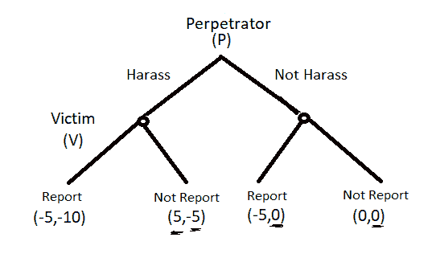

# 将#MeToo 理解为游戏

> 原文：<https://medium.datadriveninvestor.com/understanding-metoo-as-a-game-314e7ef5769b?source=collection_archive---------15----------------------->

#MeToo 运动在哈维·韦恩斯坦事件后势头迅猛，像野火一样蔓延到包括印度在内的世界各地。虽然许多女性都说出了她们的疤痕经历，但许多人认为这是一场闹剧，并愤怒地反对，男女都一样。很难理解为什么一个女人会愿意在几个月甚至几年后讲述自己的故事，而她在最初被骚扰时并不反对。博弈论可能会解决这个难题。

理解这种沉默是至关重要的，也是为什么这场运动对防止未来发生如此骇人听闻的罪行如此重要。首先，要理解为什么女性，或者事实上，任何被猥亵或性侵犯的人，都不想报案。我们想到的最明显的答案是他们害怕后果。他们举报的风险太大，因为他们害怕举报带来的社会、心理和实际后果。然而，还有更阴险的原因。在许多情况下，犯罪者往往是有权力的人，或者是他们在工作中的长辈，甚至是与他们过于亲近的人，比如亲戚。

如果受害者敞开心扉，他们信任的人通常会避开他们，很多时候，他们甚至不知道发生在他们身上的事情是否构成了骚扰。毕竟，骚扰可能会被误解为一种戏谑的姿态，或者被肇事者误解为无害。这只是冰山一角，有太多的原因在起作用。从经济角度来看，报告或公开成本太高。

为了便于解释，假设游戏中有两方:犯罪者(P)和 1 号受害者(V1)。假设双方都是理性的，P 有骚扰的意图，而 V1 是一个无法阻止骚扰的潜在个体。他们可以采取的行动有:

*   p 可以骚扰也可以不骚扰
*   v 可以报告也可以不报告

现在，把它公式化为一个游戏会产生有趣的结果。在当前时间段，游戏看起来有点像这样:

我们用一个叫做逆向归纳法的概念来解决这个博弈。在这种情况下，当犯罪者骚扰时，受害者报告和不报告的收益分别是-10 和-5。这是以这样一种方式制定的，即假设上述报告的成本对个人来说太高而无法报告。显然，在这种情况下，受害者会选择不举报骚扰，而犯罪者最终会得到 5 英镑的回报。

如果肇事者没有骚扰，受害人被认为对报案和不报案无动于衷。(这里需要注意的是，在这种情况下，正如一些人可能会争辩的那样，报案可能对受害者有利，因为他们可以通过谎报犯罪获得更多的效用。然而，为了简单起见，我不考虑这种情况)。由于受害者在报告和不报告之间是无差异的，我们可以假设她以相等的概率随机选择，因此犯罪者的预期收益是-2.5。这个博弈的纳什均衡是当犯罪者骚扰而受害者不举报时双方都得到 5 和-5 的收益。

展望未来，受害者将在她的余生中承受骚扰的心理成本，并可以选择在未来报告犯罪，这可以通过赎回的方式增加她的回报，但会减少犯罪者的回报。不报告的负面心理回报每年都会打折扣，这意味着负面回报逐年下降。但是受害者从举报中获得的总收益仍然没有不举报的多。

数学上，

V1 的回报是:-10 + (-10)δ + (-10)δ^2 + (-10)δ^3 + …

V1 不报告的收益:-5 + (-5)δ + (-5)δ^2 + (-5)δ^3 + …

可以解出几何级数，得出不报告的总收益为-5(1/1-δ)。为了简单起见，我们可以假设这个贴现因子等于 1/2，这样不报告的收益(-5*2 = -10)就大于报告的收益(-10*2 = -20)。此外，请注意，在任何时候，受害者都可以从报告中获得一些积极的回报，但这还不足以将决策转移到报告上。(可以是 0 到 10 之间的任何值，再说一遍 5)。所以从报案来看受害者最多能得到-15。

现在，过了一段时间，犯罪者骚扰了其他人(V2)。然而，这位受害者举报的社会成本并不高，她举报了肇事者。这可以被视为#MeToo 运动的兴起，有人大声反对骚扰。这有双重影响:它减少了犯罪者的收益，也减少了为受害者报案的社会成本(V1)。社会成本，早些时候是-10，现在可以减少。这将意味着，在那个时期，受害者实际报告犯罪是有意义的，并进一步影响犯罪者的回报。

这是一个非常简化的游戏，可以通过添加不同类型的犯罪者和受害者的不确定性来使其更加真实。但是，这个简单的游戏足够强大，可以为#MeToo 运动这样的重要现象提供逻辑解释。同样的论点可以延伸到世界各地的其他运动，如#BlackLivesMatter、#ELSIceBucketChallenge 等。

更重要的是理解这种运动如何影响犯罪者的未来行为，以及这种影响会持续多久。但这并不是这篇文章背后的动机，而是留给读者去探索。