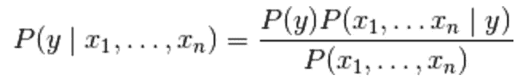
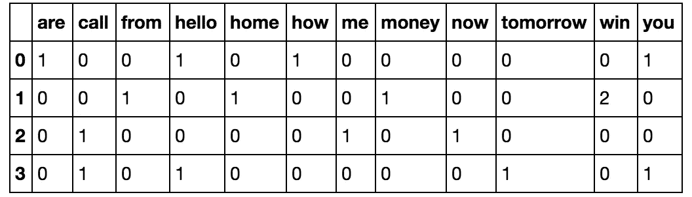

# 理解朴素贝叶斯及其在文本分类中的应用

> 原文：<https://medium.datadriveninvestor.com/understanding-naive-bayes-and-its-application-in-text-classification-99c38e739f88?source=collection_archive---------0----------------------->

在这篇文章中，我们将试图以一种简单的方式来理解什么是朴素贝叶斯，它是如何工作的，以及我们如何应用朴素贝叶斯分类器来将文本或评论分类为“正面”或“负面”，我们将通过一个电影评论的案例研究来工作。

**首先，什么是朴素贝叶斯？**

贝叶斯定理是由 Bayes 牧师开发的最早的概率推理算法之一(他曾用它来尝试和推断上帝的存在)，对于某些用例仍然表现得非常好。

最好用一个例子来理解这个定理，让我们假设你是一个推销员，你想帮助一个顾客选择一辆汽车，这个顾客不知道要买什么，所以你的工作是帮助他选择一辆，现在，你将开始问他这样的问题:

*   你的预算是多少？
*   你最喜欢哪个品牌？
*   你在找新车还是二手车？等等..

因此，根据他的回答，我们可以将它们视为汽车的特征，如价格、品牌、年龄……如果一辆汽车符合所有条件，达到了在你脑海中跨越选择门槛的水平，你就可以采取行动，提出一个选择。

贝叶斯定理的工作方式与我们根据某些相关事件(品牌、价格、新旧)的概率计算事件(候选汽车)的概率的方式相同..等等)。

需要考虑的一件事是这些特性之间的独立性。例如，如果一辆丰田汽车有一个特定的价格，那么购买该汽车的可能性就不如购买价格大致相同的其他品牌汽车的可能性大。进一步说，这里有两个我们正在考虑的特征，品牌和价格。假设我们单独查看这些功能，我们可以设计一个模型，标出所有符合客户预算的品牌。然而，很可能我们会有很多误报，因为很有可能其他品牌的汽车也会在预算之内。因此，通过考虑品牌和价格特征，我们肯定会得到更准确的结果，知道哪些是潜在候选人，哪些不是。

这是定理中“幼稚”的一点，它认为每个特性都是相互独立的，但情况可能并不总是如此，因此这可能会影响最终的决策。

朴素贝叶斯定理背后的数学原理

如果你谷歌一下朴素贝叶斯定理，你首先会发现的是这个公式:

根据这些定义:

`P(A)`是 A 独立发生的先验概率。

`P(B)`是 B 独立发生的先验概率。

`P(A|B)`是给定 b，A 发生的后验概率

`P(B|A)`是 B 发生的似然概率，给定 a。

这是已知的简单朴素贝叶斯公式，用于计算给定事件 b 的事件 A 的概率。

但在现实世界中，事情比我们上面看到的要复杂一些，在大多数情况下，我们使用朴素贝叶斯定理来计算一个事件给定多个其他事件的可能性。为了理解这一点，我们将用一个例子来说明。

假设我们有两份不同的报纸,《彭博时报》和《纽约时报》,我们知道每份报纸包含单词“股票”和“市场”的概率如下:

*   `P(S|BL)`彭博拥有世界【股票】的概率:0.7
*   `P(M|BL)`彭博拥有世界【市场】的概率:0.2
*   `P(S|NT)`纽约时报拥有世界【股票】的概率:0.1
*   `P(M|NT)`纽约时报拥有世界“市场”的概率:0.1

让我们假设阅读彭博报纸`P(BL)`的概率是`0.5`，阅读纽约时报的概率也是`P(NT) = 0.5.`

考虑到这一点，如果我们必须找出彭博出现“股票”和“市场”这两个词的概率会怎么样呢？这就是朴素贝叶斯定理发挥作用的地方，因为我们正在考虑两个特征，“股票”和“市场”。

现在我们可以定义朴素贝叶斯定理的公式了:

这里，`y`是类变量，或者在我们的例子中是报纸的名称，而`x1`到`xn`是特征向量，或者在我们的例子中是单词。该定理假设每个特征向量或单词(`xi`)彼此独立。让我们将这个公式应用到上面的例子中，计算彭博拥有单词 stocks 和 market P(BL|S，M)的概率，为此我们需要计算

P(BL|S，M) = (P(BL) * P(S|BL) * P(M|BL)) / P(S，M)。

除了 P(S，M)之外，所有的值都是之前给出的，P(S，M)是“股票”和“市场”这两个词出现在报纸上的概率。

P(S，M)=(P(BL)* P(S/BL)* P(M/BL))+(P(NT)* P(S/NT)* P(M/NT))

现在我们都有了，只要用它的值替换每个概率，结果就是 P(BL|S，M) = 0.933。并且计算纽约时报具有单词股票和市场 P(NT|S，M)的概率，足以计算这个公式 1-P(BL|S，M)=0.067。这个结果似乎是合乎逻辑的，因为彭博报纸更关注金融世界。(免责声明:所有这些值都是假设，不反映任何研究)。

**朴素贝叶斯在现实世界中的应用。**

在这一部分，我们将使用 IMDB review 的真实世界[数据](https://www.kaggle.com/utathya/sentiment-analysis-of-imdb-reviews/data)，将电影评论分为“正面”或“负面”。

在我们跳到代码之前，我们需要知道单词包(BoW)概念，这个术语用于指定需要处理的具有“单词包”或文本数据集合的问题。BoW 的基本思想是获取一段文本，并计算该文本中单词的频率。值得注意的是，BoW 概念单独处理每个单词，单词出现的顺序无关紧要。我们可以将一组文档转换成一个矩阵，每个文档是一行，每个单词(标记)是一列，相应的(行，列)值是每个单词或标记在该文档中出现的频率。

例如:

假设我们有如下 4 个文档:['你好，你好！'，‘赢钱，从家里赢。’、'现在给我打电话'、'你好，明天给你打电话？']

我们的目标是将这组文本转换为频率分布矩阵，如下所示:

为了解决这个问题，我们将使用 sklearns 计数矢量器方法，该方法执行以下操作:

它将字符串标记化(将字符串分隔成单个单词)，并为每个标记提供一个整数 ID。它计算这些标记的出现次数。

CountVectorizer 方法自动将所有标记化的单词转换为小写形式，这样就不会对“he”和“He”这样的单词区别对待。它使用默认设置为 True 的小写参数来实现这一点。

它还会忽略所有标点符号，以便单词后跟一个标点符号(例如:“你好！”)与不带标点符号前缀或后缀的相同单词(例如:“hello”)没有区别。它使用 token_pattern 参数来实现这一点，该参数有一个默认的正则表达式，该表达式选择 2 个或更多字母数字字符的标记。

第三个需要注意的参数是 stop_words 参数。停用词是指一种语言中最常用的词。它们包括像' am '，' an '，' the '等词。通过将该参数值设置为 english，CountVectorizer 将自动忽略在 scikit-learn 的内置英文停用词列表中找到的所有单词(来自我们的输入文本)。这是非常有用的，因为当我们试图找到某些关键词时，停用词会扭曲我们的计算。

这里有一个[链接](https://github.com/khalidbouziane/Naive-Bayes-for-text-classification/blob/master/NB.ipynb)到代码。

**结论**

与其他分类算法相比，朴素贝叶斯的一个主要优势是它能够处理大量的特征。在我们的例子中，每个单词都被视为一个特征，有成千上万个不同的单词。此外，即使存在不相关的特征，它也能很好地执行，并且相对不受它们的影响。它的另一个主要优点是相对简单。“朴素贝叶斯”开箱即用，很少需要调整它的参数，除非通常在数据分布已知的情况下。它很少过拟合数据。另一个重要的优势是，对于它可以处理的数据量来说，它的模型训练和预测时间非常快。总而言之，朴素贝叶斯真的是算法中的瑰宝！

*参考:Luis Serrano，机器学习导师。(Udacity)*