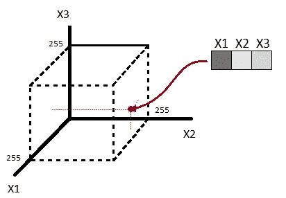
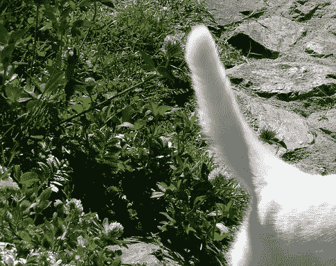
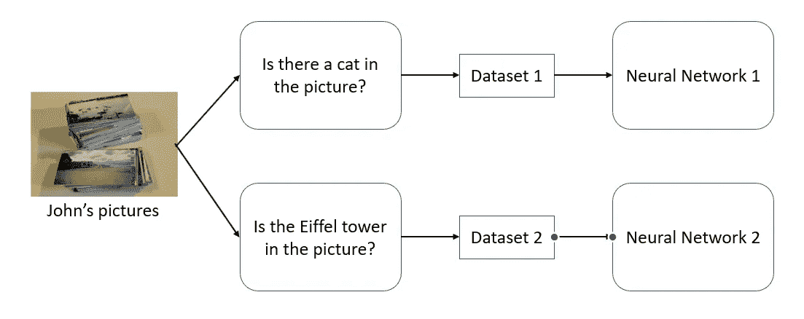

# 理解神经网络-第 1 部分

> 原文：<https://medium.datadriveninvestor.com/understanding-neural-networks-part-1-657cc52e9a4c?source=collection_archive---------5----------------------->

神经网络彻底改变了我们解决复杂问题的方式，这些问题用其他技术无法解决。尽管我们可以让它们工作，但由于它们复杂的数学架构，很难理解它们为什么工作(或者更重要的是，它们为什么不工作)。谷歌的阿里·拉希米将机器学习比作炼金术。尽管 Yann Lecun 强烈反对这种说法，但他在最近的一次采访中表示，“有各种各样的技巧可以让 backprop 工作，这仍然有点像一种黑色艺术——但现在我们有了一个配方。如果你按照食谱做，每次都会奏效。”在这一系列的博客文章中，我将尝试解释神经网络的内部工作原理，以便对幕后发生的事情有一个更好的直觉。

这一系列的博客文章将分为两部分。第一组博文“理解神经网络”将更好地理解神经网络问题域。我们将给出神经网络正在做什么以及它在什么条件下运行的完整解释。我们将做很少做的事情，并表明神经网络实际上是一个近似器。我们将展示神经网络试图模拟为一组给定数据点生成标签的功能。最后，我们将举例说明神经网络失败的地方和原因，并给出可以做些什么的想法。

在这个系列的第二部分“神经网络的机制”中，我们将深入研究神经网络的数学。我们将展示神经网络如何分割输入空间(或者更确切地说是分割它)。我们将会看到这些点是如何在每一层中重新映射的，我们甚至会计算最终的函数并看到不同的约束。我们将研究小型简单全连接网络，使用 ReLU 作为分类问题的激活函数。即使如此，也将表明一些相同的概念适用于更复杂的体系结构和激活功能。

所以让我们开始吧

# 作为逼近器的神经网络

由于神经网络的设计是受人脑的启发，所以很容易忘记神经网络归根结底是一个数学函数。在这里，我们将以稍微不同的方式来看待神经网络。我们将采取“缩小”的方法，观察整个神经网络的功能，以及它如何跨越整个输入空间，而不是观察单个神经元及其所学的内容。这种方法非常面向输入空间。这意味着我们更多地关注输入空间的不同区域。更确切地说，我们将关注数据点如何在输入空间中分布。这将有望给读者在神经网络方面更好的洞察力和直觉。

所以我们声称神经网络是一个近似器。这是什么意思？这意味着神经网络试图逼近一个函数。问题是它试图逼近什么函数？在什么条件下？它是如何做到的？有哪些局限性？为了找到这些问题的答案，我们必须更好地理解我们所处的问题领域。我们将用一个例子来说明这一点。

假设约翰正在巴黎度假。白天他拿着相机不停地拍照，晚上他在外面吃饭，所以没有时间拍照。在他的一周长假后，他有了大量巴黎白天的照片，他决定通过上传照片到网上与世界分享。

John taking pictures of Paris during the daytime

让我们像电脑看照片一样看照片。假设 John 的相机不好，照片是 320x240 的灰度图像。所以每张照片都是一个 76800 (=320x240)长的向量，值在 0 到 255 之间。这些点在输入空间中会是什么样子？如果相机只有 3 个像素长，我们的输入空间将是一个 3 轴输入空间。那么每张图片将是输入空间中 255×255×255 立方体内的一个点。

Three pixel grayscale image in a three dimensional input space

如果是这样的话，我们可以想象约翰的每一张照片都是一个 76800 维的超立方体中的一个点。

我们应该注意到一些重要的事情。总共有有限数量的可能图片(确切地说是 256⁷⁶⁸⁰⁰)。在所有这些点中，即使不是大部分，这些点中的一些甚至不是真实的图片，而是随机噪声。这些是用约翰的相机拍不出来的“照片”。换句话说，如果我们说每张图片都是输入空间中的样本，那么我们可以肯定，使用约翰的相机来捕捉这些图像(对这些点进行采样)在物理上是不可能的。

如果我们只看约翰拍的其中一张照片，正如我们之前展示的，这张照片是输入空间中的一个点。如果我们看那个点附近的点，或者离它很近的点呢？我们将会看到它们所代表的图片与原始图片只有一点点不同。一个人看着这些照片会说它们本质上是同一张照片。因此，如果我们要建立一个神经网络，我们希望该网络对该点周围的所有点给出相同的结果(只要我们不怀疑太远)。所以在输入空间中彼此足够接近的点本质上是同一张图片。反之则不然。如果我们有两张图片，其中第二张图片与第一张图片相同，只是所有点都向右移动了一个像素。它们本质上是相同的图像，但是在输入空间中这些点不一定是接近的。

最后，我们会注意到，John 只是有选择地对输入空间的不同区域进行采样。他的照片是在白天对巴黎进行采样(可能很多像素会是亮高值)。这些点大概离北京晚上的图片都挺远的(大部分像素会是暗低值)。

我们可以把 256⁷⁶⁸⁰⁰理论图片分成三组。第一组是输入空间的区域，它们是相机无法产生的随机噪声图片。这些是输入空间中在训练和推断阶段都不会采样的区域，因为摄像机不可能对它们进行采样。保留合法图像的剩余区域我们可以进一步分为两组。首先是输入空间中靠近约翰白天拍摄的巴黎照片的区域。最后一组是输入空间的所有剩余部分。北京夜晚的图片就属于这一组。它以后会回来的。

# **创建数据集**

我们决定用约翰的照片来建立一个能做一些事情的神经网络。为了做到这一点，图片是不够的。我们需要一个带标签的数据集。假设我们想要建立一个神经网络，能够对照片中是否有猫进行分类。为了创建这个数据集，我们雇佣了 100 万人。我们要求每个人给每张照片贴上标签，如果照片里有猫的话。因此，对于约翰的每一张照片，我们得到了具有一百万个分类结果的数据集。单个图像的一百万个标签不一定是相同的。这可能是因为有人给图片贴错了标签，但也可能是因为我们雇佣的人不一定意见一致。可能猫藏起来了或者很难确定图中有猫。也许在图像中只能看到猫尾巴的边缘。在这种情况下，它更像是一个哲学问题:照片中的猫尾巴是一只猫吗？

Is there a cat in the picture?

我们可以很容易地问这百万人任何其他问题，并创建一个完全不同的数据集，可以用来教另一个神经网络完全不同的东西。

最后，我们将使用这个数据集来建立一个神经网络。神经网络的目的是从本质上取代这 100 万人。这意味着，如果我们有一张新照片，并通过神经网络输入，我们应该得到的答案应该与我们问 100 万人照片中是否有猫的平均值相同。

The input pictures can be used to create different data sets and different neural networks

让我们更深入地了解一下我们是如何构建这个神经网络的。我们获取数据集，并使用[反向传播](https://en.wikipedia.org/wiki/Backpropagation)进行训练。因此，每次我们浏览所有数据点时，我们都会改变神经网络的权重，以便网络的输出更接近数据点的输出。我们只看约翰的一张照片。对于该特定输入点，我们有一百万个数据点条目(图片)。对于该特定输入，所有将该图像分类为包含猫的条目将试图将我们的神经网络的输出拉向 1，而所有分类为没有猫的条目将试图将其拉向 0。在运行足够的时期的反向传播之后，对于输入中的特定图片，所得到的神经网络输出应该是所有一百万个分类器的平均值。因此，如果 99%的分类器同意图片中有一只猫，神经网络的输出理想地应该在 0.99 左右。在实践中，情况可能并非如此，神经网络仍然可以给我们良好的结果，但理想情况下，这是我们正在寻找的。

这一切都很好，但在现实生活中，我们不可能让 100 万人给每张图片贴标签。这是真的，但是这个理论上的例子给了我们一些基本的直觉，让我们了解正在发生的事情。真实数据集是如何创建的？假设我们有一个分布在整个输入空间的函数。该函数为输入空间中的每个可能的图片(包括 256⁷⁶⁸⁰⁰可能的理论图片)回答以下问题。对于每张图片，它都会回答:“如果我把这张图片给一个做分类的人，他们会返回图片中有一只猫的概率是多少？”这个函数是一个非常重要的函数。我们最终会看到，这实际上是神经网络试图模仿的功能，至少在输入空间的某些部分。

但是这个函数如何帮助我们创建一个带标签的数据集呢？为了创建数据集，我们在输入空间的某些点对该函数进行采样。在我们的例子中，这些点是约翰的照片。对于每个输入点，我们得到一个概率。我们用这个概率为这个数据点画一个标签。这就是我们如何最终建立一个完整的数据集。

为了更好地让你相信这个概率函数确实存在，这里有另一种方式来看训练数据是如何创建的。为了给某张图片创建一个标签，我们从一百万个给数据贴标签的人中随机挑选一个。然后，我们将它们的分类结果作为该图片的标签。随机抽一个人，用他们的标签，本质上和求得到某个标签的概率，然后根据那个概率抽一个标签是一样的。

对这个概率函数有一些约束，以便它甚至有可能使用神经网络来解决分类问题。其中一个限制是这个函数必须是相对平滑的，至少在我们将要采样的输入空间区域。这是必要的，因为如果函数太不稳定，知道某一点的标记将不会帮助我们理解相邻点或非常接近的点的标记。在这种情况下，我们会说这个问题不能很好地概括。这不是唯一的限制，我们将在以后的文章中讨论更多的限制。

# 使用数据集来近似

然后，我们使用这个数据集来尝试近似这个概率函数。因为我们假设这个概率函数是相对平滑的，所以分散在输入空间中的图像以及它们的标签将帮助我们重建这个概率函数。为了重构该函数，我们使用了一种称为曲线拟合的技术(这是反向传播本质上要做的)。我们将在接下来的博客文章中涉及更多。

我想指出的是，输入分布，约翰拍摄的照片，完全独立于分类和我们正在做的其他事情。约翰是独立的，不管发生什么事，他都可以照任何他喜欢的照片。我们已经可以开始看到哪里可能会出现问题。假设约翰继续他的假期，飞到中国北京。在北京时，他参观了北京的一个夜市。像以前一样，他拍了一堆照片，上传到网上。假设我们决定拍摄这些照片来测试我们的神经网络。我们已经确定，北京在夜间的图像可能与巴黎在白天的图像非常不同，并且占据输入空间的不同区域。我们将会看到，神经网络在输入空间的这一部分会给出非常糟糕的结果。结果输出甚至可能超出 0–1 的范围，这意味着我们可能会得到大于 1 的概率或没有意义的负值。我们会在下一篇博文中理解为什么会这样。但是神经网络给出不好的结果的事实是有意义的。根据在训练阶段输入神经网络的数据，理论上神经网络不可能在其输入分布之外给出可靠的结果。让我们解释一下。神经网络只看到图片和标签的例子。它不知道我们问做分类的人的问题。我们用来训练神经网络的问题是“照片里有猫吗？”，但也很可能是“白天照片里有猫吗？”。这两个问题会为 John 的巴黎日照片生成相同的数据集。如果我们从这个数据集建立一个神经网络，然后在北京的夜间图片上查询它，神经网络会返回什么答案？由于神经网络无法从给定的数据中知道分类问题，因此它无法返回正确的答案。

这给了我们一个线索，与普遍的看法相反，神经网络并没有学习猫是什么。相反，神经网络试图找出给定图像是否与它在训练数据中看到的另一个图像相似。它正在使用这些图像，这些图像在输入空间中与它相对接近，以便尝试找出如何对该点进行分类。这就是为什么如果我们试图对远离我们的输入分布的点进行分类，我们会发现神经网络不能很好地工作。

如果你记得我们谈论过输入空间被分成三组:随机噪声的输入空间区域，同样靠近训练图像的区域和所有其他区域。在随机噪声的区域，我们并不真正关心我们的神经网络会给我们什么结果，因为我们假设我们不会从这些区域采样。然后我们有不接近训练数据的区域。这些数据点超出了输入分布的范围。这些是我们必须小心的区域，因为网络会返回一个结果，但我们无法知道结果是否正确。使用神经网络来评估这些区域中的函数被称为外推，并且结果是不可靠的。对于我们有训练图像的输入空间的区域(作为输入分布的一部分的区域)，我们应该得到不错的结果，因为我们建立了神经网络以在这些区域中很好地执行。尽管如此，在这些区域中可能有一部分神经网络不能很好地执行。这与输入分布有关。例如，如果在某些区域，我们的输入分布中的点非常少。你可以用约翰的巴黎图片和北京夜市的一张图片来想象火车网络。这种新的神经网络不会突然在北京夜市图片上表现得很好。

这只是导致神经网络失败的一个例子。我们将看到，在推理阶段保持与训练阶段使用的分布相同是非常重要的。在接下来的帖子中，我们还将讨论更多的条件，以便让神经网络正确运行。

我们现在开始对正在发生的事情有了更全面的了解。理解我们的神经网络在问题域中运行是至关重要的。神经网络非常强大，但也有其局限性。他们不能解决所有的问题。此外，为了使神经网络工作，必须满足某些条件。

# 总结事情

我们从由我们的特征决定的输入空间开始(在我们的例子中是所有可能的图片)。在这个输入空间的顶部，有一个未知的概率函数，它回答问题“对于一个给定的输入，它被分类为(输入任何问题)的概率是多少？”。这是我们理想地希望我们的神经网络模拟的功能，至少对于我们将要采样的输入空间的区域。然后，我们根据给定的输入分布(John 的图片)，在输入空间的点中对该函数进行采样。对于这些点中的每一个，我们根据这个函数给出的概率画一个标签。这就是我们如何得到一个数据集。然后，我们获取这个数据集，并使用它来训练我们的神经网络，希望我们得到一个在给定输入分布的输入空间区域中足够接近未知概率函数的函数。

在下一篇文章中，我们将讨论训练中发生的事情，我们将看到曲线拟合是如何完成的。敬请关注