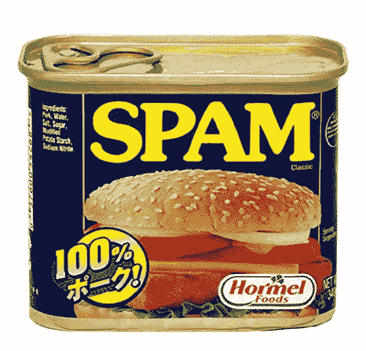
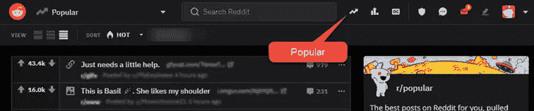
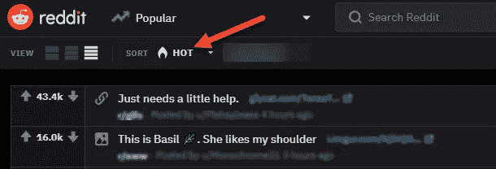

# 了解 Reddit 因果报应

> 原文：<https://medium.datadriveninvestor.com/understanding-reddit-909c6821c62e?source=collection_archive---------0----------------------->

Reddit 是所有主题的伟大的社交媒体平台。我经常用它来查看感兴趣领域的新闻，以及发表帖子和评论。

Reddit 由亚历克斯·奥哈尼安和史蒂夫·霍夫曼于 2005 年 6 月创建。多年来，它已经发展成为世界上最大和最常用的网站社区之一。

当我第一次开始使用 Reddit 时，我发现它非常混乱和复杂。

我写这篇文章是为了帮助新用户或现有用户理解基础知识，并从中获得最大收益。

在这篇文章中，我不会涵盖所有领域，只关注'**karma**'(Reddit 声誉系统)；它是什么，它如何影响你的 Reddit 体验。您可以在侧边栏顶部或您的个人资料页面查看您的因果报应。Karma 在 Reddit 平台之外没有任何价值，纯粹是一个内部工具。

虽然一些 Reddit 用户认为 karma 是一个噱头，无视它的价值，但它可以也确实会影响你在平台上发布和评论的声誉和能力。

"考虑到我的评论或帖子没有冒犯性或垃圾内容，为什么我的帖子会被删除？"

如果你的因果报应很低，你可能会发现评论和帖子会被版主自动或手动删除。一些 subreddits(社区)，将只接受来自那些有最少业力的人的评论和帖子。

Reddit 引入 karma 作为对抗垃圾邮件和机器人活动的方法。你可以把它看作一个声誉系统，或者衡量你对更大的 Reddit 社区的贡献。你的业力越高，你的声望越高，你在平台上被允许的自由就越多。

Karma 是用一种只有 Reddit 自己完全理解的复杂算法来应用的，其中包括许多终端用户不知道的因素。这种算法经常改变，以跟上当前的趋势。然而，就我们而言，评论和帖子都是因果报应。当你的一个评论或帖子被“投票赞成”时，因果报应就适用于你的账户。同样，当你的评论或帖子被“否决”时，你就失去了因果报应。

需要注意的一点是“投票模糊化”。为了打击平台上的机器人、垃圾邮件发送者、作弊和投票操纵，Reddit 掩盖了你的实际分数。如果你监控你的业力，你可能会注意到总数增加或减少了几个点。这样做是为了愚弄那些利用投票机器人操纵系统的人。不过，这没什么好担心的，因为你的“实际”分数总是被准确记录的，尽管在查看单个帖子时可能并不明显。

有 Reddit 社区致力于增加因果报应，但我不能认可这些。因果报应应该永远合法诚实地获得。

我要给你的一个建议是，确保你定期在不那么“排外”的社区上发表评论和帖子，比如电视节目和电影，或者那些限制较少的“大众”社区。如果你的目标是加密货币等独家社区，你的评论和帖子被删除的可能性要大得多。

简而言之，在进入排他性/限制性较低的社区之前，先在排他性/限制性较低的社区建立你的业力。

虽然我们没有人深入了解这个系统是如何真正工作的，但这里有一些提示，可以帮助你增加你的因果报应，开始你的 Reddit 之旅。

*   小心你的措辞。确保您尝试并限制使用“销售”、“报价”或任何其他可能被解释为销售或垃圾邮件的词语。
*   **不要卷入争论，保持礼貌。**记住，我们的目标是鼓励其他 redditors 投票支持你的评论。陷入争论或捣乱可能会导致反对票多于赞成票，并可能让你被禁赛。
*   **活跃在拥有大量用户的热门子街道上。**点击网页顶部的“热门”按钮。在子编辑区的右上角，检查订户和当前活动用户的数量。经常评论热门的子话题和主题可能会比不太忙的论坛更能吸引你的注意力。

*   **回复热门标签上的帖子。**登录您的帐户后，您会在 Reddit 顶部附近找到该标签。此选项卡显示您订阅的子主题中最受欢迎的主题。由于有这么多人在这些帖子上互动，你的评论可能会获得更多的浏览量和潜在的更多赞成票。

*   **用有趣、相关的模因进行评论。在一个繁忙的帖子上发布的完美迷因可以在很短的时间内获得数百次的支持。**
*   **经常检查子编辑规则。**许多子社区都有需要遵守的规则。在发帖/评论之前，一定要检查规则，确保你的帖子不会被删除，或者更糟的是被封禁。