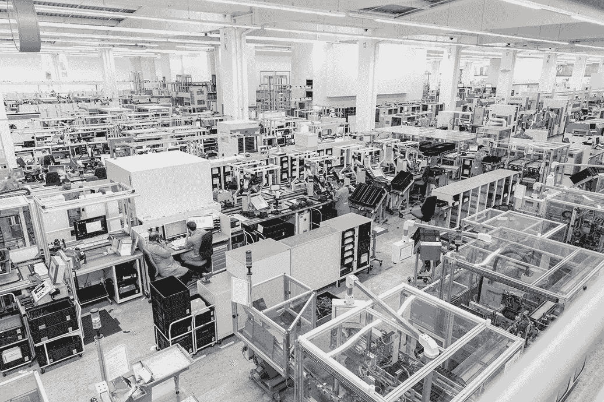

# 数字双胞胎如何改变制造业

> 原文：<https://medium.datadriveninvestor.com/understanding-smart-manufacturing-e61268c5038e?source=collection_archive---------5----------------------->

## 数字双胞胎和其他数据驱动的智能技术正在提高效率和削减成本

The Amberg factory combines the real and virtual worlds: products communicate with machines, and all production processes are optimally integrated and controlled via IT. (Photo: Siemens AG)

如果医生能够访问你的数字克隆体，掌握你的饮食、生活方式和当前环境的实时数据，她可以给你开处方，治疗你不知道自己患有的疾病，甚至可能在你感到不适之前。医学可能还没有到达那一步，但是所谓的“数字双胞胎”在[智能制造](http://www.iec.ch/whitepaper/futurefactory/?ref=extfooter)的世界里是非常现实的。

工业部门正在从数字化转型过程中受益。由于“虚拟”和“真实”的结合提供了价值链的完整视图，工厂正以更少的资源更快、更高效地制造产品。由于廉价传感器、可靠数据传输网络以及用于处理和决策的智能分析系统的普及，像数字双胞胎这样的技术正在获得牵引力。国际标准在很大程度上促进了这一点。它们不仅传播了行之有效的最佳做法，还消除了以有竞争力的价格从其他国家寻找和获得可靠部件的障碍。

 [## 今年值得关注的人工智能趋势|数据驱动的投资者

### 预计 2019 年人工智能将取得广泛的重大进展。从谷歌搜索到处理复杂的工作，如…

www.datadriveninvestor.com](https://www.datadriveninvestor.com/2019/02/19/artificial-intelligence-trends-to-watch-this-year/) 

这就是为什么越来越多的公司现在能够使用数字双胞胎来提高质量和安全，同时降低成本。[根据 Gartner](https://www.gartner.com/newsroom/id/3868363) 的一份报告，近一半正在实施物联网的组织要么已经在使用，要么计划很快开始使用数字双胞胎。前者的一个很好的例子是德国阿姆贝格的西门子工厂，它有一个在各方面都完全相同的数字孪生工厂。他们用它来规划生产过程和编程机器，设计产品和测试产品，并促进预防性和预测性维护。

预防性维护是指定期维修机器，以使其在使用寿命期间性能更好，并避免潜在的灾难性故障。尽管定期维护可以降低风险，甚至可以延长机器的使用寿命，但事情仍然可能出错。熟悉[墨菲定律](https://en.wikipedia.org/wiki/Murphy%27s_law)的人应该不会感到惊讶，机器在维护期之间特别脆弱。

众所周知，精心维护的机器偶尔会出故障，同样，经常锻炼和服用维生素补充剂的人有时也会生病。至少对机器来说，解决方案是持续的、24 小时的监控，称为预测性维护。智能传感器使实时传输数据和智能分析成为可能，从而做出明智的决策。

预测何时需要维护的能力最大限度地减少了对制造过程的干扰，并使工程师能够了解他们的机器如何影响产品的公差、应力和设计。数字双胞胎使制造商能够实时研究产品在其整个生命周期中如何制造、操作和工作的所有元素和动态。

回到西门子在安伯格的工厂，只有当有了一个高效的工作模式，所有的问题都解决了，实体工厂才开始生产。这项技术使西门子公司得以将产量扩大到每年 1500 万台，自 1989 年以来增长了 13 倍，而无需雇用更多的人员或搬进更大的厂房。据西门子称，该工厂的缺陷率接近于零。考虑到该工厂在同一条生产线上生产一千多种不同的产品，这一点就更加引人注目了。

数字双胞胎并不局限于智能制造领域。一位领先的石油专家[声称](https://www.energyvoice.com/oilandgas/173986/digital-twins-can-get-8-more-oil-from-a-well-says-premier-oil-specialist/)创造一项资产的数字复制品可以显著节约成本并提高产量。在其他地方，越来越多的主要基础设施资产拥有数字双胞胎。例如，在澳大利亚，超过 2000 个传感器监测悉尼港湾大桥[的物理完整性，以便将其与数字孪生](https://www.iiconsortium.org/pdf/Smart_Factory_Applications_in_Discrete_Mfg_white_paper_20170222.pdf)对准。

这座桥只有一公里多长，但是最大的数字孪生物体可能是在瑞士日内瓦的欧洲核子研究中心发现的。大型强子对撞机(LHC)长达 27 公里的回路不仅是世界上最大的粒子加速器，也可能是有史以来最大的机器。LHC 的每一个部件都作为数字孪生件登录在企业资产管理(EAM)系统中。