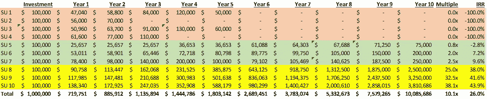
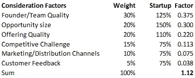

# 理解初创企业估值

> 原文：<https://medium.datadriveninvestor.com/understanding-startup-valuation-a393f6fadc6f?source=collection_archive---------1----------------------->

我经常被初创公司的创始人问到，他们中的大多数人几乎没有商业背景，如何在他们的企业发展过程中整体考虑融资和初创公司估值。许多人苦于没有为投资者会议做好充分准备，也无法为感兴趣的风险投资公司(VC)量化他们的风险价值(或估值)。一些人为此付出了沉重的代价。我一年前遇到的一位创始人抱怨说，由于糟糕的融资策略和一贯低估他的初创公司，他在自己公司中只有 11%的股权(低于初始融资后的 85%)，从而允许每个新投资者大幅稀释创始人的股份。

你不能让有限的创业金融知识破坏你在创业公司投入的难以置信的努力和精力。

所以还是从基本面开始吧。在这篇文章中，我们将涵盖初创公司估值的基础知识，包括融资的*阶段，风投如何衡量自己，如何评估你的初创公司，以及如何最大化你的初创公司的估值*。

# **融资阶段**

在高层次上，人们可以将融资回合合并为三个主要类别:种子和天使阶段、成长阶段和退出阶段。

**种子&天使阶段**——关于“诞生”这个想法所需的融资，这一点不言自明。

*   种子基金——大多数初创公司都是由创始人自己投资和/或在朋友和家人的帮助下投资的。
*   **天使投资** —种子投资者和其他投资者可能会投入更多资金，让创意超越诞生，进入营销和客户获取领域。

**增长阶段** —这一阶段需要资本来试验商业模式，扩大业务规模，并将运营提升到可行的临界质量。一般来说，风险投资在提供增长资本方面发挥着关键作用。

*   **首轮融资** —这是成长阶段的早期阶段，投资者提供资本，在市场上测试初步审查的商业模式。通常首轮融资可能会融资 200 万至 500 万美元。
*   **B 轮融资** —这也被视为成长阶段的早期融资，筹集的资本通常有助于完善商业机会的范围，微调上述商业模式，建立强大的团队，并进一步开发产品或服务。通常 B 轮融资可能达到 500 万到 1500 万美元。
*   **C 轮融资** —我们现在处于成长阶段的后期，一旦团队、产品和可核实的客户群建立起来，是时候扩大规模了，投资者就会支持企业。该创业公司可以在全球范围内和/或在其产品和/或其分销渠道等方面进行扩展。一家公司筹集了 C 轮或更多的资金，表明它已经达到了生存所需的临界质量。典型的 C 轮融资可能达到 1500 多万美元。

**退出阶段**——此时，风投们打算利用他们的投资收益，将利润返还给他们基金的投资者。从本质上说，早期投资者的创业投资之旅基本上已经走完了一圈，现在已经完成了。

*   **兼并&收购(M&A)**——大多数初创公司选择被收购，而不是上市。成长期投资者可能会在这个阶段退出投资。
*   首次公开募股(IPO)——一些初创公司，如谷歌和脸书，选择保持独立，通过在 IPO 中提供二级股票，在公开市场上寻求更高的估值和流动性。权衡之下，该公司现在受到公众的关注，受到更多的审查和监管，但寻求获得流动资本的运营良好的公司会走这条路，并在证券交易所上市。
*   **私募** —类似于并购选项，如果一家公司选择不在公开市场上市，它可能会筹集更多轮融资，例如 D 轮和 E 轮融资等。，将财务需求与盈利能力和自我可持续性联系起来。一旦公司获得良好的财务能见度，它也可以选择提高债务融资，而不是股权融资，从而限制现有股东的潜在股份稀释。

请注意，创业阶段越早，商业模式越不成熟，风险越高，初创公司的估值越低。换句话说，A 轮投资者会比 B 轮投资者寻求更高的回报，B 轮投资者会比 C 轮投资者寻求更高的回报，依此类推。*

# 风投的动机是什么？

评估你的创业公司也需要了解“评估者”或投资者/风投的动机。获得风投的资助并不容易。大多数初创公司甚至连基于创意提交或推介的第一次会议都被拒绝。大多数硅谷投资者可能会给初创公司提供不到 1%的融资机会——大多数风投只会支持他们看到的 150 笔交易中的 1 笔。风投为什么这么挑剔？他们一定很擅长挑选赢家，对吧？嗯，是也不是。成功的风险投资公司确实会挑选赢家，但帮助他们击败其他风险投资公司并继续增加资金的是他们获胜的数量，而不是获胜的次数。

风险投资公司不仅选择基金组合中的赢家。没有什么神奇的球可以告诉然后保证未来。事实上，大多数风险投资都失败了，风险投资从少数明星投资中获得回报。因此，在风险投资领域，你试图在几个赌注上赢得大的和超级大的，这样你就可以克服在大多数其他没有成功的赌注上的损失。他们赢的少，但是当他们赢的时候，回报是指数级的。

例如，假设一家风险投资公司必须向 10 家初创公司(SU1 到 SU10)投资 100 万美元，在 10 年的时间里，整个基金的年回报率为 26%。如果公司能够达到 26%的 IRR 目标(有限合伙人或投资者预期的内部回报率)，基金将在 10 年内增长 10 倍，即从 100 万美元的初始投资增加到 1000 多万美元。从理论上讲，10 项投资中的每一项(即每项 100，000 美元)在 10 年内都应获得 26%的 IRR，每项投资的回报率为 10 倍，即每 100，000 美元的赌注在 10 年后应变成 100 万美元。这是极不可能的。通常情况下，大多数投资在某些情况下不会有太多价值。在我们下面的示例场景中，只有三项投资(SU8、SU9 和 SU10)的组合推动了基金的绝大部分回报(以黄色行突出显示)，而三项投资(以绿色突出显示)的总体回报有限(SU5、SU6 和 SU7)，其余四项投资(SU1、SU2、SU3 和 SU 4)表现平平！

Sample VC fund portfolio and growth

为了使整个投资组合在 10 年内实现 26%的 IRR 或 10 倍的回报率*，只有三项投资在 10 年内获得 38%至 44%的 IRR 或 25 倍至 38 倍的回报率*。换句话说，SU1 至 SU7 的总投资为 700，000 美元，导致第 10 年资本为 525，000 美元或亏损 175，000 美元，而 SU8、SU9 和 SU10 的总投资为 300，000 美元，导致第 10 年资本为 9，560，686 美元或收益为 9，260，686 美元。

问题是:*你的想法是否通过了承诺指数级高回报的高门槛？*好的想法不会得到资助，伟大的想法和出色的团队以及一点时间运气偶尔会得到资助。请记住，150 个想法中只有 1 个可能获得风险投资，大多数获得资助的想法仍然失败！

坚持上面的例子，这表明 10 家受资助的初创公司(SU1-SU10)都是 150 选 1 俱乐部的一部分，即从 1500 个经过审查的想法中挑选出 10 个，其中只有 3 个创造了让风投继续经营的回报。这是 0.2%的成功率，即每 500 人中有 1 人成功。

# **如何评估你的创业公司？**

从 DCF 模型(贴现现金流)到同业倍数再到记分卡方法，有六种方法可以对一家初创公司进行估值。**

*根据我的经验，首轮和 B 轮融资通常遵循倍数法和记分卡法进行估值*。

因为大多数从种子和天使阶段出来的创业公司都在产品、人员、基础设施、营销等方面进行大量投资。，更适合将销售倍数应用于年度收入运行率的未来预期，而不是考虑利润，在这些阶段，利润基本上不存在。对于一个高增长、高利润、高收入(如经常性销售)的创业公司来说，公司可能会要求其未来销售额的 5 倍甚至 10 倍。因此，一家正在快速获取客户并在留住客户方面做得很好的初创公司，预计在未来 12 个月内实现 100 万美元的销售额，可能会将其*投资前估值设定在 800 万美元左右(例如，8x 100 万美元)*。

融资前估值就是在筹集新资本或任何额外融资之前对公司的估值。

另一种获得初创企业估值(仍在融资前)的方法可能是，风投应用记分卡框架，对五到七个关键因素进行单独加权和估值，然后相加得出总体乘数，然后将其应用于可比的市场交易。听起来很复杂？不要烦恼。它实际上非常简单和直观。

风险投资可能依赖于六个考虑因素，例如，包括团队素质和先前经验、市场规模和颠覆性潜力、提供的质量或技术差异、市场竞争强度、营销和分销策略以及包括客户反馈在内的其他因素。然后，风险投资会将权重分配给考虑中的每一个因素，以及创业公司在每一个因素类别中相对于同行的相关位置。每家风投公司可能会根据其对成功潜力的看法分配不同的权重——一些风投公司可能会将团队质量置于机会规模之上，反之亦然。

Sample Scorecard breakdown

每个类别的结果因子是通过将类别的权重乘以创业公司的相对位置得出的。在上述案例中，与同行相比，初创公司在团队质量、机会规模和产品质量方面的定位相对较好，而与市场相比，风险投资在竞争压力、营销/分销和客户反馈方面的定位相对较弱。*所有因素相加，交易或估值倍数为 1.12 倍*

假设最近的可比同行已经筹集了大约 500 万美元的资金(列出所有交易并计算平均融资额)，那么这家初创公司的*投前估值将为 560 万美元(即 500 万美元 x 1.12)*。

请注意，与公司的销售倍数法(800 万美元)相比，记分卡估值法的估值明显较低，为 560 万美元。没有哪两种估值方法会产生完全相同的估值，所以这里没有什么好担心的。

现在让我们开始投资者路演。假设这家初创公司在首轮融资中寻求 200 万美元的资本，而一位风投愿意接受公司管理层设定的 800 万美元的投资前估值。然后，我们使用下面的简单公式得出货币后估值:

**融资前估值+首轮融资=融资后估值**

800 万美元+200 万美元= 1000 万美元的投后估值。

因此，投资者将为创业公司 **20%的股权**注入 200 万美元，即(200 万美元/1000 万美元)×100%。

假设与风投进行了激烈的谈判，双方同意 560 万美元的融资前估值，而不是创始人要求的 800 万美元，那么融资后估值将为 760 万美元，投资者将获得 **26.3%的股权**，高于融资前估值更高时的 20%，即(200 万美元/760 万美元)x 100%。

只有实际谈判才能揭示投资者和创始人的估值离开点，但上述实践表明，如果现有股东(包括创始人和天使投资者)的融资前估值变得有些站不住脚，他们的股权稀释可能会超过预期。投资者必须接受你的估值假设，如果你真的认为投资者在估值上亏待了你，那么你应该退出交易。说起来容易做起来难，我知道！*由于 6.3%的股权稀释差异，你如何摆脱稳赚不赔的资本注入，以及可能是你的初创公司最后几条生命线之一？*

这就是为什么你提前几十次考虑这种情况，并尽最大努力降低你的出价，你的财务模型正确，你的假设三角化，并有一个单独的条款清单谈判计划(概述所有相关融资条款和条件的最终协议，包括投资者代替资本注入获得的股份)。大多数投资者并不是不讲道理的，他们会对你的头寸进行彻底的评估，但你必须做好功课，明白为什么你的初创公司应该获得更高的市盈率。

# **如何让你的创业公司估值最大化？**

如前所述，风险投资会尽最大努力在投资组合中挑选更多的指数赢家，并可能使用以下问卷来列出一家初创公司的名单。同样的问题列表也有助于决定计算初创公司估值的倍数范围。

倍数是关于捕捉故事的——故事越好(不是神话，而是现实)，风投愿意支付的价格越高。8 倍的故事和 10 倍的故事之间有 25%的估值差异。风险投资人在评估你的推销时检查的项目越多，你“多重扩张”的前景就越好问自己以下问题，看看你能自信地回答多少:

1.  产品/服务是否以独特的方式满足了市场的真正需求？
2.  这个机会是否足以吸引其他早期投资者的未来投资？
3.  机会大到足以吸引人吗？
4.  该产品的竞争力如何？或者更好的是，是否有蓝海机会(即没有竞争)？
5.  公司的“不公平”竞争优势是什么？技术？专利？团队？关系？
6.  商业模式在合理的时间内是否可行？企业能够适应生活，以争取另一天，另一个市场趋势。
7.  商业模式是高利润还是批量依赖？
8.  收入构成是一次性的还是经常性的？
9.  团队对推动公司估值的指标有坚实的感觉吗？每用户平均收入(ARPU)、边际贡献、客户获取成本(CAC)、保留率、每月经常性收入(MRR)、生命周期价值(LTV)分析？
10.  是否有机会通过增加安全功能或移动功能来显著提高 ARPU 或单位收入？

从上面的列表可以推断，如果商业模式具有高销售增长预期、高利润、高收入可见性、高客户粘性、大市场规模、灵活的支点选择以及最重要的是，一流的团队，那么初创公司的估值将受益。记住所有这些故事元素，不要留下任何东西。即使你目前没有发现自己对上述问题给出深刻而真实的答案，也要注意如何将这个列表中的想法整合到你未来的推销中。

在简洁的叙述中对业务和财务模式有一个全面的了解，可以大大提高你在正确的时间以正确的估值获得资金的机会。***

*有关融资轮次的详细信息，请访问[“A 轮、B 轮、C 轮、D 轮和 E 轮融资:运作方式”](https://www.startups.co/articles/series-funding-a-b-c-d-e)

**如需了解更多估值方法，请查看[“初创公司估值——9 种解释方法”](https://medium.com/parisoma-blog/valuation-for-startups-9-methods-explained-53771c86590e)

***查看[“如何增加获得风险投资的机会”](https://www.forbes.com/sites/tomtaulli/2018/06/26/how-to-boost-your-chances-of-getting-vc-funding/#3c83ed1a45b6)获取更多观点。