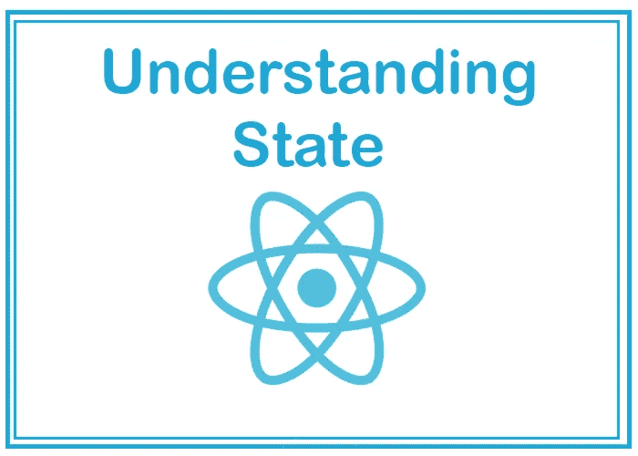
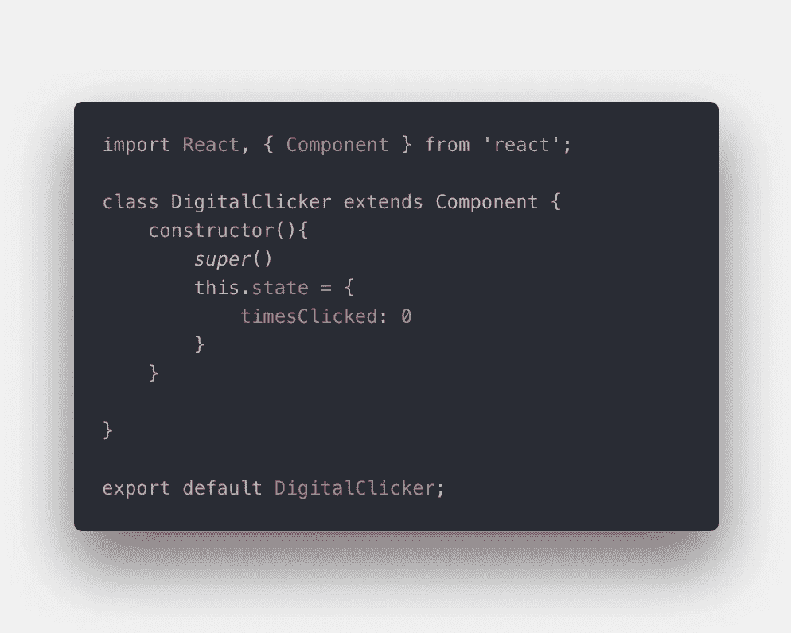
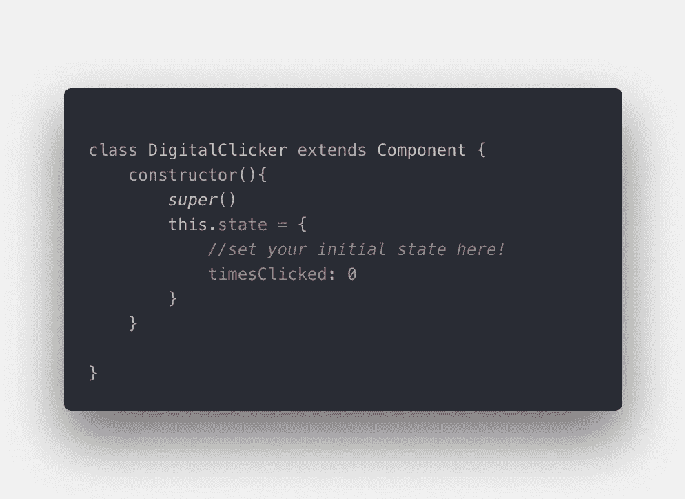
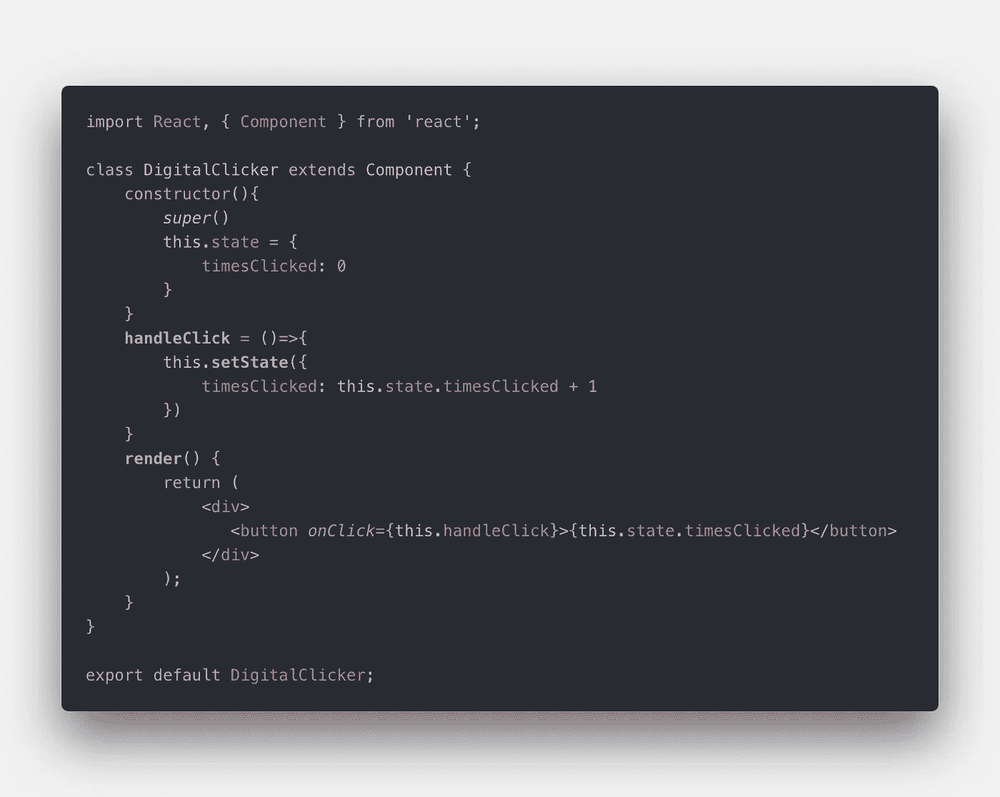

# 了解 React 中的状态

> 原文：<https://medium.datadriveninvestor.com/understanding-state-in-react-f74a1188e099?source=collection_archive---------2----------------------->

## 反应:状态介绍



当你第一次开始学习来自普通 JavaScript 的 React 时，这可能是一个令人生畏的过程，全新的约定和思维定势往好了说可能会令人困惑，往坏了说可能会让你浪费很多时间阅读文档和观看 YouTube 视频。我在这篇文章和以后的文章中的目标是帮助澄清一些困惑。我知道当我在研究特定的技术课题时，我想尽快进入，获取信息，然后离开。所以为了更好的用户体验，我在下面分解了这篇文章的结构。

> 生活更新:我在熨斗学校结束了第 10 周的软件工程沉浸式学习后写了这篇文章。这是我们学习 React 的第一周，所以如果下面有任何错误，请通知我！如果你喜欢你所读的，并且正在招聘，给我发电子邮件吧！😉

[](https://www.datadriveninvestor.com/2019/02/21/best-coding-languages-to-learn-in-2019/) [## 2019 年最值得学习的编码语言|数据驱动的投资者

### 在我读大学的那几年，我跳过了很多次夜游去学习 Java，希望有一天它能帮助我在…

www.datadriveninvestor.com](https://www.datadriveninvestor.com/2019/02/21/best-coding-languages-to-learn-in-2019/) 

# 涵盖的主题:

*   React 中的状态是什么？
*   哪些组件需要状态？
*   更改组件的状态

我们开始吧。


Photo by [Braden Collum](https://unsplash.com/@bradencollum?utm_source=medium&utm_medium=referral) on [Unsplash](https://unsplash.com?utm_source=medium&utm_medium=referral)

# 反应状态是什么

那么国家到底是什么，它有什么好处？要理解状态，首先必须理解组件。React 是关于组件的！组件是应用程序的基本构造块。在 React 中，您创建要呈现到页面的组件。如果你想要一个导航条，你创建一个导航条组件。如果您想要一个搜索，您创建一个搜索组件，等等。

这些组件也简称为属性或道具。道具有助于定义组件在页面上*渲染*时的样子。除了道具，组件也可以随意拥有**状态。**

State 只是一个 JavaScript 对象，它保存的信息会影响它所属组件的呈现。

关于状态，有一些关键的事情需要记住:

*   状态*属于*一个单独的组件
*   状态是组件的私有状态
*   仅当您需要有关组件**的数据来更改**时，才应使用状态。

下面是一个虚构的组件示例中的状态:



Example of State

这个组件有什么用，为什么需要状态？嗯，名副其实的 DigitalClicker 组件被构建成能够记录用户点击它的次数。由于点击次数是一个*会改变*的数据，那么看起来 DigitalClicker 组件需要状态！这是进入下一部分的好机会:**什么组件需要状态？**


Photo by [Max van den Oetelaar](https://unsplash.com/@maxvdo?utm_source=medium&utm_medium=referral) on [Unsplash](https://unsplash.com?utm_source=medium&utm_medium=referral)

# 哪些组件需要状态？

在 React 中创建组件时，您应该考虑“当用户使用它时，它会改变或需要改变吗？如果是这样，也许它需要状态。”

基本上，任何需要改变和跟踪改变的东西都需要状态。这包括但不限于:表单、按钮、定时器等等！

然而，在你认为状态是一个非常简单的概念之前，要知道你还需要考虑从父母到孩子的单向数据流，一些组件如何知道其他组件的状态，以及一堆其他的东西，这些都超出了本文的范围，但我希望在以后的博客中深入探讨。

设置组件的初始状态相当简单。您必须有一个*类组件，*，要设置状态，您只需在构造函数中定义它。



如上所示，我已经将初始状态设置为等于{timesClicked: 0}。这很好，但是国家的全部意义在于**它可以改变。**那么现在，你如何改变状态呢？

# 更改组件的状态

关于状态要记住的另一件事是，你**永远不要在初始化后直接改变状态。**这被广泛认为是不好的做法，如果你直接改变它，它会导致一些奇怪的错误和难以优化的组件。

React 为我们提供了一个改变状态的内置方法:setState()！

我将向您展示我为 DigitalClicker 构建的完整组件，然后解释如何使用 setState:



正如您在 handleClick 方法中看到的，我调用 this.setState()。setState()方法告诉 React 这个组件及其子组件需要用更新后的状态重新呈现。它是异步的，意味着它可能会也可能不会立即发生。它可以接受两个参数，一个更新函数和一个回调函数。

```
setState(updater[, callback])
```

仅考虑更新功能，您有一些选择。您可以:

*   传递一个对象而不是一个函数——这将执行一个状态变化到新状态的**浅层合并**,如果您的状态属性不是嵌套的，这也没问题。

```
this.setState({timesClicked: 5}) //update clicks to 5
```

*   传递一个函数来使用当前状态和属性进行更新

```
this.setState((state, props) => {
    return {timesClicked: state + 1}});
```

如您所见，在如何构造 setState 方面确实有一些灵活性。(在上面完整的代码片段中，我也以不同的方式对此进行了编码)。

setState 的第二个参数是回调函数，它是可选的，将在 setState 完成后和组件重新呈现后执行。

在我的 DigitalClicker 类中，我向按钮添加了一个事件侦听器，该事件侦听器在组件的状态中向我的 timesClicked 键添加了一个事件侦听器！现在有了这些关于状态的知识，你就可以开始考虑更有创造性的方法来将状态集成到你的项目/代码中。这仅仅是对在 React 中使用状态的介绍，我希望在以后的文章中做更深入的探讨。