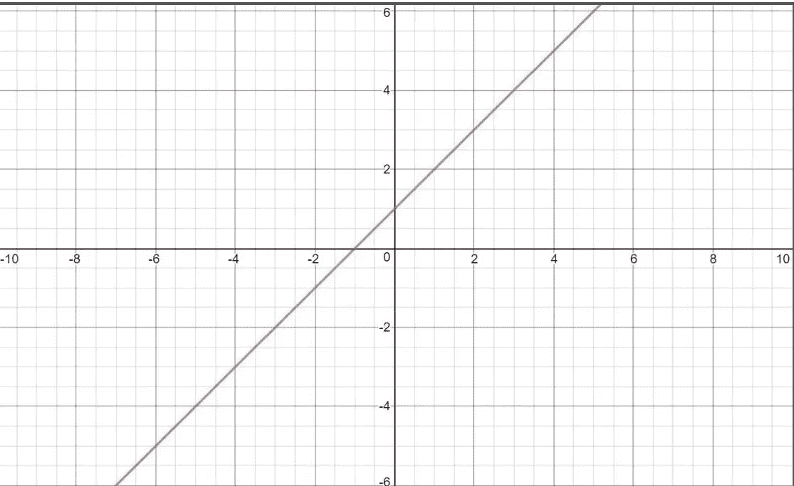
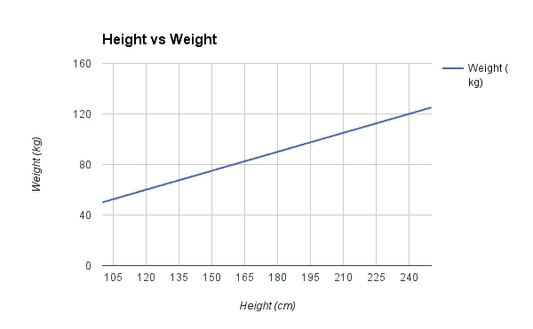
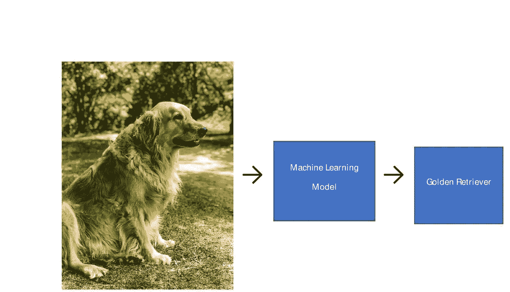
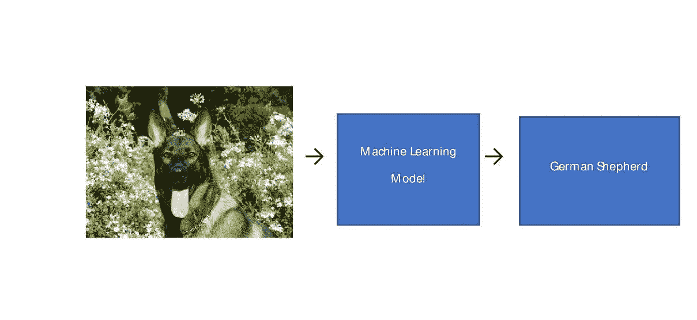

# 理解机器学习的基础

> 原文：<https://medium.datadriveninvestor.com/understanding-the-basics-of-machine-learning-3302b650710e?source=collection_archive---------11----------------------->

机器学习是一个研究领域，在这个领域中，我们根据某些特征对未来做出预测，而不需要实际进行显式编程。例如，为了预测下图中显示的是哪种动物，如果我们使用普通的编程，那么我们必须定义所有的东西，比如它的眼睛颜色，形状，腿的长度等等。

仅仅是为了表现这只猫，就需要几千行代码。但这可以通过使用机器学习来完成，只需几行代码。一旦机器学习模型制作完成，我们只需要输入动物图像，它就会自动预测它的类型。

有三种机器学习算法

1.  监督学习
2.  无监督学习
3.  强化学习

在本节中，我们将尝试深入理解监督学习算法。

现在，让我们试着理解什么是真正的监督机器学习。我们非常熟悉“学习”这个词，我们人类从自己的经历中学习。现在，一台机器如何体验一些东西，但实际上令人惊讶的是，对于机器来说，数据是他们的体验。因此，任何有监督的机器学习模型或算法都只从数据中学习，而我们从中学习的数据，我们称之为训练数据。

现在，用数学术语来说，有监督的机器学习算法试图做什么将变得更加清楚。我们都学过数学中的函数。让我们再修改一遍。

比如 f(x)=x 就是一元函数(这里就是 x)的一个简单例子，也叫一维函数。类似地，f(x，y)=x + y 是二维函数的一个例子(x 和 y 是两个变量)。f(x1，x2……xN)是 n 维函数的一个例子。

有两种功能

**线性函数**:当函数的图形为直线时，称为线性函数。简单来说，当变量的指数(即 x1，x2，…，xN)为 0 或 1，则称为线性函数。f(x)=x+1，f(x)=2，f(x，y)=x+y+1 是线性函数的一些例子。

下面是 f(x)=x+1 的曲线图，正如我们所看到的，这是一条直线，因此，函数是线性的。

Graph for f(x)=x+1

**非线性函数**:当函数的图形不是直线时，称为非线性函数。当函数中变量的指数不是 0 或 1 时，它被称为非线性函数。f(x)=x，f(x)=x 是非线性函数的一些例子。

下面是 f(x)=x 的曲线图，可以看出，曲线图不是直线，因此，函数是非线性的，反之亦然。

Graph for f(x)=x²

所以，在有监督的机器学习中，我们要做的基本上是找到这个函数 f(x1，x2…..xN)其中 x1，x2…xN 不过是特性。这个函数可以是线性的，也可以是非线性的，这取决于我们要处理的数据。一旦获得这个函数，我们只要输入特征，它就会为我们预测输出。

现在，根据输出类型，我们有两种类型的监督机器学习算法

1 **回归**:当输出值连续时，则称为回归问题。例如，如果我们试图根据身高等特征预测一个人的体重，那么我们称之为回归(因为体重是一个连续的值)。

Sample Height vs weight Linear Regression

2 **分类:**当输出值离散时，则称为分类问题。例如，如果银行试图基于某些特征来预测此人是否是欺诈，那么这种类型的问题被称为分类问题。另一个例子是对狗所属的品种进行分类。

下面是机器学习模型作为狗品种分类器的例子。

这是第一个关于机器学习的博客，将在接下来的博客中详细介绍其他主题。

如果有任何问题或疑问，请在评论中告诉我。