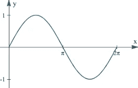
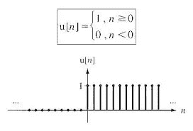
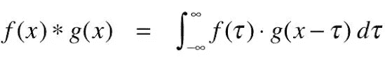
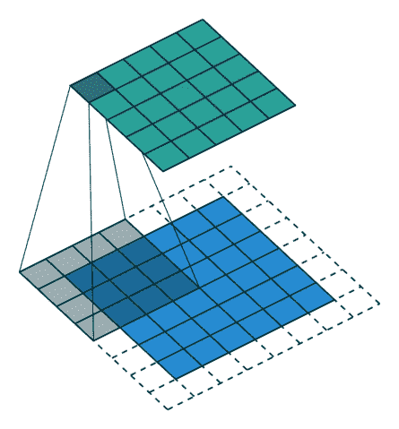
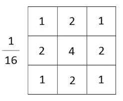
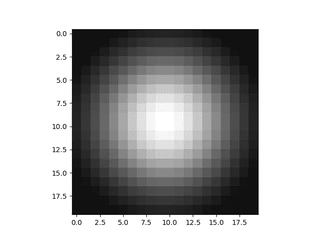
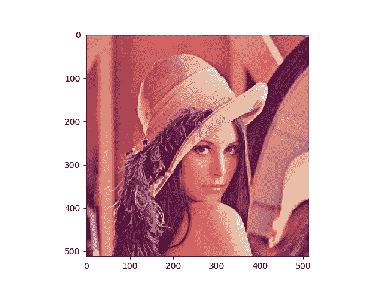

# 理解 CNN 中的“C”！

> 原文：<https://medium.datadriveninvestor.com/understanding-the-c-in-cnn-745c2a55d576?source=collection_archive---------6----------------------->

# 目标

在这篇文章中，我们将从数学上直观地理解卷积运算，并***构建我们自己的高斯模糊滤波器，*** 这篇文章的目标是让我们清楚地了解卷积如何适合神经网络术语，这将有助于我们更好地理解 CNN。

# 介绍

使用卷积，我们无法构建一个花哨的 Snapchat 过滤器，而是真正了解基层图像处理，如模糊或边缘检测。那么什么是卷积呢？*卷积基本上是一种分析两个信号重叠的数学工具。让我们剖析一下这个定义。*

信号是任何携带信息的东西，如声波、图像等。关键区别在于，声波是一个连续函数(一个**连续函数**，另一方面，是一个**函数**，它可以在某个区间内取任何数。)正如我们的好老 ***罪(x)一样。***

另一方面，图像是离散函数(离散函数**是具有不同**和独立**值的**函数**)。)像这个坏小子(注意 n 是整数)++**

那么我们如何从数学上定义一个函数与另一个函数重叠，我将首先展示这个公式，然后我们将尝试建立它的直觉。所以两个函数 f(x)和 g(x)的卷积表示为

其逻辑非常直观，因为我们必须量化重叠，我们在轴(f(x))上固定一个函数，将另一个函数(g(x))从负无穷大到正无穷大，并在每一时刻将它们相乘。

图像是二维离散函数，因此卷积看起来像

另一种看待卷积的方式是加权求和，图像中的每个像素都用滤波器中的某个特定值映射，结果存储在新图像的相应像素值中。

# 弄脏我们的手。

计算机将黑白图像视为二维阵列，所有低调的图像处理操作(如模糊、边缘检测)都是通过在图像上卷积特定的滤波器(通常为 3*3 矩阵)来完成的。例如，高斯模糊过滤器看起来像

这是相当直观的，如果你看看它，而卷积过滤器将映射最高数字的中间像素，所有后续的邻居将被赋予低值，给出一个模糊的效果(淡出像素值)。

所以我们的高斯滤波器看起来像

因此，我们首先将目标图像转换为黑白图像，然后执行简单的二维卷积，这将生成黑白模糊图像，我们将再次转换为 RGB 以获得最终值。

# 密码

欢迎任何反馈/批评。很乐意与您交流，讨论进一步的想法。

感谢你阅读❤

