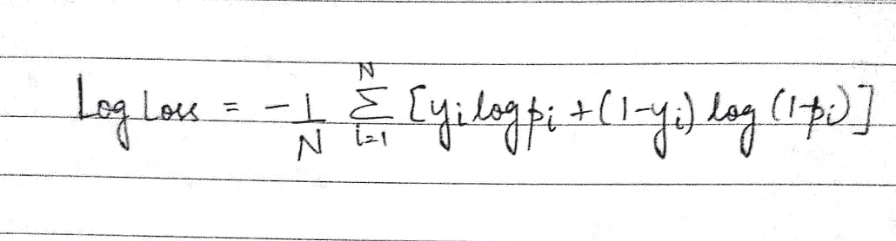
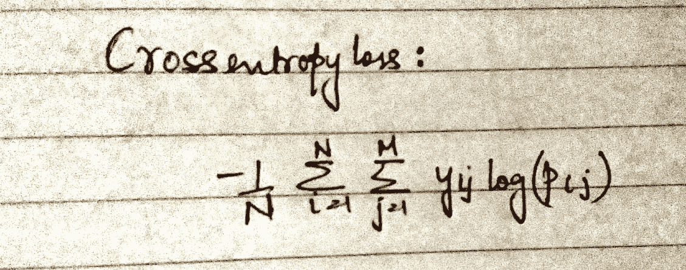

# 了解 XGBoost 的日志丢失功能

> 原文：<https://medium.datadriveninvestor.com/understanding-the-log-loss-function-of-xgboost-8842e99d975d?source=collection_archive---------1----------------------->

[](http://www.track.datadriveninvestor.com/1B9E)

数学经常用所有的术语和听起来很复杂的术语向我们扔出曲线球。大量使用代数、统计、微积分和概率概念的数据科学也借用了很多这些术语。机器学习(ML)是依赖数学的数据科学中一个引人入胜的方面。有很多算法一直在这个领域占据主导地位，为了理解这些算法，对数学概念的良好体验变得至关重要。XGBoost 就是这样一种基于梯度推进决策树的流行且日益占主导地位的 ML 算法。它可以用于分类和回归问题，并以其性能和速度而闻名。XGBoost 使用一种流行的度量标准，称为“log loss ”,就像大多数其他梯度增强算法一样。这种基于概率的度量用于测量分类模型的性能。然而，在我们开始使用它来评估我们的模型之前，有必要了解其背后的数学原理。这篇文章涉及到对数损失的数学概念。在随后的文章中，我们将简要介绍它如何影响 ML 分类算法的性能，尤其是 XGBoost。

# 定义日志损失

对数损失(Log loss)是分类的损失函数，它量化了分类问题中预测不准确所付出的代价。日志丢失通过考虑分类的概率来惩罚错误的分类。为了阐明这个概念，让我们先来看一下这个术语的数学表示:



在上面的等式中，N 是实例或样本的数量。“易”将是第 I 个实例的结果。比如说，一个实例可以假设两个结果，比如 0 和 1。在上面的等式中，“yi”将是 1，因此，“1-yi”是 0。“pi”表示第 I 个实例采用值“yi”的概率。换句话说，log loss 累积了在所有实例中同时假设状态 0 和 1 的样本的概率。该等式背后的简单条件是:对于真实输出(yi)，概率因子是 *-log(真实输出的概率)*，对于另一个输出是*-log(1-真实输出的概率)。*
让我们试着用 Python 以编程方式来表示条件:

```
**def** log_loss_cond(actual, predict_prob):
  **if** actual == 1:  
    # use natural logarithm
    **return** -log(predict_prob) 
  **else**:
    **return** -log(1 - predict_prob)
```

如果我们看上面的等式，0 和 1 的预测输入值是未定义的。为了解决这个问题，对数损失函数将预测概率(p)调整一个小值ε。ε的这个值通常保持为(1e-15)。因此，我们可以通过应用以下代码来进行调整:

```
max(min(p, 1−10^−15), 10^-15)
```

在此操作中，可能会出现以下情况:

**当 p = 0 时:**

1.  应用最小值函数(0 小于 1–1e-15→0)
2.  应用最大函数(1e-15 大于 0 → 1e-15)
3.  因此，我们提交的概率 0 转换为 1e-15

**当 p = 1 时:**

1.  应用最小函数(1–1e-15 小于 1→1–1e-15)
2.  应用最大功能(1–1e-15 大于 1e-15→1–1e-15)
3.  因此，我们提交的概率 1 转换为 1–1e-15

现在，让我们复制上面的整个数学等式:

```
def logloss(actual, predict_prob):
    predict_prob = min(max(predict_prob, 1e-15), (1 - (1e-15)))  

    if actual == 1:  
        # use natural logarithm  
        return np.log(predict_prob)    
    else:   
        return np.log(1-predict_prob)
```

我们也可以把它表示为 R 中的一个函数:

```
LogLossBinary **=** **function**(actual, predicted, eps **=** 1e-15) {
	predicted **=** **pmin**(**pmax**(predicted, eps), 1**-**eps)
	**-** (**sum**(actual ***** **log**(predicted) **+** (1 **-** actual) ***** **log**(1 **-** predicted))) **/** **length**(actual)
}
```

在我们继续讨论如何在分类算法中实现这一点之前，让我们简单地谈谈与对数损失相关的另一个概念。交叉熵是一个类似的度量，并且随着预测的概率偏离实际标签，与之相关的损失增加。完美的模型应该具有 0 的对数损失值或交叉熵损失值。那么，为什么它们是两个不同的术语呢？

> 当涉及到机器学习算法时，交叉熵是对数损失的更一般形式。虽然对数损失用于二元分类算法，交叉熵用于多类分类问题的相同目的。换句话说，当有两个可能的结果时使用对数损失，当有两个以上的可能结果时使用交叉熵。

该等式可以用以下方式表示:



这里，“M”是给定情况下可能出现的结果或标签的数量。按照与上一个等式类似的约定，“pij”是模型将标签 j 分配给实例 I 的概率。让我们借助一个示例来理解这一点:

> 让我们假设一个问题陈述，其中一个人必须预测一个学生在给定他的属性的情况下将在考试中得分的等级范围。如果有三种可能的结果:用[(1，0，0) (0，1，0) (0，0，1)]表示的高、中、低。现在，对于一个特定的学生，预测概率是(0.2，0.7，0.1)。这表明预测的分数范围最有可能是“中等”，因为那里的概率最高。因此，交叉熵误差为:
> 
> CE _ loss =-(ln(0.2)(0)+ln(0.7)(1)+ln(0.1)(0))
> =-(0+(-0.36)(1)+0)
> = 0.36

现在，这个理论已经被处理了，我们可以更好地开始在分类模型中使用它。在随后的文章中，我将讨论如何使用测井曲线损失作为模型输入参数的决定因素。我们将特别讨论使用 XGBoost 分类模型的日志损失背后的基本原理。