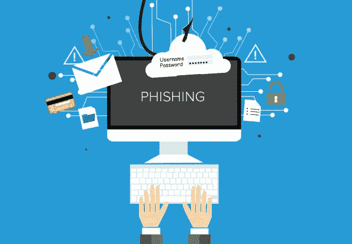

# 了解各种网络钓鱼攻击的风险

> 原文：<https://medium.datadriveninvestor.com/understanding-your-risk-for-various-phishing-attacks-96dfd0adcdac?source=collection_archive---------18----------------------->

因此，在一个物联网的世界中，了解恶意个人的“网络钓鱼”攻击最终成功的方法和风险至关重要。在这篇简短的文章中，我将解释不同类型的网络钓鱼攻击，以及如何识别它们。

1.  **鱼叉式网络钓鱼**

鱼叉式网络钓鱼攻击通常针对引人注目的目标，如首席执行官、首席财务官、首席技术官或任何机构/公司的首席经理。因此就有了人们熟悉的短语“鱼叉捕鱼”(基本上，潜在的黑客会去追逐上述组织的“鲸鱼”)。

 [## 理解物联网|数据驱动的投资者

### 一个系统越开放，它就越有利于创新和产生信任。然而，当谈到开放系统时…

www.datadriveninvestor.com](https://www.datadriveninvestor.com/2019/09/28/making-sense-of-iot/) 

防御鱼叉式网络钓鱼:

一般来说，鱼叉式网络钓鱼制作精良，几乎没有语法错误。他们通常会表达一种紧迫感，通常希望目标点击一个链接。如果您看到任何哪怕是非常可疑的电子邮件，请将其作为网络钓鱼邮件报告给您公司的 it 部门，如果没有，请将其删除。 ***如有任何疑点不要打开邮件或立即举报*** 。记住:你不会因为对你公司的潜在危害疑神疑鬼而惹上麻烦，事实上，他们可能会尊重你报告任何可疑的事情。

**2。视觉**

视觉钓鱼是一种专门通过电话进行的网络钓鱼。“Vishing”是“语音钓鱼”的融合词。这些电话通常针对客户服务代表、当地经理，甚至初级员工/实习生。这些电话通常由被称为*社会工程师的个人使用，或者使用可疑的狡猾，有时甚至是欺骗来获取不应该被共享的信息的个人使用。如果这些电话是针对初级员工的，它们通常是由施虐的配偶/男朋友/女朋友打来的，以便弄清楚某人什么时候工作，或者某人什么时候上班或下班。这就是为什么作为一名在 IT 部门工作的人，我强烈建议，如果你不认识的任何人打电话来，并立即询问另一名员工的个人信息，不管来电者如何表明自己的身份，如他们到达的时间表或时间，立即挂断电话或无限期等待，以便你可以记下他们拨打的号码。大多数情况下，打这些电话是为了获取不应被共享的信息。*

**针对视觉的防御:**

在任何情况下:不要在电话中透露任何同事的个人信息。如果打电话的人是跟踪狂或虐待狂，这实际上可能会让你的同事面临潜在的生命危险。如果你碰巧回答了这种类型的网络钓鱼，请立即记下来电显示中的号码，并记住不要透露任何个人信息。

**3。网络钓鱼**

啊，是的，所有的 PB&J:网络钓鱼。网络钓鱼是恶意个人或社会工程师经常使用的一种攻击，目的是获取或访问社交媒体帐户、电子邮件地址、银行帐户、需要登录的系统、网络，甚至是通过同意证明对建筑物的物理访问。黑客通常会克隆整个登录页面，并使用域名欺骗转发所克隆的登录页面，以获取目标用户的信息。这些通常会通过电子邮件到达，看起来非常合法。2019 年发生的一个非常值得注意的事件是针对一款名为“堡垒之夜”的视频游戏用户的网络钓鱼活动，它采用了该公司的标志，一个带有游戏人物头像的字母横幅，并声明“最近有人试图访问你的帐户，请单击此处重置你的密码”(简言之，我收到了上述攻击并立即删除了它)。这确实是一封网络钓鱼邮件，Epic Games(堡垒之夜的所有者)发布了一份攻击公告。

**网络钓鱼防御:**

检测网络钓鱼电子邮件最明显的方法是看它是否有可疑的链接。另一个稳妥的办法是，如果邮件看起来可疑，就不要打开。如果您最终点击了该链接，您的计算机可能会感染勒索软件，或者您可能会被引诱登录到一个虚假的登录页面，攻击者将在那里获得您的用户名和密码。

总的来说，在当今社会，网络钓鱼是新的骗子的小刀。它的许多用途和进入你收件箱的各种方式都很可笑，对于那些点击链接的人来说，他们经常会吃到苦头。