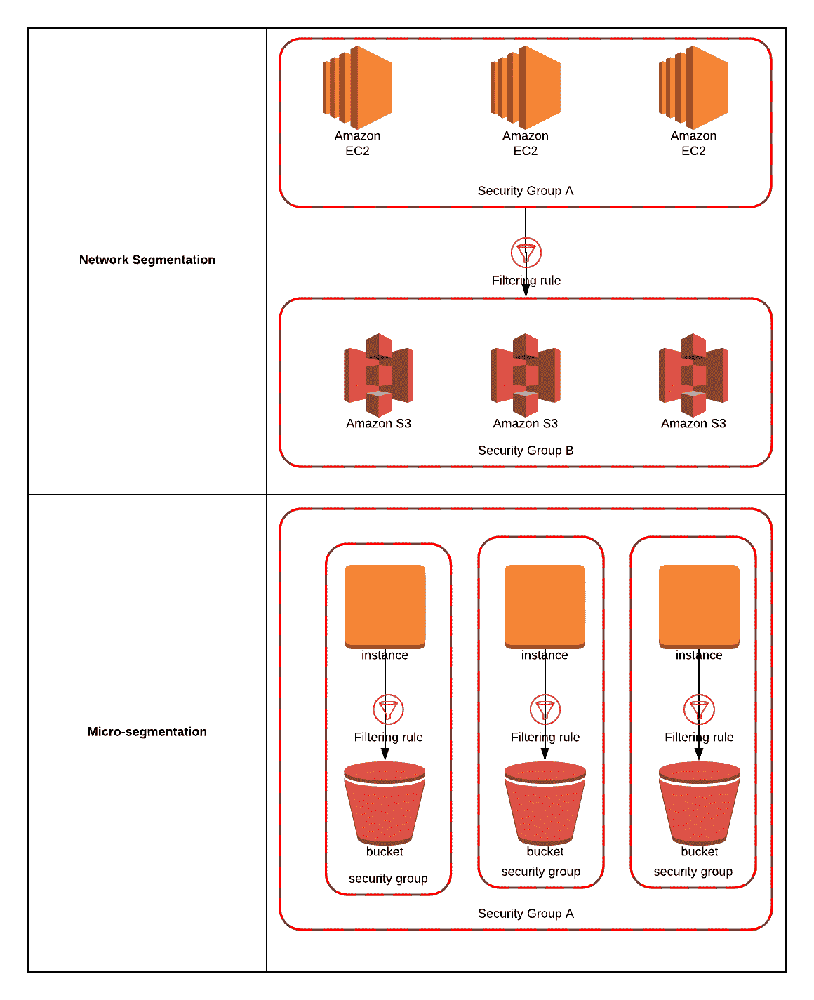

# 未分割的我们倒下了:在软件定义的边界中将网络分段与微分段分离

> 原文：<https://medium.datadriveninvestor.com/undivided-we-fall-decoupling-network-segmentation-from-micro-segmentation-in-the-software-defined-dbb863d14fdd?source=collection_archive---------9----------------------->

Falling [the play]. Retrieved from [https://theacornpenzance.com/events/falling/](https://theacornpenzance.com/events/falling/) on SEP 8, 2019

# 介绍

到目前为止，没有任何法律或法规，甚至是最新版本的 PCI-DSS、HIPAA 和 HITECH，不强制要求网络分段或微分段遵守该规则。通过让网络分段变得可自由决定，即使在传输、处理或存储受监管数据时，违规数量也将继续上升，因为公司宁愿少花钱多办事。

本文的目的不是解释网络细分和微细分的当代需要。相反，它试图澄清两者之间的对立区别，以重新构建这两个概念是相同的广泛使用的叙事。

 [## 网络安全非营利组织帮助中小企业打击网络犯罪|数据驱动的投资者

### 一个名为全球网络联盟(GCA)的非营利组织发誓要改善…

www.datadriveninvestor.com](https://www.datadriveninvestor.com/2019/02/22/cybersecurity-non-profit-to-help-smes-fight-against-cybercrime/) 

# 历史

2017 年 3 月，我写了第一篇关于网络分段的文章，名为[一种设计、实施和操作网络隔离和微分段](https://www.linkedin.com/pulse/project-management-approach-designing-implementing-network-knight)的项目管理方法。在那篇文章发表后的两年多时间里，扁平网络似乎仍然是每个行业特有的问题。即使是在受监管环境中运营的实体，如支付卡行业(PCI)或医疗保健行业，我们也可以从医院的访客无线网络访问互联的生物医学设备。类似地，从 PCI-DSS 版本 3.2 开始，网络分段仍然不是强制性的，以符合商家的 PCI。但是，如果未实施网络分段，则会将整个网络纳入 PCI 评估的范围，这可能会为实体通过年度 QSA 审计以获得合规性报告(ROC)增加大量时间和成本。

虽然人们普遍理解什么是网络分段，但微分段的概念似乎一直与分段混为一谈，事实上，它们描述的是两个完全独立的概念。这两个概念实际上是相互排斥的；意思是，你可以同时拥有网络细分和微细分，所以它们是不一样的。我给出了单独实现的例子，解释了为什么将这两个概念合并会造成很高的代价，或者会引入潜在的漏洞，特别是在将前沿作战基地(fob)连接到机密网络的冲突地区。

# 什么是网络分段

图一。细分与微细分。

*Source: Alissa Knight*

网络分段可以简单地描述为采用一个大型平面网络，并使用防火墙规则或 VLAN 访问控制列表(VACLs)，定义允许或拒绝主机之间流量方向性的规则。

# 什么是微分段

微分段是网络分段的概念，但在更小的规模上，同一 VLAN 内的节点被隔离到一种飞地中。微分段类似于客户端 VPN，其中两台主机相互通信，同一网络中的其余主机无法与这些主机通信或看到它们。实施网络分段时，VLAN 的默认路由设置为防火墙，或者使用 VACLs 来控制它们可以与 VLAN 外部的哪些主机通信。借助微分段，可以在不同 VLAN 中的主机之间或同一 VLAN 内的飞地中实现主机隔离。

# 微细分的商业案例

您的第一个问题可能是微细分应该在什么时候应用，这种场景的业务案例是什么。在这里，我提供了三个微分段有意义的场景示例。

**盒中网络(NIB)。**当美国将地面部队部署到一个新的作战区域，并且建造了一个基地，例如前方作战基地(FOB)时，必须实施服务器和网络连接。由 [Tecore Networks](https://www.tecore.com/) 等公司开发的产品提供一体化无线系统，其中包含服务器和无线(4G/LTE、卫星等)。)连接性，以便 FOB 在数小时内与 SIPRNET、NIPRNET 和 JWICS 建立连接。

但是，对于生产这些 nib 的一些供应商，这三个系统都是虚拟机，都在虚拟机管理程序中运行，虚拟机管理程序位于虚拟机管理程序的虚拟交换机内运行的单个防火墙之后。虽然这阻止了转向这些系统，但它并不能保护同一个飞地中的主机不受彼此的影响。因此，如果连接到 SIPRNET 的主机受到威胁，该主机将能够与 NIPRNET 上的主机通话，这是两个完全不同的分类级别。通过实施微分段，这三台主机可以彼此完全隔离，即使它们运行在同一个虚拟机管理程序中。

**限制 PCI 范围。**当一家公司传输、处理或存储支付卡信息时，他们必须根据每年处理的信用卡交易数量，由认证 QSA 执行年度 QSA 审计。如果员工在连接到公司网络的同时，与其他不执行范围内 PCI 活动的员工一起在他们的工作站上处理信用卡，这可能会导致公司网络中的整个用户 VLAN 都在 QSA 审核的范围内。通过实施微分段，这一名或多名员工(无论他们在哪个 VLANs 中)都可以隔离到范围内的 PCI 网络中，从而将公司网络从 QSA 审核的范围中移除。

# 解决办法

现在有几种解决方案可以消除在交换机级别使用 VACLs 和防火墙规则实施分段的旧方法，它们是一种新的产品类别，称为软件定义的边界(SDP)解决方案。一个特别的解决方案是优利系统公司的秘密行动。Stealth 位于堆栈的第 3 层，利用安装了代理的主机的操作系统来创建与其他主机的 IPSec 隧道，Unisys 将其称为利益共同体(COI)。

Stealth 除了允许管理员定义微分段 COI 之外，还包括“隐藏”资产的能力，使主机变暗，COI 之外的其他主机无法访问。

SDP 使得在由遍布全球的数千个节点组成的大规模异构网络中实施微分段成为可能，否则传统方法无法通过交换机级别的硬件分段实现这一点。

如果您实施微分段的需求从 prem 扩展到了云甚至是多云资产，Stealth 支持云服务提供商和任何网络结构，因为微分段是在网络层完成的。

总之，网络分段在零信任安全(ZTS)框架中是必要的，但应被视为不同于微分段，微分段的粒度要小得多。

# 喜欢和分享

你支持我继续内容开发和影响网络安全工作的最好方式是喜欢并分享我的文章。