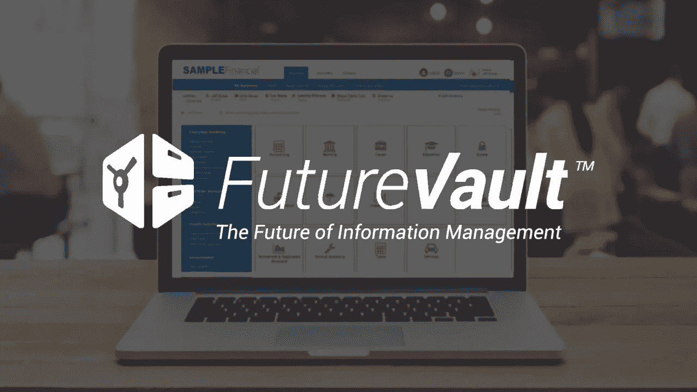

# 美国国防部研究潜在的区块链网络安全解决方案

> 原文：<https://medium.datadriveninvestor.com/united-states-department-of-defense-researching-potential-blockchain-solutions-for-cybersecurity-b22bfe3cca36?source=collection_archive---------10----------------------->

## 美国国防部试验将区块链技术作为一种可能的网络安全解决方案

Blockchain Technology Potential in Cybersecurity — Photo by NASA via Unsplash.com

国防部在 2019 年 7 月发布的报告“ [DoD 数字现代化战略:DoD 信息资源管理战略计划](https://media.defense.gov/2019/Jul/12/2002156622/-1/-1/1/DOD-DIGITAL-MODERNIZATION-STRATEGY-2019.PDF)”中表示，它正在试验将区块链作为人员之间安全通信的一种方式，也作为创建不可破解代码的一种方式。

> “国防高级研究计划局(DARPA)正开始与区块链进行试验，以创建一个使用区块链协议的更高效、更强大、更安全的平台，该平台将允许任何地方的人员传输安全消息或处理交易，这些交易可以通过分散账本的众多渠道进行跟踪。该应用程序将用于不同的方面，包括促进各单位和总部之间的通信，以及在情报官员和五角大楼之间传输信息。DARPA 也一直在试图开发一种不可破解的代码——区块链可以为此提供便利——因为这项技术可以为试图闯入安全数据库的黑客提供情报。”—国防部数字化现代化战略:国防部信息资源管理战略计划

 [## 信息图:云之旅|数据驱动的投资者

### 聪明的企业领导者了解利用云的价值。随着数据存储需求的增长，他们已经…

www.datadriveninvestor.com](https://www.datadriveninvestor.com/2018/09/22/infographic-journey-to-the-clouds/) 

> 这份国防部战略文件从世界上唯一的超级大国的作战和安全角度出发，涵盖了所有内容，它揭示了像区块链这样的安全技术的必要性，以遏制雄心勃勃的国防部计划，实现真正强大的人工智能应用。国防部设想人工智能是“国防部所有职能的力量倍增器和变革代理——我们将聪明地利用它，并以 ***的速度*** ”。国防部计划在他们的信息企业中启用人工智能，并通过事件驱动计算调用它来“为联合作战人员增加 ***的杀伤力*** ”。如果不是因为区块链广泛分布的分类账和多方面的公钥和私钥数据结构的数据锁定性质，这种方法可能会使邪恶势力有可能操纵国防部的人工智能，从而带来潜在的灾难性后果，消除单点攻击和控制。我们都应该感谢区块链技术是如此强大的人工智能能力的侍女。— [兰迪·麦奎尔](https://www.linkedin.com/in/randy-mcguire-a61428/)、[首席执行官流动账目](https://www.linkedin.com/company/liquid-ledgers/?viewAsMember=true)

区块链是一种分布式账本技术(DLT)，即去中心化；特定区块链上的所有节点(计算机)都可以获得信息，网络中的每个人都有整个数据库的副本。所有交易都被加密并存储在带有时间戳的数据块中，并按时间顺序链接在一起。如果进行了更改，就不能重写程序块。更改被存储在一个新的块中并打上时间戳。这一过程在建立信任的同时也保持了高度的数据完整性。

Cybersecurity — Blockchian — Cloud Computing

在区块链这样的分散数据库中发送和存储重要数据，解决了集中式数据库的一个关键问题，即只有一个脆弱的访问点，使其更容易被黑客攻击。存储在区块链上的数据不会受到黑客的单点攻击。区块链的透明记录系统实时向每个节点提供任何潜在黑客企图的信息。区块链获取信息，对其加密，将其分解成小块，并在网络上分发。如果信息被黑客攻击，黑客只能获得一部分加密数据。

区块链最终可能成为包括云计算在内的许多行业的信息管理不可或缺的一部分。

[Brad Rosenberg](https://www.linkedin.com/in/rosenbergbrad/),[FutureVault 的联合创始人&首席产品官，FutureVault 是一家白标云文档管理平台提供商，为金融、法律、保险、政府](https://www.futurevault.com/)等多个行业提供服务，正在考虑实施一项独立的 future vault 服务，利用区块链存储、验证和加密重要文档。区块链交易 id 将证明文档是由发起者发布的，并且未被修改。例子:文凭，纳税申报表，结婚证，遗嘱，契约，抵押贷款。

> “许多公司被驱使成为区块链技术潮流的一部分，并想方设法将其融入到自己的产品中。然而，FutureVault 平台非常适合区块链支持的文档和交易认证服务。生态系统已经存在；文档存储、文档协作、安全性以及与需要认证文档的机构的关系。作为认证文件托管服务的平台是一个天然的选择。”—联合创始人兼首席产品官布拉德·罗森伯格

区块链的采用似乎正在起飞；几年后，它将不再被认为是“新兴的”或“破坏性的”外行人将能够区分区块链技术和比特币，比特币是一种帮助区块链成名的加密货币。

奥黛丽·奈斯比特

[奥黛丽·奈斯比特在 Linkedin 上](https://www.linkedin.com/in/audrey-nesbitt-0388a52a/)

[@ audreynesbit 11 在推特上](https://twitter.com/AudreyNesbitt11)

[螺旋营销&公关](http://www.spinspirational.com/)