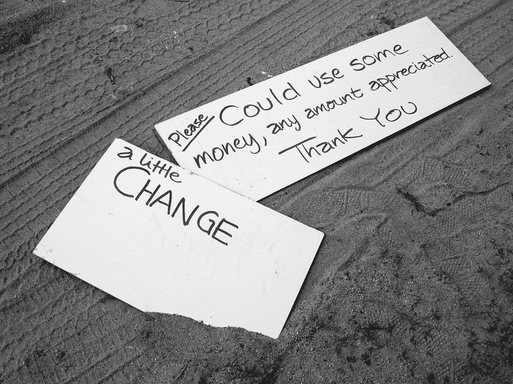
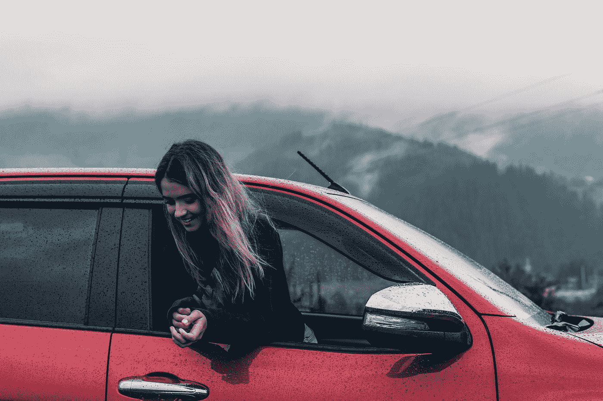

# 普遍基本收入——我们需要它吗？

> 原文：<https://medium.datadriveninvestor.com/universal-basic-income-do-we-need-it-56a1f2b1183f?source=collection_archive---------5----------------------->

## 面向未来的教育

近年来，随着计算能力的指数级增长，云计算、机器学习(特别是深度学习)、计算机视觉和物联网等领域取得了显著的增长。这种增长导致了这样的预测，在不太遥远的未来，将不会有任何工作是机器不能做得比人类更好的。这方面的一个例子是自动驾驶，如果被政府接受，这将迫使数百万司机失业。

在这样的阶段，人类自己将变得没有能力为自己谋生。持这种思想的人提出，应该普遍地为每个人提供能够支付生活费用的基本收入。这种收入的术语是**普遍基本收入。**

Demand for Universal Basic Income

让我们试着根据历史观点和人类行为来理解我们是否需要它。然后我们会看到一些替代方案。

## 我们需要普遍的基本收入吗？

**不**，我们不需要全民基本收入。我们甚至不想接近那种情况。虽然自动化很好，但我们需要自己找到该做什么，而不是等待别人来养活我们。

我们可以从最基本的方面来评估这些想法:学校。**教育教导我们遵守规则。**

这有什么关系？

从幼儿园到大学，我们的教育体系是基于这样一个前提:学生们会坐在一起听几个小时，做我们被告知要做的事情。就业也遵循同样的模式。即使是个体户也只是努力遵守政府制定的规则。遵守规则是社会的结构，对吗？

这样的教育体系教会我们好好学习，取得好成绩，努力工作谋生。我们的社会尊重努力工作。即使是那些不需要钱的人，超级富豪也努力工作来获得一种受尊重的感觉，以及在社会中有所贡献的感觉。给我们的指示是如此的固定在我们的头脑中，以至于我们不会质疑它是否需要。蒂姆·菲利斯称之为“为工作而工作”。

因此，正如我们的教育系统所教导的那样，我们需要工作来维持生活。收入，真的是次要的，不管我们接受与否。对我们大多数人来说，收入只能帮助维持我们向他人展示的生活方式。工作是生活的基础。普遍基本收入的基本思想是，不会有任何人类需要做的工作。那么，在这种情况下，人类会怎么做呢？

如果你已经有足够的钱来支撑你的一生，你愿意今天完全停止工作吗？如果这个问题的答案是肯定的，那你为什么还要全民基本收入呢？

数百万无所事事的人类将共同取得什么成就？就看电视，抱怨节目的平庸？

> 懒惰的头脑是魔鬼的工厂

我们想让人口普遍闲置吗？如果我们无所事事，我们甚至可能以世界大战而告终！

因此，在以任何形式提出全民基本收入之前，我们需要解决以下问题。

a)考虑到所有传统工作的现有途径都是由人工智能完成的，人类可以采取哪些新的工作途径。我们需要准备一份详尽的清单，列出人工智能无法完成的工作——因为这是人类可以比人工智能做得更好的地方。

b)我们如何进入这样的工作领域？我们需要新的知识，我们如何鼓励人们获得这些知识来从事这种新的工作领域，而不是抱怨当前的工作领域被机器夺走。

c)对人们的工作给予补偿的方式有哪些？

d)我们如何在空闲时间让自己有事可做？显然，未来每天的工作时间将会比现在少。

e)我们如何保持自己的身心健康？许多健康问题，包括精神疾病，如抑郁症，都是由于缺乏体力劳动造成的。

如果新的工作途径能让我们保持健康、快乐，并为我们提供基本的生活来源，那么就不需要普遍的基本收入。

## 普遍基本收入不是优先事项的原因

即使是现在，社会上那些年纪太大而不能工作或找不到工作的人仍在从政府那里获得一些基本收入。这没什么，因为作为负责任的公民，我们应该照顾这些人，但这是我们不希望社会中的每个人都处于的状态。

我们希望人们保持健康，并通过他们的工作直接或间接地为社会做贡献。至少是那些适合工作的人。

*我们不希望人类变成动物园里的动物，任由人工智能摆布，而是成为为了我们的利益而指挥人工智能的人。*

虽然我们可以说，没有工作，人们将没有钱，他们将死于饥饿——最重要的是，我们想找到改善人类的方法。如果所有人都无所事事，银行账户自动填满，这种情况就不会发生。

由于我们的教养，我们倾向于相信我们需要谋生，当我们这样做的时候，我们自动地通过我们的工作对社会有所贡献。当那项工作不存在时，我们就自己想办法利用空闲时间。这需要被引导，所以下一代对他们的生活有一些公平的想法。

## 教人们享受生活

学校有没有教我们各种方法让我们有事可做，玩得开心？不要！我们太忙了，记不住统计数字和图表，所以有一天我们可以在工作中用到它们！

Count the drops on a rainy day and see the abundance! [Pic Credit: [Elijah O'Donnell](https://unsplash.com/@elijahsad?utm_source=medium&utm_medium=referral) on [Unsplash]](https://unsplash.com?utm_source=medium&utm_medium=referral)

如果大部分任务都是自动化的，那么几乎不需要人工干预。在这种情况下，即使每个人都有工作，他们的参与也将是最小的。他们不需要像现在这样一周工作 40 个小时。

所以，如何利用我们的时间是需要从一开始就教会的事情。时间管理、优先排序等技能是学校和大学里从来没有教过的，而实际上却是需要的。同样，我们也不应该错过如何利用你的时间享受乐趣。这是需要教给大众的东西——教育系统是把每个人都装进一个盒子里，那些谈论非传统事物的人被视为傻瓜。这些人的例子有，那些辞职去从事电影表演的人，那些去度一年假期的人等等。不应该是这样的。

为什么学习不同的娱乐方式很重要？

如果你今天被解雇了——但是你有足够的钱度过你的一生而没有经济问题，你知道如何过一个快乐和充满乐趣的生活而不陷入抑郁吗？

## 教导人们要有创造力

[Youtube 统计数据](https://www.youtube.com/intl/en-GB/yt/about/press/)显示，2018 年，收入达到六位数的频道数量同比增长 40%。这清楚地表明了一种趋势。许多人正在成为内容创造者，他们正在做好生意。

当我们研究自传时，我们经常看到辍学者成为企业家，那些完成学校和大学学业的人成为他们的雇员！为什么？

学校里不教创造力，甚至不容忍创造力。质疑的人被视为不服从。这种态度应该改变，应该向提高学生的创造力倾斜。与创造力相关的书籍，如 [Edward De Bono 的书](https://www.amazon.in/Lateral-Thinking-Creativity-Edward-Bono/dp/0241257549/ref=sr_1_1?s=books&ie=UTF8&qid=1539478903&sr=1-1&refinements=p_27%3AEdward+De+Bono)应该成为激发学生创造力的途径。

## 结束语

普遍基本收入只是那些预测人类末日的人推广的一个概念。另一方面，如果我们开始改变我们的教育体系，鼓励并教导学生更有创造力，并展示如何获得乐趣和各种途径来快乐地度过一生，那么这不是终点。我们会产生更多的企业家，也不会缺乏财富。

***如果你喜欢这个帖子，就帮别人找吧，轻轻拍几下！👏每位用户最多可鼓掌 50 次，所以只要你觉得合适，就多拍几次。***

如果你已经读到这里，我希望你喜欢阅读它。通过评论让我知道你的想法。

我的职业是软件开发员。我经常写关于软件开发、一般技术趋势和书评的文章。可以通过 [LinkedIn](https://www.linkedin.com/in/manjunathrajamanickam) 和我联系。