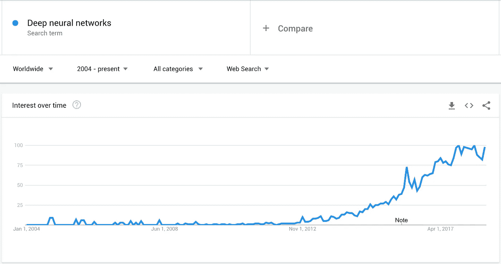
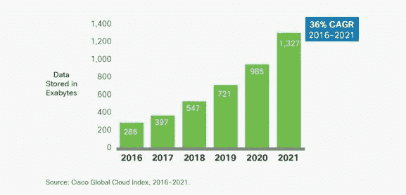
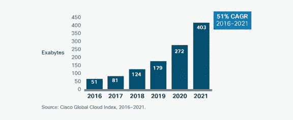
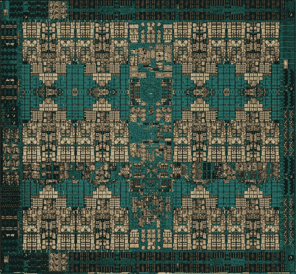
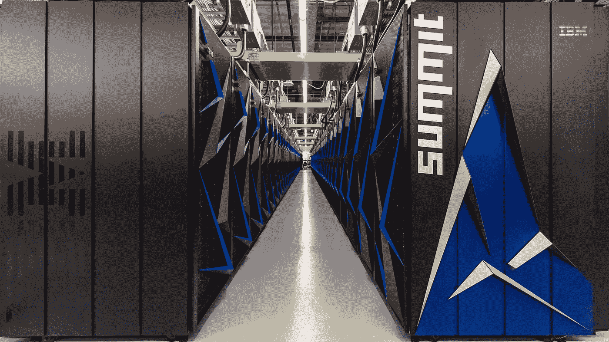

# 通用函数逼近器又称深度神经网络(第一部分)

> 原文：<https://medium.datadriveninvestor.com/universal-function-approximators-a-k-a-deep-neural-networks-part-1-5ecc76a8f8db?source=collection_archive---------17----------------------->


***Water Lilies*** or *Nymphéas**by*French impressionist [Claude Monet](https://en.wikipedia.org/wiki/Claude_Monet)

这是通用函数逼近器系列的 **part1** 和 [**part2**](https://medium.com/@duminda101/universal-function-approximators-a-k-a-deep-neural-networks-part-2-3db545fc0e51) 也可供阅读。

“通用函数逼近器”听起来很不错，对吧？

我不知道你怎么想，但对我来说，任何以“通用”开头的东西都会让我开心，因为我必须学会这一点，然后把它应用到几乎所有的事情上。这是否意味着我们可以近似宇宙中的任何函数？如果有足够的数据，我们可以:)

我们开始工作吧，好吗？

首先，我们需要一个无人知晓的函数。因为没有人知道它是什么，我们不得不依靠我们的神秘函数产生的数据。

基本上我们有输入和输出。

## 输入

```
[-100, -99, -98, -97, -96, -95, -94, -93, -92, -91, -90, -89, -88, -87, -86, -85, -84, -83, -82, -81, -80, -79, -78, -77, -76, -75, -74, -73, -72, -71, -70, -69, -68, -67, -66, -65, -64, -63, -62, -61, -60, -59, -58, -57, -56, -55, -54, -53, -52, -51, -50, -49, -48, -47, -46, -45, -44, -43, -42, -41, -40, -39, -38, -37, -36, -35, -34, -33, -32, -31, -30, -29, -28, -27, -26, -25, -24, -23, -22, -21, -20, -19, -18, -17, -16, -15, -14, -13, -12, -11, -10, -9, -8, -7, -6, -5, -4, -3, -2, -1, 0, 1, 2, 3, 4, 5, 6, 7, 8, 9, 10, 11, 12, 13, 14, 15, 16, 17, 18, 19, 20, 21, 22, 23, 24, 25, 26, 27, 28, 29, 30, 31, 32, 33, 34, 35, 36, 37, 38, 39, 40, 41, 42, 43, 44, 45, 46, 47, 48, 49, 50, 51, 52, 53, 54, 55, 56, 57, 58, 59, 60, 61, 62, 63, 64, 65, 66, 67, 68, 69, 70, 71, 72, 73, 74, 75, 76, 77, 78, 79, 80, 81, 82, 83, 84, 85, 86, 87, 88, 89, 90, 91, 92, 93, 94, 95, 96, 97, 98, 99] We got 200 inputs ranging from -100 to 100(excluding 100)
```

## 输出

```
[29550.2, 28957.7, 28371.2, 27790.7, 27216.2, 26647.7, 26085.2, 25528.7, 24978.2, 24433.7, 23895.2, 23362.7, 22836.2, 22315.7, 21801.2, 21292.7, 20790.2, 20293.7, 19803.2, 19318.7, 18840.2, 18367.7, 17901.2, 17440.7, 16986.2, 16537.7, 16095.2, 15658.7, 15228.2, 14803.7, 14385.2, 13972.7, 13566.2, 13165.7, 12771.2, 12382.7, 12000.2, 11623.7, 11253.2, 10888.7, 10530.2, 10177.7, 9831.2, 9490.7, 9156.2, 8827.7, 8505.2, 8188.7, 7878.2, 7573.7, 7275.2, 6982.7, 6696.2, 6415.7, 6141.2, 5872.7, 5610.2, 5353.7, 5103.2, 4858.7, 4620.2, 4387.7, 4161.2, 3940.7, 3726.2, 3517.7, 3315.2, 3118.7, 2928.2, 2743.7, 2565.2, 2392.7, 2226.2, 2065.7, 1911.2, 1762.7, 1620.2, 1483.7, 1353.2, 1228.7, 1110.2, 997.7, 891.2, 790.7, 696.2, 607.7, 525.2, 448.7, 378.2, 313.7, 255.2, 202.7, 156.2, 115.7, 81.2, 52.7, 30.2, 13.7, 3.2, -1.3, 0.2, 7.7, 21.2, 40.7, 66.2, 97.7, 135.2, 178.7, 228.2, 283.7, 345.2, 412.7, 486.2, 565.7, 651.2, 742.7, 840.2, 943.7, 1053.2, 1168.7, 1290.2, 1417.7, 1551.2, 1690.7, 1836.2, 1987.7, 2145.2, 2308.7, 2478.2, 2653.7, 2835.2, 3022.7, 3216.2, 3415.7, 3621.2, 3832.7, 4050.2, 4273.7, 4503.2, 4738.7, 4980.2, 5227.7, 5481.2, 5740.7, 6006.2, 6277.7, 6555.2, 6838.7, 7128.2, 7423.7, 7725.2, 8032.7, 8346.2, 8665.7, 8991.2, 9322.7, 9660.2, 10003.7, 10353.2, 10708.7, 11070.2, 11437.7, 11811.2, 12190.7, 12576.2, 12967.7, 13365.2, 13768.7, 14178.2, 14593.7, 15015.2, 15442.7, 15876.2, 16315.7, 16761.2, 17212.7, 17670.2, 18133.7, 18603.2, 19078.7, 19560.2, 20047.7, 20541.2, 21040.7, 21546.2, 22057.7, 22575.2, 23098.7, 23628.2, 24163.7, 24705.2, 25252.7, 25806.2, 26365.7, 26931.2, 27502.7, 28080.2, 28663.7, 29253.2, 29848.7]We got 200 outputs ranging from 0 to 30000
```

看起来我们的函数接受 200 个值，然后吐出 200 个值，或者我们可以把它看作一个序列。

那么我们要怎么猜测这个函数呢？我们要用什么？

我们将创建一个深度神经网络(DNN)与我们的函数近似几层。

## 深度神经网络

在开始写代码之前，让我们先谈谈围绕 DNN 和神经网络的所有宣传。

> 1965 年，Alexey Ivakhnenko 和帕拉发表了第一个通用的工作学习算法，用于监督、深度、前馈、多层[感知器](https://en.wikipedia.org/wiki/Perceptron)。[【27】](https://en.wikipedia.org/wiki/Deep_learning#cite_note-ivak1965-27)1971 年的一篇论文描述了一个由[组数据处理方法](https://en.wikipedia.org/wiki/Group_method_of_data_handling)算法训练的 8 层深度网络。[【28】](https://en.wikipedia.org/wiki/Deep_learning#cite_note-ivak1971-28)

这么古老的东西怎么会变成流行语？



Google trends for “Deep neural networks”

## 数据

我们每个人都会在网上产生大量数据，我们的联网设备也是如此。推文、帖子、图像、视频、GPS 定位、温度、指纹，甚至心率。基本上，我们移动设备上的每一次点击都是一个数据点。

我们谈论的是十亿字节。

> 从全球来看，到 2021 年，存储在数据中心的数据将增长 4.6 倍，达到 1.3 ZB，高于 2016 年的 286 EB
> 
> —思科



> 到 2021 年，大数据将达到 403 EB，比 2016 年的 51 EB 增长了近 8 倍。到 2021 年，仅大数据就将占数据中心存储数据的 30%，高于 2016 年的 18%
> 
> —思科



## 五金器具

另一方面，芯片变得越来越好。

IBM Power9 处理器规格如下所示。(括号中的 Power8 规格用于比较)

*   80 亿个晶体管(42 亿个)
*   多达 24 个内核(多达 12 个内核)
*   使用 14 纳米 fin fet(22 纳米 SOI)制造
*   支持 PCIe 第四代(PCIe 第三代)
*   120 MB 共享三级高速缓存(96 MB 共享三级高速缓存)
*   4 路和 8 路同时多线程(8 路同时多线程)
*   120 或 230 GB/秒的内存带宽(230 GB/秒)



IBM Power9 chip



Summit supercomputer at Oak Ridge National Laboratory in Tennessee

截至 2018 年 6 月 8 日，Summit 是世界上最快的超级计算机，它消耗了 Power9 CPUs 和 Volta GPUs 的惊人性能，Summit 正在进行民用科学研究。


Sierra supercomputer at Lawrence Livermore National Laboratory

Sierra 的架构与 Summit 类似，使用 Power9 CPUs 和 Nvidia Tesla GPUs。Sierra 是为核武器模拟设计的。

因此，有数据和能力来处理它，但什么算法可以理解这么多的数据。目前看来，研究人员和社区已经选择了神经网络作为这项工作的候选人。

接下来，让我们跳到“它是如何工作的”部分，为了使用方便和简单，我在这里结束这篇文章，并将在下一篇文章中继续。