# 通用函数逼近器又称深度神经网络(第二部分)

> 原文：<https://medium.datadriveninvestor.com/universal-function-approximators-a-k-a-deep-neural-networks-part-2-3db545fc0e51?source=collection_archive---------20----------------------->

Boats on the Beach at Pourville, 1882 by Claude Monet

这是通用函数逼近器系列的 **part2** 和 [**part1**](https://medium.com/datadriveninvestor/universal-function-approximators-a-k-a-deep-neural-networks-part-1-5ecc76a8f8db) 也可供阅读。

我认为你更熟悉理解事物如何运作的欣快感觉。所以，让我们探索一下人工神经网络的内部工作原理。

## 人工神经元

这些是神经网络的组成部分。这些神经元可以解决复杂的问题，但基本概念却如此简单。

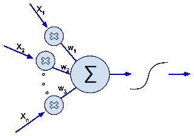

Artificial neuron

***x1，x2，…，xn*** 为输入，每个输入值乘以一个权重( ***w1，w2，…，wn*** )，然后计算加权输入的和(`**∑**`)并通过激活函数(`***f***`)。

上面这句话可以这样数学注释。

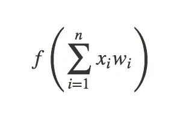

## 砝码

权重是确定相应的输入在影响输出中应该起多大作用的参数。

在神经网络中，这些权重在训练开始时被初始化，并在整个训练阶段被优化。

## 加权和

所有输入的总和乘以相应的权重。

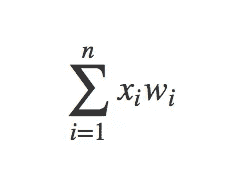

Weighted sum

## 激活功能

给定一个加权和，激活函数决定它应该输出什么值，换句话说，神经元是否应该激活。

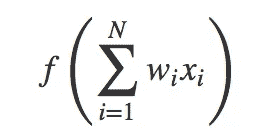

在神经网络中有如此多的选择。

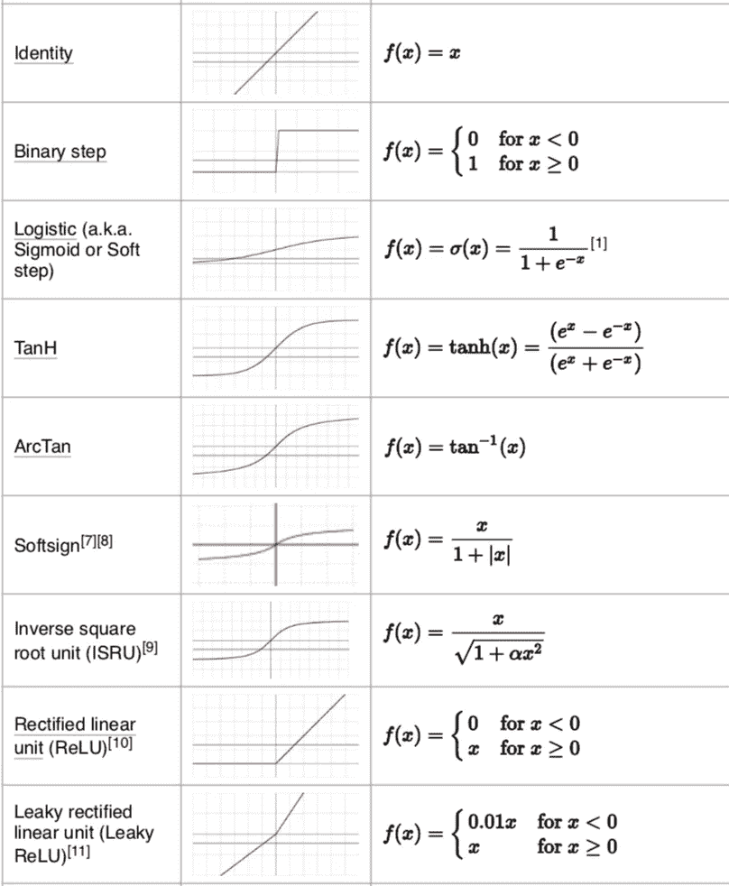

每种功能都有其优势。我们将在以后的例子中使用 Identity 和 ReLU 激活函数。

这应该是人造神经元最简单的形式。

神经元选址本身在应用程序中不会起太大作用，它必须从给定的数据中学习。

## 人工神经元是如何学习的？

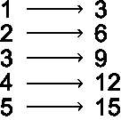

假设我们需要我们的神经元来学习上述数字对之间的关系。因为我们只有一个输入，我们的神经元看起来像这样。

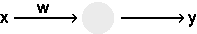

对于这个人来说，学习意味着为 ***w*** 找到一个最准确地代表数字对之间关系的值。让我们在神经元中运行数列。

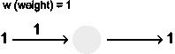

当重量为`1`时，我们与预期产量相差`**2**`。我们可以把这个价值称为这次行动的成本。

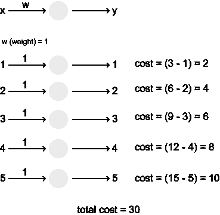

对于这个权重的设置，我们网络的成本是`30`。毕竟这是单个神经元的神经网络:)我知道，是不是“网络”值得商榷。无论如何，我们可以在下面的成本函数中对此进行注释。*`***yi***`*⑻***目标值****`***yi***`***帽子***⑻***网络输出。******

**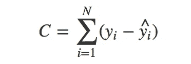**

## **价值函数**

**成本函数是目标值和网络输出之间的差值。不同的成本函数意味着不同的网络成本概念。本质上，成本函数所做的是确定网络输出与目标值有多远。请记住，上述成本函数是为了简单起见而定义的。实际的成本函数应该是这样的。对我来说，注释和索引是最令人困惑的。**

**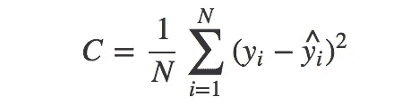**

**现在一切都是为了最小化网络成本。较低的成本意味着网络对于数字对之间的关系(函数)具有良好的近似性。**

**什么影响成本？看似重量。**

**让我们回到以前的公式。**

**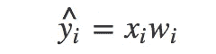******

**我们需要想出对 ***和*** 作业指导书做些什么来最小化成本。我们应该向上推一点还是向下推一点？**

**让我们试着用一点点 python 来可视化，看看它是如何进行的。**

**在 jupyter 笔记本中执行上述代码将会绘制以下图形。**

**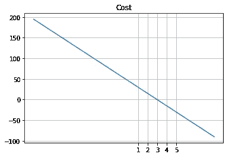**

**Cost function outputs against weights**

**我们可以清楚地看到，当重量为`3`时，成本变为零，这应该是我们的理想重量，但我们的图表没有很好地表示它。虽然随着重量的增加，成本似乎在下降，但这并不意味着`100`的成本比`-100`高。所以我们需要一个更好的成本函数来表示我们离期望值有多远。**

**我们把上面代码的代价函数改成**均方误差**。**

****

**MSE (mean squared error)**

**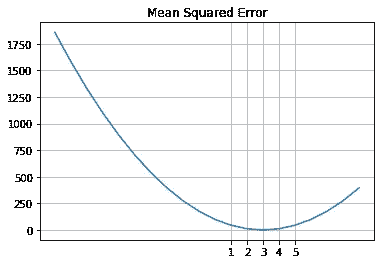**

**正如我们现在看到的，成本函数(MSE)更清楚地表示了我们与期望值的差距。**

**在上面的例子中，我们的理想体重恰好在选定的体重范围内，但如果不是这样呢，如下图所示。**

****

**大多数时候，经历一系列的重量值不会让我们接近成本函数的最小值(我们的完美重量所在的位置)。我们需要一种更好的机制来浏览权重，直到找到正确的权重。**

**让我们回忆一下微积分课上的微分。**

> **微分是计算一个**导数**的动作。变量`x`的函数`y = f(x)`的**导数**是函数值`y`相对于变量`x`变化的变化率的度量。称为`f`相对于`x`的**导数**。**

**我们可以找到成本函数相对于重量的导数，它将告诉我们在给定重量下成本函数的斜率(阅读[这篇](http://mccormickml.com/2014/03/04/gradient-descent-derivation/)好文章可以更好地理解)。如果斜率是负的，我们应该增加重量，如果是正的，我们应该减少重量。我们应该增加或减少多少取决于负斜率或正斜率的大小。因为当我们到达最小值时，斜率变小了，所以我们应该迈小一点的步子，否则我们会错过最小值。这种通过权重导航的方法称为**梯度下降。****

> ****梯度下降**是一种寻找函数最小值的一阶迭代优化算法。为了使用**梯度下降**找到函数的局部最小值，采取与当前点的函数的**梯度**(或近似**梯度**)的负值成比例的步骤。**

**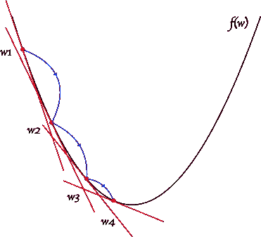**

**gradient descent**

**到目前为止，我们已经讨论了人工神经元是如何制造的，以及如何在梯度下降的帮助下优化自身，但是我们上面讨论的所有事情都过于简化了。我们错过了太多的东西，像****但是希望如此！，现在我们得到了这个概念。******

******想象一下，当我们考虑多层神经网络(深度神经网络)时，它会有多复杂。记得吗？，我们只考虑了单个神经元，甚至没有考虑单个层。******

******有一些库可以为我们处理所有这些复杂的事情。以下是一些开源的深度学习库，有大多数 github 明星和贡献者。******

1.  ******[张量流](https://www.tensorflow.org/)******
2.  ******[Keras](https://keras.io/)******
3.  ******[咖啡](http://caffe.berkeleyvision.org/)******
4.  ******[PyTorch](https://pytorch.org/)******
5.  ******[theno](http://deeplearning.net/software/theano/)******
6.  ******[dlib](http://dlib.net/)******

******记得吗？，这个函数我们想通过查看它在 [**Part1**](https://medium.com/datadriveninvestor/universal-function-approximators-a-k-a-deep-neural-networks-part-1-5ecc76a8f8db) **中的输入和输出来近似。在下一个例子中，我们将使用 Keras 和 TensorFlow 后端来解决这个问题。********

******所以，让我们来看看 python 代码是如何构建深度神经网络的。******

******我在这里结束这篇文章，并将在下一篇文章中继续。******

******直到下次，继续黑；)******