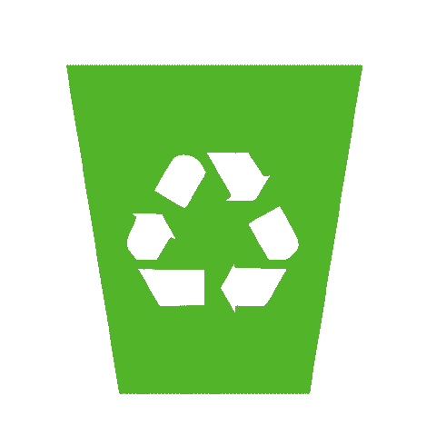

# 普遍回收是未来

> 原文：<https://medium.datadriveninvestor.com/universal-recycling-is-the-future-aac2bf3940ba?source=collection_archive---------2----------------------->

Source: [https://www.kisscc0.com/png/recycling-bin-rubbish-bins-waste-paper-baskets-rec-sh9b47/download-480-480-png.html](https://www.kisscc0.com/png/recycling-bin-rubbish-bins-waste-paper-baskets-rec-sh9b47/download-480-480-png.html)

我对未来充满幻想。自从我看了电影《瓦力》后，我就有了这种幻想。如果你看过那部电影，你就知道《瓦力》的开场场景向我们展示了一个被人类用他们的废物填满后遗弃的地球。在那个场景中，我们看到瓦力，一个已经收集、压缩和堆放垃圾几十年的机器人。

昨天刚看了另一部电影，阿丽塔:战斗天使。在这里，我们再次看到人类的未来被垃圾、金属和塑料废物所包围。开场是一个男人在一大堆垃圾中寻找可以修复的机器人。

在这些反乌托邦的未来中，人们认为不值得花时间和精力来收拾我们的烂摊子。清理它们无利可图。但我认为这是公共政策问题，而不是技术问题。

许多年前，我在一家退休之家工作，担任其中一个地点的 IT 人员。在那段时间里，我看到我们正在耗尽电池，需要一个地方来放置它们。所以我花了一些时间研究处理电池的负责任的方法，我想出了这个绿色的大盒子。

绿色大盒子是一家致力于负责任地回收电池和小型电子产品的公司。过程很简单。你买一个盒子，然后你把盒子装满你的废电池，废手机等等。然后，当箱子装满时，按照说明，你把箱子运回去。运费在您购买包装盒时就已支付，因此即使包装盒内装有大量电池，也无需再支付任何费用。

一旦收到装满的箱子，箱子里的废物就被分类，这样能再利用的就被再利用了。不能再利用的就切碎熔化回收，作为可以用于制造的原料。整个过程都受到监管，这样盒子里的东西就不会被送到中国的垃圾填埋场。[中国有一个庞大的非正式电子回收行业](https://www.cnn.com/2013/05/30/world/asia/china-electronic-waste-e-waste/index.html)。[去年，中国开始拒绝我们的垃圾。](https://www.npr.org/sections/goatsandsoda/2018/06/28/623972937/china-has-refused-to-recycle-the-wests-plastics-what-now)

在自然界，没有东西会被浪费。一切都以某种方式被回收。拾荒者捡树叶。细菌吃死人。霉菌吃水果。苍蝇利用死者来繁殖后代。没有被拾荒者回收的东西会被暴露在阳光、风、雨和火的环境中分解。如果还剩下一些东西，地质力量会将地壳送到地幔，在那里燃烧并再次变成液态岩石，然后通过火山以液态岩石的形式返回地表。

这一切是怎么回事？核能。核聚变是我们太阳的能量来源。我们的太阳驱动着我们的天气。阳光普照万物。太阳核心的聚变是强烈的重力、压力和氢原子融合在一起形成氦的结果。裂变是我们地球的力量。在地球的核心，重元素和放射性元素在高温高压下形成核反应堆。这种热量如此强烈，以至于融化了岩石，就像太阳一样，这个过程已经持续了数十亿年。

我们可以建立自己的通用回收器。这只是建造一个能提供能源的发电厂的问题。一旦你有了发电厂，剩下的就是工程、规划和执行。我读了科学新闻，似乎每个月都有核能方面的重大进展可以让这一切发生。

我们离商业化的核聚变能源可能还有 5 到 10 年的时间。法国的 ITER 继续取得进步。私营公司正在为建造一个可运行的聚变反应堆所需的研究寻找投资。我们也看到了聚变能的摩尔定律，我们的反应堆的效率每 1.8 年翻一番。

[我们还需要 5-10 年才能建成商用熔盐反应堆](https://www.nextbigfuture.com/2018/03/terrestrial-energy-on-track-to-commercial-molten-salt-reactor-competitive-with-natural-gas-prices.html)，这是一种可以使用钍或铀的反应堆。熔盐反应堆可以燃烧我们所有的核废料，并使用 99%的燃料，而我们的加压轻水反应堆仅使用 6%的燃料。

熔盐反应堆有被动安全装置。如果反应堆变得太热，它会自动冷却。如果反应堆的任何地方出现故障，液体燃料就会被排放到一个储存罐中。没有像福岛那样的高压水会爆炸到大气中。

我是环保主义者。我是个菜鸟。然而，我认为核能是人类可持续未来的必要条件。我看到太阳能、风能、地热、潮汐能和水能，都与核能一脉相承。我们将需要所有这些来为我们的文明提供动力，我们可以做到这一点，而不需要将二氧化碳重新添加到我们呼吸的空气中。

我看到了一个未来的世界，在那里采矿和诽谤我们美丽的地球不再有利可图。我看到了这样一个世界，在那里开采每一条废物流和我们曾经建造的每一个垃圾填埋场都是有利可图的。我看到了这样一个世界，来自设计合理的核电站的废热可以用来处理我们所有的废物，燃烧它，融化它，并将其烧结成原材料，我们可以再次用于制造业。甚至从这种回收工作中产生的气体也可以被收集、分类和输出用于生产。

一旦我们有了发电厂，我们就可以驱动机器人对收到的垃圾进行分类，并在地球上搜寻金属、塑料和纸张。有人说，要清除海洋中漂浮的塑料碎片需要 1000 年的时间。机器人可以清洁我们的海洋，而且可能只需要预计时间的一小部分。

一旦我们有了发电厂，我们就可以用这些能量建造并驱动能够从空气中提取二氧化碳并将其捕获的机器。还有一些方法可以利用这种能量[来捕获二氧化碳，并将其转化为可用于建筑的砖块](https://futurism.com/revolutionary-carbon-capture-method-makes-building-materials-out-of-emissions)。

是的，所有这些都需要钱。而且任何需要花钱的事情也能创造就业。这是绿色新政反对者的论点中经常缺失的部分。我们可以选择把钱花在炸弹或桥梁上。为什么战争似乎比桥梁更划算？

绿色新政中缺少的是核能。钍和铀的能量密度比碳键大一百万倍。有了现代的 GenIV 设计，我们可以建造不会熔化的熔盐核电厂，它有内置的被动安全装置，可以燃烧 99%的燃料，废料只需要储存 300 年，而不是 20 万年。聚变是干净的。

我认为绿色新政的支持者忽视核能是一个错误。通过将核能纳入 GND，我们可以利用一种非常容易控制和定位的能源来应对和解决我们今天面临的问题。我们现在面临的最大问题之一是如何处理我们制造的所有垃圾。

每次我走过我们当地的铁匠店，我都会看到市场上有一排排的小玩意和玩具。正如在电视上看到的，耳机、电池、厨房用具、儿童塑料玩具等等。他们都是垃圾填埋场，因为他们很难回收。随着我们技术的进步，随着我们制造的设备变得越来越先进，它们变得越来越难以回收。当我说，“更难回收”，我的意思是他们需要更多的能源，更多的努力来回收。

可再生能源是伟大的，我们需要它们。但是聚变和裂变是可再生的，因为一旦被利用，它们就是无限的能源。相对于我们现在燃烧的铂价铀，钍是丰富的。我们永远不会用完钍。氢同位素氘和氚是天然存在的，我们每天在饮用水中都会摄入少量的氢同位素。它们在我们的海洋、湖泊和河流中非常丰富。实际上，它们是无限的，因此是可再生的。

无论我们决定使用何种能源来为我们的文明提供动力，我们都需要一个通用的回收器，一个可以回收任何废物并使其变得无害的东西。我们需要一个拥有无限能源的过程，它可以将任何人造的东西转化为可用于制造或回归自然的东西。这就是万能回收器的用途。

继续写。