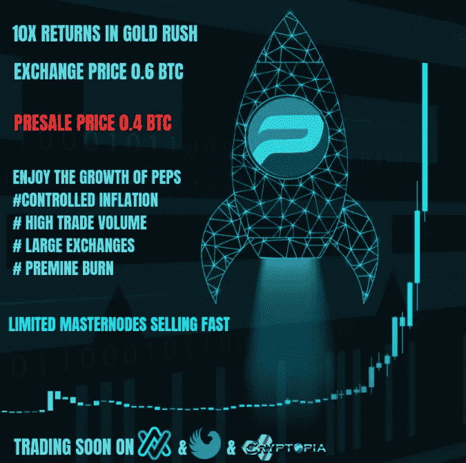

# 借助 PEPS 3.0 释放区块链的力量

> 原文：<https://medium.datadriveninvestor.com/unleash-the-power-of-blockchain-with-peps-3-0-8af79eac2be4?source=collection_archive---------26----------------------->

对玛塞拉来说，这是一次激动人心的旅程。通过学生交流项目去美国旅行是她长久以来的梦想。她的学校说 1000 美元足够三个月的生活费用，但是，如果有紧急情况呢？她将如何确保她的钱不被偷？新的国家，新的人，很多兴奋和担忧…..直到她的朋友建议“PEPS”。现在，多酷啊！Marcela 可以在手机的 PEPS 钱包中携带额外的 PEPS。更安全，完全保密，那是她在国外的应急基金。

对理查德来说，这是一次糟糕的经历。上个月，他终止了当地市场上的橙子供应商，因为他意识到自己为一半的质量付出了几乎双倍的代价。他生产果酱的成本没有给他留下多少利润。现在他遇到了这个来自希腊的小农场主，如果他能得到他作为他的供应商，这可能意味着理查德更高的利润。但由于外汇政策和税收，他无法计算出采购成本，直到他发现了 PEPS 应用程序。PEPS 使他的合同和海外付款变得简单到 1–2–3，只需点击一个按钮，他就可以向来自 Kalivia 的新供应商 Petar 付款。

# 欢迎来到 PEPS！

PEPS 是一种全球通用的硬币，适用于航空、医疗、保健、供应链、教育等主要行业。

基于 Quark 算法和 PivX 协议，PEPS 交易是即时、安全和完全匿名的。

PEPS 项目于 2018 年 10 月推出，并推出了令人兴奋的易用开发，如 PEPS Visa 卡和 PEPS 行业应用程序。

PoS/master node coin pep MN 受通货膨胀控制，交易量高，仅在大型交易所提供。pep 仅在两个月的天崩地裂阶段提供高额奖励，并在此后的期间提供一致的奖励。

**为什么是 PEPS MN？**

*   高交易量— PEPS 仅面向高交易量的交易所，1 个 PEPS 的交易起始价为 3000 satoshi
*   低通胀——有限的赠品和溢价燃烧使流通仅限于锰所有者
*   有限的 MNs — PEPS 预售截止到 11 月 9 日，预售的主节点数量限制在 100 个以下
*   Masternodes 监控— PEPS 已经在 MNO 应用，并将在 Masternodes 中提供。下周上线。
*   伟大的交流——PEPS 已经在 Crex24 中上市，并将从 11 月 10 日起仅在 CryptoBridge 和 2019 年 1 月 1 日起在 Cryptopia 上市。其他 exchange 版本，如 Mercatox、Bleutrade、Coins.exchange 和币安即将发布。
*   巨大的折扣— PEPS MN 宣传资料为 20000 PEPS，在 Crex24 中以 0.6 BTC 的价格提供，而在有限的预售期内，人们可以以 0.4 BTC 的价格购买相同的内容。这是一个值得考虑的提议！

让我们稍微挖掘一下 PEPS 的历史。pep 在 2016 年开始作为一种 PoW coin，最初速度非常慢，直到 2017 年他们将其换成 PoS。PEPS 最初是食品行业的硬币，目标是餐馆、咖啡馆和美食广场。PEPS 在全球范围内有 100 家接受 PEPS 付款的真实商户，运行良好。

有什么新鲜事吗？新的 PEPS 是一枚 Masternode 硬币，因此早期适配器的利润更高，不仅针对食品行业，还针对其他主要行业，如航空/医疗保健/教育，当然还有酒店业。PEPS 还在与 Rupay India 和 Ka$H Malaysia 进行讨论，以推出一种 PEPS visa 卡，该卡可以在 fiat/peps 上充值，并可用于在全球各地的商家或供应商处支付。全新的 PEPS 应用程序将与 PEPS 卡相连，可用于授予和管理合同、清算对供应商的汇款、预订和保留、申请入场以及更多此类相关服务。

随着真正的行业适应性和通货膨胀控制措施，这肯定是一个有趣的项目，期待着高盈利能力和未来的收益。

**链接:**

**【https://bitcointalk.org/index.php?topic=5052347.new#new】T4**

****PEPS 白皮书:**[http://pepegold.org/images/WhitePaperPEPSv3.pdf](http://pepegold.org/images/WhitePaperPEPSv3.pdf)**

****PEPS 块浏览器:**[https://track.pepegold.org/](https://track.pepegold.org/)**

****Github 发布:**[https://github.com/PEPS-Project/peps/](https://github.com/PEPS-Project/peps/)**

****PEPS v3 WINDOWS 钱包:**[https://github . com/PEPS-Project/PEPS/releases/download/2 . 3 . 0/PEPS 230-win . zip](https://github.com/PEPS-Project/peps/releases/download/2.3.0/peps230-win.zip)**

****PEPS v3 LINUX 钱包:**[https://github . com/PEPS-Project/PEPS/releases/download/2 . 3 . 0/PEPS 230-Lin . zip](https://github.com/PEPS-Project/peps/releases/download/2.3.0/peps230-lin.zip)**

****PEPS v3 一键 Masternode 设置脚本:**[https://github . com/PEPS-Project/PEPS/releases/download/2 . 3 . 0/PEPS-Mn . sh](https://github.com/PEPS-Project/peps/releases/download/2.3.0/peps-mn.sh)**

****PEPS 社交链接:****

****YouTube:** [https://www.youtube.com/channel/UCNQEqwDDbwQ579t6lgV-YzA](https://www.youtube.com/channel/UCNQEqwDDbwQ579t6lgV-YzA)**

****推特:** [https://twitter.com/projectpeps](https://twitter.com/projectpeps)**

****电报:**[https://t.me/pepsofficial](https://t.me/pepsofficial)**

****FB:**[https://www.facebook.com/Pepscommunity](https://www.facebook.com/Pepscommunity)**

****Discord:**[https://discord.gg/VQsFBYq](https://discord.gg/VQsFBYq)**

****网站:** [http://peps.today/](http://peps.today/)**