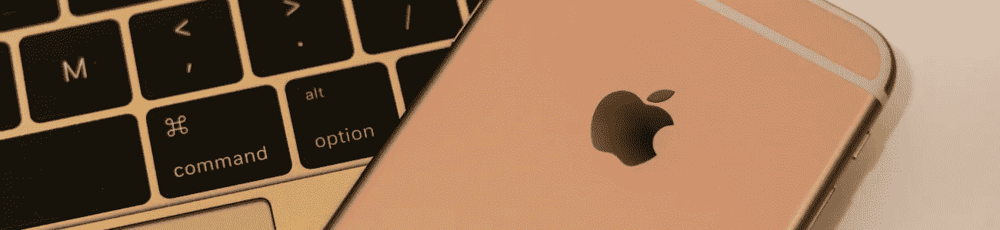

# 解锁一个秘密的 iPhone 表情键盘

> 原文：<https://medium.datadriveninvestor.com/unlock-a-secret-iphone-emoji-keyboard-c7db8f4560fc?source=collection_archive---------3----------------------->

## iPhones 总是吹嘘那些被用户忽略的很酷的隐藏功能。这个隐藏的表情符号键盘也不例外！

*最初发表于*[*【millennialmoderator.com】*](https://millennialmoderator.com/unlock-a-secret-iphone-emoji-keyboard)*。*

每个人都喜欢表情符号，但 iPhone 自带的表情符号可能有点乏味，没有创意。或者真的是这样吗？原来，在你的 iPhone 中有一个秘密的、隐藏的表情键盘**,你可以通过改变一些键盘设置来访问它。**

老实说，这些表情符号不一定是一个**秘密**，它们只是日本键盘的一部分。如果你喜欢寻找隐藏的 iPhone 功能，看看我们在这里写的[以外的更多功能！](https://millennialmoderator.com/5-iphone-tricks-you-didnt-know-about)。

# 隐藏的 iPhone 表情键盘

要访问很酷的 iPhone 键盘表情符号，如(͡ ͜ʖ ͡)等，请按照以下步骤操作:

*   打开设置
*   选择“常规”
*   选择“键盘”
*   选择“键盘”
*   选择“添加新键盘”
*   查找并选择“日语”
*   选择“假名”

瞧啊。现在，当您在任何文本字段中打开键盘时，选择**地球图标**(左下角)，然后选择日语符号(也在左下角)。这将调出日语键盘。选择 **^-^** 键(左下角),在**文本建议**栏中，您将看到各种表情符号出现。要扩展这个列表，只需点击键盘右上角的 **^** 键。

在这些有趣的 iPhone 表情符号中，你会发现熟悉的 Lenny face、owo 等等。

如果你喜欢这个隐藏的 iPhone 技巧，[点击这里](https://millennialmoderator.com/5-iphone-tricks-you-didnt-know-about)看看我们其他的一些！

这个列表中哪个表情符号是你最喜欢的？在[推特](https://twitter.com/alekseyweyman)上和我分享！

标记为:[技术电话](https://millennialmoderator.com/unlock-a-secret-iphone-emoji-keyboard#)

*原载于*[*millennialmoderator.com*](https://millennialmoderator.com/unlock-a-secret-iphone-emoji-keyboard)*。*