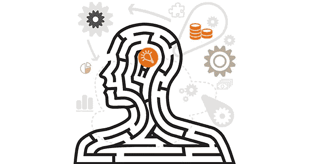

# 揭示问题背后的认知过程，以及为什么它们是创新的关键

> 原文：<https://medium.datadriveninvestor.com/unmasking-the-cognitive-process-behind-questions-and-why-they-are-the-linchpin-to-innovation-32d84f5ca058?source=collection_archive---------42----------------------->

许多文章和书籍都提到了问题对于实现创新的重要性。企业家和商业领袖也谈到了问题对创新的重要影响。谷歌前首席执行官埃里克·施密特(Eric Schmidt)走得更远，他说:“我们经营这家公司靠的是问题，而不是答案。”

因此，很明显，人们非常依赖问题。然而，即使是神经科学家也不理解问题背后的认知过程。他们最有可能的猜测是，脑细胞产生思维，然后思维产生你，你提出问题，然后回答问题。不幸的是，这不是一个科学的模型。那是科幻小说。为了真正理解有效的认知过程，这里将介绍一种叫做[心智模型](https://www.youtube.com/watch?v=Jw-o7qoBlDE)的新范式。这是一个大脑/思维动态与计算机如何工作的模型相同的模型。[计算机有由操作系统运行的机械硬件。反过来，人类拥有由操作系统运行的生物硬件。我们把生物硬件称为大脑，把操作系统称为思想。](https://www.linkedin.com/pulse/unmasking-how-intelligence-collaborates-emotion-facilitate-krutz/)在计算机中，当操作系统发展到使机械硬件过时的程度时，该机械硬件不得不被丢弃，并被升级的硬件所取代。但是对于人类来说，大脑这一生物硬件通过操作系统(即思维)的重新连接而不断升级。

但这只是对心智模型的部分描述。在接下来的描述中，头脑不是一个单一的部分，而是由几个独立的部分组成。从你这个主要的心智组成部分开始——你感觉和感知到的自我身份。这是需要认识的一个重要方面，因为在你的自我和你的其他思维成分之间有一个关键的界限。那些其他的思维成分将从此被标记为:创造性思维、反应性思维、理性思维、直觉和情感。

让我们先深入解释一下你是谁。你的身份包括你的智力、性格、才能、喜欢、不喜欢、优点和缺点等核心属性。你的身份也包括你的记忆，从现在开始，个人知识库这个新术语将被取代。你也是决策者。思想、直觉和情感的其他心智组成部分只是给你提供选择，让你做出决定。这些选择是对你的一种引导和影响，帮助决定了你现在是谁。

当你做决定的时候，这些其他的思维成分一直在指导和影响着你的一生。对你的影响有好有坏，有合作也有冲突。是的，你和你的其他思维组件之间的互动过程是如此无缝和流畅，以至于你总是认为你的思维是一个单独单元的功能。但事实并非如此。只有你才能对其他呈现给你的想法做出最终的决定。耶稣和佛陀用宗教术语的外衣描述了这些思想成分。但是社会进化现在已经足够先进，以至于这些概念最终可以用科学术语公开揭露。

到目前为止，需要描述的最后一个方面还被宗教术语所掩盖。它处理的是信息选择从何而来，这些信息选择是由其他思维组件呈现给你的。这些信息来自一个来源，此后将被称为通用知识库。本质上，mind 的其他组件执行的功能类似于高度先进的搜索应用程序，这些应用程序也从一个来源产生信息，但针对每个独特的移动设备进行定制和个性化——在这种情况下，移动设备就是你。是的，你是独一无二的，就像你的虹膜和指纹。再者，在所有的心智成分中，只有你是好奇的。只有你提问。如果你的个人知识库中已经有了你需要的答案，那么你就不会问问题了。提问的行为意味着你在从你个人知识之外的来源寻求答案。因此，当你在内心提问时，其他思维组件会以选择的形式做出回应。然后你将这些选择视为你所提问题的答案。创造性和反应性思维的思维成分为你提供了你以前不知道的积极和消极的基于信息的答案，以促进创新。

因此，在我们复杂的系统中，你可以自由选择现有的通用知识库信息，共同创造前所未有的全新体验和创新。但是人们并不了解这一过程，因此只是顺便使用它。随着这一过程的揭开，你现在被授权有意识地使用你的思维组件，就像工具箱里的工具一样。然而，这只有在你提问的时候才会发生。所以，现在我们终于找到了整个范式的症结所在，来问这个过程中的问题有什么特别之处？

用计算机术语来说，提问就像初始化命令提示符。
他们有三种结局:
1。问题给你设定议程的授权，让其他思维组件去遵循和关注。
2。问题总是会促使其他思维组件做出反应。无论是完整的答案、假设还是提示。
3。问题解锁并在您的个人知识库中腾出空间，以便从您收到的答案中接收和存储新信息。

当你不提问的时候，其他的思维成分会用他们自己的议程来引导和影响你。同样，如果不提问，你的个人知识库将无法保留任何新信息，从而严重限制了你的创新能力。本质上，要么是你在利用其他的思维成分，要么是它们在利用你。使用你的其他思维成分已经被心理学观察到，并被赋予许多不同的标签。其中一个标签是“自动性”或毫不费力地采取行动的能力。这种无需真正思考就能行动的能力是大多数人大多数时间都处于的状态。

所以现在我们知道在你的头脑中会发生两种完全不同的思维功能。第一种类型是，你能够毫不费力地快速对其他思维组件为你设定的议程做出决定。在这种被动的心态下，自我认同是不可能增长的。因此，它也被心理学贴上了“固定思维”的标签。然后是第二种类型的思维功能，包括费力和缓慢的思考。在这种类型的思维中，你通过提出问题、分析这些问题的答案以及访问你自己的个人知识库来解决问题，从而设定议程。在这种创造性思维中，自我认同的增长几乎有无限的潜力。这被心理学称为“成长心态”。再说一次，你要么是通过提问来使用你的思维组件，要么是思维组件在利用你。这就是为什么问题是产生创新新想法的认知过程的关键。这个过程的最高层次是[，不仅仅是产生新的想法，而是开发想法模型。](https://www.linkedin.com/pulse/why-breakthrough-innovators-develop-idea-models-how-you-anton-krutz/)

在这一点上，你可能会问这个范例是否有一个大胆的用途？答案是肯定的，它基于这样一种理解，即未来数百万年以突破性物理和技术形式存在的信息，是可以潜在地获得的。虽然有计划的随机性(即不确定性原则)的构造确保未来的人类经历和冲突仅保持为有计划的概率，但突破性的物理学和技术的信息已设定为不断进化有感知的社会。从强大的有意识人工智能，到使用频率修复 DNA 的医疗仪器，再到几何形状的星际飞船，它们通过内部移动磁场在容器周围移动外部空间物质/时空，以接近光速向前推进——没有阻力。全部。这个。信息。存在。现在。它可以通过问题和想法模型获得。黑掉我们的 matrix 生态系统并去获取它不是很有趣吗？

这些心智模型概念并不是孤立的。它们来源于一个更大的物理统一场论模型。关于这个新范例的完整文档可以在 oisource.com/why-we-exist[找到。但是，你可以学习这种范式的实际应用，提出正确的问题，并使用你的其他思维组件作为工具来开发想法模型的唯一地方，是在 OIsource(【oisource.com】](https://oisource.com/why-we-exist.html))培训中。联系我们，了解如何让我们的创新培训经验为您和您的公司服务。