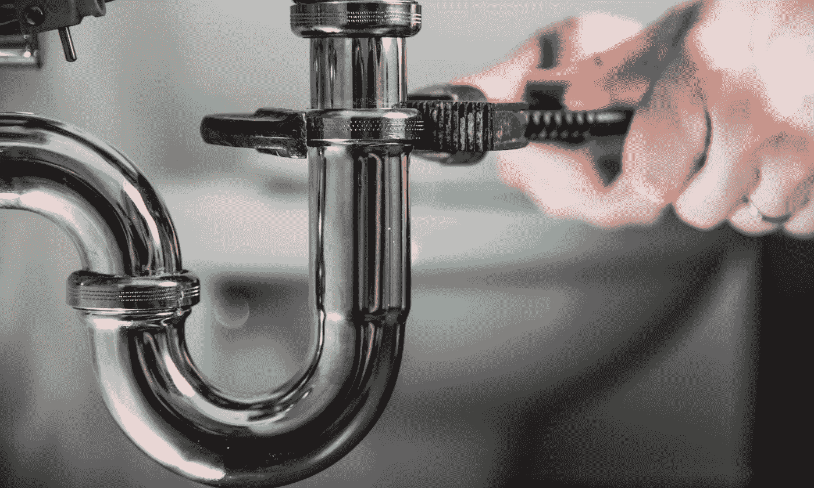

# 未开发的美国

> 原文：<https://medium.datadriveninvestor.com/unplumbed-america-69540a695d87?source=collection_archive---------5----------------------->

一份人口普查报告给出了一个令人沮丧的统计数据:近 63 万美国家庭没有完整的管道设施。

这意味着美国约有 160 万人没有抽水马桶、冷热水、浴缸或淋浴。

 [## 为什么包容性财富指数比 GDP 更能衡量社会进步？-数据驱动…

### 你不需要成为一个经济奇才或金融大师就能知道 GDP 的定义。即使你从未拿过 ECON 奖…

www.datadriveninvestor.com](https://www.datadriveninvestor.com/2019/03/08/why-inclusive-wealth-index-is-a-better-measure-of-societal-progress-than-gdp/) 

全国范围内未登记的家庭只占总数的 1%的一半，仍然有点令人震惊的是，加利福尼亚州超过 70，000 个有人居住的家庭和德克萨斯州超过 60，000 个家庭缺乏这些基本需求——以及阿拉斯加州整整 5%的家庭。

然而，乐观主义者可以称之为进步:1950 年，几乎四分之一的美国家庭没有抽水马桶。